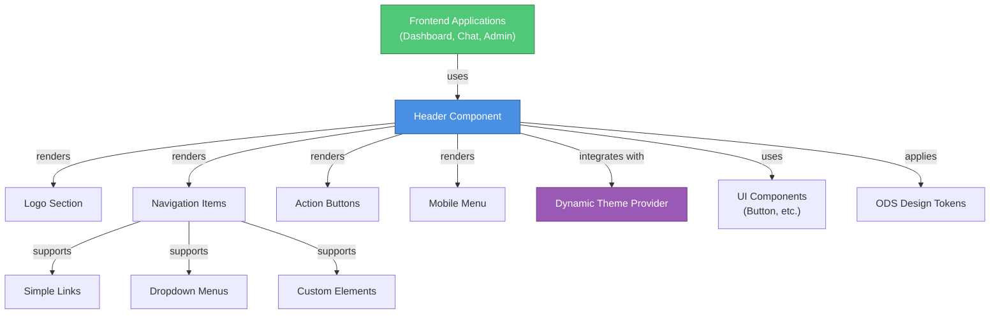
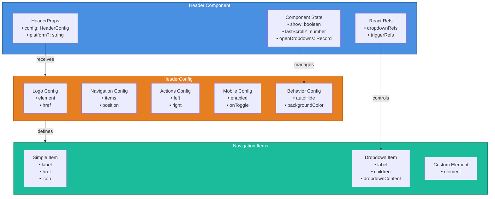
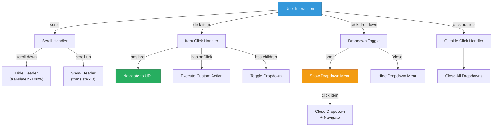
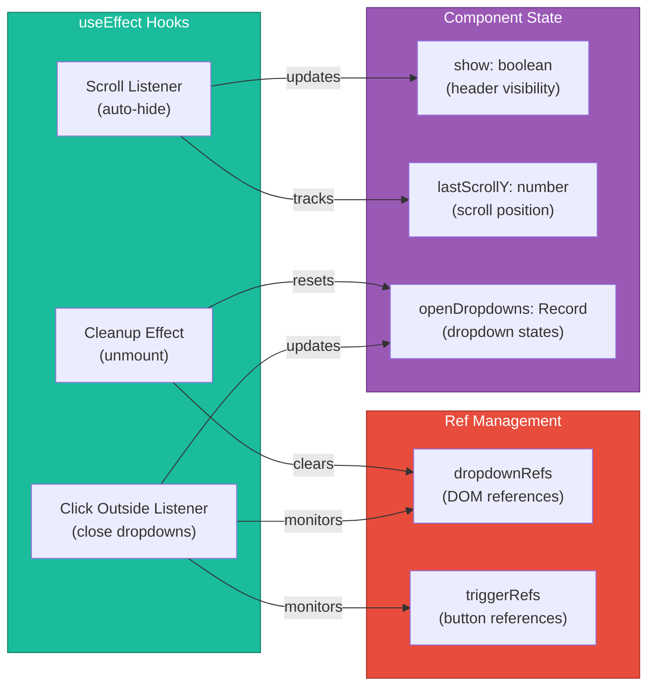
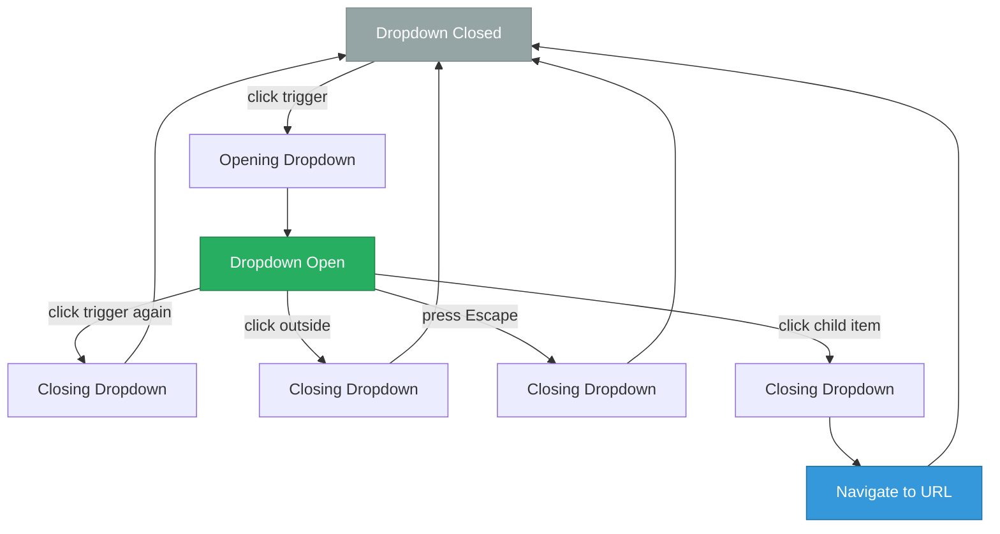
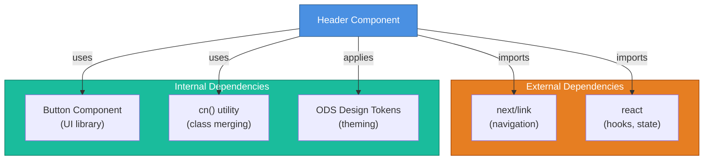
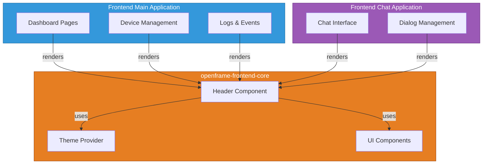
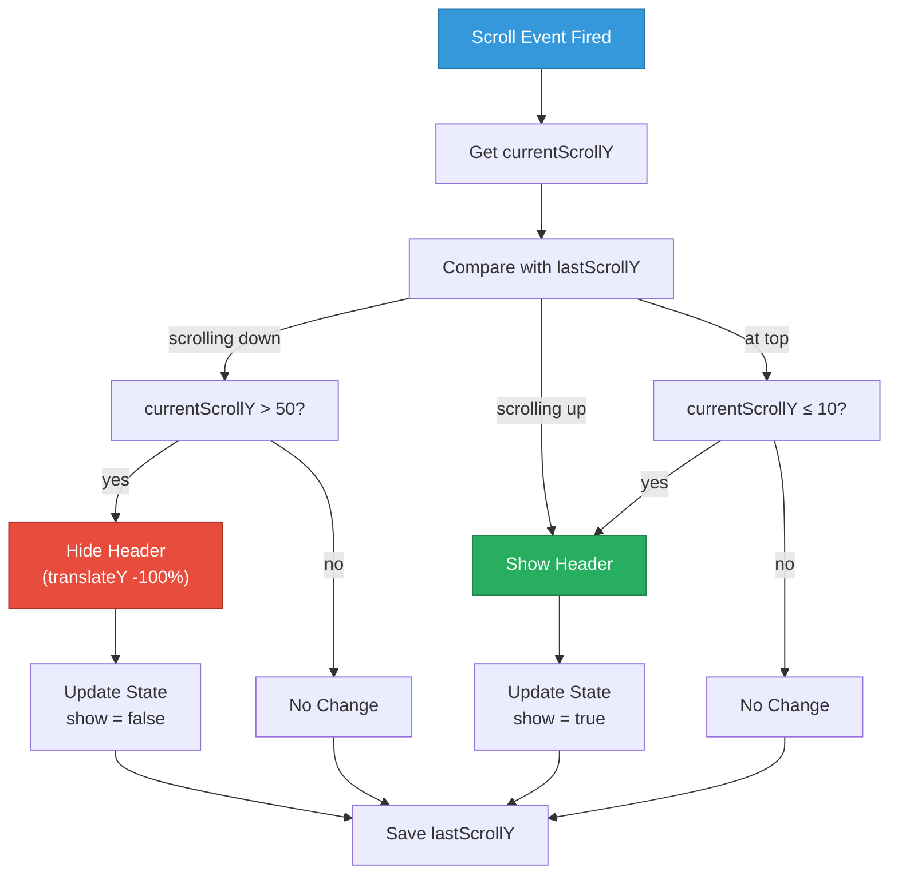

# Frontend Core Navigation Module

## Overview

The **Frontend Core Navigation** module provides a sophisticated, responsive header navigation system for OpenFrame's web applications. Built with React and Next.js, it delivers a feature-rich navigation experience with auto-hide behavior, dropdown menus, mobile responsiveness, and seamless integration with OpenFrame's design system.

This module is part of the **openframe-frontend-core** library and serves as the primary navigation component across all OpenFrame frontend applications including the main dashboard, chat interfaces, and administrative panels.

---

## Table of Contents

1. [Architecture Overview](#architecture-overview)
2. [Core Components](#core-components)
3. [Navigation System](#navigation-system)
4. [Features & Capabilities](#features--capabilities)
5. [Integration Points](#integration-points)
6. [Configuration Guide](#configuration-guide)
7. [Usage Examples](#usage-examples)
8. [Styling & Theming](#styling--theming)
9. [Accessibility](#accessibility)
10. [Best Practices](#best-practices)

---

## Architecture Overview

### System Context



### Component Architecture



---

## Core Components

### Header Component

**Location:** `deps-openframe-oss-lib/openframe-frontend-core/src/components/navigation/header.tsx`

The main navigation header component that orchestrates all navigation functionality.

#### Component Interface

```typescript
interface HeaderProps {
  config: HeaderConfig
  platform?: string
}

interface HeaderConfig {
  // Logo configuration
  logo: {
    element: React.ReactNode
    href: string
  }
  
  // Navigation items
  navigation?: {
    items: NavigationItem[]
    position?: 'left' | 'center' | 'right'
  }
  
  // Action buttons (left and right)
  actions?: {
    left?: React.ReactNode
    right?: React.ReactNode
  }
  
  // Mobile menu configuration
  mobile?: {
    enabled: boolean
    isOpen?: boolean
    onToggle?: () => void
    menuIcon?: React.ReactNode
  }
  
  // Behavior configuration
  autoHide?: boolean
  backgroundColor?: string
  className?: string
  style?: React.CSSProperties
}
```

#### Navigation Item Types

```typescript
interface NavigationItem {
  id: string
  label: string
  
  // Navigation options
  href?: string
  onClick?: () => void
  isExternal?: boolean
  isActive?: boolean
  
  // Visual elements
  icon?: React.ReactNode
  badge?: React.ReactNode
  
  // Dropdown support
  children?: NavigationItem[]
  dropdownContent?: React.ReactNode
  dropdownClassName?: string
  showDropdownDivider?: boolean
  
  // Custom rendering
  element?: React.ReactNode
  className?: string
}
```

---

## Navigation System

### Navigation Flow



### State Management



---

## Features & Capabilities

### 1. Auto-Hide Behavior

The header automatically hides when scrolling down and reappears when scrolling up, providing more screen space for content.

**Implementation:**

```typescript
useEffect(() => {
  if (!config.autoHide) {
    setShow(true)
    return
  }
  
  const handleScroll = () => {
    const currentScrollY = window.scrollY
    
    setLastScrollY(prevScrollY => {
      const shouldHide = currentScrollY > prevScrollY && currentScrollY > 50
      const shouldShow = currentScrollY < prevScrollY || currentScrollY <= 10
      
      if (shouldHide) setShow(false)
      else if (shouldShow) setShow(true)
      
      return currentScrollY
    })
  }

  window.addEventListener('scroll', handleScroll, { passive: true })
  return () => window.removeEventListener('scroll', handleScroll)
}, [config.autoHide])
```

**Behavior:**
- Hides when scrolling down past 50px
- Shows when scrolling up
- Always shows when at top of page (≤10px)
- Can be disabled via `autoHide: false`

### 2. Dropdown Menus

Supports nested navigation with dropdown menus that include custom content.

**Features:**
- Click-to-open/close behavior
- Click outside to close
- Escape key to close
- Custom dropdown content
- Configurable styling
- Active state highlighting

**Dropdown Lifecycle:**



### 3. Mobile Responsiveness

Provides mobile menu toggle functionality with responsive visibility controls.

**Responsive Breakpoints:**
- **Desktop (≥768px):** Full navigation visible
- **Mobile (<768px):** Hamburger menu toggle

**Mobile Configuration:**

```typescript
mobile: {
  enabled: true,
  isOpen: false,
  onToggle: () => setMobileMenuOpen(!mobileMenuOpen),
  menuIcon: <MenuIcon />
}
```

### 4. Active State Management

Automatically highlights active navigation items based on current route.

**Visual Indicators:**
- Active items: `bg-ods-bg-hover` (subtle gray background)
- All items: `text-ods-text-primary` (consistent text color)
- Hover state: `hover:bg-ods-bg-hover`

### 5. Custom Elements

Supports injecting custom React elements at any navigation position.

**Use Cases:**
- Search bars
- User profile dropdowns
- Notification badges
- Custom widgets

---

## Integration Points

### Dependencies



### Integration with Frontend Applications



**Related Modules:**
- [frontend_main](frontend_main.md) - Main dashboard application
- [frontend_chat](frontend_chat.md) - Chat interface application
- [frontend_core_theme_provider](frontend_core_theme_provider.md) - Theme management
- [frontend_core_ui_table](frontend_core_ui_table.md) - UI component library

---

## Configuration Guide

### Basic Configuration

```typescript
const headerConfig: HeaderConfig = {
  // Logo configuration
  logo: {
    element: <Logo />,
    href: '/'
  },
  
  // Navigation items
  navigation: {
    position: 'center',
    items: [
      {
        id: 'dashboard',
        label: 'Dashboard',
        href: '/dashboard',
        isActive: true
      },
      {
        id: 'devices',
        label: 'Devices',
        href: '/devices'
      }
    ]
  },
  
  // Right-side actions
  actions: {
    right: (
      <>
        <NotificationButton />
        <UserMenu />
      </>
    )
  },
  
  // Enable auto-hide
  autoHide: true
}
```

### Dropdown Menu Configuration

```typescript
const dropdownItem: NavigationItem = {
  id: 'community',
  label: 'Community',
  icon: <UsersIcon />,
  children: [
    {
      id: 'slack',
      label: 'Join Slack',
      href: 'https://openmsp.ai',
      isExternal: true,
      icon: <SlackIcon />
    },
    {
      id: 'github',
      label: 'GitHub',
      href: 'https://github.com/openframe',
      isExternal: true,
      icon: <GitHubIcon />
    }
  ],
  dropdownContent: (
    <div className="p-2">
      <p className="text-sm text-ods-text-secondary">
        Join our community to get help and share ideas
      </p>
    </div>
  ),
  dropdownClassName: 'min-w-[240px]'
}
```

### Mobile Menu Configuration

```typescript
const [mobileMenuOpen, setMobileMenuOpen] = useState(false)

const headerConfig: HeaderConfig = {
  // ... other config
  mobile: {
    enabled: true,
    isOpen: mobileMenuOpen,
    onToggle: () => setMobileMenuOpen(!mobileMenuOpen),
    menuIcon: <MenuIcon className="h-6 w-6" />
  }
}
```

### Custom Element Configuration

```typescript
const customSearchItem: NavigationItem = {
  id: 'search',
  element: (
    <div className="relative">
      <SearchInput 
        placeholder="Search..."
        className="w-64"
      />
    </div>
  )
}
```

---

## Usage Examples

### Example 1: Basic Header

```typescript
import { Header, HeaderConfig } from '@openframe/frontend-core'

export default function Layout({ children }) {
  const config: HeaderConfig = {
    logo: {
      element: ,
      href: '/'
    },
    navigation: {
      items: [
        { id: 'home', label: 'Home', href: '/' },
        { id: 'about', label: 'About', href: '/about' }
      ]
    },
    autoHide: true
  }
  
  return (
    <>
      <Header config={config} />
      <main>{children}</main>
    </>
  )
}
```

### Example 2: Header with Dropdown

```typescript
const config: HeaderConfig = {
  logo: {
    element: <Logo />,
    href: '/'
  },
  navigation: {
    position: 'center',
    items: [
      {
        id: 'products',
        label: 'Products',
        children: [
          {
            id: 'openframe',
            label: 'OpenFrame',
            href: '/products/openframe',
            icon: <FrameIcon />
          },
          {
            id: 'flamingo',
            label: 'Flamingo',
            href: '/products/flamingo',
            icon: <FlamingoIcon />
          }
        ]
      },
      {
        id: 'docs',
        label: 'Documentation',
        href: '/docs'
      }
    ]
  }
}
```

### Example 3: Header with Actions

```typescript
const config: HeaderConfig = {
  logo: {
    element: <Logo />,
    href: '/'
  },
  actions: {
    left: <BackButton />,
    right: (
      <div className="flex items-center gap-2">
        <ThemeToggle />
        <NotificationBell />
        <UserAvatar />
      </div>
    )
  },
  navigation: {
    items: [
      { id: 'dashboard', label: 'Dashboard', href: '/dashboard' }
    ]
  }
}
```

### Example 4: Platform-Specific Header

```typescript
function AppLayout() {
  const pathname = usePathname()
  
  const config: HeaderConfig = {
    logo: {
      element: <Logo />,
      href: '/'
    },
    navigation: {
      items: [
        {
          id: 'dashboard',
          label: 'Dashboard',
          href: '/dashboard',
          isActive: pathname === '/dashboard'
        },
        {
          id: 'devices',
          label: 'Devices',
          href: '/devices',
          isActive: pathname.startsWith('/devices')
        },
        {
          id: 'logs',
          label: 'Logs',
          href: '/logs',
          isActive: pathname.startsWith('/logs')
        }
      ]
    }
  }
  
  return <Header config={config} platform="openframe" />
}
```

---

## Styling & Theming

### Design Token Usage

The Header component uses OpenFrame's design system tokens for consistent theming:

```typescript
// Background colors
"bg-ods-card"           // Header background
"bg-ods-bg-hover"       // Hover/active states

// Text colors
"text-ods-text-primary"    // All navigation text
"text-ods-text-secondary"  // Secondary text in dropdowns

// Border colors
"border-ods-border"     // Header border and dropdown borders

// Effects
"backdrop-blur-sm"      // Header backdrop blur
"shadow-xl"             // Dropdown shadow
```

### CSS Classes Applied

```mermaid
flowchart TD
    Header["Header Container"]
    
    Header -->|"applies"| Sticky["sticky top-0 z-50"]
    Header -->|"applies"| Transition["transition-transform"]
    Header -->|"applies"| Background["bg-ods-card backdrop-blur-sm"]
    
    NavItem["Navigation Item"]
    NavItem -->|"applies"| Font["font-DM_Sans font-bold text-16px"]
    NavItem -->|"applies"| Hover["hover:bg-ods-bg-hover"]
    NavItem -->|"applies"| Active["isActive → bg-ods-bg-hover"]
    
    Dropdown["Dropdown Menu"]
    Dropdown -->|"applies"| Position["absolute top-full left-0"]
    Dropdown -->|"applies"| Style["rounded-lg shadow-xl z-9999"]
    Dropdown -->|"applies"| DropBg["bg-ods-card border-ods-border"]
    
    style Header fill:#3498DB,stroke:#2471A3,color:#fff
    style NavItem fill:#E67E22,stroke:#A04000,color:#fff
    style Dropdown fill:#9B59B6,stroke:#6C3483,color:#fff
```



### Custom Styling

```typescript
// Custom header background
const config: HeaderConfig = {
  backgroundColor: 'bg-gradient-to-r from-blue-500 to-purple-600',
  className: 'shadow-lg',
  style: {
    borderBottom: '2px solid #4A90E2'
  }
}

// Custom dropdown styling
const dropdownItem: NavigationItem = {
  id: 'custom',
  label: 'Custom',
  children: [...],
  dropdownClassName: 'bg-gray-900 border-gray-700 min-w-[300px]'
}

// Custom navigation item styling
const navItem: NavigationItem = {
  id: 'special',
  label: 'Special',
  href: '/special',
  className: 'text-blue-500 hover:text-blue-600'
}
```

---

## Accessibility

### ARIA Attributes

```typescript
// Navigation landmark
<nav role="navigation" aria-label="Main navigation">
  {/* navigation items */}
</nav>

// Mobile menu toggle
<Button
  aria-label={config.mobile?.isOpen ? "Close menu" : "Open menu"}
  onClick={config.mobile?.onToggle}
>
  {menuIcon}
</Button>
```

### Keyboard Navigation

**Supported Interactions:**
- **Tab:** Navigate between items
- **Enter/Space:** Activate links and buttons
- **Escape:** Close open dropdowns
- **Arrow Keys:** Navigate within dropdowns (browser default)

### Focus Management

```typescript
// Dropdown refs for focus management
const dropdownRefs = useRef<Record<string, HTMLDivElement | null>>({})
const triggerRefs = useRef<Record<string, HTMLButtonElement | null>>({})

// Cleanup on unmount to prevent focus errors
useEffect(() => {
  return () => {
    setOpenDropdowns({})
    dropdownRefs.current = {}
    triggerRefs.current = {}
  }
}, [])
```

### Screen Reader Support

- Semantic HTML structure (`<header>`, `<nav>`, `<button>`)
- Descriptive labels for all interactive elements
- External link indicators via `isExternal` prop
- Active state announcements via ARIA

---

## Best Practices

### 1. Navigation Structure

✅ **DO:**
```typescript
// Keep navigation flat and organized
navigation: {
  items: [
    { id: 'dashboard', label: 'Dashboard', href: '/dashboard' },
    { id: 'devices', label: 'Devices', href: '/devices' },
    { 
      id: 'more', 
      label: 'More',
      children: [
        { id: 'settings', label: 'Settings', href: '/settings' },
        { id: 'help', label: 'Help', href: '/help' }
      ]
    }
  ]
}
```

❌ **DON'T:**
```typescript
// Avoid deeply nested dropdowns
children: [
  {
    id: 'nested',
    label: 'Nested',
    children: [ // Too deep!
      { id: 'deep', label: 'Deep', children: [...] }
    ]
  }
]
```

### 2. Active State Management

✅ **DO:**
```typescript
// Use pathname to determine active state
const pathname = usePathname()

const items = [
  {
    id: 'devices',
    label: 'Devices',
    href: '/devices',
    isActive: pathname.startsWith('/devices')
  }
]
```

❌ **DON'T:**
```typescript
// Don't hardcode active states
isActive: true // This won't update on navigation
```

### 3. Mobile Responsiveness

✅ **DO:**
```typescript
// Provide mobile menu toggle
mobile: {
  enabled: true,
  isOpen: mobileMenuOpen,
  onToggle: () => setMobileMenuOpen(!mobileMenuOpen)
}

// Hide desktop actions on mobile
actions: {
  right: (
    <div className="hidden md:flex items-center gap-4">
      <UserMenu />
    </div>
  )
}
```

### 4. Performance Optimization

✅ **DO:**
```typescript
// Use passive scroll listeners
window.addEventListener('scroll', handleScroll, { passive: true })

// Cleanup event listeners
useEffect(() => {
  window.addEventListener('scroll', handleScroll)
  return () => window.removeEventListener('scroll', handleScroll)
}, [])
```

### 5. Dropdown Management

✅ **DO:**
```typescript
// Close dropdown when item is clicked
onClick={() => {
  setOpenDropdowns(prev => ({ ...prev, [item.id]: false }))
  if (child.onClick) child.onClick()
}}

// Handle click outside
useEffect(() => {
  const handleClickOutside = (event: MouseEvent) => {
    // Check if click is outside all dropdowns
    if (isOutsideAllDropdowns) {
      setOpenDropdowns({})
    }
  }
  
  document.addEventListener('mousedown', handleClickOutside)
  return () => document.removeEventListener('mousedown', handleClickOutside)
}, [openDropdowns])
```

### 6. Icon and Badge Usage

✅ **DO:**
```typescript
// Use consistent icon sizing
{
  id: 'notifications',
  label: 'Notifications',
  icon: <BellIcon className="h-5 w-5" />,
  badge: <Badge count={3} />
}
```

### 7. External Links

✅ **DO:**
```typescript
// Mark external links explicitly
{
  id: 'github',
  label: 'GitHub',
  href: 'https://github.com/openframe',
  isExternal: true,
  icon: <ExternalLinkIcon />
}
```

---

## Technical Implementation Details

### Scroll Behavior Algorithm



### Dropdown State Management

```typescript
// Dropdown state structure
const [openDropdowns, setOpenDropdowns] = useState<Record<string, boolean>>({
  'community': false,
  'products': false,
  'more': false
})

// Toggle specific dropdown
const toggleDropdown = (id: string) => {
  setOpenDropdowns(prev => ({
    ...prev,
    [id]: !prev[id]
  }))
}

// Close all dropdowns
const closeAllDropdowns = () => {
  setOpenDropdowns({})
}
```

### Ref Management Pattern

```typescript
// Store refs for each dropdown
const dropdownRefs = useRef<Record<string, HTMLDivElement | null>>({})
const triggerRefs = useRef<Record<string, HTMLButtonElement | null>>({})

// Assign refs during render
<div ref={(el) => { dropdownRefs.current[item.id] = el }}>
  {/* dropdown content */}
</div>

<button ref={(el) => { triggerRefs.current[item.id] = el }}>
  {/* trigger button */}
</button>

// Use refs for click detection
const isOutsideAllDropdowns = Object.keys(openDropdowns).every(id => {
  const dropdown = dropdownRefs.current[id]
  const trigger = triggerRefs.current[id]
  return !dropdown?.contains(target) && !trigger?.contains(target)
})
```

---

## Troubleshooting

### Common Issues

#### 1. Header Not Auto-Hiding

**Problem:** Header remains visible when scrolling down.

**Solution:**
```typescript
// Ensure autoHide is enabled
const config: HeaderConfig = {
  autoHide: true, // Must be explicitly set
  // ... other config
}
```

#### 2. Dropdown Not Closing

**Problem:** Dropdown remains open after clicking outside.

**Solution:**
- Ensure dropdown refs are properly assigned
- Check that click outside listener is active
- Verify no event propagation issues

```typescript
// Proper ref assignment
<div ref={(el) => { dropdownRefs.current[item.id] = el }}>
```

#### 3. Active State Not Updating

**Problem:** Navigation items don't show active state.

**Solution:**
```typescript
// Use dynamic pathname checking
const pathname = usePathname()

const items = [
  {
    id: 'devices',
    label: 'Devices',
    href: '/devices',
    isActive: pathname.startsWith('/devices') // Dynamic check
  }
]
```

#### 4. Mobile Menu Not Toggling

**Problem:** Mobile menu button doesn't work.

**Solution:**
```typescript
// Ensure mobile config is complete
const [isOpen, setIsOpen] = useState(false)

mobile: {
  enabled: true,
  isOpen: isOpen,
  onToggle: () => setIsOpen(!isOpen) // Must update state
}
```

#### 5. Z-Index Issues

**Problem:** Dropdown appears behind other elements.

**Solution:**
```typescript
// Header uses z-50, dropdowns use z-9999
className="z-[9999]" // Ensure dropdown is on top
```

---

## Future Enhancements

### Planned Features

1. **Mega Menu Support**
   - Multi-column dropdown layouts
   - Rich content sections
   - Featured items

2. **Search Integration**
   - Built-in search bar component
   - Keyboard shortcuts (Cmd+K)
   - Search results dropdown

3. **Breadcrumb Integration**
   - Automatic breadcrumb generation
   - Configurable breadcrumb display
   - Mobile breadcrumb handling

4. **Animation Improvements**
   - Smooth dropdown transitions
   - Staggered menu animations
   - Micro-interactions

5. **Accessibility Enhancements**
   - Improved keyboard navigation
   - Better screen reader support
   - Focus trap for dropdowns

---

## Related Documentation

- **[Frontend Main](frontend_main.md)** - Main dashboard application using this header
- **[Frontend Chat](frontend_chat.md)** - Chat interface integration
- **[Frontend Core Theme Provider](frontend_core_theme_provider.md)** - Theme management system
- **[Frontend Core UI Table](frontend_core_ui_table.md)** - Related UI components
- **[Frontend Core Chat System](frontend_core_chat_system.md)** - Chat UI components

---

## Support & Community

For questions, issues, or contributions related to the Frontend Core Navigation module:

- **Slack Community:** [OpenMSP Slack](https://www.openmsp.ai/)
- **GitHub Repository:** [OpenFrame on GitHub](https://github.com/openframe)
- **Documentation:** [OpenFrame Docs](https://www.flamingo.run/openframe)

---

**Last Updated:** 2024  
**Module Version:** 1.0  
**Maintainer:** OpenFrame Core Team
