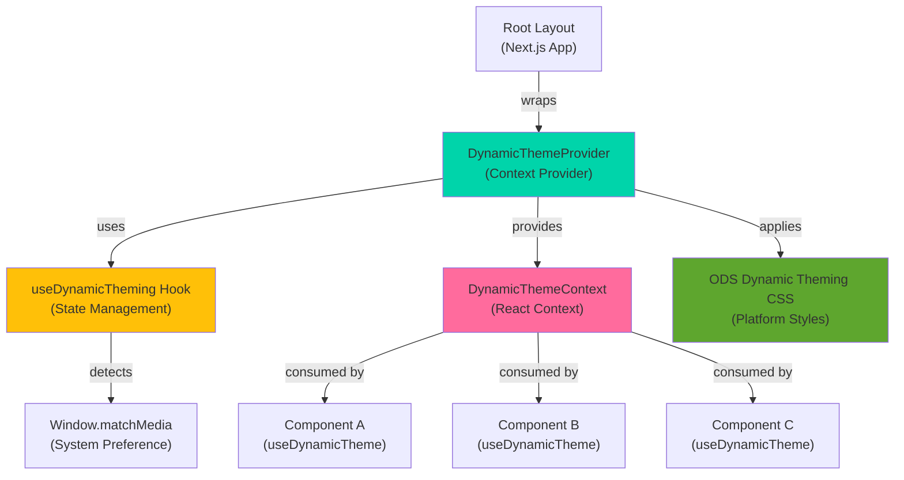
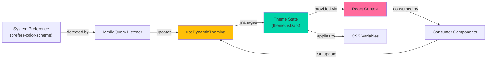
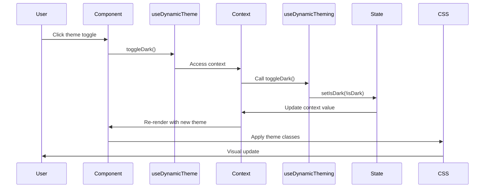
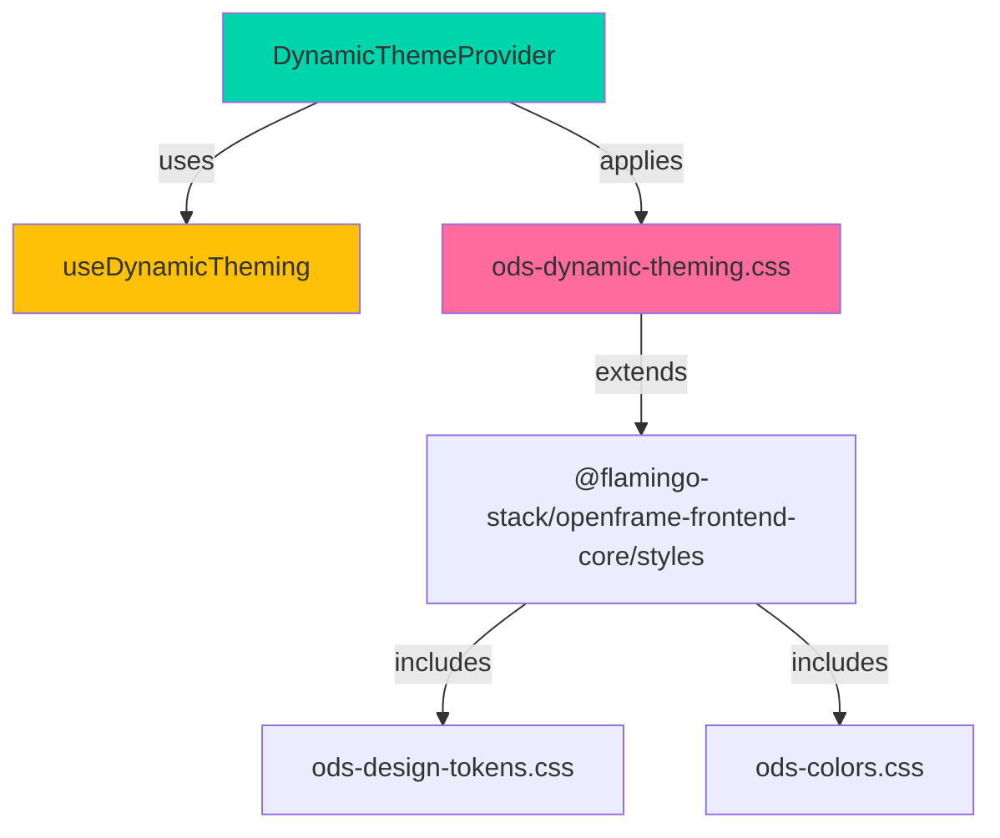

# Frontend Core Theme Provider

## Overview

The **Frontend Core Theme Provider** module is a React Context-based theming system that enables dynamic, platform-aware theme management across the OpenFrame frontend applications. It provides centralized control over color schemes, dark mode preferences, and platform-specific visual identities while supporting accessibility features like high contrast mode and reduced motion preferences.

This module is part of the `@flamingo-stack/openframe-frontend-core` library and serves as the foundation for consistent visual theming across all OpenFrame platform applications (OpenFrame, Flamingo, OpenMSP, and various Hubs).

---

## Core Components

### 1. DynamicThemeProvider

**Location:** `deps-openframe-oss-lib/openframe-frontend-core/src/components/providers/dynamic-theme-provider.tsx`

The main React Context provider that wraps the application and provides theme state management.

```typescript
interface DynamicThemeContextType {
  theme: ThemeConfig;
  isDark: boolean;
  updateTheme: (theme: Partial<ThemeConfig>) => void;
  toggleDark: () => void;
}
```

**Key Features:**
- Wraps application components to provide theme context
- Exposes theme state and control functions via React Context
- Integrates with `useDynamicTheming` hook for state management
- Throws error if used outside provider scope (fail-fast pattern)

**Usage Example:**

```typescript
import { DynamicThemeProvider } from '@flamingo-stack/openframe-frontend-core';

export default function RootLayout({ children }: { children: React.ReactNode }) {
  return (
    <html lang="en">
      <body>
        <DynamicThemeProvider>
          {children}
        </DynamicThemeProvider>
      </body>
    </html>
  );
}
```

### 2. useDynamicTheme Hook

**Location:** `deps-openframe-oss-lib/openframe-frontend-core/src/components/providers/dynamic-theme-provider.tsx`

Consumer hook that provides access to theme context in child components.

```typescript
const { theme, isDark, updateTheme, toggleDark } = useDynamicTheme();
```

**API:**
- `theme`: Current theme configuration object
- `isDark`: Boolean indicating dark mode state
- `updateTheme(newTheme)`: Merge partial theme updates
- `toggleDark()`: Toggle between light and dark modes

**Usage Example:**

```typescript
import { useDynamicTheme } from '@flamingo-stack/openframe-frontend-core';

function ThemeToggleButton() {
  const { isDark, toggleDark } = useDynamicTheme();
  
  return (
    <button onClick={toggleDark}>
      {isDark ? '☀️ Light Mode' : '🌙 Dark Mode'}
    </button>
  );
}
```

### 3. useDynamicTheming Hook

**Location:** `deps-openframe-oss-lib/openframe-frontend-core/src/hooks/use-dynamic-theming.ts`

Core state management hook that handles theme logic and system preference detection.

```typescript
interface ThemeConfig {
  primaryColor: string;
  secondaryColor: string;
  accentColor: string;
  backgroundColor: string;
  textColor: string;
}

const defaultTheme: ThemeConfig = {
  primaryColor: '#FFC008',    // OpenMSP Yellow
  secondaryColor: '#161616',  // Dark background
  accentColor: '#E5E5E5',     // Light grey
  backgroundColor: '#FAFAFA', // Off-white
  textColor: '#161616',       // Dark text
};
```

**Key Features:**
- Detects system color scheme preference via `prefers-color-scheme` media query
- Listens for system theme changes and updates automatically
- Manages theme state with React hooks
- Provides theme update and dark mode toggle functions
- Cleans up event listeners on unmount

**Implementation Details:**

```typescript
export function useDynamicTheming() {
  const [theme, setTheme] = useState<ThemeConfig>(defaultTheme);
  const [isDark, setIsDark] = useState(false);

  useEffect(() => {
    // Check for system preference
    const mediaQuery = window.matchMedia('(prefers-color-scheme: dark)');
    setIsDark(mediaQuery.matches);

    const handleChange = (e: MediaQueryListEvent) => {
      setIsDark(e.matches);
    };

    mediaQuery.addEventListener('change', handleChange);
    return () => mediaQuery.removeEventListener('change', handleChange);
  }, []);

  const updateTheme = (newTheme: Partial<ThemeConfig>) => {
    setTheme(prev => ({ ...prev, ...newTheme }));
  };

  const toggleDark = () => {
    setIsDark(prev => !prev);
  };

  return { theme, isDark, updateTheme, toggleDark };
}
```

---

## Architecture

### Component Hierarchy



### Data Flow



### Theme Update Flow



---

## Platform-Specific Theming

The module supports multiple platform identities through CSS classes and theme configurations defined in `ods-dynamic-theming.css`.

### Supported Platforms

| Platform | Accent Color | RGB Values | Personality | Focus Color |
|----------|--------------|------------|-------------|-------------|
| **OpenMSP** | Yellow | `255, 192, 8` | Energetic | `--ods-open-yellow-base` |
| **OpenFrame** | Cyan | `0, 212, 170` | Technical | `--ods-flamingo-cyan-base` |
| **Flamingo** | Pink | `255, 107, 157` | Creative | `--ods-flamingo-pink-base` |
| **Admin Hub** | Pink | `255, 107, 157` | Professional | `--ods-flamingo-pink-base` |
| **Marketing Hub** | Pink | `243, 87, 187` | Creative | `--ods-flamingo-pink-base` |
| **Product Hub** | Green | `94, 166, 46` | Professional | `--ods-attention-green-success` |
| **Revenue Hub** | Yellow | `255, 192, 8` | Energetic | `--ods-attention-yellow-warning` |
| **People Hub** | Cyan | `94, 250, 240` | Supportive | `--ods-flamingo-cyan-base` |
| **TMCG** | Pink | `243, 87, 187` | Bold | `--ods-flamingo-pink-base` |

### Platform Theme Classes

```css
/* Example: OpenMSP Theme */
.theme-openmsp {
  --theme-accent-rgb: 255, 192, 8;
  --theme-personality: 'energetic';
}

/* Example: OpenFrame Theme */
.theme-openframe {
  --theme-accent-rgb: 0, 212, 170;
  --theme-personality: 'technical';
}
```

### Platform-Specific Animations

Each platform has unique animation personalities:

```css
/* Energetic bounce (OpenMSP) */
@keyframes energetic-pulse {
  0%, 100% { transform: scale(1); }
  50% { transform: scale(1.05); }
}

/* Technical glow (OpenFrame) */
@keyframes technical-glow {
  0%, 100% { filter: drop-shadow(0 0 8px var(--color-accent-primary)); }
  50% { filter: drop-shadow(0 0 16px var(--color-accent-primary)); }
}

/* Creative wave (Flamingo) */
@keyframes creative-wave {
  0%, 100% { transform: translateY(0px); }
  33% { transform: translateY(-2px); }
  66% { transform: translateY(2px); }
}
```

---

## CSS Integration

### Dynamic Theming Stylesheet

**Location:** `deps-openframe-oss-lib/openframe-frontend-core/src/styles/ods-dynamic-theming.css`

This comprehensive stylesheet provides:

1. **Theme Transitions**: Smooth color transitions when switching themes
2. **Platform Classes**: Pre-defined theme configurations for each platform
3. **Accessibility Support**: High contrast mode, reduced motion, focus indicators
4. **Interactive States**: Hover, active, focus, disabled, loading states
5. **Adaptive Components**: Background, text, and border utilities
6. **Loading States**: Skeleton screens and shimmer effects
7. **Debug Mode**: Visual indicators for theme debugging

### Key CSS Features

#### Theme Transitions

```css
.theme-transitioning {
  transition: 
    background-color var(--theme-transition-duration, 300ms) ease-out,
    color var(--theme-transition-duration, 300ms) ease-out,
    border-color var(--theme-transition-duration, 300ms) ease-out;
}
```

#### High Contrast Mode

```css
.high-contrast {
  --color-text-primary: #ffffff;
  --color-text-secondary: #e0e0e0;
  --color-bg: #000000;
  --color-bg-card: #1a1a1a;
  --color-border-default: #ffffff;
  --color-focus-ring: #ffff00;
  --focus-ring-width: 3px;
}
```

#### Adaptive Utilities

```css
.ods-adaptive-bg {
  background: var(--color-bg-card);
  transition: background-color var(--theme-transition-duration, 300ms) ease-out;
}

.ods-adaptive-text {
  color: var(--color-text-primary);
  transition: color var(--theme-transition-duration, 300ms) ease-out;
}

.ods-adaptive-border {
  border-color: var(--color-border-default);
  transition: border-color var(--theme-transition-duration, 300ms) ease-out;
}
```

#### Interactive States

```css
.interactive-wrapper.state-hovered {
  transform: translateY(-1px);
}

.interactive-wrapper.state-pressed {
  transform: translateY(0px) scale(0.98);
}

.interactive-wrapper.state-focused {
  outline: 2px solid var(--color-focus-ring);
  outline-offset: 2px;
}

.interactive-wrapper.state-disabled {
  opacity: 0.6;
  pointer-events: none;
  cursor: not-allowed;
}
```

---

## Accessibility Features

### 1. System Preference Detection

Automatically detects and respects user's system color scheme preference:

```typescript
const mediaQuery = window.matchMedia('(prefers-color-scheme: dark)');
setIsDark(mediaQuery.matches);
```

### 2. High Contrast Mode

Provides enhanced contrast ratios for users with visual impairments:

```css
.high-contrast {
  --color-text-primary: #ffffff;
  --color-bg: #000000;
  --color-focus-ring: #ffff00;
  --focus-ring-width: 3px;
}
```

**Features:**
- Maximum contrast text colors (white on black)
- Bright focus indicators (yellow)
- Thicker focus rings (3px)
- High contrast status colors

### 3. Reduced Motion Support

Respects `prefers-reduced-motion` media query:

```css
@media (prefers-reduced-motion: reduce) {
  .theme-transitioning,
  .theme-transitioning * {
    transition: none !important;
    animation: none !important;
  }
  
  .theme-dynamic {
    --theme-transition-duration: 0ms;
  }
}
```

### 4. Focus Indicators

Platform-aware focus indicators for keyboard navigation:

```css
.theme-openmsp :focus-visible {
  outline: 2px solid var(--ods-open-yellow-base);
  outline-offset: 2px;
}

.theme-openframe :focus-visible {
  outline: 2px solid var(--ods-flamingo-cyan-base);
  outline-offset: 2px;
}
```

### 5. Touch Target Sizing

Ensures minimum touch target sizes on mobile:

```css
@media (max-width: 768px) {
  .theme-dynamic {
    --touch-target-min: 48px;
  }
}
```

---

## Integration with OpenFrame

### Application Setup

The theme provider is integrated at the root layout level in Next.js applications:

**File:** `openframe/services/openframe-frontend/src/app/layout.tsx`

```typescript
import '@flamingo-stack/openframe-frontend-core/styles'

export default function RootLayout({ children }: { children: React.ReactNode }) {
  return (
    <html lang="en" suppressHydrationWarning className={`dark ${azeretMono.variable} ${dmSans.variable}`}>
      <body
        suppressHydrationWarning
        className="min-h-screen antialiased font-body"
        data-app-type="openframe"
      >
        {/* Theme provider would wrap children here */}
        <div className="relative flex min-h-screen flex-col">
          {children}
        </div>
      </body>
    </html>
  );
}
```

### Style Import

All ODS (OpenFrame Design System) styles are imported via:

```typescript
import '@flamingo-stack/openframe-frontend-core/styles'
```

This includes:
- `ods-colors.css` - Color token definitions
- `ods-design-tokens.css` - Design system tokens
- `ods-dynamic-theming.css` - Dynamic theme system
- `ods-interaction-states.css` - Interactive state styles
- `ods-fluid-typography.css` - Responsive typography
- `ods-responsive-tokens.css` - Responsive design tokens

---

## Usage Patterns

### Basic Theme Toggle

```typescript
import { useDynamicTheme } from '@flamingo-stack/openframe-frontend-core';

function ThemeToggle() {
  const { isDark, toggleDark } = useDynamicTheme();
  
  return (
    <button 
      onClick={toggleDark}
      className="ods-interactive"
      aria-label={isDark ? 'Switch to light mode' : 'Switch to dark mode'}
    >
      {isDark ? <SunIcon /> : <MoonIcon />}
    </button>
  );
}
```

### Custom Theme Colors

```typescript
import { useDynamicTheme } from '@flamingo-stack/openframe-frontend-core';

function CustomThemeButton() {
  const { updateTheme } = useDynamicTheme();
  
  const applyCustomTheme = () => {
    updateTheme({
      primaryColor: '#FF5733',
      accentColor: '#33FF57',
      backgroundColor: '#1A1A1A',
    });
  };
  
  return (
    <button onClick={applyCustomTheme}>
      Apply Custom Theme
    </button>
  );
}
```

### Platform-Specific Theming

```typescript
import { useDynamicTheme } from '@flamingo-stack/openframe-frontend-core';
import { useEffect } from 'react';

function PlatformThemeApplier({ platform }: { platform: string }) {
  const { updateTheme } = useDynamicTheme();
  
  useEffect(() => {
    // Apply platform-specific theme class to body
    document.body.classList.add(`theme-${platform}`);
    
    return () => {
      document.body.classList.remove(`theme-${platform}`);
    };
  }, [platform]);
  
  return null;
}

// Usage
<PlatformThemeApplier platform="openframe" />
```

### Conditional Styling Based on Theme

```typescript
import { useDynamicTheme } from '@flamingo-stack/openframe-frontend-core';

function ThemedComponent() {
  const { theme, isDark } = useDynamicTheme();
  
  return (
    <div 
      className={`
        ods-adaptive-bg 
        ods-adaptive-text 
        ${isDark ? 'dark-mode-specific' : 'light-mode-specific'}
      `}
      style={{
        borderColor: theme.accentColor,
      }}
    >
      <h2 style={{ color: theme.primaryColor }}>
        Themed Content
      </h2>
      <p>Current mode: {isDark ? 'Dark' : 'Light'}</p>
    </div>
  );
}
```

### Loading States with Theme

```typescript
import { useDynamicTheme } from '@flamingo-stack/openframe-frontend-core';

function ThemedSkeleton() {
  const { isDark } = useDynamicTheme();
  
  return (
    <div className={`
      skeleton-wave 
      ${isDark ? 'skeleton-platform-openframe' : 'skeleton-platform-flamingo'}
    `}>
      <div className="skeleton-stage-2">
        Loading content...
      </div>
    </div>
  );
}
```

---

## Advanced Features

### 1. Theme Validation

Visual indicators for theme validation during development:

```css
.theme-validation-pass::after {
  content: '✓';
  background: var(--color-success);
  /* Positioned indicator */
}

.theme-validation-fail::after {
  content: '!';
  background: var(--color-error);
  /* Positioned indicator */
}
```

### 2. Debug Mode

Enable visual debugging for theme elements:

```css
.theme-debug .ods-accent::before {
  content: '';
  position: absolute;
  width: 4px;
  height: 4px;
  background: #ff00ff;
  z-index: 1000;
}
```

### 3. Dynamic Color Mixing

CSS color-mix for adaptive color variations:

```css
.theme-dynamic {
  --color-accent-subtle: color-mix(in srgb, var(--color-accent-primary) 60%, transparent);
  --color-accent-strong: color-mix(in srgb, var(--color-accent-primary) 140%, #000000);
  --shadow-accent: 0 4px 20px color-mix(in srgb, var(--color-accent-primary) 25%, transparent);
}
```

### 4. Responsive Theme Adjustments

Mobile-specific theme enhancements:

```css
@media (max-width: 768px) {
  .theme-dynamic {
    --color-text-secondary: color-mix(in srgb, var(--color-text-secondary) 110%, var(--color-text-primary));
    --touch-target-min: 48px;
  }
}
```

---

## Dependencies

### Internal Dependencies



### External Dependencies

- **React**: Context API, hooks (useState, useEffect, useContext)
- **Next.js**: App Router, client components (`"use client"`)
- **Browser APIs**: `window.matchMedia`, `MediaQueryList` events

---

## Related Modules

- **[frontend_core_components](frontend_core_components.md)**: UI components that consume theme context
- **[frontend_core_navigation](frontend_core_navigation.md)**: Navigation components with theme-aware styling
- **[frontend_core_ui_table](frontend_core_ui_table.md)**: Table components with adaptive theming
- **[frontend_main](frontend_main.md)**: Main frontend application that integrates theme provider

---

## Best Practices

### 1. Provider Placement

Always place `DynamicThemeProvider` at the root of your application:

```typescript
// ✅ Good: Root level
<DynamicThemeProvider>
  <App />
</DynamicThemeProvider>

// ❌ Bad: Nested deep in component tree
<App>
  <SomeComponent>
    <DynamicThemeProvider>
      <ThemedComponent />
    </DynamicThemeProvider>
  </SomeComponent>
</App>
```

### 2. Use CSS Classes Over Inline Styles

Prefer CSS utility classes for theme-aware styling:

```typescript
// ✅ Good: CSS classes
<div className="ods-adaptive-bg ods-adaptive-text">
  Content
</div>

// ⚠️ Acceptable: Dynamic inline styles when necessary
<div style={{ color: theme.primaryColor }}>
  Content
</div>
```

### 3. Respect User Preferences

Always honor system preferences and accessibility settings:

```typescript
// ✅ Good: Detect and respect system preference
useEffect(() => {
  const mediaQuery = window.matchMedia('(prefers-color-scheme: dark)');
  setIsDark(mediaQuery.matches);
}, []);

// ❌ Bad: Force theme without checking preference
setIsDark(true); // Ignores user preference
```

### 4. Provide Theme Toggle UI

Give users control over theme preferences:

```typescript
// ✅ Good: Accessible theme toggle
<button 
  onClick={toggleDark}
  aria-label={isDark ? 'Switch to light mode' : 'Switch to dark mode'}
  className="ods-interactive"
>
  {isDark ? <SunIcon /> : <MoonIcon />}
</button>
```

### 5. Test Accessibility

Ensure theme changes maintain accessibility:

- Test with screen readers
- Verify focus indicators are visible
- Check color contrast ratios
- Test with reduced motion enabled
- Validate high contrast mode

### 6. Performance Optimization

Minimize re-renders when theme changes:

```typescript
// ✅ Good: Memoize theme-dependent values
const themedStyles = useMemo(() => ({
  color: theme.primaryColor,
  backgroundColor: theme.backgroundColor,
}), [theme.primaryColor, theme.backgroundColor]);

// ❌ Bad: Create new object on every render
const themedStyles = {
  color: theme.primaryColor,
  backgroundColor: theme.backgroundColor,
};
```

---

## Troubleshooting

### Theme Not Applying

**Problem:** Theme changes don't reflect in components.

**Solutions:**
1. Ensure `DynamicThemeProvider` wraps your app
2. Verify CSS imports are loaded: `import '@flamingo-stack/openframe-frontend-core/styles'`
3. Check browser console for context errors
4. Verify component uses `useDynamicTheme` hook

### System Preference Not Detected

**Problem:** Dark mode doesn't match system preference.

**Solutions:**
1. Check browser supports `prefers-color-scheme` media query
2. Verify `window.matchMedia` is available (client-side only)
3. Ensure component is client-side rendered (`"use client"` in Next.js)

### CSS Variables Not Working

**Problem:** CSS custom properties show default values.

**Solutions:**
1. Verify platform theme class is applied to body/html
2. Check CSS specificity conflicts
3. Ensure CSS files are imported in correct order
4. Validate CSS variable names match design tokens

### Performance Issues

**Problem:** Theme changes cause lag or jank.

**Solutions:**
1. Use CSS transitions instead of JavaScript animations
2. Memoize theme-dependent calculations
3. Debounce rapid theme changes
4. Use `will-change` CSS property for animated elements

---

## Future Enhancements

### Planned Features

1. **Theme Persistence**: Save user theme preference to localStorage
2. **Theme Presets**: Pre-defined theme configurations for quick switching
3. **Color Picker Integration**: Allow users to customize theme colors
4. **Theme Preview**: Live preview of theme changes before applying
5. **Theme Export/Import**: Share custom themes between users
6. **Automatic Contrast Adjustment**: AI-powered contrast optimization
7. **Theme Scheduling**: Automatic theme switching based on time of day
8. **Multi-Theme Support**: Multiple active themes for different sections

### Potential Improvements

1. **TypeScript Strict Mode**: Enhanced type safety for theme configurations
2. **Theme Validation**: Runtime validation of theme color contrast ratios
3. **Performance Monitoring**: Track theme change performance metrics
4. **A11y Testing**: Automated accessibility testing for theme combinations
5. **Theme Documentation**: Auto-generated theme documentation from CSS
6. **Theme Playground**: Interactive theme customization tool

---

## Contributing

When contributing to the theme provider module:

1. **Maintain Accessibility**: All theme changes must maintain WCAG AA contrast ratios
2. **Test Cross-Platform**: Verify themes work across all supported platforms
3. **Document Changes**: Update this documentation for new features
4. **Follow Naming Conventions**: Use ODS naming patterns for CSS classes
5. **Add Tests**: Include unit tests for new theme logic
6. **Performance**: Ensure theme changes don't degrade performance

---

## Support

For questions or issues related to the theme provider:

- **Slack Community**: [OpenMSP Slack](https://join.slack.com/t/openmsp/shared_invite/zt-36bl7mx0h-3~U2nFH6nqHqoTPXMaHEHA)
- **Documentation**: This file and related module docs
- **Code Examples**: See usage patterns section above

---

## License

Part of the OpenFrame open-source project. See repository root for license information.
