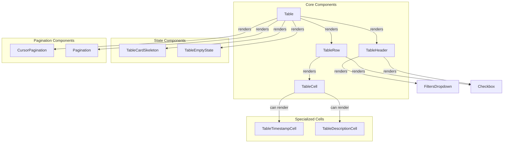
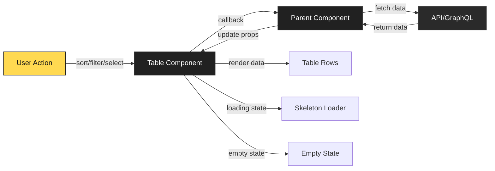
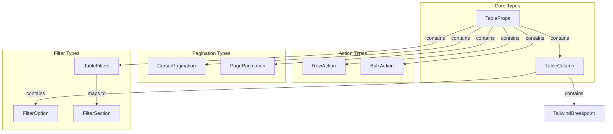

# Frontend Core UI Table Module

## Overview

The **Frontend Core UI Table** module is a comprehensive, production-ready table component system built for the OpenFrame platform. It provides a flexible, feature-rich data table implementation with support for sorting, filtering, pagination, row selection, bulk actions, and responsive design. The module is designed to handle complex data presentation requirements while maintaining consistent styling and user experience across the OpenFrame frontend applications.

**Key Features:**
- **Responsive Design**: Adaptive layouts for desktop and mobile viewports
- **Advanced Sorting**: Multi-column sorting with custom sort functions
- **Flexible Filtering**: Column-level filters with dropdown UI
- **Dual Pagination**: Support for both cursor-based and page-based pagination
- **Row Selection**: Single and multi-row selection with bulk actions
- **Customizable Rendering**: Custom cell and header renderers
- **Loading States**: Skeleton loaders with configurable row counts
- **Empty States**: Customizable empty state with actions
- **Row Actions**: Inline action buttons or custom action renderers
- **Accessibility**: Keyboard navigation and ARIA attributes
- **Type Safety**: Full TypeScript support with generic types

---

## Architecture

### Component Hierarchy



### Data Flow



### Type System



---

## Core Components

### 1. Table Component

The main table component that orchestrates all table functionality.

**Location:** `deps-openframe-oss-lib/openframe-frontend-core/src/components/ui/table/table.tsx`

**Key Responsibilities:**
- Data rendering and row management
- Selection state management
- Pagination integration
- Loading and empty state handling
- Action column injection
- Toolbar rendering for bulk actions

**Generic Type Parameter:**
- `T`: The type of data items in the table

**Example Usage:**

```typescript
import { Table, type TableColumn } from '@flamingo-stack/openframe-frontend-core/components/ui'

interface User {
  id: string
  name: string
  email: string
  role: string
  createdAt: Date
}

const columns: TableColumn<User>[] = [
  {
    key: 'name',
    label: 'Name',
    sortable: true,
    width: 'w-64'
  },
  {
    key: 'email',
    label: 'Email',
    sortable: true,
    width: 'flex-1'
  },
  {
    key: 'role',
    label: 'Role',
    filterable: true,
    filterOptions: [
      { id: 'admin', label: 'Admin', value: 'admin' },
      { id: 'user', label: 'User', value: 'user' }
    ]
  }
]

function UsersTable() {
  const [users, setUsers] = useState<User[]>([])
  const [loading, setLoading] = useState(true)
  
  return (
    <Table
      data={users}
      columns={columns}
      rowKey="id"
      loading={loading}
      onRowClick={(user) => console.log('Clicked:', user)}
      cursorPagination={{
        hasNextPage: true,
        endCursor: 'cursor123',
        onNext: (cursor) => fetchNextPage(cursor)
      }}
    />
  )
}
```

### 2. TableHeader Component

Renders the table header with column labels, sort indicators, and filter controls.

**Location:** `deps-openframe-oss-lib/openframe-frontend-core/src/components/ui/table/table-header.tsx`

**Features:**
- Sortable column headers with visual indicators
- Inline filter dropdowns
- Select-all checkbox for row selection
- Result count display
- Responsive visibility (hidden on mobile)

**Sort Icons:**
- Inactive: `SwitchVrIcon` (gray)
- Ascending: `Arrow01UpIcon` (yellow)
- Descending: `Arrow01DownIcon` (yellow)

### 3. TableRow Component

Renders individual table rows with cell data and selection support.

**Location:** `deps-openframe-oss-lib/openframe-frontend-core/src/components/ui/table/table-row.tsx`

**Features:**
- Nested property access via dot notation (e.g., `user.profile.name`)
- Custom cell rendering via `renderCell`
- Click handling with exclusion zones (`data-no-row-click`)
- Selection checkbox integration
- Hover effects and transitions

**Cell Value Resolution:**
1. If `column.renderCell` exists, use custom renderer
2. Access nested properties using dot notation
3. Handle null/undefined → display "-"
4. Handle booleans → display "Yes"/"No"
5. Handle objects → JSON stringify
6. Default → convert to string

### 4. TableCell Component

Renders individual table cells with alignment and styling.

**Location:** `deps-openframe-oss-lib/openframe-frontend-core/src/components/ui/table/table-cell.tsx`

**Features:**
- Configurable alignment (left, center, right)
- Automatic text truncation
- Custom width support
- Typography styling (DM Sans font)

### 5. TableCardSkeleton Component

Provides loading state visualization with animated skeleton rows.

**Location:** `deps-openframe-oss-lib/openframe-frontend-core/src/components/ui/table/table-skeleton.tsx`

**Features:**
- Configurable row count (default: 10)
- Responsive skeleton layouts (desktop/mobile)
- Consistent row heights using CSS clamp
- Pulse animation
- Action button placeholders

**Row Heights:**
- Desktop: `clamp(72px, 5vw, 88px)`
- Mobile: `clamp(72px, 18vw, 96px)`

### 6. TableEmptyState Component

Displays when no data is available.

**Location:** `deps-openframe-oss-lib/openframe-frontend-core/src/components/ui/table/table-empty-state.tsx`

**Features:**
- Custom icon support (default: `FileX2`)
- Custom message
- Optional action button
- Centered layout

---

## Specialized Cell Components

### TableTimestampCell

Displays timestamp with associated ID in a two-line format.

**Location:** `deps-openframe-oss-lib/openframe-frontend-core/src/components/ui/table/table-timestamp-cell.tsx`

**Props:**
- `timestamp`: Date or ISO string
- `id`: Identifier to display
- `idLabel`: Optional label prefix (e.g., "Log ID")
- `formatTimestamp`: Auto-format timestamps (default: true)

**Example:**

```typescript
{
  key: 'timestamp',
  label: 'Created',
  renderCell: (log) => (
    <TableTimestampCell
      timestamp={log.createdAt}
      id={log.id}
      idLabel="Log ID"
    />
  )
}
```

### TableDescriptionCell

Displays multi-line text with line clamping.

**Location:** `deps-openframe-oss-lib/openframe-frontend-core/src/components/ui/table/table-description-cell.tsx`

**Props:**
- `text`: Description text
- `maxLines`: Maximum lines before truncation (default: 3)
- `className`: Additional CSS classes

**Example:**

```typescript
{
  key: 'description',
  label: 'Description',
  renderCell: (item) => (
    <TableDescriptionCell
      text={item.description}
      maxLines={2}
    />
  )
}
```

---

## Type Definitions

### TableProps<T>

Main configuration interface for the Table component.

```typescript
interface TableProps<T = any> {
  // Data
  data: T[]
  columns: TableColumn<T>[]
  rowKey: keyof T | ((item: T) => string)

  // States
  loading?: boolean
  emptyMessage?: string
  skeletonRows?: number // Default: 10
  
  // Styling
  className?: string
  containerClassName?: string
  headerClassName?: string
  rowClassName?: string | ((item: T, index: number) => string)
  
  // Interactions
  onRowClick?: (item: T) => void
  
  // Row Actions
  rowActions?: RowAction<T>[]
  renderRowActions?: (item: T) => ReactNode

  // Sorting
  sortBy?: string
  sortDirection?: 'asc' | 'desc'
  onSort?: (column: string, direction: 'asc' | 'desc') => void
  defaultSort?: { column: string; direction: 'asc' | 'desc' }
  
  // Filtering
  filters?: TableFilters
  onFilterChange?: (filters: TableFilters) => void
  showFilters?: boolean
  
  // Selection
  selectable?: boolean
  selectedRows?: T[]
  onSelectionChange?: (selected: T[]) => void
  
  // Bulk Actions
  bulkActions?: BulkAction<T>[]
  showToolbar?: boolean
  
  // Pagination
  cursorPagination?: CursorPagination
  pagePagination?: PagePagination
  paginationClassName?: string
}
```

### TableColumn<T>

Column configuration with rendering and behavior options.

```typescript
interface TableColumn<T = any> {
  key: string
  label: string
  width?: string // Tailwind classes: 'w-40', 'flex-1', etc.
  align?: 'left' | 'center' | 'right'
  sortable?: boolean
  filterable?: boolean
  hideAt?: TailwindBreakpoint | TailwindBreakpoint[]
  renderCell?: (item: T, column: TableColumn<T>) => ReactNode
  renderHeader?: () => ReactNode
  className?: string
  
  // Sorting
  sortKey?: string // Override key for sorting
  sortFunction?: (a: T, b: T) => number
  
  // Filtering
  filterOptions?: FilterOption[]
  filterKey?: string // Override key for filtering
  filterFunction?: (item: T, filterValue: any) => boolean
}
```

### CursorPagination

Configuration for cursor-based pagination (GraphQL-style).

```typescript
interface CursorPagination {
  hasNextPage: boolean
  hasPreviousPage?: boolean
  isFirstPage?: boolean
  startCursor?: string | null
  endCursor?: string | null
  currentCount?: number
  totalCount?: number | null
  onNext?: (cursor: string) => void
  onPrevious?: (cursor: string) => void
  onReset?: () => void
  itemName?: string // e.g., "devices", "users"
  showInfo?: boolean
  compact?: boolean
  resetButtonLabel?: string
  resetButtonIcon?: 'home' | 'rotate'
}
```

### PagePagination

Configuration for traditional page-based pagination.

```typescript
interface PagePagination {
  currentPage: number
  totalPages: number
  pageSize?: number
  totalItems?: number
  onPageChange: (page: number) => void
}
```

### RowAction<T> & BulkAction<T>

Action button configurations for rows and bulk operations.

```typescript
interface RowAction<T = any> {
  label: string
  icon?: ReactNode
  onClick: (item: T) => void
  variant?: 'primary' | 'secondary' | 'outline' | 'ghost' | 'destructive'
  className?: string
  hideOnMobile?: boolean
}

interface BulkAction<T = any> {
  label: string
  icon?: ReactNode
  onClick: (selectedItems: T[]) => void
  variant?: 'primary' | 'secondary' | 'outline' | 'ghost' | 'destructive'
  requiresSelection?: boolean
  className?: string
}
```

---

## Features Deep Dive

### Sorting

The table supports both client-side and server-side sorting.

**Client-Side Sorting:**

```typescript
const columns: TableColumn<Device>[] = [
  {
    key: 'name',
    label: 'Device Name',
    sortable: true,
    sortFunction: (a, b) => a.name.localeCompare(b.name)
  }
]
```

**Server-Side Sorting:**

```typescript
function DevicesTable() {
  const [sortBy, setSortBy] = useState<string>()
  const [sortDirection, setSortDirection] = useState<'asc' | 'desc'>('asc')
  
  const handleSort = (column: string, direction: 'asc' | 'desc') => {
    setSortBy(column)
    setSortDirection(direction)
    // Fetch data with new sort parameters
    fetchDevices({ sortBy: column, sortDirection: direction })
  }
  
  return (
    <Table
      data={devices}
      columns={columns}
      sortBy={sortBy}
      sortDirection={sortDirection}
      onSort={handleSort}
    />
  )
}
```

### Filtering

Column-level filtering with dropdown UI.

**Filter Configuration:**

```typescript
const columns: TableColumn<Device>[] = [
  {
    key: 'status',
    label: 'Status',
    filterable: true,
    filterOptions: [
      { id: 'online', label: 'Online', value: 'ONLINE' },
      { id: 'offline', label: 'Offline', value: 'OFFLINE' },
      { id: 'maintenance', label: 'Maintenance', value: 'MAINTENANCE' }
    ]
  }
]
```

**Filter State Management:**

```typescript
function DevicesTable() {
  const [filters, setFilters] = useState<TableFilters>({})
  
  const handleFilterChange = (newFilters: TableFilters) => {
    setFilters(newFilters)
    // Fetch data with new filters
    fetchDevices({ filters: newFilters })
  }
  
  return (
    <Table
      data={devices}
      columns={columns}
      filters={filters}
      onFilterChange={handleFilterChange}
    />
  )
}
```

### Row Selection

Enable multi-row selection with bulk actions.

```typescript
function DevicesTable() {
  const [selectedDevices, setSelectedDevices] = useState<Device[]>([])
  
  const bulkActions: BulkAction<Device>[] = [
    {
      label: 'Delete Selected',
      variant: 'destructive',
      onClick: (devices) => {
        console.log('Deleting:', devices)
      }
    },
    {
      label: 'Export',
      onClick: (devices) => {
        exportDevices(devices)
      }
    }
  ]
  
  return (
    <Table
      data={devices}
      columns={columns}
      selectable={true}
      selectedRows={selectedDevices}
      onSelectionChange={setSelectedDevices}
      bulkActions={bulkActions}
      showToolbar={true}
    />
  )
}
```

### Pagination

**Cursor-Based Pagination (Recommended for GraphQL):**

```typescript
function DevicesTable() {
  const { devices, pageInfo, fetchNextPage } = useDevices()
  
  return (
    <Table
      data={devices}
      columns={columns}
      cursorPagination={{
        hasNextPage: pageInfo.hasNextPage,
        endCursor: pageInfo.endCursor,
        currentCount: devices.length,
        totalCount: pageInfo.totalCount,
        itemName: 'devices',
        onNext: (cursor) => fetchNextPage(cursor),
        onReset: () => fetchFirstPage(),
        showInfo: true
      }}
    />
  )
}
```

**Page-Based Pagination:**

```typescript
function DevicesTable() {
  const [currentPage, setCurrentPage] = useState(1)
  const { devices, totalPages } = useDevices({ page: currentPage })
  
  return (
    <Table
      data={devices}
      columns={columns}
      pagePagination={{
        currentPage,
        totalPages,
        pageSize: 20,
        onPageChange: setCurrentPage
      }}
    />
  )
}
```

### Responsive Design

Control column visibility at different breakpoints.

```typescript
const columns: TableColumn<Device>[] = [
  {
    key: 'name',
    label: 'Name',
    width: 'flex-1'
    // Always visible
  },
  {
    key: 'status',
    label: 'Status',
    hideAt: 'md' // Hidden below md, visible at md and above
  },
  {
    key: 'lastSeen',
    label: 'Last Seen',
    hideAt: ['sm', 'md'] // Hidden at sm and md, visible at lg+
  }
]
```

**Breakpoint Values:**
- `sm`: 640px
- `md`: 768px
- `lg`: 1024px
- `xl`: 1280px
- `2xl`: 1536px

### Custom Cell Rendering

**Simple Custom Renderer:**

```typescript
{
  key: 'status',
  label: 'Status',
  renderCell: (device) => (
    <span className={cn(
      'px-2 py-1 rounded',
      device.status === 'ONLINE' ? 'bg-green-500' : 'bg-red-500'
    )}>
      {device.status}
    </span>
  )
}
```

**Complex Custom Renderer:**

```typescript
{
  key: 'organization',
  label: 'Organization',
  renderCell: (device) => (
    <div className="flex items-center gap-2">
      {device.organizationImageUrl && (
        
      )}
      <div className="flex flex-col">
        <span className="font-medium">{device.organizationName}</span>
        <span className="text-sm text-gray-500">{device.organizationId}</span>
      </div>
    </div>
  )
}
```

### Row Actions

**Standard Row Actions:**

```typescript
const rowActions: RowAction<Device>[] = [
  {
    label: 'Edit',
    icon: <EditIcon />,
    onClick: (device) => router.push(`/devices/edit/${device.id}`)
  },
  {
    label: 'Delete',
    variant: 'destructive',
    onClick: (device) => deleteDevice(device.id)
  }
]

<Table
  data={devices}
  columns={columns}
  rowActions={rowActions}
/>
```

**Custom Row Actions Renderer:**

```typescript
<Table
  data={devices}
  columns={columns}
  renderRowActions={(device) => (
    <DropdownMenu>
      <DropdownMenuTrigger>
        <DotsVerticalIcon />
      </DropdownMenuTrigger>
      <DropdownMenuContent>
        <DropdownMenuItem onClick={() => editDevice(device)}>
          Edit
        </DropdownMenuItem>
        <DropdownMenuItem onClick={() => deleteDevice(device)}>
          Delete
        </DropdownMenuItem>
      </DropdownMenuContent>
    </DropdownMenu>
  )}
/>
```

---

## Utility Functions

### getHideClasses

Generates Tailwind CSS classes for responsive column visibility.

**Location:** `deps-openframe-oss-lib/openframe-frontend-core/src/components/ui/table/utils.ts`

```typescript
function getHideClasses(
  hideAt?: TailwindBreakpoint | TailwindBreakpoint[]
): string
```

**Examples:**

```typescript
getHideClasses('md')           // Returns: 'hidden md:flex'
getHideClasses(['sm', 'md'])   // Returns: 'sm:hidden md:hidden lg:flex'
getHideClasses(undefined)      // Returns: ''
```

### isHiddenOnMobile

Checks if a column is hidden on mobile breakpoints.

```typescript
function isHiddenOnMobile<T>(column: TableColumn<T>): boolean
```

**Usage:**

```typescript
const mobileColumns = columns.filter(col => !isHiddenOnMobile(col))
```

---

## Integration with OpenFrame

### Usage in Device Management

The table component is extensively used in the device management interface.

**File:** `openframe/services/openframe-frontend/src/app/devices/components/devices-view.tsx`

```typescript
import { Table } from "@flamingo-stack/openframe-frontend-core/components/ui"
import { useDevices } from '../hooks/use-devices'
import { getDeviceTableColumns, getDeviceTableRowActions } from './devices-table-columns'

export function DevicesView() {
  const { devices, pageInfo, isLoading, fetchNextPage } = useDevices()
  const columns = useMemo(() => getDeviceTableColumns(), [])
  const renderRowActions = useMemo(() => getDeviceTableRowActions(), [])
  
  return (
    <Table
      data={devices}
      columns={columns}
      rowKey="id"
      loading={isLoading}
      renderRowActions={renderRowActions}
      onRowClick={(device) => router.push(`/devices/details/${device.id}`)}
      cursorPagination={{
        hasNextPage: pageInfo.hasNextPage,
        endCursor: pageInfo.endCursor,
        itemName: 'devices',
        onNext: (cursor) => fetchNextPage(cursor)
      }}
    />
  )
}
```

### Integration with GraphQL

The table works seamlessly with GraphQL cursor-based pagination.

```typescript
const DEVICES_QUERY = gql`
  query GetDevices($cursor: String, $search: String) {
    devices(first: 20, after: $cursor, search: $search) {
      edges {
        node {
          id
          name
          status
          organizationName
        }
      }
      pageInfo {
        hasNextPage
        endCursor
      }
    }
  }
`

function useDevices() {
  const [fetchDevices, { data, loading }] = useLazyQuery(DEVICES_QUERY)
  
  const devices = data?.devices.edges.map(edge => edge.node) || []
  const pageInfo = data?.devices.pageInfo
  
  return { devices, pageInfo, loading, fetchDevices }
}
```

### Styling Integration

The table uses OpenFrame Design System (ODS) tokens for consistent theming.

**Color Tokens:**
- Background: `#212121` (card background)
- Border: `#3a3a3a` (primary border)
- Text Primary: `#fafafa`
- Text Secondary: `#888888`
- Accent: `#FFD951` (yellow highlight)
- Hover: `#2a2a2a`

**Typography:**
- Font Family: DM Sans
- Header: 12px uppercase, medium weight
- Cell Primary: 18px, medium weight
- Cell Secondary: 14px-16px, medium weight

---

## Performance Considerations

### Virtualization

For large datasets (1000+ rows), consider implementing virtual scrolling:

```typescript
import { useVirtualizer } from '@tanstack/react-virtual'

function VirtualizedTable({ data, columns }) {
  const parentRef = useRef<HTMLDivElement>(null)
  
  const virtualizer = useVirtualizer({
    count: data.length,
    getScrollElement: () => parentRef.current,
    estimateSize: () => 88, // Row height
    overscan: 5
  })
  
  // Render only visible rows
  const virtualRows = virtualizer.getVirtualItems()
  
  return (
    <div ref={parentRef} style={{ height: '600px', overflow: 'auto' }}>
      <div style={{ height: `${virtualizer.getTotalSize()}px` }}>
        {virtualRows.map(virtualRow => (
          <TableRow
            key={data[virtualRow.index].id}
            item={data[virtualRow.index]}
            columns={columns}
            style={{
              position: 'absolute',
              top: 0,
              left: 0,
              width: '100%',
              transform: `translateY(${virtualRow.start}px)`
            }}
          />
        ))}
      </div>
    </div>
  )
}
```

### Memoization

Use React memoization to prevent unnecessary re-renders:

```typescript
const columns = useMemo(() => getDeviceTableColumns(), [])
const renderRowActions = useMemo(() => getDeviceTableRowActions(), [])
const handleRowClick = useCallback((device: Device) => {
  router.push(`/devices/details/${device.id}`)
}, [router])
```

### Skeleton Row Count

Adjust skeleton rows based on viewport height:

```typescript
const skeletonRows = useMemo(() => {
  const viewportHeight = window.innerHeight
  const rowHeight = 88 // Desktop row height
  return Math.floor(viewportHeight / rowHeight) - 2
}, [])

<Table
  data={devices}
  columns={columns}
  loading={loading}
  skeletonRows={skeletonRows}
/>
```

---

## Accessibility

### Keyboard Navigation

The table supports standard keyboard interactions:

- **Tab**: Navigate between interactive elements
- **Enter/Space**: Activate buttons and checkboxes
- **Arrow Keys**: Navigate within dropdown filters

### ARIA Attributes

```typescript
// Selection checkbox
<Checkbox
  checked={selected}
  onCheckedChange={handleSelect}
  aria-label={`Select ${item.name}`}
/>

// Sort button
<button
  onClick={() => handleSort(column)}
  aria-label={`Sort by ${column.label}`}
  aria-sort={sortDirection}
>
  {column.label}
</button>

// Filter dropdown
<FiltersDropdown
  triggerElement={<FilterIcon />}
  aria-label={`Filter by ${column.label}`}
/>
```

### Screen Reader Support

- Row count announcements
- Selection state announcements
- Sort direction announcements
- Filter state announcements

---

## Testing

### Unit Tests

```typescript
import { render, screen, fireEvent } from '@testing-library/react'
import { Table } from './table'

describe('Table', () => {
  const mockData = [
    { id: '1', name: 'Device 1', status: 'ONLINE' },
    { id: '2', name: 'Device 2', status: 'OFFLINE' }
  ]
  
  const mockColumns = [
    { key: 'name', label: 'Name' },
    { key: 'status', label: 'Status' }
  ]
  
  it('renders data correctly', () => {
    render(<Table data={mockData} columns={mockColumns} rowKey="id" />)
    
    expect(screen.getByText('Device 1')).toBeInTheDocument()
    expect(screen.getByText('Device 2')).toBeInTheDocument()
  })
  
  it('handles row click', () => {
    const handleClick = jest.fn()
    render(
      <Table 
        data={mockData} 
        columns={mockColumns} 
        rowKey="id"
        onRowClick={handleClick}
      />
    )
    
    fireEvent.click(screen.getByText('Device 1'))
    expect(handleClick).toHaveBeenCalledWith(mockData[0])
  })
  
  it('shows loading state', () => {
    render(
      <Table 
        data={[]} 
        columns={mockColumns} 
        rowKey="id"
        loading={true}
        skeletonRows={3}
      />
    )
    
    const skeletons = screen.getAllByRole('presentation')
    expect(skeletons).toHaveLength(3)
  })
  
  it('shows empty state', () => {
    render(
      <Table 
        data={[]} 
        columns={mockColumns} 
        rowKey="id"
        emptyMessage="No devices found"
      />
    )
    
    expect(screen.getByText('No devices found')).toBeInTheDocument()
  })
})
```

### Integration Tests

```typescript
describe('Table with Pagination', () => {
  it('fetches next page on pagination click', async () => {
    const fetchNextPage = jest.fn()
    
    render(
      <Table
        data={mockData}
        columns={mockColumns}
        rowKey="id"
        cursorPagination={{
          hasNextPage: true,
          endCursor: 'cursor123',
          onNext: fetchNextPage
        }}
      />
    )
    
    const nextButton = screen.getByText('Next')
    fireEvent.click(nextButton)
    
    expect(fetchNextPage).toHaveBeenCalledWith('cursor123')
  })
})
```

---

## Best Practices

### 1. Use Memoization

Always memoize columns and callbacks to prevent unnecessary re-renders:

```typescript
const columns = useMemo(() => getColumns(), [dependencies])
const handleRowClick = useCallback((item) => { /* ... */ }, [dependencies])
```

### 2. Implement Proper Loading States

Show skeleton loaders during data fetching:

```typescript
<Table
  data={devices}
  columns={columns}
  loading={isLoading}
  skeletonRows={10}
/>
```

### 3. Handle Empty States

Provide meaningful empty states with actions:

```typescript
<Table
  data={devices}
  columns={columns}
  emptyMessage="No devices found. Add your first device to get started."
/>
```

### 4. Use Cursor Pagination for Large Datasets

Prefer cursor-based pagination over page-based for better performance:

```typescript
cursorPagination={{
  hasNextPage: pageInfo.hasNextPage,
  endCursor: pageInfo.endCursor,
  onNext: fetchNextPage
}}
```

### 5. Implement Responsive Columns

Hide less important columns on smaller screens:

```typescript
{
  key: 'lastSeen',
  label: 'Last Seen',
  hideAt: ['sm', 'md'] // Only show on large screens
}
```

### 6. Use Type Safety

Always provide generic type parameters:

```typescript
const columns: TableColumn<Device>[] = [...]
const rowActions: RowAction<Device>[] = [...]
```

### 7. Optimize Custom Renderers

Keep custom cell renderers lightweight:

```typescript
// Good: Simple, fast renderer
renderCell: (device) => <StatusBadge status={device.status} />

// Bad: Heavy computation in renderer
renderCell: (device) => {
  const stats = calculateComplexStats(device) // Avoid!
  return <ComplexComponent stats={stats} />
}
```

### 8. Handle Row Click Exclusions

Use `data-no-row-click` to prevent row clicks on interactive elements:

```typescript
<div data-no-row-click>
  <Button onClick={handleAction}>Action</Button>
</div>
```

---

## Common Patterns

### Pattern 1: Server-Side Filtering and Sorting

```typescript
function DevicesTable() {
  const [filters, setFilters] = useState<TableFilters>({})
  const [sortBy, setSortBy] = useState<string>()
  const [sortDirection, setSortDirection] = useState<'asc' | 'desc'>('asc')
  
  const { devices, loading } = useDevices({
    filters,
    sortBy,
    sortDirection
  })
  
  return (
    <Table
      data={devices}
      columns={columns}
      loading={loading}
      filters={filters}
      onFilterChange={setFilters}
      sortBy={sortBy}
      sortDirection={sortDirection}
      onSort={(col, dir) => {
        setSortBy(col)
        setSortDirection(dir)
      }}
    />
  )
}
```

### Pattern 2: Bulk Operations with Confirmation

```typescript
function DevicesTable() {
  const [selectedDevices, setSelectedDevices] = useState<Device[]>([])
  
  const bulkActions: BulkAction<Device>[] = [
    {
      label: 'Delete Selected',
      variant: 'destructive',
      onClick: async (devices) => {
        const confirmed = await confirmDialog({
          title: 'Delete Devices',
          message: `Are you sure you want to delete ${devices.length} devices?`
        })
        
        if (confirmed) {
          await deleteDevices(devices.map(d => d.id))
          setSelectedDevices([])
        }
      }
    }
  ]
  
  return (
    <Table
      data={devices}
      columns={columns}
      selectable={true}
      selectedRows={selectedDevices}
      onSelectionChange={setSelectedDevices}
      bulkActions={bulkActions}
      showToolbar={true}
    />
  )
}
```

### Pattern 3: Infinite Scroll with Cursor Pagination

```typescript
function DevicesTable() {
  const { devices, pageInfo, fetchNextPage, loading } = useDevices()
  const observerRef = useRef<HTMLDivElement>(null)
  
  useEffect(() => {
    const observer = new IntersectionObserver(
      (entries) => {
        if (entries[0].isIntersecting && pageInfo.hasNextPage && !loading) {
          fetchNextPage(pageInfo.endCursor)
        }
      },
      { threshold: 1.0 }
    )
    
    if (observerRef.current) {
      observer.observe(observerRef.current)
    }
    
    return () => observer.disconnect()
  }, [pageInfo, loading, fetchNextPage])
  
  return (
    <>
      <Table
        data={devices}
        columns={columns}
        loading={loading}
      />
      <div ref={observerRef} style={{ height: '1px' }} />
    </>
  )
}
```

### Pattern 4: Dynamic Column Configuration

```typescript
function DevicesTable() {
  const [visibleColumns, setVisibleColumns] = useState<string[]>([
    'name', 'status', 'organization'
  ])
  
  const allColumns: TableColumn<Device>[] = [
    { key: 'name', label: 'Name' },
    { key: 'status', label: 'Status' },
    { key: 'organization', label: 'Organization' },
    { key: 'lastSeen', label: 'Last Seen' },
    { key: 'ipAddress', label: 'IP Address' }
  ]
  
  const columns = useMemo(
    () => allColumns.filter(col => visibleColumns.includes(col.key)),
    [visibleColumns]
  )
  
  return (
    <>
      <ColumnSelector
        columns={allColumns}
        visibleColumns={visibleColumns}
        onChange={setVisibleColumns}
      />
      <Table data={devices} columns={columns} />
    </>
  )
}
```

---

## Troubleshooting

### Issue: Table Not Rendering

**Symptoms:** Blank screen or no table visible

**Solutions:**
1. Check that `data` prop is an array (not null/undefined)
2. Verify `columns` array is not empty
3. Ensure `rowKey` matches a property in your data
4. Check console for TypeScript errors

```typescript
// Debug logging
console.log('Data:', data)
console.log('Columns:', columns)
console.log('Row Key:', rowKey)
```

### Issue: Sorting Not Working

**Symptoms:** Clicking sort headers has no effect

**Solutions:**
1. Verify `sortable: true` is set on columns
2. Ensure `onSort` callback is provided
3. Check that sort state is being updated
4. For server-side sorting, verify API is receiving sort parameters

```typescript
const handleSort = (column: string, direction: 'asc' | 'desc') => {
  console.log('Sort triggered:', column, direction)
  setSortBy(column)
  setSortDirection(direction)
}
```

### Issue: Filters Not Applying

**Symptoms:** Filter selections don't affect displayed data

**Solutions:**
1. Verify `filterable: true` and `filterOptions` are set
2. Ensure `onFilterChange` callback is provided
3. Check that filter state is being updated
4. For server-side filtering, verify API is receiving filter parameters

```typescript
const handleFilterChange = (filters: TableFilters) => {
  console.log('Filters changed:', filters)
  setFilters(filters)
  // Trigger data refetch
}
```

### Issue: Pagination Not Working

**Symptoms:** Next/Previous buttons don't load new data

**Solutions:**
1. Verify pagination callbacks are provided (`onNext`, `onPrevious`)
2. Check that `hasNextPage` is correctly set
3. Ensure cursor/page state is being updated
4. Verify API is returning correct pagination metadata

```typescript
const handleNext = (cursor: string) => {
  console.log('Fetching next page with cursor:', cursor)
  fetchNextPage(cursor)
}
```

### Issue: Performance Problems

**Symptoms:** Slow rendering, laggy interactions

**Solutions:**
1. Implement memoization for columns and callbacks
2. Reduce skeleton row count
3. Consider virtual scrolling for large datasets
4. Optimize custom cell renderers
5. Use `React.memo` for row components

```typescript
const MemoizedTableRow = React.memo(TableRow)
```

### Issue: Mobile Layout Issues

**Symptoms:** Table not responsive on mobile devices

**Solutions:**
1. Use `hideAt` prop to hide columns on small screens
2. Verify responsive breakpoints are correct
3. Test on actual mobile devices, not just browser resize
4. Check that mobile skeleton is rendering correctly

```typescript
{
  key: 'details',
  label: 'Details',
  hideAt: ['sm', 'md'] // Hide on mobile and tablet
}
```

---

## Related Modules

- **[frontend_core_components](frontend_core_components.md)**: Parent module containing all core UI components
- **[frontend_core_navigation](frontend_core_navigation.md)**: Header and navigation components
- **[frontend_core_theme_provider](frontend_core_theme_provider.md)**: Theme and styling system
- **[frontend_device_management](frontend_device_management.md)**: Device management implementation using tables
- **[frontend_main](frontend_main.md)**: Main frontend application architecture

---

## API Reference

### Exported Components

```typescript
export { Table } from './table'
export { TableCell } from './table-cell'
export { TableDescriptionCell } from './table-description-cell'
export { TableEmptyState } from './table-empty-state'
export { TableHeader } from './table-header'
export { TableRow } from './table-row'
export { TableCardSkeleton } from './table-skeleton'
export { TableTimestampCell } from './table-timestamp-cell'
```

### Exported Types

```typescript
export type {
  TableProps,
  TableColumn,
  TableFilters,
  TableHeaderProps,
  TableRowProps,
  TableCellProps,
  TableEmptyStateProps,
  TableCardSkeletonProps,
  TableTimestampCellProps,
  TableDescriptionCellProps,
  CursorPagination,
  PagePagination,
  RowAction,
  BulkAction,
  FilterOption,
  FilterSection,
  TailwindBreakpoint
}
```

### Exported Utilities

```typescript
export { getHideClasses, isHiddenOnMobile } from './utils'
export { ROW_HEIGHT_DESKTOP, ROW_HEIGHT_MOBILE } from './table-skeleton'
```

---

## Contributing

When contributing to the table module:

1. **Maintain Type Safety**: Always use generic types
2. **Follow Design System**: Use ODS tokens for colors and typography
3. **Test Responsiveness**: Verify on mobile, tablet, and desktop
4. **Document Changes**: Update this documentation for new features
5. **Add Tests**: Include unit and integration tests
6. **Performance**: Profile and optimize for large datasets

---

## Changelog

### Version 1.0.0 (Current)
- Initial implementation with full feature set
- Cursor and page-based pagination support
- Sorting, filtering, and selection
- Responsive design with breakpoint control
- Specialized cell components
- Skeleton loading states
- Empty state handling
- Bulk actions and row actions
- Custom cell and header rendering
- Accessibility features

---

## Support

For questions or issues related to the table module:

- **Slack Community**: [OpenMSP Slack](https://join.slack.com/t/openmsp/shared_invite/zt-36bl7mx0h-3~U2nFH6nqHqoTPXMaHEHA)
- **Documentation**: [OpenFrame Documentation](https://www.flamingo.run/openframe)
- **Repository**: Check the source code in `deps-openframe-oss-lib/openframe-frontend-core/src/components/ui/table/`

---

**Last Updated**: 2024  
**Module Version**: 1.0.0  
**Maintainer**: OpenFrame Core Team
