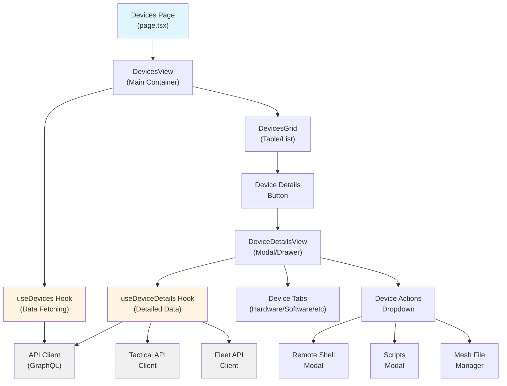
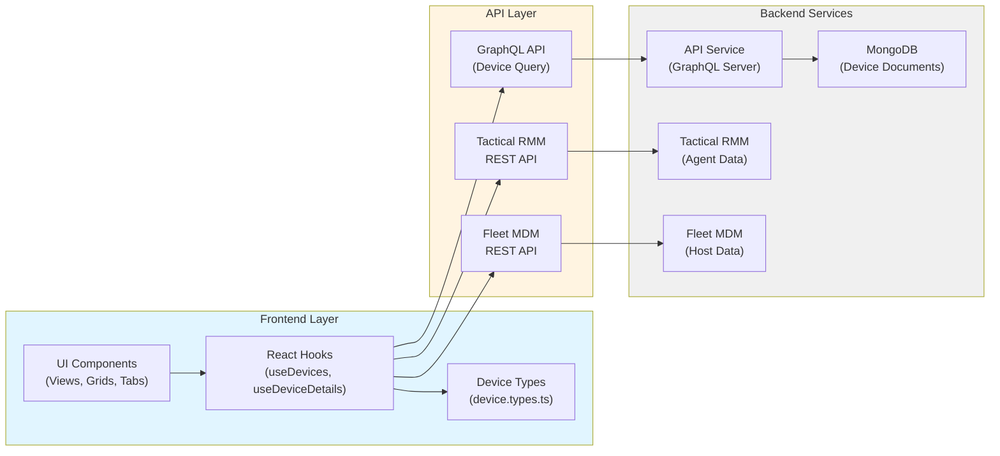
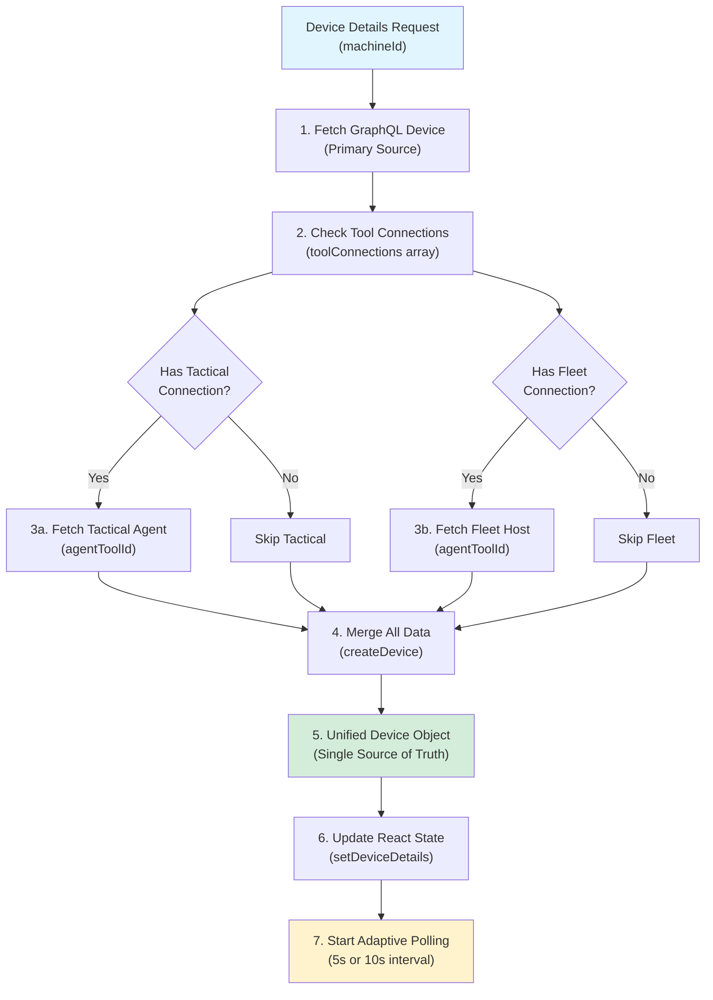
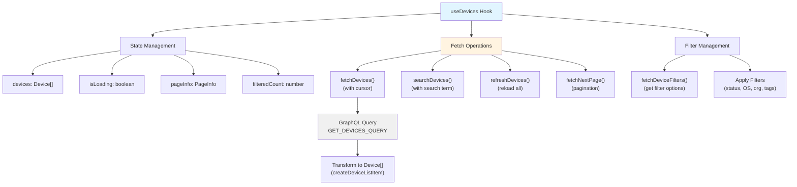
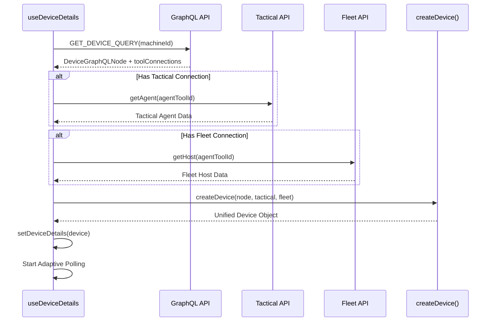
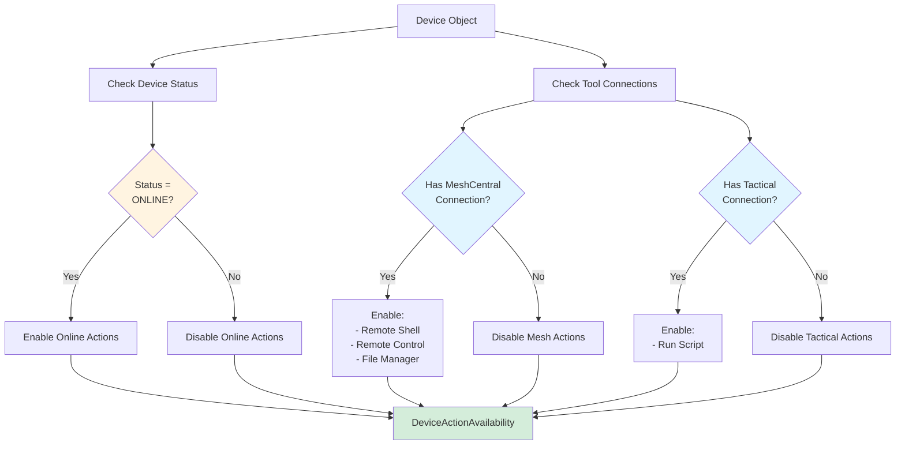
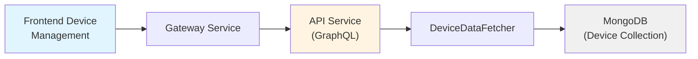
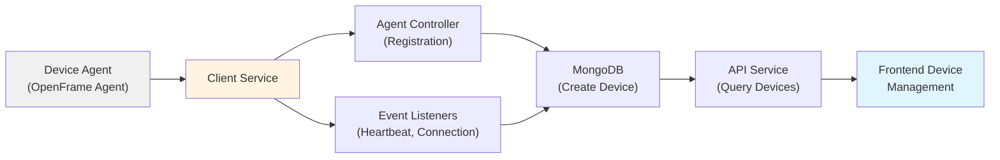
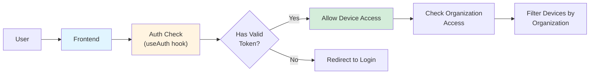

# Frontend Device Management Module

## Overview

The **Frontend Device Management** module is the primary user interface for managing, monitoring, and interacting with devices across the OpenFrame platform. It provides a comprehensive device inventory system with real-time status tracking, multi-tool integration (Fleet MDM, Tactical RMM, MeshCentral), and rich device details including hardware, software, network, security, and compliance information.

This module serves as the central hub for MSP technicians to:
- View and search device inventory across organizations
- Monitor device health and status in real-time
- Access detailed device information from multiple management tools
- Perform remote actions (shell, desktop control, file management)
- Track software, vulnerabilities, and compliance
- Manage device lifecycle (registration, archival, deletion)

**Key Capabilities:**
- **Unified Device Model**: Single source of truth merging data from GraphQL API, Fleet MDM, and Tactical RMM
- **Real-time Updates**: Adaptive polling with 5-10s intervals based on agent connection status
- **Multi-tool Integration**: Seamless integration with MeshCentral, Tactical RMM, and Fleet MDM
- **Advanced Filtering**: Filter by status, OS type, organization, tags, and device type
- **Cursor-based Pagination**: Efficient handling of large device inventories
- **Rich Device Details**: Comprehensive tabs for hardware, software, network, security, compliance, and logs

---

## Architecture

### High-Level Component Structure



### Data Flow Architecture



### Device Data Merging Strategy



---

## Core Components

### 1. Device Type System

**File**: `src/app/devices/types/device.types.ts`

The unified `Device` interface is the single source of truth for all device data across the application. It merges data from multiple sources into a flat structure with no nesting.

#### Key Type Definitions

```typescript
interface Device {
  // Core Identifiers
  id: string
  machineId: string
  hostname: string
  displayName: string

  // Hardware - CPU
  cpu_brand?: string
  cpu_type?: string
  cpu_physical_cores?: number
  cpu_logical_cores?: number

  // Hardware - Memory
  memory?: number  // bytes
  totalRam?: string  // formatted string

  // Storage
  gigs_disk_space_available?: number
  percent_disk_space_available?: number
  disk_encryption_enabled?: boolean

  // Network
  primary_ip?: string
  primary_mac?: string
  public_ip?: string
  local_ips: string[]

  // System Status
  status: string
  uptime?: number
  last_seen?: string
  lastSeen?: string

  // Operating System
  platform?: string
  os_version?: string
  osType?: string
  osVersion?: string

  // Unified Arrays (NO NESTING)
  software?: Software[]
  batteries?: Battery[]
  users?: User[]

  // MDM Info
  mdm?: MDMInfo

  // Organization
  organizationId?: string
  organization?: string
  tags?: DeviceTag[]

  // Tool Connections
  toolConnections?: ToolConnection[]
  installedAgents?: InstalledAgent[]

  // Reference IDs
  fleetId?: number
  tacticalAgentId?: string
}
```

#### Supporting Types

```typescript
interface Software {
  id: number
  name: string
  version: string
  source: 'apps' | 'chrome_extensions' | 'vscode_extensions' | 'homebrew_packages' | 'python_packages'
  vulnerabilities: Vulnerability[]
  installed_paths: string[]
}

interface ToolConnection {
  id: string
  machineId: string
  toolType: 'MESHCENTRAL' | 'TACTICAL_RMM' | 'FLEET_MDM'
  agentToolId: string
  status: string
  connectedAt?: string
  lastSyncAt?: string
}

interface DeviceTag {
  id: string
  name: string
  description?: string
  color?: string
  organizationId: string
}
```

**Design Principles:**
- **Flat Structure**: All fields at root level, no nested objects (except arrays)
- **Backward Compatibility**: Includes legacy field aliases (e.g., `serialNumber` and `serial_number`)
- **Multi-source Support**: Fields from GraphQL, Fleet MDM, and Tactical RMM
- **Type Safety**: Full TypeScript coverage with optional fields for missing data

---

### 2. Device List Hook (`useDevices`)

**File**: `src/app/devices/hooks/use-devices.ts`

Manages device list fetching, filtering, pagination, and search functionality.

#### Key Features



#### Usage Example

```typescript
const {
  devices,
  deviceFilters,
  isLoading,
  searchDevices,
  refreshDevices,
  fetchNextPage,
  pageInfo,
  filteredCount
} = useDevices({
  statuses: ['ONLINE', 'OFFLINE'],
  osTypes: ['darwin', 'windows'],
  organizationIds: ['org-123']
})

// Search devices
searchDevices('macbook')

// Load next page
if (pageInfo?.hasNextPage) {
  fetchNextPage(searchTerm)
}

// Refresh data
refreshDevices()
```

#### Pagination Strategy

- **Cursor-based Pagination**: Uses GraphQL cursor pagination for efficient large dataset handling
- **Page Size**: 10 devices per page
- **State Tracking**: `hasLoadedBeyondFirst` tracks if user has navigated beyond first page
- **URL Integration**: Supports cursor from URL for deep linking

#### Filter Synchronization

```typescript
// Filters are stabilized to prevent infinite loops
const filtersKey = JSON.stringify(filters)
const stableFilters = useMemo(() => filters, [filtersKey])

// Refetch when filters change (after initial load)
useEffect(() => {
  if (initialLoadDone.current && prevFiltersKey.current !== filtersKey) {
    fetchDevices()
    fetchDeviceFilters()
  }
}, [filtersKey])
```

---

### 3. Device Details Hook (`useDeviceDetails`)

**File**: `src/app/devices/hooks/use-device-details.ts`

Fetches comprehensive device details by merging data from GraphQL, Tactical RMM, and Fleet MDM.

#### Data Merging Process



#### Adaptive Polling

The hook implements intelligent polling based on agent connection status:

```typescript
// Fast polling (5s) when agents missing, slow (10s) when all connected
const hasAllAgents = Boolean(tacticalAgentId && meshcentralAgentId)
const pollingInterval = hasAllAgents ? 10000 : 5000

useEffect(() => {
  const intervalId = setInterval(() => {
    // Silent refresh - no loading states or error toasts
    fetchDeviceById(deviceDetails.machineId, true)
  }, pollingInterval)

  return () => clearInterval(intervalId)
}, [deviceDetails?.machineId, deviceDetails?.toolConnections])
```

**Polling Strategy:**
- **5 seconds**: When agents are missing (faster detection of new connections)
- **10 seconds**: When all agents connected (reduce API load)
- **Silent Updates**: Polling uses `silent=true` to avoid loading spinners and error toasts
- **Automatic Cleanup**: Polling stops when component unmounts

#### IP Address Handling

The hook implements sophisticated IP address merging and classification:

```typescript
// Helper to check if IP is private
const isPrivateIP = (ip: string): boolean => {
  if (ip.startsWith('10.')) return true
  if (ip.startsWith('172.')) {
    const second = parseInt(ip.split('.')[1])
    if (second >= 16 && second <= 31) return true
  }
  if (ip.startsWith('192.168.')) return true
  if (ip.startsWith('127.')) return true
  // ... more checks
  return false
}

// Determine actual public IP (filter private IPs)
let actualPublicIP = ''
if (fleetData?.public_ip && !isPrivateIP(fleetData.public_ip)) {
  actualPublicIP = fleetData.public_ip
} else if (tacticalData?.public_ip && !isPrivateIP(tacticalData.public_ip)) {
  actualPublicIP = tacticalData.public_ip
}

// Merge ALL IPs into unified array
const local_ips: string[] = []
// Add Fleet primary_ip, public_ip, Node IP, Tactical IPs...
```

**IP Classification:**
- **Public IP**: First non-private IP from Fleet or Tactical
- **Local IPs**: All IPs from all sources (deduplicated)
- **Primary IP**: Fleet primary_ip or first available IP

---

### 4. Device Transform Utilities

**File**: `src/app/devices/utils/device-transform.ts`

Provides lightweight transformation for device list items (without external API calls).

#### `createDeviceListItem()`

```typescript
function createDeviceListItem(node: DevicesGraphQLNode): Device {
  return {
    // Core Identifiers
    id: node.id,
    machineId: node.machineId || node.id,
    hostname: node.hostname || node.displayName || '',
    displayName: node.displayName || node.hostname,

    // Hardware - Identifiers
    serial_number: node.serialNumber,
    manufacturer: node.manufacturer,
    model: node.model,

    // Network
    ip: node.ip,
    macAddress: node.macAddress,
    local_ips: node.ip ? [node.ip] : [],

    // System Status
    status: node.status,
    lastSeen: node.lastSeen,

    // Operating System
    osType: node.osType,
    osVersion: node.osVersion,
    osBuild: node.osBuild,

    // Organization
    organizationId: node.organization?.organizationId,
    organization: node.organization?.name,
    tags: node.tags,

    // Tool Connections
    toolConnections: node.toolConnections,

    // Fields not available in list view set to undefined
    software: undefined,
    batteries: undefined,
    users: undefined,
    mdm: undefined,
    // ...
  }
}
```

**Purpose:**
- **Performance**: Lightweight transformation for list view (no API calls)
- **Consistency**: Uses same `Device` type as detail view
- **Partial Data**: Sets unavailable fields to `undefined` (not fetched in list query)

---

### 5. GraphQL Queries

**File**: `src/app/devices/queries/devices-queries.ts`

Defines all GraphQL queries for device data fetching.

#### Device List Query

```graphql
query GetDevices($filter: DeviceFilterInput, $pagination: CursorPaginationInput, $search: String) {
  devices(filter: $filter, pagination: $pagination, search: $search) {
    edges {
      node {
        id
        machineId
        hostname
        displayName
        status
        lastSeen
        organization {
          id
          organizationId
          name
          image { imageUrl }
        }
        toolConnections {
          id
          toolType
          agentToolId
          status
          connectedAt
        }
        tags {
          id
          name
          color
        }
      }
      cursor
    }
    pageInfo {
      hasNextPage
      endCursor
    }
    filteredCount
  }
}
```

#### Device Details Query

```graphql
query GetDevice($machineId: String!) {
  device(machineId: $machineId) {
    id
    machineId
    hostname
    displayName
    status
    lastSeen
    organization { ... }
    toolConnections { ... }
    installedAgents {
      id
      agentType
      version
      createdAt
    }
    tags { ... }
  }
}
```

#### Device Filters Query

```graphql
query GetDeviceFilters($filter: DeviceFilterInput) {
  deviceFilters(filter: $filter) {
    statuses { value, count }
    deviceTypes { value, count }
    osTypes { value, count }
    organizationIds { value, label, count }
    tags { value, label, count }
    filteredCount
  }
}
```

**Query Features:**
- **Cursor Pagination**: Efficient handling of large datasets
- **Dynamic Filtering**: Filter by status, OS, organization, tags
- **Search Support**: Full-text search across device fields
- **Aggregated Counts**: Filter options include device counts

---

### 6. Device Action Utilities

**File**: `src/app/devices/utils/device-action-utils.ts`

Centralized logic for determining device action availability.

#### Action Availability Interface

```typescript
interface DeviceActionAvailability {
  // Action enabled states
  remoteShellEnabled: boolean
  remoteControlEnabled: boolean
  manageFilesEnabled: boolean
  runScriptEnabled: boolean
  archiveEnabled: boolean
  deleteEnabled: boolean

  // Tool IDs (for handlers)
  meshcentralAgentId: string | undefined
  tacticalAgentId: string | undefined

  // Device state
  isOnline: boolean
}
```

#### Action Availability Logic



#### Helper Functions

```typescript
// Check if device is online
function isDeviceOnline(status: string | undefined): boolean {
  return status?.toUpperCase() === 'ONLINE'
}

// Get tool connection by type
function getToolConnection(
  toolConnections: ToolConnection[] | undefined,
  toolType: 'MESHCENTRAL' | 'TACTICAL_RMM' | 'FLEET_MDM'
): ToolConnection | undefined {
  return toolConnections?.find(tc => tc.toolType === toolType)
}

// Get MeshCentral agent ID
function getMeshCentralAgentId(device: Device): string | undefined {
  return getToolConnection(device.toolConnections, 'MESHCENTRAL')?.agentToolId
}

// Get unified action availability
function getDeviceActionAvailability(device: Device): DeviceActionAvailability {
  const meshcentralAgentId = getMeshCentralAgentId(device)
  const tacticalAgentId = getTacticalAgentId(device)
  const isOnline = isDeviceOnline(device.status)

  return {
    remoteShellEnabled: isOnline && Boolean(meshcentralAgentId),
    remoteControlEnabled: isOnline && Boolean(meshcentralAgentId),
    manageFilesEnabled: isOnline && Boolean(meshcentralAgentId),
    runScriptEnabled: isOnline && Boolean(tacticalAgentId),
    archiveEnabled: canArchiveDevice(device.status),
    deleteEnabled: canDeleteDevice(device.status),
    meshcentralAgentId,
    tacticalAgentId,
    isOnline
  }
}
```

---

## UI Components

### 1. Devices View (`DevicesView`)

**File**: `src/app/devices/components/devices-view.tsx`

Main container component for the device list page.

**Responsibilities:**
- Initialize `useDevices` hook with filters from URL
- Manage search state and filter state
- Render device grid/table
- Handle initial data fetch with cursor from URL
- Coordinate filter sidebar and device list

**Key Features:**
- URL-based filter persistence
- Search debouncing
- Pagination controls
- Filter sidebar integration

---

### 2. Devices Grid (`DevicesGrid`)

**File**: `src/app/devices/components/devices-grid.tsx`

Displays devices in a table/grid format with sortable columns.

**Columns:**
- Status badge (online/offline/archived)
- Device name (hostname/displayName)
- Organization (with logo)
- IP address
- OS type and version
- Last seen timestamp
- Actions dropdown

**Features:**
- Row selection
- Bulk actions
- Sortable columns
- Responsive design
- Loading skeletons

---

### 3. Device Details View (`DeviceDetailsView`)

**File**: `src/app/devices/components/device-details-view.tsx`

Modal/drawer displaying comprehensive device information.

**Structure:**
```text
┌─────────────────────────────────────────┐
│ Device Details Header                   │
│ - Device name, status badge             │
│ - Organization info                     │
│ - Actions dropdown                      │
├─────────────────────────────────────────┤
│ Device Info Section                     │
│ - Quick stats (IP, OS, uptime, etc.)    │
├─────────────────────────────────────────┤
│ Tabs Navigation                         │
│ [Hardware] [Software] [Network] ...     │
├─────────────────────────────────────────┤
│ Tab Content                             │
│ (Dynamic based on selected tab)         │
└─────────────────────────────────────────┘
```

**Tabs:**
1. **Hardware**: CPU, memory, storage, battery
2. **Software**: Installed applications, versions
3. **Network**: IPs, MAC addresses, network interfaces
4. **Security**: Disk encryption, firewall, antivirus
5. **Compliance**: MDM enrollment, policies
6. **Vulnerabilities**: CVEs, security issues
7. **Users**: Local users, logged-in users
8. **Agents**: Tool connections, agent versions
9. **Logs**: Device activity logs

---

### 4. Device Actions Dropdown

**File**: `src/app/devices/components/device-actions-dropdown.tsx`

Dropdown menu with device-specific actions.

**Actions:**
- **Remote Shell**: Open terminal session (MeshCentral)
- **Remote Control**: Launch remote desktop (MeshCentral)
- **Manage Files**: Open file manager (MeshCentral)
- **Run Script**: Execute script on device (Tactical RMM)
- **Archive Device**: Mark device as archived
- **Delete Device**: Remove device from inventory

**Action Availability:**
- Uses `getDeviceActionAvailability()` to determine enabled/disabled state
- Shows tooltips for disabled actions explaining why
- Dynamically shows/hides actions based on tool connections

---

### 5. Device Status Badge

**File**: `src/app/devices/components/device-status-badge.tsx`

Visual indicator for device status.

**Status Types:**
- **ONLINE**: Green badge, "Online"
- **OFFLINE**: Gray badge, "Offline"
- **ARCHIVED**: Yellow badge, "Archived"
- **DELETED**: Red badge, "Deleted"
- **UNKNOWN**: Gray badge, "Unknown"

**Features:**
- Color-coded badges
- Tooltip with last seen time
- Responsive sizing

---

### 6. Remote Shell Modal

**File**: `src/app/devices/components/remote-shell-modal.tsx`

Terminal interface for remote command execution via MeshCentral.

**Features:**
- Full terminal emulation (xterm.js)
- WebSocket connection to MeshCentral
- Command history
- Copy/paste support
- Resizable terminal

**Integration:**
- Requires MeshCentral agent connection
- Uses `meshcentralAgentId` from device
- Handles connection errors gracefully

---

### 7. Scripts Modal

**File**: `src/app/devices/components/scripts-modal.tsx`

Interface for running predefined scripts on devices via Tactical RMM.

**Features:**
- Script library browser
- Script parameter input
- Execution status tracking
- Output display
- Script history

**Integration:**
- Requires Tactical RMM agent connection
- Uses `tacticalAgentId` from device
- Supports PowerShell, Bash, Python scripts

---

## Integration Points

### 1. API Service Integration

The module integrates with the [API Service](api_service.md) for device data:



**GraphQL Queries Used:**
- `devices`: List devices with filtering and pagination
- `device`: Get single device by machineId
- `deviceFilters`: Get available filter options

**See**: [API Service GraphQL DataFetchers](api_service_graphql_datafetchers.md)

---

### 2. Client Service Integration

Device registration and agent management is handled by the [Client Service](client_service.md):



**Integration Points:**
- Device registration creates initial device record
- Heartbeat listeners update device status
- Tool connection events update `toolConnections` array

**See**: [Client Service Registration & Auth](client_service_registration_auth.md)

---

### 3. External Tool Integration

#### Fleet MDM Integration

```typescript
// Fetch Fleet host data
const fleet = node.toolConnections?.find(tc => tc.toolType === 'FLEET_MDM')
if (fleet?.agentToolId) {
  const fleetHostId = Number(fleet.agentToolId)
  const fResponse = await fleetApiClient.getHost(fleetHostId)
  if (fResponse.ok && fResponse.data?.host) {
    fleetData = fResponse.data.host
  }
}
```

**Data Retrieved:**
- Hardware details (CPU, memory, storage)
- Software inventory
- Vulnerabilities (CVEs)
- MDM enrollment status
- Battery health
- User accounts

**See**: [Fleet MDM SDK](fleet_mdm_sdk.md)

#### Tactical RMM Integration

```typescript
// Fetch Tactical agent data
const tactical = node.toolConnections?.find(tc => tc.toolType === 'TACTICAL_RMM')
if (tactical?.agentToolId) {
  const tResponse = await tacticalApiClient.getAgent(tactical.agentToolId)
  if (tResponse.ok) {
    tacticalData = tResponse.data
  }
}
```

**Data Retrieved:**
- Agent status and version
- System information (WMI details)
- Disk information
- Network configuration
- Checks and alerts
- Maintenance mode status

**See**: [Tactical RMM SDK](tactical_rmm_sdk.md)

#### MeshCentral Integration

```typescript
// Get MeshCentral agent ID for remote actions
const meshcentralAgentId = getMeshCentralAgentId(device)

// Open remote shell
if (meshcentralAgentId) {
  openRemoteShell(meshcentralAgentId)
}
```

**Features Used:**
- Remote shell (terminal)
- Remote desktop control
- File manager
- Agent status

**See**: [MeshCentral Integration](meshcentral_integration.md)

---

### 4. Authentication Integration

Device access is controlled by the authentication system:



**Organization Filtering:**
- Users only see devices from their organization(s)
- Multi-tenant isolation enforced at API level
- Organization filter automatically applied based on user context

**See**: [Frontend Authentication](frontend_authentication.md)

---

## Data Models

### Device Document (MongoDB)

The backend stores devices in MongoDB with the following structure:

```typescript
{
  _id: ObjectId,
  machineId: string,  // Unique identifier
  hostname: string,
  displayName: string,
  ip: string,
  macAddress: string,
  osUuid: string,
  agentVersion: string,
  status: "ONLINE" | "OFFLINE" | "ARCHIVED" | "DELETED",
  lastSeen: Date,
  organizationId: string,
  serialNumber: string,
  manufacturer: string,
  model: string,
  type: string,
  osType: string,
  osVersion: string,
  osBuild: string,
  timezone: string,
  registeredAt: Date,
  updatedAt: Date,
  tags: [
    {
      id: string,
      name: string,
      color: string,
      organizationId: string
    }
  ],
  toolConnections: [
    {
      id: string,
      machineId: string,
      toolType: "MESHCENTRAL" | "TACTICAL_RMM" | "FLEET_MDM",
      agentToolId: string,
      status: string,
      connectedAt: Date,
      lastSyncAt: Date
    }
  ],
  installedAgents: [
    {
      id: string,
      machineId: string,
      agentType: string,
      version: string,
      createdAt: Date,
      updatedAt: Date
    }
  ]
}
```

**See**: [Data Layer MongoDB Documents](data_layer_mongo_documents.md)

---

### Tool Connection Model

Tool connections link devices to external management tools:

```typescript
interface ToolConnection {
  id: string                    // Unique connection ID
  machineId: string             // Device machine ID
  toolType: ToolType            // MESHCENTRAL | TACTICAL_RMM | FLEET_MDM
  agentToolId: string           // External tool's agent ID
  status: string                // Connection status
  metadata?: any                // Tool-specific metadata
  connectedAt?: string          // First connection timestamp
  lastSyncAt?: string           // Last sync timestamp
  disconnectedAt?: string       // Disconnection timestamp (if applicable)
}
```

**Tool Types:**
- **MESHCENTRAL**: Remote access and control
- **TACTICAL_RMM**: Remote monitoring and management
- **FLEET_MDM**: Mobile device management and security

**Connection Lifecycle:**
1. Agent installed on device
2. Agent registers with tool
3. Tool webhook notifies OpenFrame
4. OpenFrame creates `ToolConnection` record
5. Frontend queries `toolConnections` to enable actions

---

## State Management

### Device List State

```typescript
// useDevices hook state
{
  devices: Device[],              // Current page of devices
  deviceFilters: DeviceFilters,   // Available filter options
  isLoading: boolean,             // Loading state
  error: string | null,           // Error message
  pageInfo: {                     // Pagination info
    hasNextPage: boolean,
    hasPreviousPage: boolean,
    startCursor: string,
    endCursor: string
  },
  filteredCount: number,          // Total matching devices
  hasLoadedBeyondFirst: boolean   // Pagination tracking
}
```

### Device Details State

```typescript
// useDeviceDetails hook state
{
  deviceDetails: Device | null,   // Full device object
  isLoading: boolean,             // Loading state
  error: string | null,           // Error message
  lastUpdated: number | null      // Last update timestamp
}
```

### Filter State (URL-based)

Filters are persisted in URL query parameters:

```text
/devices?status=ONLINE&osType=darwin&org=org-123&tag=production
```

**Filter Parameters:**
- `status`: Device status filter (comma-separated)
- `osType`: Operating system filter (comma-separated)
- `org`: Organization ID filter (comma-separated)
- `tag`: Tag filter (comma-separated)
- `search`: Search term
- `cursor`: Pagination cursor

---

## Performance Optimizations

### 1. Cursor-based Pagination

Instead of offset-based pagination, the module uses cursor-based pagination for better performance:

**Benefits:**
- Consistent results even when data changes
- Efficient database queries (no SKIP operations)
- Scalable to large datasets

**Implementation:**
```typescript
// Fetch next page using cursor
const response = await apiClient.post('/api/graphql', {
  query: GET_DEVICES_QUERY,
  variables: {
    pagination: { 
      limit: 10, 
      cursor: pageInfo.endCursor  // Cursor from previous page
    }
  }
})
```

---

### 2. Lightweight List View

Device list uses minimal data to improve performance:

**List View Data:**
- Core identifiers (id, machineId, hostname)
- Status and last seen
- Organization info
- Tool connections (for action availability)
- Tags

**NOT Included in List:**
- Software inventory
- Hardware details
- User accounts
- Vulnerabilities
- Logs

**Benefit**: Reduces payload size by ~80% compared to full device details

---

### 3. Adaptive Polling

Device details polling adapts based on agent connection status:

```typescript
// Fast polling when agents missing (5s)
// Slow polling when all connected (10s)
const hasAllAgents = Boolean(tacticalAgentId && meshcentralAgentId)
const pollingInterval = hasAllAgents ? 10000 : 5000
```

**Benefits:**
- Faster detection of new agent connections
- Reduced API load when devices are stable
- Better user experience (faster updates when needed)

---

### 4. Silent Polling

Polling updates use silent mode to avoid UI disruption:

```typescript
// Silent refresh - no loading states or error toasts
fetchDeviceById(deviceDetails.machineId, true)
```

**Benefits:**
- No loading spinners during background updates
- No error toasts for transient network issues
- Smoother user experience

---

### 5. Filter Stabilization

Filters are stabilized to prevent infinite re-render loops:

```typescript
// Stabilize filters to prevent infinite loops
const filtersKey = JSON.stringify(filters)
const stableFilters = useMemo(() => filters, [filtersKey])
```

**Benefits:**
- Prevents unnecessary re-fetches
- Avoids infinite loops from object reference changes
- Improves React performance

---

## Error Handling

### 1. GraphQL Error Handling

```typescript
const graphqlResponse = response.data
if (!graphqlResponse?.data) {
  throw new Error('No data received from server')
}
if (graphqlResponse.errors && graphqlResponse.errors.length > 0) {
  throw new Error(graphqlResponse.errors[0].message || 'GraphQL error occurred')
}
```

**Error Types:**
- Network errors (fetch failures)
- GraphQL errors (query errors)
- Data validation errors (missing required fields)

---

### 2. Tool API Error Handling

```typescript
// Tactical API error handling
const tResponse = await tacticalApiClient.getAgent(tactical.agentToolId)
if (tResponse.ok) {
  tacticalData = tResponse.data
} else {
  // Silently fail - device details still shown without Tactical data
  console.warn('Failed to fetch Tactical data:', tResponse.error)
}
```

**Strategy:**
- **Graceful Degradation**: Show device details even if tool APIs fail
- **Silent Failures**: Don't block UI for non-critical data
- **Logging**: Log errors for debugging without user disruption

---

### 3. User-facing Error Messages

```typescript
toast({
  title: "Failed to Load Devices",
  description: errorMessage,
  variant: "destructive"
})
```

**Error Toast Guidelines:**
- Show for initial data fetches (not polling)
- Include actionable error messages
- Use destructive variant for errors
- Provide retry mechanisms where applicable

---

## Testing Considerations

### Unit Tests

**Components to Test:**
- `useDevices` hook (data fetching, filtering, pagination)
- `useDeviceDetails` hook (data merging, polling)
- `createDeviceListItem` (data transformation)
- `getDeviceActionAvailability` (action logic)
- Device status utilities

**Test Cases:**
```typescript
describe('useDevices', () => {
  it('should fetch devices with filters', async () => {
    const { result } = renderHook(() => useDevices({ 
      statuses: ['ONLINE'] 
    }))
    
    await waitFor(() => {
      expect(result.current.devices).toHaveLength(10)
      expect(result.current.devices[0].status).toBe('ONLINE')
    })
  })
  
  it('should handle pagination', async () => {
    const { result } = renderHook(() => useDevices())
    
    await waitFor(() => {
      expect(result.current.pageInfo?.hasNextPage).toBe(true)
    })
    
    act(() => {
      result.current.fetchNextPage('')
    })
    
    await waitFor(() => {
      expect(result.current.devices).toHaveLength(10)
    })
  })
})
```

---

### Integration Tests

**Scenarios to Test:**
- Device list loading with filters
- Device details modal opening
- Tool connection status updates
- Remote action availability
- Search functionality
- Pagination navigation

---

### E2E Tests

**User Flows:**
1. Navigate to devices page
2. Apply filters (status, OS, organization)
3. Search for device
4. Open device details
5. View different tabs (hardware, software, etc.)
6. Execute remote action (shell, control, files)
7. Archive/delete device

---

## Security Considerations

### 1. Organization Isolation

Devices are filtered by organization at the API level:

```typescript
// API automatically filters by user's organization(s)
const response = await apiClient.post('/api/graphql', {
  query: GET_DEVICES_QUERY,
  variables: {
    filter: {
      organizationIds: userOrganizations  // Enforced by API
    }
  }
})
```

**Enforcement:**
- Backend validates user's organization access
- Frontend cannot bypass organization filtering
- Multi-tenant isolation guaranteed

---

### 2. Action Authorization

Remote actions require proper tool connections:

```typescript
// Remote shell requires MeshCentral connection
const meshcentralAgentId = getMeshCentralAgentId(device)
if (!meshcentralAgentId) {
  // Action disabled - no MeshCentral agent
  return
}

// Execute action with agent ID
openRemoteShell(meshcentralAgentId)
```

**Authorization Checks:**
- Tool connection must exist
- Device must be online (for remote actions)
- User must have permission to access device's organization

---

### 3. Sensitive Data Handling

Device data may contain sensitive information:

**Sensitive Fields:**
- IP addresses (public and private)
- MAC addresses
- Serial numbers
- User accounts
- Software inventory

**Protection:**
- HTTPS for all API requests
- JWT authentication required
- Organization-based access control
- No sensitive data in URL parameters

---

## Troubleshooting

### Common Issues

#### 1. Devices Not Loading

**Symptoms:**
- Empty device list
- Loading spinner indefinitely
- Error toast: "Failed to fetch devices"

**Possible Causes:**
- GraphQL API unavailable
- Network connectivity issues
- Invalid authentication token
- Organization filter too restrictive

**Solutions:**
```typescript
// Check API health
const response = await apiClient.get('/health')

// Verify authentication
const { isAuthenticated } = useAuth()

// Check filters
console.log('Active filters:', filters)

// Retry fetch
refreshDevices()
```

---

#### 2. Device Details Not Updating

**Symptoms:**
- Stale device information
- Tool connections not appearing
- Status not changing

**Possible Causes:**
- Polling disabled
- Silent polling failing
- Tool API unavailable

**Solutions:**
```typescript
// Check polling status
console.log('Polling active:', isPollingRef.current)

// Check last update time
console.log('Last updated:', lastUpdated)

// Manual refresh
fetchDeviceById(machineId, false)
```

---

#### 3. Remote Actions Disabled

**Symptoms:**
- All remote actions grayed out
- Tooltip: "Device offline" or "Agent not connected"

**Possible Causes:**
- Device offline
- MeshCentral agent not connected
- Tactical RMM agent not connected

**Solutions:**
```typescript
// Check device status
console.log('Device status:', device.status)

// Check tool connections
console.log('Tool connections:', device.toolConnections)

// Verify agent IDs
const availability = getDeviceActionAvailability(device)
console.log('Action availability:', availability)
```

---

#### 4. Pagination Not Working

**Symptoms:**
- "Load More" button disabled
- Same devices shown repeatedly
- Cursor not advancing

**Possible Causes:**
- `hasNextPage` is false
- Cursor not being passed correctly
- API pagination broken

**Solutions:**
```typescript
// Check page info
console.log('Page info:', pageInfo)

// Verify cursor
console.log('End cursor:', pageInfo?.endCursor)

// Check filtered count
console.log('Filtered count:', filteredCount)
console.log('Current devices:', devices.length)
```

---

## Future Enhancements

### Planned Features

1. **Bulk Actions**
   - Select multiple devices
   - Execute actions on multiple devices simultaneously
   - Bulk tagging and organization assignment

2. **Advanced Search**
   - Search by software installed
   - Search by vulnerability CVE
   - Search by hardware specs

3. **Device Groups**
   - Create custom device groups
   - Group-based filtering
   - Group-based actions

4. **Device History**
   - Track device changes over time
   - Audit log for device actions
   - Historical status tracking

5. **Custom Columns**
   - User-configurable table columns
   - Save column preferences
   - Export custom views

6. **Real-time Updates**
   - WebSocket-based status updates
   - Live device count updates
   - Real-time agent connection notifications

7. **Device Comparison**
   - Compare multiple devices side-by-side
   - Highlight differences
   - Export comparison reports

8. **Mobile Optimization**
   - Responsive device cards
   - Touch-optimized actions
   - Mobile-friendly details view

---

## Related Documentation

- **[API Service](api_service.md)**: Backend GraphQL API for device queries
- **[API Service GraphQL DataFetchers](api_service_graphql_datafetchers.md)**: Device data fetching logic
- **[Client Service](client_service.md)**: Device registration and agent management
- **[Client Service Registration & Auth](client_service_registration_auth.md)**: Agent registration flow
- **[Frontend Authentication](frontend_authentication.md)**: User authentication and authorization
- **[Frontend API Clients](frontend_api_clients.md)**: API client implementations
- **[Fleet MDM SDK](fleet_mdm_sdk.md)**: Fleet MDM integration
- **[Tactical RMM SDK](tactical_rmm_sdk.md)**: Tactical RMM integration
- **[MeshCentral Integration](meshcentral_integration.md)**: Remote access integration
- **[Data Layer MongoDB Documents](data_layer_mongo_documents.md)**: Device data model

---

## Contributing

When contributing to the device management module:

1. **Follow Type Safety**: Use the unified `Device` type for all device data
2. **Maintain Backward Compatibility**: Keep legacy field aliases when adding new fields
3. **Test Multi-tool Scenarios**: Test with devices having different tool connections
4. **Document Data Sources**: Comment which fields come from which API (GraphQL, Fleet, Tactical)
5. **Handle Missing Data**: Always handle cases where tool APIs are unavailable
6. **Optimize Performance**: Consider impact on list view performance when adding fields
7. **Update GraphQL Queries**: Keep queries in sync with backend schema changes

---

## Support

For questions or issues with the device management module:

- **Slack**: [OpenMSP Community](https://join.slack.com/t/openmsp/shared_invite/zt-36bl7mx0h-3~U2nFH6nqHqoTPXMaHEHA)
- **Documentation**: [OpenFrame Documentation](https://www.flamingo.run/openframe)
- **Repository**: [OpenFrame OSS](https://github.com/flamingo-run/openframe-oss)

---

**Last Updated**: 2024  
**Module Version**: 1.0  
**Maintainers**: OpenFrame Frontend Team
