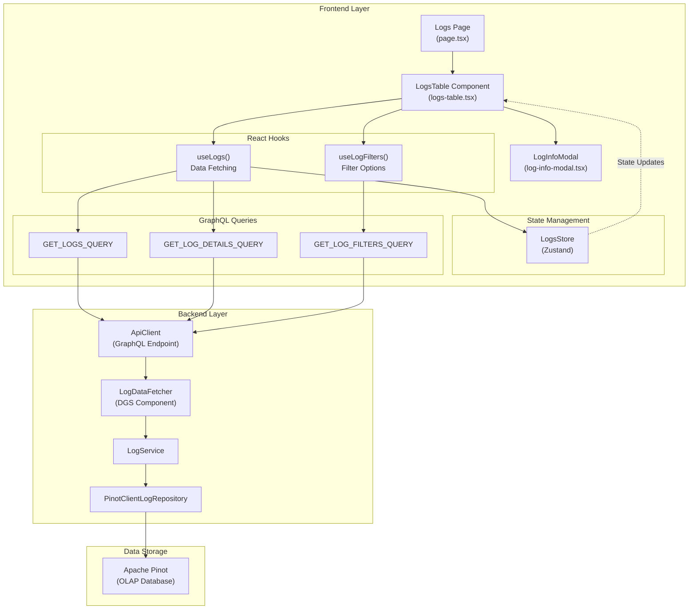
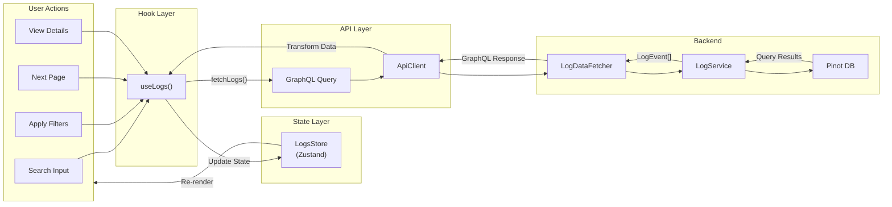
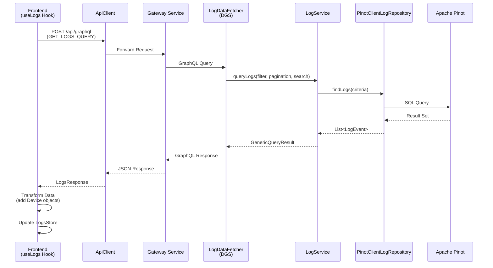
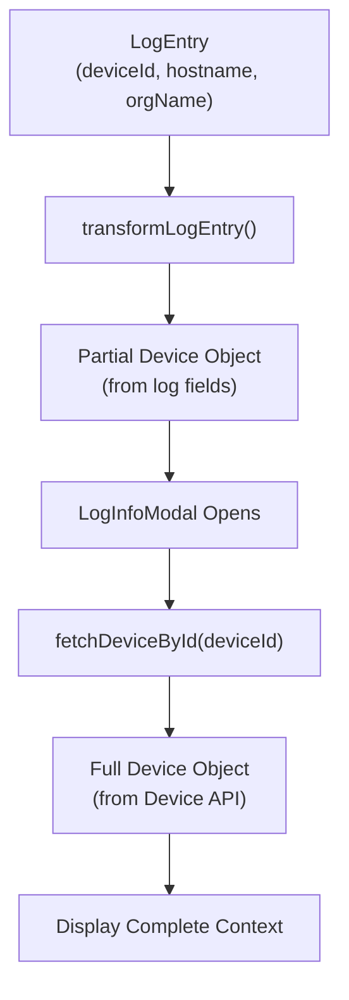

# Frontend Logs & Events Module

## Overview

The **Frontend Logs & Events** module provides a comprehensive interface for viewing, searching, filtering, and analyzing system logs and events within the OpenFrame platform. This module serves as the primary observability interface for MSP technicians and administrators to monitor system activity, troubleshoot issues, and track device behavior across integrated tools.

**Key Capabilities:**
- Real-time log streaming and pagination with cursor-based navigation
- Advanced filtering by severity, tool type, organization, and device
- Full-text search across log messages and metadata
- Detailed log inspection with device context
- GraphQL-powered data fetching with optimized queries
- Responsive UI with embedded and standalone views

**Related Modules:**
- [API Service GraphQL DataFetchers](api_service_graphql_datafetchers.md) - Backend GraphQL resolvers for logs and events
- [Data Layer Core](data_layer_core.md) - Apache Pinot repositories for log storage and querying
- [Frontend Device Management](frontend_device_management.md) - Device context and details integration
- [Frontend API Clients](frontend_api_clients.md) - HTTP client for GraphQL communication

---

## Architecture

### High-Level Component Structure



### Data Flow Architecture



---

## Core Components

### 1. React Hooks

#### `useLogs()` Hook

**Purpose:** Primary data fetching and state management hook for log operations.

**Location:** `openframe/services/openframe-frontend/src/app/logs-page/hooks/use-logs.ts`

**Key Features:**
- Cursor-based pagination with forward navigation
- Full-text search across log content
- Multi-dimensional filtering (severity, tool type, organization, device)
- Automatic data transformation (flat fields → Device objects)
- Error handling with toast notifications
- Duplicate detection and prevention

**API:**

```typescript
interface UseLogs {
  // State
  logs: LogEntry[]
  edges: LogEdge[]
  search: string
  pageInfo: PageInfo | null
  pageSize: number
  isLoading: boolean
  error: string | null
  hasNextPage: boolean
  hasPreviousPage: boolean
  
  // Actions
  fetchLogs: (search: string, filters: LogFilterInput, cursor?: string, append?: boolean) => Promise<LogsResponse>
  fetchNextPage: () => Promise<void>
  fetchFirstPage: () => Promise<void>
  fetchLogDetails: (logEntry: LogEntry) => Promise<LogEntry>
  searchLogs: (searchTerm: string) => Promise<void>
  changePageSize: (newSize: number) => Promise<void>
  refreshLogs: () => Promise<void>
  clearLogs: () => void
  reset: () => void
}
```

**Data Transformation Logic:**

```typescript
const transformLogEntry = (logEntry: LogEntry): LogEntry => {
  // Transform flat backend fields into Device object structure
  if (logEntry.deviceId || logEntry.hostname || logEntry.organizationName) {
    return {
      ...logEntry,
      device: {
        id: logEntry.deviceId || '',
        machineId: logEntry.deviceId || '',
        hostname: logEntry.hostname || logEntry.deviceId || '',
        displayName: logEntry.hostname || '',
        organizationId: logEntry.organizationId,
        organization: logEntry.organizationName || logEntry.organizationId || ''
      }
    }
  }
  return logEntry
}
```

**Usage Example:**

```typescript
const {
  logs,
  isLoading,
  error,
  fetchLogs,
  fetchNextPage,
  hasNextPage
} = useLogs({
  severities: ['ERROR', 'CRITICAL'],
  toolTypes: ['FLEET_MDM'],
  deviceId: 'device-123'
})

// Initial load
useEffect(() => {
  fetchLogs('', filters, null, false)
}, [])

// Load next page
const handleLoadMore = () => {
  if (hasNextPage) {
    fetchNextPage()
  }
}
```

#### `useLogFilters()` Hook

**Purpose:** Fetch available filter options dynamically based on current data.

**Key Features:**
- Dynamic filter options (tool types, severities, organizations)
- Context-aware filtering (respects active filters)
- Cached filter state

**API:**

```typescript
interface UseLogFilters {
  logFilters: LogFilters | null
  isLoading: boolean
  error: string | null
  fetchLogFilters: (filter?: LogFilterInput) => Promise<LogFilters>
}

interface LogFilters {
  toolTypes: string[]
  eventTypes: string[]
  severities: string[]
  organizations: { id: string, name: string }[]
}
```

---

### 2. State Management

#### LogsStore (Zustand)

**Purpose:** Centralized state management for logs with immutable updates via Immer.

**Location:** `openframe/services/openframe-frontend/src/app/logs-page/stores/logs-store.ts`

**State Schema:**

```typescript
interface LogsState {
  // Data
  logs: LogEntry[]
  edges: LogEdge[]
  search: string
  pageInfo: PageInfo | null
  pageSize: number
  isLoading: boolean
  error: string | null
  
  // Actions
  setLogs: (logs: LogEntry[]) => void
  setEdges: (edges: LogEdge[]) => void
  appendEdges: (edges: LogEdge[]) => void
  setSearch: (search: string) => void
  setPageInfo: (pageInfo: PageInfo) => void
  setPageSize: (size: number) => void
  setLoading: (loading: boolean) => void
  setError: (error: string | null) => void
  clearLogs: () => void
  reset: () => void
}
```

**Key Features:**

1. **Duplicate Prevention:**
```typescript
appendEdges: (edges) =>
  set((state) => {
    const existingIds = new Set(state.logs.map(log => log.toolEventId))
    const newEdges = edges.filter(edge => !existingIds.has(edge.node.toolEventId))
    
    if (newEdges.length < edges.length) {
      console.warn(`Filtered ${edges.length - newEdges.length} duplicate logs`)
    }
    
    state.edges = [...state.edges, ...newEdges]
    state.logs = [...state.logs, ...newEdges.map(edge => edge.node)]
  })
```

2. **Pagination Reset on Filter Changes:**
```typescript
setSearch: (search) =>
  set((state) => {
    state.search = search
    state.pageInfo = null // Reset pagination
  })
```

3. **DevTools Integration:**
```typescript
export const useLogsStore = create<LogsState>()(
  devtools(
    immer((set) => ({ /* ... */ })),
    { name: 'logs-store' }
  )
)
```

**Selectors:**

```typescript
// Optimized selectors for component re-renders
export const selectLogs = (state: LogsState) => state.logs
export const selectPageInfo = (state: LogsState) => state.pageInfo
export const selectIsLoading = (state: LogsState) => state.isLoading
export const selectHasMorePages = (state: LogsState) => ({
  hasNext: state.pageInfo?.hasNextPage ?? false,
  hasPrevious: state.pageInfo?.hasPreviousPage ?? false,
})
```

---

### 3. GraphQL Queries

#### GET_LOGS_QUERY

**Purpose:** Fetch paginated logs with filtering and search.

**Location:** `openframe/services/openframe-frontend/src/app/logs-page/queries/logs-queries.ts`

**Query Definition:**

```graphql
query GetLogs($filter: LogFilterInput, $pagination: CursorPaginationInput, $search: String) {
  logs(filter: $filter, pagination: $pagination, search: $search) {
    edges {
      node {
        toolEventId
        eventType
        ingestDay
        toolType
        severity
        userId
        deviceId
        hostname
        organizationName
        organizationId
        summary
        timestamp
        __typename
      }
      __typename
    }
    pageInfo {
      hasNextPage
      hasPreviousPage
      startCursor
      endCursor
      __typename
    }
    __typename
  }
}
```

**Variables:**

```typescript
{
  filter: {
    severities?: string[]        // ['ERROR', 'CRITICAL']
    toolTypes?: string[]          // ['FLEET_MDM', 'TACTICAL_RMM']
    organizationIds?: string[]    // ['org-123']
    deviceId?: string             // 'device-456'
  },
  pagination: {
    limit: number                 // 10, 25, 50, 100
    cursor?: string | null        // Base64 encoded cursor
  },
  search?: string                 // Full-text search term
}
```

#### GET_LOG_DETAILS_QUERY

**Purpose:** Fetch complete log details including full message and metadata.

**Query Definition:**

```graphql
query GetLogDetails(
  $logId: ID!,
  $ingestDay: String!,
  $toolType: String!,
  $eventType: String!,
  $timestamp: Instant!
) {
  logDetails(
    toolEventId: $logId
    ingestDay: $ingestDay
    toolType: $toolType
    eventType: $eventType
    timestamp: $timestamp
  ) {
    toolEventId
    eventType
    ingestDay
    toolType
    severity
    userId
    deviceId
    hostname
    organizationName
    organizationId
    message
    timestamp
    details
    __typename
  }
}
```

**Composite Key Requirement:**

Apache Pinot requires all partition key fields for efficient lookups:
- `ingestDay` - Partition key (YYYYMMDD format)
- `toolType` - Tool identifier
- `eventType` - Event category
- `timestamp` - Event timestamp
- `toolEventId` - Unique event identifier

#### GET_LOG_FILTERS_QUERY

**Purpose:** Fetch available filter options based on current data.

**Query Definition:**

```graphql
query GetLogFilters($filter: LogFilterInput) {
  logFilters(filter: $filter) {
    toolTypes
    eventTypes
    severities
    organizations {
      id
      name
    }
    __typename
  }
}
```

---

### 4. UI Components

#### LogsTable Component

**Purpose:** Main table component for displaying logs with filtering, search, and pagination.

**Location:** `openframe/services/openframe-frontend/src/app/logs-page/components/logs-table.tsx`

**Features:**
- Responsive column layout with breakpoint-based hiding
- Multi-column filtering (severity, tool type, organization)
- Full-text search with debouncing
- Cursor-based pagination with "Load More" button
- Row actions (view details, external link)
- Embedded mode for device-specific views

**Column Configuration:**

```typescript
const columns: TableColumn<UILogEntry>[] = [
  {
    key: 'logId',
    label: 'Log ID',
    width: 'w-[200px]',
    renderCell: (log) => (
      <TableTimestampCell
        timestamp={log.timestamp}
        id={log.logId}
        formatTimestamp={false}
      />
    )
  },
  {
    key: 'status',
    label: 'Status',
    width: 'w-[120px]',
    filterable: true,
    filterOptions: logFilters?.severities?.map(severity => ({
      id: severity,
      label: severity.charAt(0).toUpperCase() + severity.slice(1).toLowerCase(),
      value: severity
    })),
    renderCell: (log) => (
      <StatusTag label={log.status.label} variant={log.status.variant} />
    )
  },
  {
    key: 'tool',
    label: 'Tool',
    width: 'w-[150px]',
    hideAt: 'sm',
    filterable: true,
    filterOptions: logFilters?.toolTypes?.map(toolType => ({
      id: toolType,
      label: toToolLabel(toolType),
      value: toolType
    })),
    renderCell: (log) => (
      <ToolBadge toolType={normalizeToolTypeWithFallback(log.source.toolType)} />
    )
  },
  {
    key: 'source',
    label: 'SOURCE',
    width: 'w-[120px]',
    hideAt: 'md',
    filterable: true,
    filterOptions: transformOrganizationFilters(logFilters?.organizations),
    renderCell: (log) => (
      <DeviceCardCompact
        deviceName={log.device.name === 'null' ? 'System' : log.device.name}
        organization={log.device.organization}
      />
    )
  },
  {
    key: 'description',
    label: 'Log Details',
    width: 'flex-1',
    hideAt: 'xl',
    renderCell: (log) => (
      <TableDescriptionCell text={log.description.title} />
    )
  }
]
```

**Data Transformation:**

```typescript
const transformedLogs: UILogEntry[] = useMemo(() => {
  return logs.map((log) => ({
    id: log.toolEventId,
    logId: log.toolEventId,
    timestamp: new Date(log.timestamp).toLocaleString(),
    status: {
      label: log.severity,
      variant: log.severity === 'ERROR' ? 'error' :
              log.severity === 'WARNING' ? 'warning' :
              log.severity === 'INFO' ? 'info' :
              log.severity === 'CRITICAL' ? 'critical' : 'success'
    },
    source: {
      name: toToolLabel(log.toolType),
      toolType: normalizeToolTypeWithFallback(log.toolType)
    },
    device: {
      name: log.device?.hostname || log.hostname || log.deviceId || '-',
      organization: log.device?.organization || log.organizationName || log.userId || '-'
    },
    description: {
      title: log.summary || 'No summary available',
      details: log.details
    },
    originalLogEntry: log
  }))
}, [logs])
```

**Pagination Handling:**

```typescript
const {
  searchInput,
  setSearchInput,
  hasLoadedBeyondFirst,
  setHasLoadedBeyondFirst,
  handleNextPage,
  handleResetToFirstPage,
  params: paginationParams,
  setParams: setPaginationParams
} = useCursorPaginationState({
  onInitialLoad: (search, cursor) => {
    if (cursor) {
      fetchLogs(search || '', backendFilters, cursor, false)
      setHasLoadedBeyondFirst(true)
    } else {
      searchLogs(search || '')
    }
    fetchLogFilters()
  },
  onSearchChange: (search) => searchLogs(search)
})
```

#### LogInfoModal Component

**Purpose:** Modal dialog for displaying detailed log information with device context.

**Location:** `openframe/services/openframe-frontend/src/app/logs-page/components/log-info-modal.tsx`

**Features:**
- Full log message and metadata display
- Device details integration (fetches full Device object)
- Severity-based color coding
- Tool badge display
- Copy-to-clipboard functionality
- Responsive layout

**Device Integration:**

```typescript
const { deviceDetails, isLoading: isLoadingDevice, fetchDeviceById, clearDeviceDetails } = useDeviceDetails()

useEffect(() => {
  if (isOpen && log?.originalLogEntry) {
    const deviceId = log.originalLogEntry.deviceId
    
    // Always fetch full device object if deviceId exists
    if (deviceId && deviceId !== 'null' && deviceId !== '') {
      fetchDeviceById(deviceId)
    }
  }
  
  if (!isOpen) {
    clearDeviceDetails()
  }
}, [isOpen, log?.originalLogEntry, fetchDeviceById, clearDeviceDetails])
```

**Log Details Fetching:**

```typescript
useEffect(() => {
  if (isOpen && log && log.originalLogEntry) {
    const logEntry = log.originalLogEntry
    
    if (!logEntry.toolEventId || !logEntry.ingestDay || !logEntry.toolType || 
        !logEntry.eventType || !logEntry.timestamp) {
      console.error('Missing required fields for log details fetch')
      return
    }
    
    setIsLoadingDetails(true)
    fetchLogDetails(logEntry)
      .then(details => {
        setDetailedLogData(details)
      })
      .catch(error => {
        console.error('Failed to fetch log details:', error)
      })
      .finally(() => {
        setIsLoadingDetails(false)
      })
  }
}, [isOpen, log, fetchLogDetails])
```

---

## Data Models

### LogEntry Interface

**Purpose:** Core data structure for log entries.

```typescript
interface LogEntry {
  // Primary Keys (Pinot Composite Key)
  toolEventId: string          // Unique event identifier
  eventType: string            // Event category (e.g., 'system_error', 'user_action')
  ingestDay: string            // Partition key (YYYYMMDD format)
  toolType: string             // Tool identifier (e.g., 'FLEET_MDM', 'TACTICAL_RMM')
  timestamp: string            // ISO 8601 timestamp
  
  // Log Content
  severity: 'DEBUG' | 'INFO' | 'WARNING' | 'ERROR' | 'CRITICAL'
  summary: string              // Short description
  message?: string             // Full log message (only in details)
  details?: string             // Additional metadata (JSON string)
  
  // Context
  userId?: string              // User who triggered the event
  deviceId?: string            // Associated device ID
  
  // Device-related fields (from backend)
  hostname?: string            // Device hostname
  organizationName?: string    // Organization name
  organizationId?: string      // Organization ID
  
  // Transformed device object (frontend only)
  device?: Partial<Device>
  
  // Metadata
  metadata?: Record<string, any>
  __typename?: string
}
```

### LogEdge Interface

**Purpose:** GraphQL connection edge wrapper for cursor-based pagination.

```typescript
interface LogEdge {
  node: LogEntry
  __typename?: string
}
```

### PageInfo Interface

**Purpose:** Pagination metadata for cursor-based navigation.

```typescript
interface PageInfo {
  hasNextPage: boolean         // More results available
  hasPreviousPage: boolean     // Previous page exists
  startCursor: string | null   // Cursor for first item
  endCursor: string | null     // Cursor for last item (use for next page)
  __typename?: string
}
```

### LogFilterInput Interface

**Purpose:** Filter criteria for log queries.

```typescript
interface LogFilterInput {
  severities?: string[]        // Filter by severity levels
  toolTypes?: string[]         // Filter by tool types
  organizationIds?: string[]   // Filter by organizations
  deviceId?: string            // Filter by specific device
  userId?: string[]            // Filter by user IDs
}
```

### UILogEntry Interface

**Purpose:** Transformed log entry for UI rendering.

```typescript
interface UILogEntry {
  id: string
  logId: string
  timestamp: string
  status: {
    label: string
    variant?: 'success' | 'warning' | 'error' | 'info' | 'critical'
  }
  source: {
    name: string
    toolType: string
    icon?: React.ReactNode
  }
  device: {
    name: string
    organization?: string
  }
  description: {
    title: string
    details?: string
  }
  originalLogEntry?: LogEntry  // Preserve original for API calls
}
```

---

## Integration Points

### Backend Integration

#### GraphQL API Endpoint

**Endpoint:** `/api/graphql`

**Request Format:**

```typescript
const response = await apiClient.post<GraphQLResponse<LogsResponse>>('/api/graphql', {
  query: GET_LOGS_QUERY,
  variables: {
    filter: {
      severities: ['ERROR', 'CRITICAL'],
      toolTypes: ['FLEET_MDM'],
      deviceId: 'device-123'
    },
    pagination: {
      limit: 25,
      cursor: 'eyJpZCI6IjEyMyIsInRpbWVzdGFtcCI6MTcwMDAwMDAwMH0='
    },
    search: 'connection failed'
  }
})
```

**Response Format:**

```typescript
interface GraphQLResponse<T> {
  data?: T
  errors?: Array<{
    message: string
    extensions?: any
  }>
}

interface LogsResponse {
  logs: {
    edges: LogEdge[]
    pageInfo: PageInfo
  }
}
```

#### Backend Data Fetcher

**Component:** `LogDataFetcher` (Java/Spring Boot)

**Location:** `deps-openframe-oss-lib/openframe-api-service-core/src/main/java/com/openframe/api/datafetcher/LogDataFetcher.java`

**Key Methods:**

```java
@DgsQuery
public GenericConnection<GenericEdge<LogEvent>> logs(
    @InputArgument @Valid LogFilterInput filter,
    @InputArgument @Valid CursorPaginationInput pagination,
    @InputArgument String search
) {
    LogFilterOptions filterOptions = logMapper.toLogFilterOptions(filter);
    CursorPaginationCriteria paginationCriteria = logMapper.toCursorPaginationCriteria(pagination);
    
    var result = logService.queryLogs(filterOptions, paginationCriteria, search);
    return logMapper.toLogConnection(result);
}

@DgsQuery
public LogDetails logDetails(
    @InputArgument @NotBlank String ingestDay,
    @InputArgument @NotBlank String toolType,
    @InputArgument @NotBlank String eventType,
    @InputArgument Instant timestamp,
    @InputArgument @NotBlank String toolEventId
) {
    return logService.findLogDetails(ingestDay, toolType, eventType, timestamp, toolEventId)
        .orElse(null);
}

@DgsQuery
public LogFilters logFilters(@InputArgument @Valid LogFilterInput filter) {
    LogFilterOptions filterOptions = logMapper.toLogFilterOptions(filter);
    return logService.getLogFilters(filterOptions);
}
```

**Data Flow:**



### Device Integration

**Purpose:** Enrich log entries with full device context.

**Integration Flow:**



**Code Example:**

```typescript
// Step 1: Transform log entry with partial device data
const transformLogEntry = (logEntry: LogEntry): LogEntry => {
  if (logEntry.deviceId || logEntry.hostname || logEntry.organizationName) {
    return {
      ...logEntry,
      device: {
        id: logEntry.deviceId || '',
        machineId: logEntry.deviceId || '',
        hostname: logEntry.hostname || logEntry.deviceId || '',
        displayName: logEntry.hostname || '',
        organizationId: logEntry.organizationId,
        organization: logEntry.organizationName || logEntry.organizationId || ''
      }
    }
  }
  return logEntry
}

// Step 2: Fetch full device details in modal
const { deviceDetails, fetchDeviceById } = useDeviceDetails()

useEffect(() => {
  if (isOpen && log?.originalLogEntry?.deviceId) {
    fetchDeviceById(log.originalLogEntry.deviceId)
  }
}, [isOpen, log])
```

---

## Usage Examples

### Basic Log Viewing

```typescript
import { LogsTable } from '@app/logs-page/components/logs-table'

export default function LogsPage() {
  return (
    <AppLayout>
      <div className="space-y-6">
        <LogsTable />
      </div>
    </AppLayout>
  )
}
```

### Device-Specific Logs (Embedded Mode)

```typescript
import { LogsTable } from '@app/logs-page/components/logs-table'

export function DeviceLogsTab({ deviceId }: { deviceId: string }) {
  return (
    <LogsTable 
      deviceId={deviceId} 
      embedded={true}  // Hides device column
    />
  )
}
```

### Custom Log Filtering

```typescript
import { useLogs } from '@app/logs-page/hooks/use-logs'

export function CriticalErrorsWidget() {
  const {
    logs,
    isLoading,
    error,
    fetchLogs
  } = useLogs({
    severities: ['ERROR', 'CRITICAL'],
    toolTypes: ['FLEET_MDM', 'TACTICAL_RMM']
  })
  
  useEffect(() => {
    fetchLogs('', {
      severities: ['ERROR', 'CRITICAL'],
      toolTypes: ['FLEET_MDM', 'TACTICAL_RMM']
    }, null, false)
  }, [])
  
  if (isLoading) return <Skeleton />
  if (error) return <ErrorMessage message={error} />
  
  return (
    <div>
      <h3>Critical Errors ({logs.length})</h3>
      <ul>
        {logs.map(log => (
          <li key={log.toolEventId}>
            {log.summary} - {log.timestamp}
          </li>
        ))}
      </ul>
    </div>
  )
}
```

### Programmatic Log Search

```typescript
import { useLogs } from '@app/logs-page/hooks/use-logs'

export function LogSearchWidget() {
  const { searchLogs, logs, isLoading } = useLogs()
  const [query, setQuery] = useState('')
  
  const handleSearch = async () => {
    await searchLogs(query)
  }
  
  return (
    <div>
      <Input
        value={query}
        onChange={(e) => setQuery(e.target.value)}
        placeholder="Search logs..."
      />
      <Button onClick={handleSearch} disabled={isLoading}>
        Search
      </Button>
      
      {logs.map(log => (
        <LogCard key={log.toolEventId} log={log} />
      ))}
    </div>
  )
}
```

### Infinite Scroll Pagination

```typescript
import { useLogs } from '@app/logs-page/hooks/use-logs'
import { useInView } from 'react-intersection-observer'

export function InfiniteLogList() {
  const { logs, fetchNextPage, hasNextPage, isLoading } = useLogs()
  const { ref, inView } = useInView()
  
  useEffect(() => {
    if (inView && hasNextPage && !isLoading) {
      fetchNextPage()
    }
  }, [inView, hasNextPage, isLoading])
  
  return (
    <div>
      {logs.map(log => (
        <LogCard key={log.toolEventId} log={log} />
      ))}
      
      {hasNextPage && (
        <div ref={ref}>
          <Spinner />
        </div>
      )}
    </div>
  )
}
```

---

## Performance Considerations

### 1. Cursor-Based Pagination

**Why Cursor-Based?**
- Consistent results even with concurrent data changes
- Efficient for large datasets (no OFFSET overhead)
- Supports forward navigation without loading all pages

**Implementation:**

```typescript
// Backend generates cursor from last item
const endCursor = Buffer.from(JSON.stringify({
  timestamp: lastLog.timestamp,
  toolEventId: lastLog.toolEventId
})).toString('base64')

// Frontend uses cursor for next page
fetchLogs(search, filters, endCursor, false)
```

### 2. Data Transformation Optimization

**Problem:** Transforming large log arrays on every render.

**Solution:** Memoization with `useMemo`

```typescript
const transformedLogs: UILogEntry[] = useMemo(() => {
  return logs.map((log) => ({
    id: log.toolEventId,
    // ... transformation logic
  }))
}, [logs, deviceId])  // Only recompute when logs or deviceId changes
```

### 3. Duplicate Prevention

**Problem:** Backend may return duplicate logs due to cursor edge cases.

**Solution:** Client-side deduplication in store

```typescript
appendEdges: (edges) =>
  set((state) => {
    const existingIds = new Set(state.logs.map(log => log.toolEventId))
    const newEdges = edges.filter(edge => !existingIds.has(edge.node.toolEventId))
    
    state.edges = [...state.edges, ...newEdges]
    state.logs = [...state.logs, ...newEdges.map(edge => edge.node)]
  })
```

### 4. Selective Re-renders

**Problem:** Entire component tree re-renders on state changes.

**Solution:** Zustand selectors

```typescript
// ❌ Bad: Re-renders on any state change
const { logs, pageInfo, isLoading, error } = useLogsStore()

// ✅ Good: Only re-renders when logs change
const logs = useLogsStore(selectLogs)
const isLoading = useLogsStore(selectIsLoading)
```

### 5. Filter State Management

**Problem:** Filter changes trigger unnecessary API calls.

**Solution:** Stable filter key with sorted arrays

```typescript
const filtersKey = useMemo(() => JSON.stringify({
  severities: filterParams.severities?.sort() || [],
  toolTypes: filterParams.toolTypes?.sort() || [],
  organizationIds: filterParams.organizationIds?.sort() || [],
  deviceId: deviceId || null
}), [filterParams.severities, filterParams.toolTypes, filterParams.organizationIds, deviceId])

useEffect(() => {
  if (filtersKey !== prevFiltersKeyRef.current) {
    fetchFirstPage()
    prevFiltersKeyRef.current = filtersKey
  }
}, [filtersKey])
```

---

## Error Handling

### GraphQL Error Handling

```typescript
const response = await apiClient.post<GraphQLResponse<LogsResponse>>('/api/graphql', {
  query: GET_LOGS_QUERY,
  variables: { /* ... */ }
})

// Check HTTP status
if (!response.ok) {
  throw new Error(response.error || `Request failed with status ${response.status}`)
}

// Check GraphQL errors
if (graphqlResponse?.errors && graphqlResponse.errors.length > 0) {
  throw new Error(graphqlResponse.errors[0].message || 'GraphQL error occurred')
}

// Check data presence
if (!graphqlResponse?.data) {
  throw new Error('No data received from server')
}
```

### User-Facing Error Messages

```typescript
try {
  await fetchLogs(search, filters, cursor, append)
} catch (error) {
  const errorMessage = error instanceof Error ? error.message : 'Failed to fetch logs'
  
  setError(errorMessage)
  
  toast({
    title: 'Error fetching logs',
    description: errorMessage,
    variant: 'destructive'
  })
}
```

### Missing Required Fields

```typescript
useEffect(() => {
  if (isOpen && log && log.originalLogEntry) {
    const logEntry = log.originalLogEntry
    
    // Validate required fields for Pinot composite key
    if (!logEntry.toolEventId || !logEntry.ingestDay || !logEntry.toolType || 
        !logEntry.eventType || !logEntry.timestamp) {
      console.error('Missing required fields for log details fetch:', {
        toolEventId: logEntry.toolEventId,
        ingestDay: logEntry.ingestDay,
        toolType: logEntry.toolType,
        eventType: logEntry.eventType,
        timestamp: logEntry.timestamp
      })
      return
    }
    
    fetchLogDetails(logEntry)
  }
}, [isOpen, log])
```

---

## Testing Strategies

### Unit Testing Hooks

```typescript
import { renderHook, waitFor } from '@testing-library/react'
import { useLogs } from '../hooks/use-logs'

describe('useLogs', () => {
  it('should fetch logs on mount', async () => {
    const { result } = renderHook(() => useLogs())
    
    await waitFor(() => {
      expect(result.current.isLoading).toBe(false)
    })
    
    expect(result.current.logs).toHaveLength(10)
  })
  
  it('should handle search', async () => {
    const { result } = renderHook(() => useLogs())
    
    await result.current.searchLogs('error')
    
    await waitFor(() => {
      expect(result.current.logs.every(log => 
        log.summary.toLowerCase().includes('error')
      )).toBe(true)
    })
  })
  
  it('should prevent duplicate logs', async () => {
    const { result } = renderHook(() => useLogs())
    
    // Simulate duplicate response
    const duplicateLogs = [
      { toolEventId: '1', summary: 'Log 1' },
      { toolEventId: '1', summary: 'Log 1' }  // Duplicate
    ]
    
    result.current.setEdges(duplicateLogs.map(node => ({ node })))
    
    expect(result.current.logs).toHaveLength(1)
  })
})
```

### Integration Testing Components

```typescript
import { render, screen, fireEvent, waitFor } from '@testing-library/react'
import { LogsTable } from '../components/logs-table'

describe('LogsTable', () => {
  it('should render logs', async () => {
    render(<LogsTable />)
    
    await waitFor(() => {
      expect(screen.getByText('Log ID')).toBeInTheDocument()
    })
    
    expect(screen.getAllByRole('row')).toHaveLength(11) // Header + 10 rows
  })
  
  it('should filter by severity', async () => {
    render(<LogsTable />)
    
    const severityFilter = screen.getByLabelText('Status')
    fireEvent.click(severityFilter)
    
    const errorOption = screen.getByText('Error')
    fireEvent.click(errorOption)
    
    await waitFor(() => {
      const rows = screen.getAllByRole('row')
      rows.slice(1).forEach(row => {
        expect(row).toHaveTextContent('ERROR')
      })
    })
  })
  
  it('should open log details modal', async () => {
    render(<LogsTable />)
    
    await waitFor(() => {
      expect(screen.getAllByRole('row')).toHaveLength(11)
    })
    
    const firstRow = screen.getAllByRole('row')[1]
    fireEvent.click(firstRow)
    
    await waitFor(() => {
      expect(screen.getByText('Log Details')).toBeInTheDocument()
    })
  })
})
```

### E2E Testing with Playwright

```typescript
import { test, expect } from '@playwright/test'

test.describe('Logs Page', () => {
  test('should load and display logs', async ({ page }) => {
    await page.goto('/logs')
    
    await expect(page.locator('table')).toBeVisible()
    await expect(page.locator('tbody tr')).toHaveCount(10)
  })
  
  test('should search logs', async ({ page }) => {
    await page.goto('/logs')
    
    await page.fill('input[placeholder="Search logs..."]', 'connection failed')
    await page.press('input[placeholder="Search logs..."]', 'Enter')
    
    await expect(page.locator('tbody tr')).toHaveCount(5)
    await expect(page.locator('tbody')).toContainText('connection failed')
  })
  
  test('should paginate logs', async ({ page }) => {
    await page.goto('/logs')
    
    await expect(page.locator('tbody tr')).toHaveCount(10)
    
    await page.click('button:has-text("Load More")')
    
    await expect(page.locator('tbody tr')).toHaveCount(20)
  })
  
  test('should open log details', async ({ page }) => {
    await page.goto('/logs')
    
    await page.click('tbody tr:first-child')
    
    await expect(page.locator('[role="dialog"]')).toBeVisible()
    await expect(page.locator('[role="dialog"]')).toContainText('Log Details')
  })
})
```

---

## Troubleshooting

### Common Issues

#### 1. Duplicate Log Keys Warning

**Symptom:**
```text
Warning: Encountered two children with the same key, `log-123`. Keys should be unique.
```

**Cause:** Backend returns duplicate `toolEventId` values.

**Solution:**
```typescript
// Check for duplicates before updating store
const ids = transformedEdges.map(e => e.node.toolEventId)
const uniqueIds = new Set(ids)
if (ids.length !== uniqueIds.size) {
  const duplicates = ids.filter((id, i) => ids.indexOf(id) !== i)
  console.error('⚠️ DUPLICATE LOG KEYS:', duplicates)
}

// Store automatically filters duplicates
appendEdges(transformedEdges)
```

#### 2. Missing Device Information

**Symptom:** Device name shows as `-` or `null`.

**Cause:** Log entry missing `deviceId`, `hostname`, or `organizationName` fields.

**Solution:**
```typescript
// Defensive rendering with fallbacks
device: {
  name: log.device?.hostname || log.hostname || log.deviceId || '-',
  organization: log.device?.organization || log.organizationName || log.userId || '-'
}
```

#### 3. Log Details Fetch Fails

**Symptom:** Modal opens but shows "Failed to fetch log details".

**Cause:** Missing required composite key fields for Pinot query.

**Solution:**
```typescript
// Validate all required fields before fetching
if (!logEntry.toolEventId || !logEntry.ingestDay || !logEntry.toolType || 
    !logEntry.eventType || !logEntry.timestamp) {
  console.error('Missing required fields:', {
    toolEventId: logEntry.toolEventId,
    ingestDay: logEntry.ingestDay,
    toolType: logEntry.toolType,
    eventType: logEntry.eventType,
    timestamp: logEntry.timestamp
  })
  return
}
```

#### 4. Pagination Not Working

**Symptom:** "Load More" button doesn't load additional logs.

**Cause:** `endCursor` not being passed correctly.

**Solution:**
```typescript
const fetchNextPage = useCallback(async () => {
  if (!pageInfo?.hasNextPage || !pageInfo?.endCursor) {
    console.warn('Cannot fetch next page:', {
      hasNextPage: pageInfo?.hasNextPage,
      endCursor: pageInfo?.endCursor
    })
    return
  }
  
  return fetchLogs(search, activeFilters, pageInfo.endCursor, false)
}, [pageInfo, fetchLogs, search, activeFilters])
```

#### 5. Filters Not Applying

**Symptom:** Changing filters doesn't update log results.

**Cause:** Filter state not triggering re-fetch.

**Solution:**
```typescript
// Use stable filter key to detect changes
const filtersKey = useMemo(() => JSON.stringify({
  severities: filterParams.severities?.sort() || [],
  toolTypes: filterParams.toolTypes?.sort() || [],
  organizationIds: filterParams.organizationIds?.sort() || [],
  deviceId: deviceId || null
}), [filterParams.severities, filterParams.toolTypes, filterParams.organizationIds, deviceId])

useEffect(() => {
  if (filtersKey !== prevFiltersKeyRef.current) {
    fetchFirstPage()
    prevFiltersKeyRef.current = filtersKey
  }
}, [filtersKey])
```

---

## Future Enhancements

### Planned Features

1. **Real-Time Log Streaming**
   - WebSocket integration for live log updates
   - Auto-refresh with configurable intervals
   - Visual indicators for new logs

2. **Advanced Search**
   - Regex pattern matching
   - Field-specific search (e.g., `deviceId:123`)
   - Saved search queries

3. **Log Aggregation**
   - Group similar logs
   - Count occurrences
   - Time-series visualization

4. **Export Functionality**
   - CSV export
   - JSON export
   - PDF report generation

5. **Log Correlation**
   - Link related logs across devices
   - Event timeline visualization
   - Root cause analysis

6. **Custom Dashboards**
   - User-defined log widgets
   - Drag-and-drop layout
   - Shareable dashboard URLs

---

## Related Documentation

- [API Service GraphQL DataFetchers](api_service_graphql_datafetchers.md) - Backend GraphQL resolvers
- [Data Layer Core](data_layer_core.md) - Apache Pinot integration
- [Data Layer Core Pinot Repositories](data_layer_core_pinot_repositories.md) - Log repository implementation
- [Frontend Device Management](frontend_device_management.md) - Device context integration
- [Frontend API Clients](frontend_api_clients.md) - HTTP client configuration
- [Stream Processing](stream_processing.md) - Log ingestion pipeline

---

## Contributing

### Adding New Log Sources

1. **Update GraphQL Schema:**
```graphql
extend type LogEvent {
  newField: String
}
```

2. **Update Backend Mapper:**
```java
public LogEvent mapToLogEvent(PinotLogRecord record) {
  return LogEvent.builder()
    .toolEventId(record.getToolEventId())
    .newField(record.getNewField())  // Add new field
    .build();
}
```

3. **Update Frontend Interface:**
```typescript
interface LogEntry {
  // ... existing fields
  newField?: string  // Add new field
}
```

4. **Update GraphQL Query:**
```graphql
query GetLogs {
  logs {
    edges {
      node {
        toolEventId
        newField  # Add new field
      }
    }
  }
}
```

### Adding New Filters

1. **Update Filter Input:**
```typescript
interface LogFilterInput {
  // ... existing filters
  newFilter?: string[]
}
```

2. **Update Backend Filter Options:**
```java
public LogFilterOptions toLogFilterOptions(LogFilterInput input) {
  return LogFilterOptions.builder()
    .severities(input.getSeverities())
    .newFilter(input.getNewFilter())  // Add new filter
    .build();
}
```

3. **Update UI Filter Component:**
```typescript
const columns: TableColumn<UILogEntry>[] = [
  {
    key: 'newColumn',
    label: 'New Column',
    filterable: true,
    filterOptions: logFilters?.newFilterOptions?.map(option => ({
      id: option,
      label: option,
      value: option
    }))
  }
]
```

---

## Support

For questions or issues related to the Frontend Logs & Events module:

1. **Slack Community:** [OpenMSP Slack](https://join.slack.com/t/openmsp/shared_invite/zt-36bl7mx0h-3~U2nFH6nqHqoTPXMaHEHA)
2. **Documentation:** [OpenFrame Docs](https://www.flamingo.run/openframe)
3. **GitHub:** [OpenFrame Repository](https://github.com/flamingo-run/openframe)

---

**Last Updated:** 2024  
**Module Version:** 1.0  
**Maintainers:** OpenFrame Frontend Team
