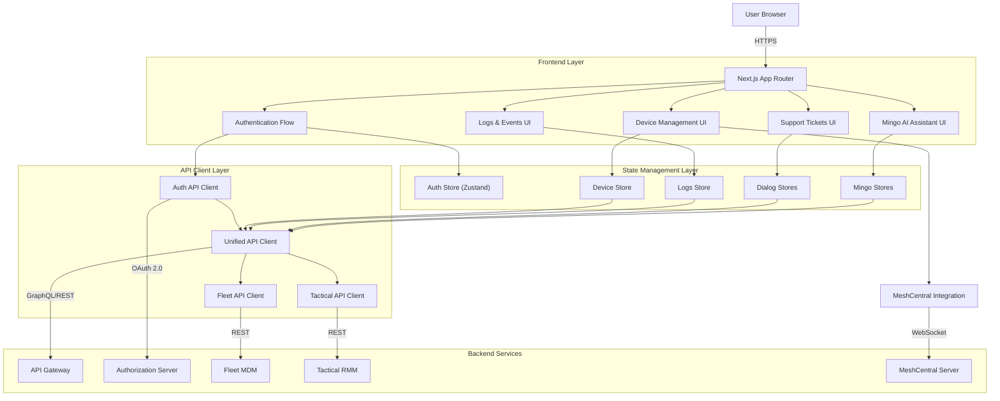
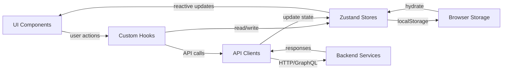
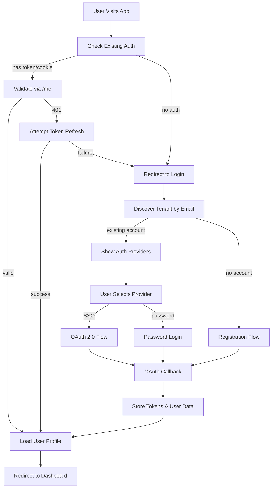
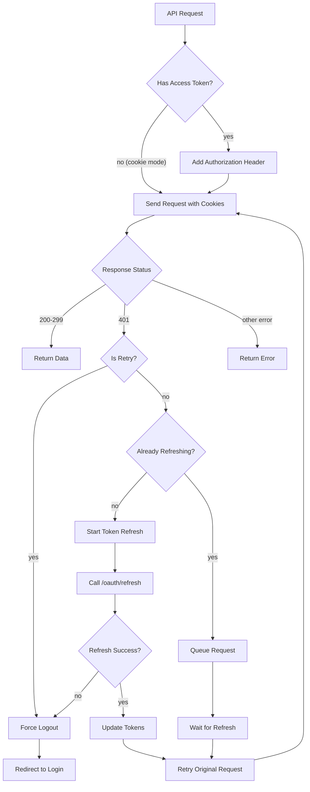
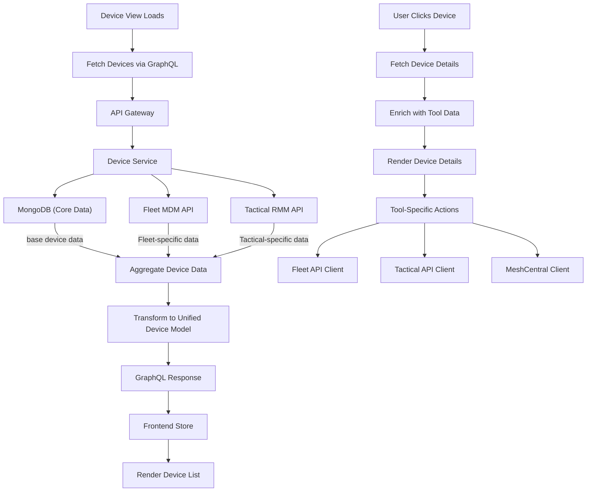
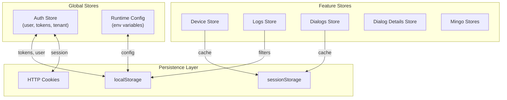
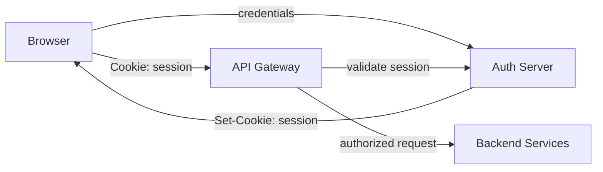
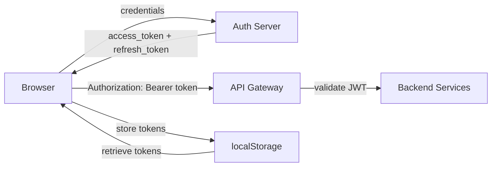
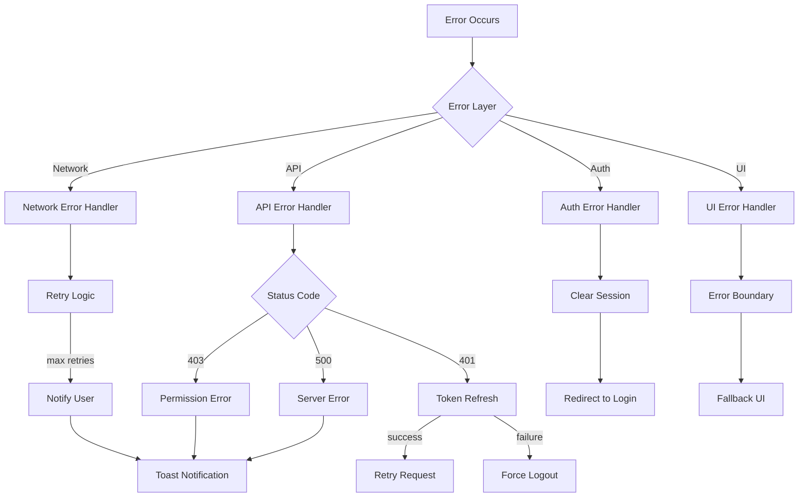
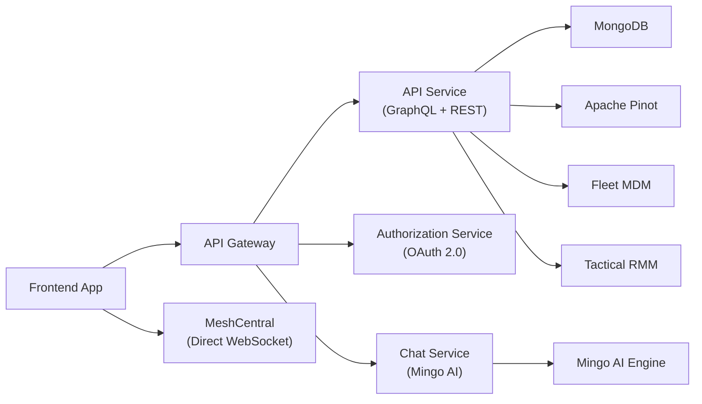

# OpenFrame Frontend Main Module

## Overview

The **OpenFrame Frontend Main Module** is the primary web application interface for the OpenFrame platform, built with **Next.js 14**, **React 18**, and **TypeScript**. It provides a comprehensive dashboard for managing devices, monitoring logs, handling support tickets, and interacting with AI assistants (Mingo). The frontend integrates with multiple backend services through a unified API client architecture and supports both cookie-based and token-based authentication.

### Key Capabilities

- **Multi-tenant Authentication**: Supports tenant discovery, SSO (Google/Microsoft), and traditional email/password authentication
- **Device Management**: Unified device view aggregating data from Fleet MDM, Tactical RMM, and MeshCentral
- **Real-time Monitoring**: Live log streaming, device status updates, and event tracking
- **AI-Powered Support**: Integrated Mingo AI assistant for IT support automation
- **Remote Access**: MeshCentral integration for remote desktop and file management
- **Flexible Deployment**: Supports both SaaS shared mode and self-hosted deployments

---

## Architecture Overview

The frontend follows a **modular, service-oriented architecture** with clear separation of concerns:



### Component Interaction Flow



---

## Core Sub-Modules

The frontend_main module is organized into several specialized sub-modules:

### 1. [Authentication & Authorization](./frontend_authentication.md)

Handles user authentication, tenant discovery, SSO integration, and session management.

**Key Components:**
- `useAuth` hook - Main authentication orchestration
- `useAuthStore` - Global authentication state management
- `AuthApiClient` - Dedicated auth service communication
- `TenantInfo` - Multi-tenant context management

**Features:**
- Tenant discovery by email
- OAuth 2.0 / OpenID Connect flows
- SSO providers (Google, Microsoft)
- Token refresh and session validation
- Multi-tenant organization registration

### 2. [API Client Infrastructure](./frontend_api_clients.md)

Unified API communication layer with automatic authentication, token refresh, and error handling.

**Key Components:**
- `ApiClient` - Base HTTP client with auth injection
- `AuthApiClient` - Authentication-specific endpoints
- `FleetApiClient` - Fleet MDM integration
- `TacticalApiClient` - Tactical RMM integration

**Features:**
- Automatic token refresh on 401 errors
- Cookie-based and header-based authentication
- Request queuing during token refresh
- Centralized error handling
- Environment-aware URL construction

### 3. [Device Management](./frontend_device_management.md)

Comprehensive device monitoring and management interface aggregating data from multiple sources.

**Key Components:**
- `Device` type - Unified device data model
- Device list and detail views
- Tool connection management
- Device filtering and search

**Features:**
- Multi-source device aggregation (Fleet, Tactical, MeshCentral)
- Real-time device status monitoring
- Software inventory and vulnerability tracking
- Remote access integration
- Device tagging and organization

### 4. [Logs & Events](./frontend_logs_events.md)

Real-time log streaming and event monitoring with advanced filtering and search capabilities.

**Key Components:**
- `useLogs` hook - Log data fetching and management
- `useLogsStore` - Log state and pagination
- `GraphQLResponse` - Type-safe GraphQL responses
- Log filtering and search UI

**Features:**
- Cursor-based pagination for large datasets
- Real-time log streaming
- Advanced filtering (severity, tool type, device, user)
- Full-text search
- Log detail views with context

### 5. [Support Tickets (Dialogs)](./frontend_support_tickets.md)

AI-powered support ticket system with real-time messaging and status management.

**Key Components:**
- `DialogsStore` - Ticket list management
- `DialogDetailsStore` - Individual ticket state
- Real-time message streaming
- Typing indicators

**Features:**
- Active and archived ticket views
- Real-time message updates via WebSocket
- Client and admin chat separation
- SLA tracking and prioritization
- Status workflow management

### 6. [Mingo AI Assistant](./frontend_mingo_ai.md)

Integrated AI assistant for IT support automation and intelligent troubleshooting.

**Key Components:**
- `MingoDialogDetailsStore` - Mingo conversation state
- `BackgroundMessagesStore` - Background task tracking
- Message streaming and rendering
- AI model selection

**Features:**
- Conversational AI interface
- Background task execution
- Multi-model support
- Context-aware responses
- Integration with device and log data

### 7. [MeshCentral Integration](./frontend_meshcentral.md)

Remote desktop and file management capabilities through MeshCentral integration.

**Key Components:**
- `MeshDesktop` - Remote desktop client
- `BinaryHeader` / `BinaryAccumulator` - Binary protocol handling
- File manager types and utilities

**Features:**
- Remote desktop access
- File transfer and management
- Binary protocol communication
- Session management
- Multi-device support

---

## Data Flow Architecture

### Authentication Flow



### API Request Flow with Token Refresh



### Device Data Aggregation Flow



---

## State Management Strategy

The frontend uses **Zustand** for state management with a modular store architecture:

### Store Organization



### Key Store Patterns

1. **Separation of Concerns**: Each feature has its own store
2. **Selective Persistence**: Only critical data persisted to localStorage
3. **Optimistic Updates**: UI updates immediately, syncs with backend
4. **Normalized State**: Avoid nested data, use flat structures
5. **Computed Values**: Derive data in selectors, not in state

---

## Authentication Modes

The frontend supports two authentication modes based on deployment configuration:

### 1. Cookie-Based Authentication (Production SaaS)

**Used when:** `ENABLE_DEV_TICKET_OBSERVER=false` (default)



**Characteristics:**
- Secure HTTP-only cookies
- Automatic cookie management by browser
- CSRF protection required
- Domain-based tenant isolation

### 2. Token-Based Authentication (Development/Self-Hosted)

**Used when:** `ENABLE_DEV_TICKET_OBSERVER=true`



**Characteristics:**
- JWT tokens in localStorage
- Manual token refresh logic
- No CSRF concerns
- Easier local development

---

## Environment Configuration

The frontend uses a **runtime configuration system** that supports both build-time and runtime environment variables:

### Key Configuration Variables

| Variable | Description | Default | Required |
|----------|-------------|---------|----------|
| `NEXT_PUBLIC_SHARED_HOST_URL` | Shared authentication host URL | - | SaaS mode |
| `NEXT_PUBLIC_TENANT_HOST_URL` | Tenant-specific backend URL | - | Self-hosted |
| `NEXT_PUBLIC_ENABLE_DEV_TICKET_OBSERVER` | Enable token-based auth | `false` | No |
| `NEXT_PUBLIC_AUTH_CHECK_INTERVAL_MS` | Session validation interval | `300000` (5min) | No |
| `NEXT_PUBLIC_SAAS_SHARED_MODE` | Enable SaaS multi-tenant mode | `false` | No |

### Configuration Loading

```typescript
// Runtime configuration with fallbacks
const runtimeEnv = {
  sharedHostUrl: () => process.env.NEXT_PUBLIC_SHARED_HOST_URL || '',
  tenantHostUrl: () => process.env.NEXT_PUBLIC_TENANT_HOST_URL || '',
  enableDevTicketObserver: () => 
    process.env.NEXT_PUBLIC_ENABLE_DEV_TICKET_OBSERVER === 'true',
  authCheckIntervalMs: () => 
    parseInt(process.env.NEXT_PUBLIC_AUTH_CHECK_INTERVAL_MS || '300000'),
  isSaasSharedMode: () => 
    process.env.NEXT_PUBLIC_SAAS_SHARED_MODE === 'true'
}
```

---

## Type System & Data Models

The frontend uses **TypeScript** with strict type checking for type safety:

### Core Type Definitions

#### Device Type (Unified Model)

```typescript
interface Device {
  // Core Identifiers
  id: string
  machineId: string
  hostname: string
  displayName: string
  
  // Hardware
  cpu_brand?: string
  cpu_physical_cores?: number
  memory?: number
  
  // System Status
  status: string
  uptime?: number
  last_seen?: string
  
  // Operating System
  platform?: string
  os_version?: string
  
  // Network
  primary_ip?: string
  primary_mac?: string
  
  // Organization
  organizationId?: string
  
  // Relationships
  tags?: DeviceTag[]
  toolConnections?: ToolConnection[]
  software?: Software[]
  users?: User[]
}
```

#### Authentication Types

```typescript
interface TenantInfo {
  tenantId?: string
  tenantName: string
  tenantDomain: string
}

interface User {
  id: string
  email: string
  tenantId?: string
  tenantName?: string
  role: string
}
```

#### API Response Types

```typescript
interface ApiResponse<T = any> {
  data?: T
  error?: string
  status: number
  ok: boolean
}

interface GraphQLResponse<T> {
  data?: T
  errors?: Array<{
    message: string
    extensions?: any
  }>
}
```

---

## Error Handling Strategy

### Layered Error Handling



### Error Handling Patterns

1. **API Client Level**: Automatic retry, token refresh, error transformation
2. **Hook Level**: Error state management, user-friendly messages
3. **Component Level**: Error boundaries, fallback UI
4. **Global Level**: Unhandled error logging, crash reporting

---

## Performance Optimization

### Key Optimization Strategies

1. **Code Splitting**: Next.js automatic route-based splitting
2. **Lazy Loading**: Dynamic imports for heavy components
3. **Memoization**: React.memo, useMemo, useCallback
4. **Virtual Scrolling**: For large lists (devices, logs)
5. **Debouncing**: Search inputs, filter changes
6. **Caching**: API response caching, localStorage caching
7. **Optimistic Updates**: Immediate UI feedback

### Data Fetching Patterns

```typescript
// Cursor-based pagination for large datasets
const fetchLogs = async (cursor?: string) => {
  const response = await apiClient.post('/api/graphql', {
    query: GET_LOGS_QUERY,
    variables: {
      pagination: { limit: 50, cursor },
      filter: activeFilters
    }
  })
  
  // Append to existing data for infinite scroll
  if (cursor) {
    appendEdges(response.data.logs.edges)
  } else {
    setEdges(response.data.logs.edges)
  }
}
```

---

## Security Considerations

### Authentication Security

- **Token Storage**: Access tokens in memory or localStorage (dev mode only)
- **Refresh Tokens**: HTTP-only cookies (production) or localStorage (dev)
- **CSRF Protection**: SameSite cookies, CSRF tokens
- **XSS Prevention**: Content Security Policy, sanitized inputs
- **Session Validation**: Periodic `/me` endpoint checks

### API Security

- **Authorization Headers**: Bearer tokens for authenticated requests
- **Request Signing**: HMAC signatures for sensitive operations
- **Rate Limiting**: Client-side throttling, server-side enforcement
- **Input Validation**: Type checking, schema validation

### Data Security

- **Sensitive Data**: Never log tokens, passwords, or PII
- **Local Storage**: Encrypt sensitive data before storage
- **Memory Management**: Clear sensitive data on logout
- **Secure Communication**: HTTPS only, no mixed content

---

## Integration Points

### Backend Service Integration



### External Tool Integration

1. **Fleet MDM**: Device management, policies, queries
2. **Tactical RMM**: Windows agent management, scripts, checks
3. **MeshCentral**: Remote desktop, file management
4. **Mingo AI**: Conversational AI, automation

---

## Development Workflow

### Local Development Setup

```bash
# Install dependencies
npm install

# Set up environment variables
cp .env.example .env.local

# Configure for local development
echo "NEXT_PUBLIC_ENABLE_DEV_TICKET_OBSERVER=true" >> .env.local
echo "NEXT_PUBLIC_TENANT_HOST_URL=http://localhost:8080" >> .env.local

# Start development server
npm run dev
```

### Build and Deployment

```bash
# Production build
npm run build

# Start production server
npm start

# Docker deployment
docker build -t openframe-frontend .
docker run -p 3000:3000 openframe-frontend
```

---

## Testing Strategy

### Test Coverage

1. **Unit Tests**: Hooks, utilities, type guards
2. **Integration Tests**: API clients, store interactions
3. **Component Tests**: UI components, user interactions
4. **E2E Tests**: Critical user flows (auth, device management)

### Testing Tools

- **Jest**: Unit and integration testing
- **React Testing Library**: Component testing
- **Playwright**: E2E testing
- **MSW**: API mocking

---

## Related Documentation

- [API Service](./api_service.md) - Backend GraphQL/REST API
- [Authorization Service](./authorization_service.md) - OAuth 2.0 authentication
- [Gateway Service](./gateway_service.md) - API gateway and routing
- [Client Service](./client_service.md) - Agent registration and management
- [Stream Processing](./stream_processing.md) - Real-time event processing
- [Data Layer (MongoDB)](./data_layer_mongo.md) - Primary data storage
- [Data Layer (Core)](./data_layer_core.md) - Analytics and time-series data

---

## Support and Community

For questions, issues, or contributions, join our **OpenMSP Slack community**:

- **Slack**: [https://www.openmsp.ai/](https://www.openmsp.ai/)
- **Invite Link**: [Join OpenMSP Slack](https://join.slack.com/t/openmsp/shared_invite/zt-36bl7mx0h-3~U2nFH6nqHqoTPXMaHEHA)

**Note**: We do not use GitHub Issues or GitHub Discussions. All support and discussions happen on Slack.

---

## License

OpenFrame is part of the Flamingo open-source MSP platform. See the main repository for license information.
