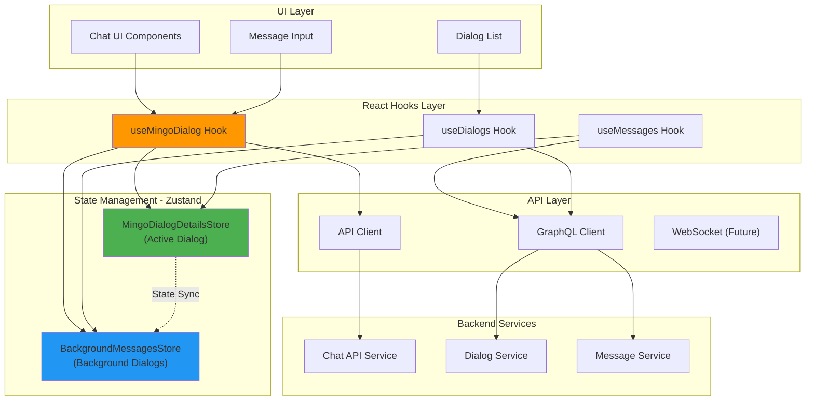
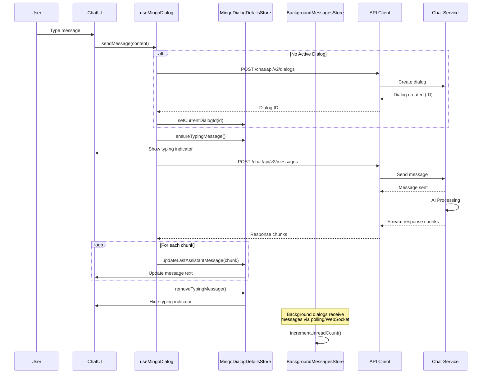
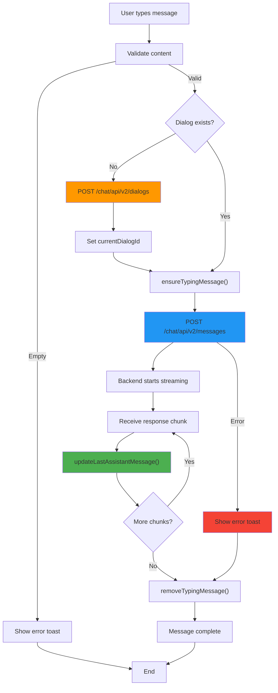
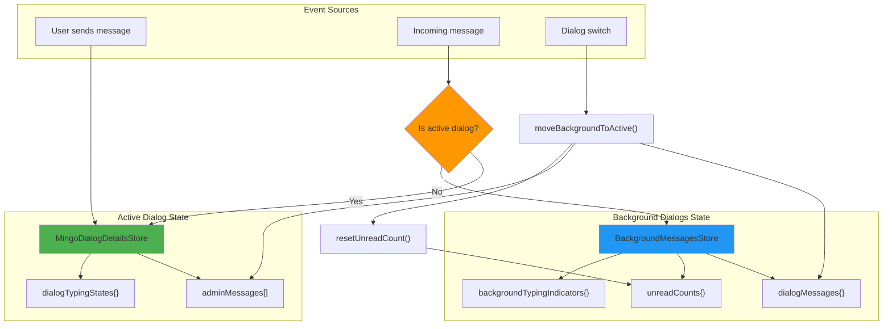
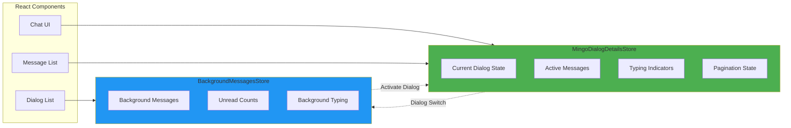
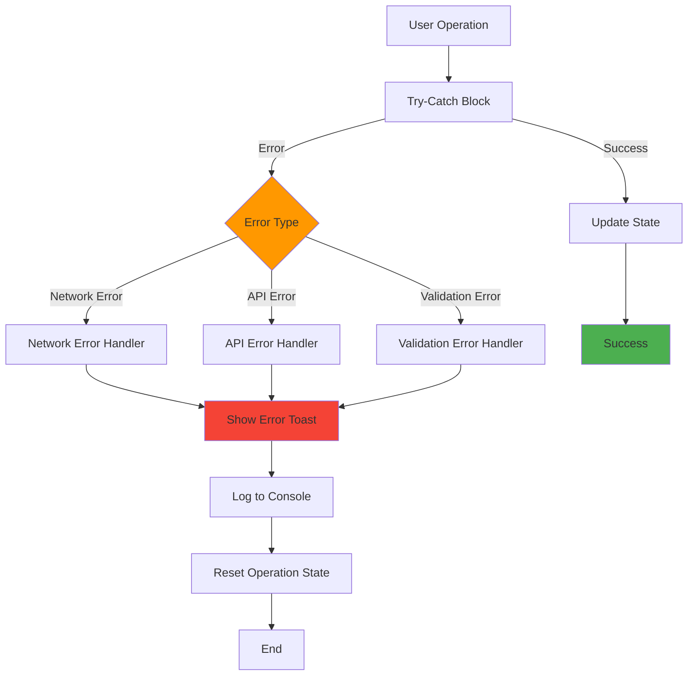
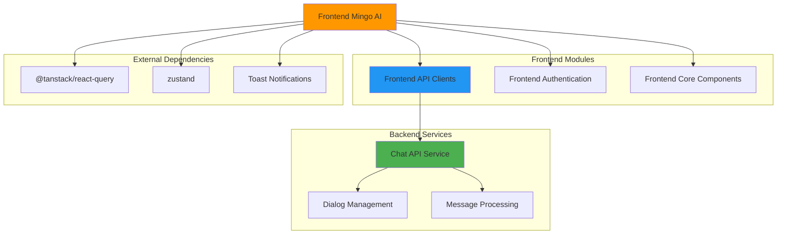

# Frontend Mingo AI Module

## Overview

The **Frontend Mingo AI Module** is the client-side implementation of Mingo, OpenFrame's AI-powered IT support assistant for technicians. This module provides the user interface and state management for real-time AI conversations, enabling MSP technicians to interact with an intelligent assistant that helps troubleshoot issues, query system data, and automate IT support tasks.

Mingo AI represents the "technician-facing" AI assistant in the Flamingo platform, complementing Fae (the client-facing assistant). This module handles dialog management, real-time message streaming, background message processing, and multi-dialog state synchronization.

**Key Capabilities:**
- Real-time AI chat interface with streaming responses
- Multi-dialog management with background message handling
- Typing indicators and message state synchronization
- GraphQL-based message and dialog queries
- Optimistic UI updates with error recovery
- Unread message tracking across multiple conversations

---

## Architecture Overview

The Mingo AI module follows a **state-driven architecture** with separation between active dialog state and background dialog state, enabling efficient multi-conversation management.



### Component Interaction Flow



---

## Core Components

### 1. useMingoDialog Hook

**Location:** `openframe/services/openframe-frontend/src/app/mingo/hooks/use-mingo-dialog.ts`

The primary hook for managing Mingo AI dialog lifecycle and message sending operations.

#### Key Responsibilities

- **Dialog Creation:** Automatically creates new dialogs when needed
- **Message Sending:** Handles message submission with validation
- **Error Handling:** Provides user-friendly error messages via toast notifications
- **State Management:** Tracks current dialog ID and operation states

#### API

```typescript
interface UseMingoDialogReturn {
  // State
  currentDialogId: string | null
  hasDialog: boolean
  
  // Loading states
  isCreatingDialog: boolean
  isSendingMessage: boolean
  
  // Error state
  error: Error | null
  
  // Actions
  createDialog: () => Promise<string | null>
  sendMessage: (content: string, selectedDialogId?: string | null) => Promise<boolean>
  resetDialog: () => void
}
```

#### Usage Example

```typescript
import { useMingoDialog } from '@app/mingo/hooks/use-mingo-dialog'

function ChatInterface() {
  const {
    currentDialogId,
    isCreatingDialog,
    isSendingMessage,
    sendMessage,
    createDialog
  } = useMingoDialog()
  
  const handleSendMessage = async (content: string) => {
    const success = await sendMessage(content)
    if (success) {
      console.log('Message sent successfully')
    }
  }
  
  return (
    <div>
      {isCreatingDialog && <p>Creating new conversation...</p>}
      {isSendingMessage && <p>Sending message...</p>}
      <MessageInput onSend={handleSendMessage} />
    </div>
  )
}
```

#### Key Features

**Automatic Dialog Creation:**
```typescript
const sendMessage = async (content: string, selectedDialogId?: string | null) => {
  let dialogId = getActiveDialogId(selectedDialogId)
  
  // Auto-create dialog if none exists
  if (!dialogId) {
    dialogId = await createDialog()
    if (!dialogId) return false
  }
  
  // Send message to dialog
  await sendMessageMutation.mutateAsync({ dialogId, content })
  return true
}
```

**Error Handling with Toast Notifications:**
```typescript
onError: (error) => {
  const errorMessage = error instanceof Error 
    ? error.message 
    : 'Failed to send message'
  
  toast({
    title: "Send Failed",
    description: errorMessage,
    variant: "destructive",
    duration: 5000
  })
}
```

---

### 2. MingoDialogDetailsStore

**Location:** `openframe/services/openframe-frontend/src/app/mingo/stores/mingo-dialog-details-store.ts`

Zustand store managing the **active dialog** state, including messages, typing indicators, and pagination.

#### State Structure

```typescript
interface MingoDialogDetailsStore {
  // Current dialog
  currentDialogId: string | null
  currentDialog: DialogNode | null
  adminMessages: Message[]
  
  // Loading states
  isLoadingDialog: boolean
  isLoadingMessages: boolean
  
  // Error states
  dialogError: string | null
  messagesError: string | null
  
  // Pagination
  hasMoreMessages: boolean
  messagesCursor: string | null
  newestMessageCursor: string | null
  
  // Per-dialog typing indicators
  dialogTypingStates: Record<string, boolean>
}
```

#### Key Operations

**Message Management:**

```typescript
// Set initial messages
setAdminMessages: (messages: Message[]) => void

// Add messages (deduplication)
addAdminMessages: (newMessages: Message[]) => void

// Real-time message updates
addRealtimeMessage: (message: Message) => void

// Remove welcome messages
removeWelcomeMessages: () => void
```

**Typing Indicator Management:**

```typescript
// Ensure typing message exists for streaming
ensureTypingMessage: (dialogId: string) => void

// Remove typing message when complete
removeTypingMessage: (dialogId: string) => void

// Check if typing message exists
hasTypingMessage: (dialogId: string) => boolean

// Update streaming message content
updateLastAssistantMessage: (dialogId: string, content: any) => void
```

**Dialog-Level Typing State:**

```typescript
// Set typing state for UI behavior
setDialogTyping: (dialogId: string, typing: boolean) => void

// Get typing state
getDialogTyping: (dialogId: string) => boolean
```

#### Streaming Message Pattern

The store implements a sophisticated streaming message pattern:

```typescript
// 1. Create empty typing message
ensureTypingMessage: (dialogId: string) => {
  const typingMessage: Message = {
    id: `typing-${dialogId}-${Date.now()}`,
    dialogId,
    owner: { type: 'ASSISTANT', model: 'mingo' },
    messageData: { type: 'TEXT', text: '' }
  }
  
  // Remove old typing messages, add new one
  const filtered = state.adminMessages.filter(msg => 
    !isTypingMessage(msg, dialogId)
  )
  
  return { adminMessages: [...filtered, typingMessage] }
}

// 2. Accumulate text chunks
updateLastAssistantMessage: (dialogId: string, content: any) => {
  const lastMessage = getLastAssistantMessage(dialogId)
  const currentText = lastMessage.messageData?.text || ''
  const newText = typeof content === 'string' ? content : ''
  
  lastMessage.messageData.text = currentText + newText  // Accumulate
}

// 3. Remove typing message when complete
removeTypingMessage: (dialogId: string) => {
  // Filter out typing messages
}
```

#### Usage Example

```typescript
import { useMingoDialogDetailsStore } from '@app/mingo/stores/mingo-dialog-details-store'

function ChatMessages() {
  const {
    adminMessages,
    isLoadingMessages,
    hasMoreMessages,
    addRealtimeMessage
  } = useMingoDialogDetailsStore()
  
  // Handle real-time message
  useEffect(() => {
    const handleNewMessage = (message: Message) => {
      addRealtimeMessage(message)
    }
    
    // Subscribe to WebSocket or polling
    subscribeToMessages(handleNewMessage)
  }, [])
  
  return (
    <div>
      {adminMessages.map(msg => (
        <MessageBubble key={msg.id} message={msg} />
      ))}
      {isLoadingMessages && <LoadingSpinner />}
      {hasMoreMessages && <LoadMoreButton />}
    </div>
  )
}
```

---

### 3. BackgroundMessagesStore

**Location:** `openframe/services/openframe-frontend/src/app/mingo/stores/mingo-background-messages-store.ts`

Zustand store with Immer middleware managing **background dialog** messages and unread counts for non-active conversations.

#### State Structure

```typescript
interface BackgroundMessagesStore {
  // Per-dialog message storage
  dialogMessages: Record<string, Message[]>
  
  // Per-dialog unread counts
  unreadCounts: Record<string, number>
  
  // Per-dialog typing indicators
  backgroundTypingIndicators: Record<string, boolean>
  
  // Current active dialog
  activeDialogId: string | null
}
```

#### Key Features

**Per-Dialog Message Storage:**

```typescript
// Add message to background dialog
addBackgroundMessage: (dialogId: string, message: Message) => {
  if (!state.dialogMessages[dialogId]) {
    state.dialogMessages[dialogId] = []
  }
  
  // Update existing or add new
  const existingIndex = state.dialogMessages[dialogId]
    .findIndex(msg => msg.id === message.id)
  
  if (existingIndex !== -1) {
    state.dialogMessages[dialogId][existingIndex] = message
  } else {
    state.dialogMessages[dialogId].push(message)
    
    // Limit to MAX_BACKGROUND_MESSAGES_PER_DIALOG (50)
    if (state.dialogMessages[dialogId].length > 50) {
      state.dialogMessages[dialogId] = 
        state.dialogMessages[dialogId].slice(-50)
    }
  }
}
```

**Unread Count Management:**

```typescript
// Increment unread count
incrementUnreadCount: (dialogId: string) => {
  if (!state.unreadCounts[dialogId]) {
    state.unreadCounts[dialogId] = 0
  }
  state.unreadCounts[dialogId] += 1
}

// Reset when dialog becomes active
resetUnreadCount: (dialogId: string) => {
  state.unreadCounts[dialogId] = 0
}

// Get current count
getUnreadCount: (dialogId: string) => number
```

**Dialog Activation Pattern:**

```typescript
// Move background messages to active store
moveBackgroundToActive: (dialogId: string) => {
  const backgroundMessages = state.dialogMessages[dialogId] || []
  
  // Reset unread count
  state.unreadCounts[dialogId] = 0
  
  // Return messages for active store
  return [...backgroundMessages]
}
```

**Streaming Message Preservation:**

```typescript
// Preserve streaming message in background
preserveStreamingMessage: (dialogId: string, streamingMessage: Message) => {
  if (!state.dialogMessages[dialogId]) {
    state.dialogMessages[dialogId] = []
  }
  
  // Remove old version, add updated version
  const filtered = state.dialogMessages[dialogId]
    .filter(msg => msg.id !== streamingMessage.id)
  
  state.dialogMessages[dialogId] = [...filtered, streamingMessage]
  
  // Enforce size limit
  if (state.dialogMessages[dialogId].length > 50) {
    state.dialogMessages[dialogId] = 
      state.dialogMessages[dialogId].slice(-50)
  }
}
```

#### Usage Example

```typescript
import { useMingoBackgroundMessagesStore } from '@app/mingo/stores/mingo-background-messages-store'

function DialogListItem({ dialogId }: { dialogId: string }) {
  const {
    getUnreadCount,
    isBackgroundTyping,
    resetUnreadCount
  } = useMingoBackgroundMessagesStore()
  
  const unreadCount = getUnreadCount(dialogId)
  const isTyping = isBackgroundTyping(dialogId)
  
  const handleClick = () => {
    resetUnreadCount(dialogId)
    // Switch to this dialog
  }
  
  return (
    <div onClick={handleClick}>
      <span>Dialog {dialogId}</span>
      {unreadCount > 0 && (
        <Badge>{unreadCount}</Badge>
      )}
      {isTyping && <TypingIndicator />}
    </div>
  )
}
```

---

## Data Flow Patterns

### Message Sending Flow



### Multi-Dialog State Synchronization



---

## API Integration

### REST API Endpoints

The module integrates with the Chat API service via REST endpoints:

#### Create Dialog

```typescript
POST /chat/api/v2/dialogs

Request:
{
  "agentType": "ADMIN"
}

Response:
{
  "id": "dialog-uuid",
  "agentType": "ADMIN",
  "currentMode": "DEFAULT",
  "status": "ACTIVE",
  "title": "New Conversation",
  "createdAt": "2024-01-15T10:30:00Z",
  "statusUpdatedAt": "2024-01-15T10:30:00Z",
  "resolvedAt": null
}
```

#### Send Message

```typescript
POST /chat/api/v2/messages

Request:
{
  "dialogId": "dialog-uuid",
  "content": "How do I reset a user password?",
  "chatType": "ADMIN_AI_CHAT"
}

Response:
{
  "id": "message-uuid",
  "dialogId": "dialog-uuid",
  "content": "To reset a user password...",
  "createdAt": "2024-01-15T10:31:00Z"
}
```

### GraphQL Queries

The module uses GraphQL for fetching dialogs and messages:

#### Fetch Dialogs

```graphql
query GetDialogs($first: Int, $after: String) {
  dialogs(first: $first, after: $after) {
    edges {
      node {
        id
        agentType
        currentMode
        status
        title
        createdAt
        statusUpdatedAt
        resolvedAt
      }
      cursor
    }
    pageInfo {
      hasNextPage
      endCursor
    }
  }
}
```

#### Fetch Messages

```graphql
query GetMessages($dialogId: ID!, $first: Int, $after: String) {
  messages(dialogId: $dialogId, first: $first, after: $after) {
    edges {
      node {
        id
        dialogId
        chatType
        dialogMode
        createdAt
        owner {
          type
          model
          userId
        }
        messageData {
          type
          text
          toolCalls {
            id
            name
            arguments
          }
        }
      }
      cursor
    }
    pageInfo {
      hasNextPage
      endCursor
    }
  }
}
```

---

## Type Definitions

### Core Types

```typescript
// Dialog types
interface DialogNode {
  id: string
  agentType: 'ADMIN' | 'CLIENT'
  currentMode: string
  status: 'ACTIVE' | 'RESOLVED' | 'ARCHIVED'
  title: string
  createdAt: string
  statusUpdatedAt: string
  resolvedAt: string | null
}

interface DialogConnection {
  edges: Array<{
    node: DialogNode
    cursor: string
  }>
  pageInfo: {
    hasNextPage: boolean
    endCursor: string | null
  }
}

// Message types
interface Message {
  id: string
  dialogId: string
  chatType: 'ADMIN_AI_CHAT' | 'CLIENT_AI_CHAT'
  dialogMode: string
  createdAt: string
  owner: {
    type: 'USER' | 'ASSISTANT'
    model?: string
    userId?: string
  }
  messageData: {
    type: 'TEXT' | 'TOOL_CALL'
    text?: string
    toolCalls?: Array<{
      id: string
      name: string
      arguments: string
    }>
  }
}

interface MessageConnection {
  edges: Array<{
    node: Message
    cursor: string
  }>
  pageInfo: {
    hasNextPage: boolean
    endCursor: string | null
  }
}

// Request types
interface CreateDialogRequest {
  agentType: 'ADMIN'
}

interface SendMessageRequest {
  dialogId: string
  content: string
  chatType: 'ADMIN_AI_CHAT'
}

// Response types
interface CreateDialogResponse {
  id: string
  agentType: string
  currentMode: string
  status: string
  title: string
  createdAt: string
  statusUpdatedAt: string
  resolvedAt: string | null
}

interface DialogsResponse {
  data: {
    dialogs: DialogConnection
  }
}

interface MessagesResponse {
  data: {
    messages: MessageConnection
  }
}
```

---

## State Management Patterns

### Zustand Store Architecture

The module uses **Zustand** for state management with two separate stores:



### Store Separation Rationale

**Why Two Stores?**

1. **Performance:** Active dialog needs frequent updates (streaming), background dialogs update less frequently
2. **Memory Management:** Background dialogs limited to 50 messages each
3. **State Isolation:** Active dialog state doesn't interfere with background state
4. **Unread Tracking:** Background store tracks unread counts independently

### Immer Middleware

The `BackgroundMessagesStore` uses Immer for immutable state updates:

```typescript
import { immer } from 'zustand/middleware/immer'

export const useMingoBackgroundMessagesStore = create<BackgroundMessagesStore>()(
  immer((set, get) => ({
    dialogMessages: {},
    
    addBackgroundMessage: (dialogId: string, message: Message) => {
      set(state => {
        // Direct mutation with Immer
        if (!state.dialogMessages[dialogId]) {
          state.dialogMessages[dialogId] = []
        }
        state.dialogMessages[dialogId].push(message)
      })
    }
  }))
)
```

**Benefits:**
- Simpler nested state updates
- Automatic immutability
- Better TypeScript inference
- Reduced boilerplate

---

## Error Handling

### Error Handling Strategy

The module implements comprehensive error handling at multiple levels:



### Error Handling Implementation

**Hook-Level Error Handling:**

```typescript
const createDialogMutation = useMutation({
  mutationFn: async (): Promise<CreateDialogResponse> => {
    const response = await apiClient.post<CreateDialogResponse>(
      '/chat/api/v2/dialogs',
      { agentType: 'ADMIN' }
    )

    // Check response status
    if (!response.ok) {
      throw new Error(
        response.error || 
        `Failed to create dialog with status ${response.status}`
      )
    }

    // Validate response data
    if (!response.data?.id) {
      throw new Error('Invalid response: dialog id not found')
    }

    return response.data
  },
  
  onError: (error) => {
    // Extract error message
    const errorMessage = error instanceof Error 
      ? error.message 
      : 'Failed to create new chat'
    
    // Show user-friendly toast
    toast({
      title: "Failed to Create Chat",
      description: errorMessage,
      variant: "destructive",
      duration: 5000
    })

    // Log for debugging
    console.error('Failed to create dialog:', error)
  }
})
```

**Validation Error Handling:**

```typescript
const sendMessage = async (content: string) => {
  // Input validation
  const trimmedContent = content.trim()
  if (!trimmedContent) {
    toast({
      title: "Empty Message",
      description: "Please enter a message to send",
      variant: "destructive",
      duration: 3000
    })
    return false
  }

  // Proceed with sending
  try {
    await sendMessageMutation.mutateAsync({ 
      dialogId, 
      content: trimmedContent 
    })
    return true
  } catch (error) {
    return false  // Error already handled by mutation
  }
}
```

**Store-Level Error State:**

```typescript
interface MingoDialogDetailsStore {
  // Error states
  dialogError: string | null
  messagesError: string | null
  
  // Error setters
  setDialogError: (error: string | null) => void
  setMessagesError: (error: string | null) => void
}

// Usage in components
const { dialogError, messagesError } = useMingoDialogDetailsStore()

if (dialogError) {
  return <ErrorDisplay message={dialogError} />
}
```

---

## Performance Optimizations

### Message Deduplication

Prevents duplicate messages in the UI:

```typescript
addAdminMessages: (newMessages: Message[]) => {
  set(state => {
    // Create set of existing IDs
    const existingIds = new Set(state.adminMessages.map(msg => msg.id))
    
    // Filter out duplicates
    const uniqueNewMessages = newMessages.filter(
      msg => !existingIds.has(msg.id)
    )
    
    return {
      adminMessages: [...state.adminMessages, ...uniqueNewMessages]
    }
  })
}
```

### Background Message Limiting

Prevents memory bloat from background dialogs:

```typescript
const MAX_BACKGROUND_MESSAGES_PER_DIALOG = 50

addBackgroundMessage: (dialogId: string, message: Message) => {
  set(state => {
    state.dialogMessages[dialogId].push(message)
    
    // Enforce size limit
    if (state.dialogMessages[dialogId].length > MAX_BACKGROUND_MESSAGES_PER_DIALOG) {
      state.dialogMessages[dialogId] = 
        state.dialogMessages[dialogId].slice(-50)  // Keep last 50
    }
  })
}
```

### Optimistic UI Updates

Updates UI immediately before API confirmation:

```typescript
const sendMessage = async (content: string) => {
  // 1. Add optimistic message to UI
  const optimisticMessage: Message = {
    id: `temp-${Date.now()}`,
    dialogId,
    content,
    owner: { type: 'USER' },
    createdAt: new Date().toISOString()
  }
  addRealtimeMessage(optimisticMessage)
  
  // 2. Send to API
  try {
    const response = await sendMessageMutation.mutateAsync({ dialogId, content })
    
    // 3. Replace optimistic message with real message
    replaceMessage(optimisticMessage.id, response.data)
  } catch (error) {
    // 4. Remove optimistic message on error
    removeMessage(optimisticMessage.id)
  }
}
```

### Streaming Message Accumulation

Efficiently accumulates streaming text:

```typescript
updateLastAssistantMessage: (dialogId: string, content: any) => {
  set(state => {
    const lastMessage = getLastAssistantMessage(dialogId)
    
    // Accumulate text instead of replacing
    const currentText = lastMessage.messageData?.text || ''
    const newText = typeof content === 'string' ? content : ''
    
    lastMessage.messageData.text = currentText + newText
    
    return { adminMessages: [...state.adminMessages] }
  })
}
```

---

## Integration Points

### Dependencies

The Mingo AI module integrates with several other modules:



### Related Modules

- **[Frontend API Clients](frontend_api_clients.md):** Provides `apiClient` for REST API calls
- **[Frontend Authentication](frontend_authentication.md):** Manages user authentication state
- **[Frontend Core Components](frontend_core_components.md):** Provides reusable chat UI components
- **[Frontend Support Tickets](frontend_support_tickets.md):** Similar dialog management patterns

### Backend Integration

The module communicates with backend services:

- **Chat API Service:** Dialog and message CRUD operations
- **GraphQL API:** Efficient querying of dialogs and messages
- **WebSocket (Future):** Real-time message streaming

---

## Usage Examples

### Basic Chat Implementation

```typescript
import { useMingoDialog } from '@app/mingo/hooks/use-mingo-dialog'
import { useMingoDialogDetailsStore } from '@app/mingo/stores/mingo-dialog-details-store'

function MingoChatInterface() {
  const {
    currentDialogId,
    isCreatingDialog,
    isSendingMessage,
    sendMessage
  } = useMingoDialog()
  
  const {
    adminMessages,
    isLoadingMessages
  } = useMingoDialogDetailsStore()
  
  const [inputValue, setInputValue] = useState('')
  
  const handleSend = async () => {
    if (!inputValue.trim()) return
    
    const success = await sendMessage(inputValue)
    if (success) {
      setInputValue('')  // Clear input on success
    }
  }
  
  return (
    <div className="chat-container">
      <div className="messages">
        {isLoadingMessages && <LoadingSpinner />}
        
        {adminMessages.map(message => (
          <MessageBubble 
            key={message.id} 
            message={message}
            isOwn={message.owner.type === 'USER'}
          />
        ))}
        
        {isSendingMessage && <TypingIndicator />}
      </div>
      
      <div className="input-area">
        <input
          value={inputValue}
          onChange={(e) => setInputValue(e.target.value)}
          onKeyPress={(e) => e.key === 'Enter' && handleSend()}
          placeholder="Ask Mingo anything..."
          disabled={isSendingMessage || isCreatingDialog}
        />
        <button 
          onClick={handleSend}
          disabled={isSendingMessage || isCreatingDialog}
        >
          Send
        </button>
      </div>
    </div>
  )
}
```

### Multi-Dialog Management

```typescript
import { useMingoBackgroundMessagesStore } from '@app/mingo/stores/mingo-background-messages-store'

function DialogSidebar() {
  const {
    dialogMessages,
    unreadCounts,
    getUnreadCount,
    resetUnreadCount,
    setActiveDialogId
  } = useMingoBackgroundMessagesStore()
  
  const [dialogs, setDialogs] = useState<DialogNode[]>([])
  
  const handleDialogClick = (dialogId: string) => {
    // Reset unread count
    resetUnreadCount(dialogId)
    
    // Set as active dialog
    setActiveDialogId(dialogId)
    
    // Navigate to dialog
    router.push(`/mingo/${dialogId}`)
  }
  
  return (
    <div className="dialog-list">
      {dialogs.map(dialog => {
        const unreadCount = getUnreadCount(dialog.id)
        
        return (
          <div 
            key={dialog.id}
            className="dialog-item"
            onClick={() => handleDialogClick(dialog.id)}
          >
            <div className="dialog-title">{dialog.title}</div>
            <div className="dialog-preview">
              {getLastMessage(dialog.id)?.messageData?.text}
            </div>
            
            {unreadCount > 0 && (
              <Badge variant="destructive">{unreadCount}</Badge>
            )}
          </div>
        )
      })}
    </div>
  )
}
```

### Streaming Message Display

```typescript
import { useEffect } from 'react'
import { useMingoDialogDetailsStore } from '@app/mingo/stores/mingo-dialog-details-store'

function StreamingMessage({ dialogId }: { dialogId: string }) {
  const {
    adminMessages,
    ensureTypingMessage,
    updateLastAssistantMessage,
    removeTypingMessage
  } = useMingoDialogDetailsStore()
  
  useEffect(() => {
    // Simulate streaming response
    const streamResponse = async () => {
      // 1. Create typing message
      ensureTypingMessage(dialogId)
      
      // 2. Simulate chunks
      const chunks = ['Hello', ' there', '!', ' How', ' can', ' I', ' help', '?']
      
      for (const chunk of chunks) {
        await new Promise(resolve => setTimeout(resolve, 100))
        updateLastAssistantMessage(dialogId, chunk)
      }
      
      // 3. Remove typing indicator
      removeTypingMessage(dialogId)
    }
    
    streamResponse()
  }, [dialogId])
  
  const lastMessage = adminMessages[adminMessages.length - 1]
  
  return (
    <div className="streaming-message">
      {lastMessage?.messageData?.text}
      {lastMessage?.id.startsWith('typing-') && <BlinkingCursor />}
    </div>
  )
}
```

---

## Testing Considerations

### Unit Testing

**Testing Hooks:**

```typescript
import { renderHook, act } from '@testing-library/react'
import { useMingoDialog } from '@app/mingo/hooks/use-mingo-dialog'

describe('useMingoDialog', () => {
  it('should create dialog automatically when sending first message', async () => {
    const { result } = renderHook(() => useMingoDialog())
    
    expect(result.current.currentDialogId).toBeNull()
    
    await act(async () => {
      await result.current.sendMessage('Hello Mingo')
    })
    
    expect(result.current.currentDialogId).not.toBeNull()
  })
  
  it('should show error toast on send failure', async () => {
    const { result } = renderHook(() => useMingoDialog())
    
    // Mock API failure
    jest.spyOn(apiClient, 'post').mockRejectedValue(new Error('Network error'))
    
    await act(async () => {
      const success = await result.current.sendMessage('Hello')
      expect(success).toBe(false)
    })
    
    // Verify toast was called
    expect(toast).toHaveBeenCalledWith(
      expect.objectContaining({
        title: 'Send Failed',
        variant: 'destructive'
      })
    )
  })
})
```

**Testing Stores:**

```typescript
import { renderHook, act } from '@testing-library/react'
import { useMingoDialogDetailsStore } from '@app/mingo/stores/mingo-dialog-details-store'

describe('MingoDialogDetailsStore', () => {
  beforeEach(() => {
    // Reset store before each test
    useMingoDialogDetailsStore.getState().clearCurrent()
  })
  
  it('should accumulate streaming message text', () => {
    const { result } = renderHook(() => useMingoDialogDetailsStore())
    const dialogId = 'test-dialog'
    
    act(() => {
      result.current.ensureTypingMessage(dialogId)
    })
    
    act(() => {
      result.current.updateLastAssistantMessage(dialogId, 'Hello')
      result.current.updateLastAssistantMessage(dialogId, ' world')
    })
    
    const lastMessage = result.current.adminMessages[
      result.current.adminMessages.length - 1
    ]
    
    expect(lastMessage.messageData.text).toBe('Hello world')
  })
  
  it('should deduplicate messages', () => {
    const { result } = renderHook(() => useMingoDialogDetailsStore())
    
    const message: Message = {
      id: 'msg-1',
      dialogId: 'dialog-1',
      content: 'Test',
      createdAt: new Date().toISOString()
    }
    
    act(() => {
      result.current.addAdminMessages([message])
      result.current.addAdminMessages([message])  // Duplicate
    })
    
    expect(result.current.adminMessages).toHaveLength(1)
  })
})
```

### Integration Testing

**Testing Message Flow:**

```typescript
import { render, screen, fireEvent, waitFor } from '@testing-library/react'
import { MingoChatInterface } from '@app/mingo/components/MingoChatInterface'

describe('MingoChatInterface Integration', () => {
  it('should send message and display response', async () => {
    render(<MingoChatInterface />)
    
    const input = screen.getByPlaceholderText('Ask Mingo anything...')
    const sendButton = screen.getByText('Send')
    
    // Type message
    fireEvent.change(input, { target: { value: 'Hello Mingo' } })
    
    // Send message
    fireEvent.click(sendButton)
    
    // Wait for user message to appear
    await waitFor(() => {
      expect(screen.getByText('Hello Mingo')).toBeInTheDocument()
    })
    
    // Wait for AI response
    await waitFor(() => {
      expect(screen.getByText(/Hello! How can I help/)).toBeInTheDocument()
    }, { timeout: 5000 })
  })
})
```

---

## Future Enhancements

### Planned Features

1. **WebSocket Integration**
   - Real-time message streaming via WebSocket
   - Eliminate polling for background messages
   - Reduce latency for message delivery

2. **Message Reactions**
   - Thumbs up/down for AI responses
   - Feedback collection for model improvement
   - User satisfaction tracking

3. **Message Search**
   - Full-text search across all dialogs
   - Filter by date, sender, content type
   - Search result highlighting

4. **Voice Input**
   - Speech-to-text for message input
   - Hands-free operation for technicians
   - Multi-language support

5. **Message Attachments**
   - File uploads (logs, screenshots)
   - Image analysis by AI
   - Document parsing and summarization

6. **Dialog Templates**
   - Pre-defined conversation starters
   - Common troubleshooting workflows
   - Quick action buttons

7. **Collaborative Dialogs**
   - Multiple users in same dialog
   - Technician-to-technician consultation
   - Supervisor oversight mode

### Technical Improvements

1. **Performance**
   - Virtual scrolling for large message lists
   - Message pagination optimization
   - Lazy loading of dialog history

2. **Offline Support**
   - IndexedDB for message caching
   - Offline message queuing
   - Sync on reconnection

3. **Accessibility**
   - Screen reader optimization
   - Keyboard navigation
   - High contrast mode

4. **Analytics**
   - Message delivery metrics
   - Response time tracking
   - User engagement analytics

---

## Troubleshooting

### Common Issues

**Issue: Messages not appearing in UI**

```typescript
// Check if messages are in store
const { adminMessages } = useMingoDialogDetailsStore()
console.log('Messages in store:', adminMessages)

// Verify dialog ID matches
const { currentDialogId } = useMingoDialog()
console.log('Current dialog ID:', currentDialogId)

// Check for errors
const { messagesError } = useMingoDialogDetailsStore()
if (messagesError) {
  console.error('Messages error:', messagesError)
}
```

**Issue: Typing indicator stuck**

```typescript
// Manually remove typing message
const { removeTypingMessage } = useMingoDialogDetailsStore()
removeTypingMessage(dialogId)

// Check typing state
const { hasTypingMessage } = useMingoDialogDetailsStore()
console.log('Has typing message:', hasTypingMessage(dialogId))
```

**Issue: Duplicate messages**

```typescript
// Verify deduplication is working
const { adminMessages } = useMingoDialogDetailsStore()
const messageIds = adminMessages.map(msg => msg.id)
const uniqueIds = new Set(messageIds)

if (messageIds.length !== uniqueIds.size) {
  console.error('Duplicate messages detected!')
  console.log('Duplicates:', messageIds.filter((id, index) => 
    messageIds.indexOf(id) !== index
  ))
}
```

**Issue: Unread counts not updating**

```typescript
// Check background store state
const { unreadCounts, getUnreadCount } = useMingoBackgroundMessagesStore()
console.log('All unread counts:', unreadCounts)
console.log('Specific dialog count:', getUnreadCount(dialogId))

// Manually reset if needed
const { resetUnreadCount } = useMingoBackgroundMessagesStore()
resetUnreadCount(dialogId)
```

---

## Best Practices

### State Management

1. **Use Appropriate Store**
   - Active dialog → `MingoDialogDetailsStore`
   - Background dialogs → `BackgroundMessagesStore`
   - Don't mix concerns

2. **Avoid Direct State Mutation**
   ```typescript
   // ❌ Bad
   const { adminMessages } = useMingoDialogDetailsStore()
   adminMessages.push(newMessage)
   
   // ✅ Good
   const { addRealtimeMessage } = useMingoDialogDetailsStore()
   addRealtimeMessage(newMessage)
   ```

3. **Clean Up on Unmount**
   ```typescript
   useEffect(() => {
     return () => {
       // Reset dialog state
       resetDialog()
       clearCurrent()
     }
   }, [])
   ```

### Error Handling

1. **Always Handle Errors**
   ```typescript
   try {
     await sendMessage(content)
   } catch (error) {
     // Show user-friendly message
     toast({ title: 'Failed to send', variant: 'destructive' })
     // Log for debugging
     console.error(error)
   }
   ```

2. **Validate Input**
   ```typescript
   const sendMessage = async (content: string) => {
     if (!content.trim()) {
       toast({ title: 'Empty message' })
       return false
     }
     // Proceed with sending
   }
   ```

3. **Provide Feedback**
   ```typescript
   // Show loading state
   {isSendingMessage && <LoadingSpinner />}
   
   // Show error state
   {error && <ErrorMessage error={error} />}
   ```

### Performance

1. **Memoize Expensive Computations**
   ```typescript
   const sortedMessages = useMemo(() => {
     return adminMessages.sort((a, b) => 
       new Date(a.createdAt).getTime() - new Date(b.createdAt).getTime()
     )
   }, [adminMessages])
   ```

2. **Debounce User Input**
   ```typescript
   const debouncedSend = useMemo(
     () => debounce(sendMessage, 300),
     [sendMessage]
   )
   ```

3. **Limit Background Messages**
   ```typescript
   // Already implemented in store
   const MAX_BACKGROUND_MESSAGES_PER_DIALOG = 50
   ```

---

## Related Documentation

- **[Frontend Main](frontend_main.md):** Main frontend application structure
- **[Frontend API Clients](frontend_api_clients.md):** API client implementations
- **[Frontend Authentication](frontend_authentication.md):** Authentication and authorization
- **[Frontend Core Components](frontend_core_components.md):** Reusable UI components
- **[Frontend Support Tickets](frontend_support_tickets.md):** Similar dialog management patterns
- **[API Service](api_service.md):** Backend API service documentation
- **[Chat API Service](https://docs.openframe.ai/services/chat-api):** Chat API endpoints (if available)

---

## Contributing

When contributing to the Mingo AI module:

1. **Follow State Patterns:** Use established store patterns for consistency
2. **Add Tests:** Include unit tests for hooks and stores
3. **Handle Errors:** Implement comprehensive error handling
4. **Document Changes:** Update this documentation for new features
5. **Performance:** Consider impact on message rendering performance

---

## Support

For questions or issues with the Mingo AI module:

- **Slack Community:** [OpenMSP Slack](https://join.slack.com/t/openmsp/shared_invite/zt-36bl7mx0h-3~U2nFH6nqHqoTPXMaHEHA)
- **Documentation:** [OpenFrame Docs](https://docs.openframe.ai)
- **GitHub:** [OpenFrame Repository](https://github.com/flamingo-run/openframe)

---

**Last Updated:** 2024-01-15  
**Module Version:** 1.0.0  
**Maintainers:** OpenFrame Frontend Team
