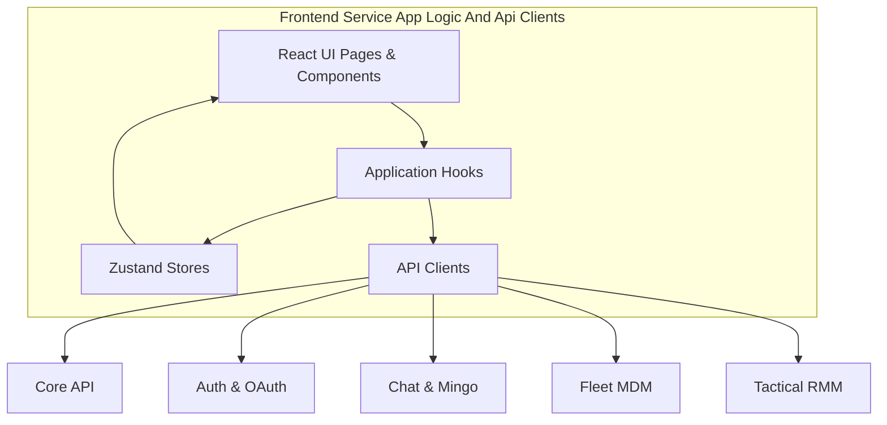
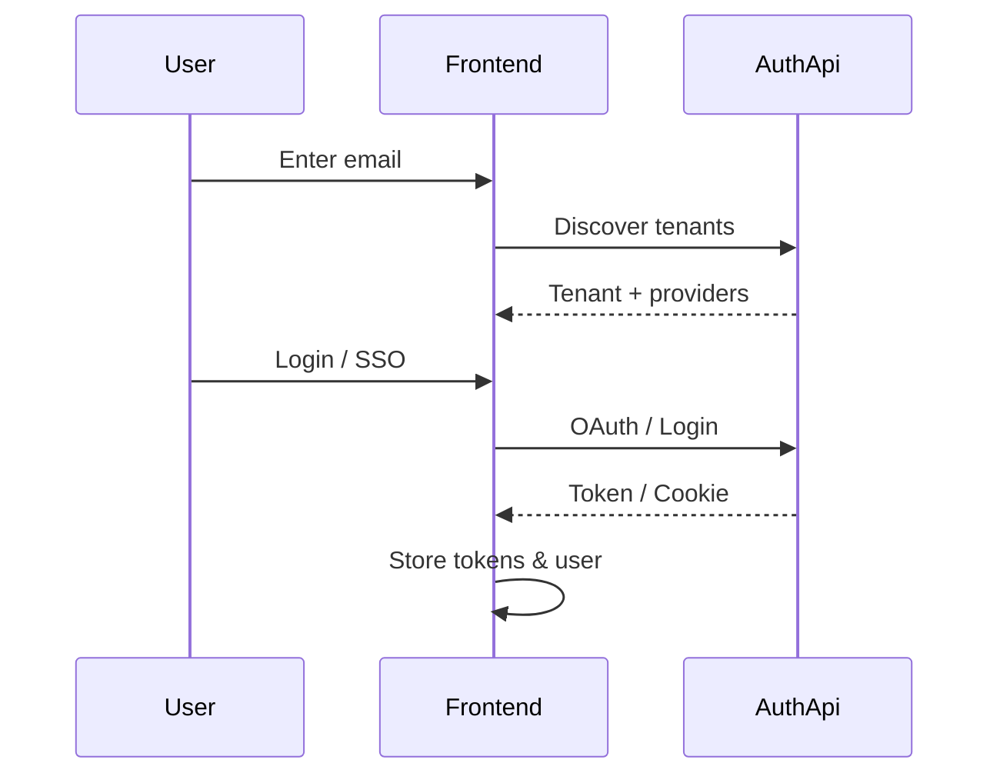
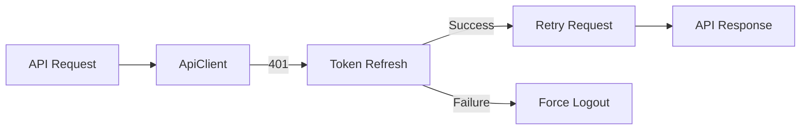
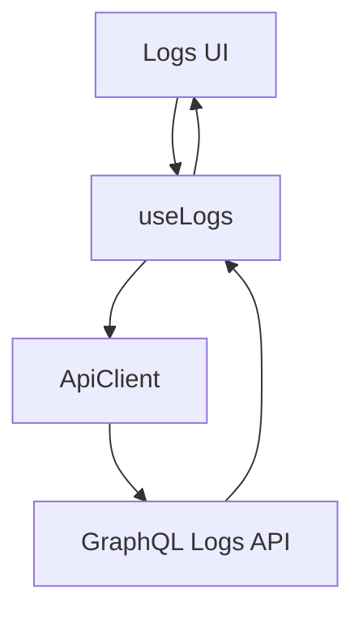
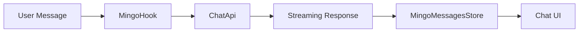

# Frontend Service App Logic And Api Clients

## Overview

The **Frontend Service App Logic And Api Clients** module represents the heart of the OpenFrame web application’s client-side logic. It encapsulates:

- Application-level React hooks and state management
- Strongly typed domain models used across UI features
- Centralized API clients that communicate with backend services (Auth, Core API, Chat, Fleet, Tactical RMM, MeshCentral)
- Real-time and streaming abstractions for chat, logs, and remote desktop features

This module acts as the **bridge between the UI and the OpenFrame backend ecosystem**, ensuring consistent authentication, error handling, pagination, and data transformation patterns across the frontend.

---

## Responsibilities at a Glance

- **Authentication & Tenant Context**: Login, logout, SSO, tenant discovery, token refresh
- **API Abstraction**: Unified API client with retry, refresh, and multi-backend routing
- **Domain Types**: Devices, logs, dialogs, policies, scripts, tools
- **Application Logic**: Hooks for logs, tickets, chat (Mingo), deployment detection
- **State Management**: Zustand stores for dialogs, messages, logs, deployment, auth
- **Advanced Integrations**: MeshCentral remote desktop & file manager, Fleet MDM, Tactical RMM

---

## High-Level Architecture

This module does **not** render UI directly. Instead, it provides the logic, data, and contracts consumed by UI components.

---

## Core Subsystems

### Authentication & Tenant Lifecycle

**Key hooks and clients**:
- `useAuth`
- `useInviteProviders`
- `useRegistrationProviders`
- `AuthApiClient`
- `ApiClient`

**Responsibilities**:
- Tenant discovery by email
- Email/password registration
- SSO login and invitation flows
- Token storage, refresh, and logout
- Periodic session validation via `/me`

---

### Central API Client Layer

**ApiClient** is the foundation for all backend communication.

**Key features**:
- Automatic header vs cookie-based auth
- Transparent token refresh with request queuing
- Unified error and response shape
- Multi-host routing (tenant host, shared host, external APIs)

Specialized clients extend this base:
- **AuthApiClient** – OAuth, SSO, tenant discovery
- **FleetApiClient** – Fleet MDM endpoints
- **TacticalApiClient** – Tactical RMM endpoints

---

### Device Domain Models

The **Device** type is a unified, flat representation used across the UI.

**Characteristics**:
- No deep nesting
- Backward-compatible aliases
- Supports multiple tools (Fleet, Tactical, MeshCentral)

Used by:
- Device lists and detail pages
- Logs correlation
- Script execution targets

---

### Logs & Observability

**Key hooks and components**:
- `useLogs`
- `useLogFilters`
- `useLogDetails`
- `LogsTable`

**Capabilities**:
- Cursor-based pagination
- Server-side filtering & search
- GraphQL-backed aggregation
- Device-aware log enrichment

---

### Tickets & Dialogs (Chat-Based Workflows)

Tickets and chats are modeled as **dialogs** with messages.

**Key hooks & stores**:
- `useDialogs`, `useDialogDetails`, `useDialogMessages`
- `useDialogsStore`, `useDialogDetailsStore`

**Features**:
- Cursor pagination
- Archived vs active dialogs
- Real-time updates
- SLA-based sorting

---

### Mingo AI Chat Integration

Mingo provides AI-assisted conversations for admins and tickets.

**Key elements**:
- `useMingoDialog`
- `MingoApiService`
- `MingoMessagesStore`

**Capabilities**:
- Dialog creation
- Streaming message handling
- Tool execution & approval requests
- Segment-based message accumulation

---

### Deployment Awareness

The `useDeployment` hook provides environment awareness.

**Detects**:
- Cloud vs self-hosted
- Development vs production
- Hostname and deployment type

Used to:
- Toggle features
- Adjust redirects
- Control authentication behavior

---

### Scripts & Tool Integrations

**Hooks & clients**:
- `useScriptDetails`
- `useIntegratedTools`
- `FleetApiClient`
- `TacticalApiClient`

These abstractions allow the frontend to:
- Fetch and execute scripts
- Manage integrated tools
- Display credentials and endpoints safely

---

### MeshCentral Remote Capabilities

Advanced integrations include:
- **MeshDesktop** – Remote desktop rendering & input handling
- **File Manager Types** – Binary protocols, uploads, downloads

These are low-level, performance-sensitive utilities that enable:
- Remote control sessions
- File browsing and transfer

---

## How This Module Fits in the Platform

- Consumed directly by **Frontend UI pages**
- Talks to **Gateway, Auth, API, Chat, and Tool services**
- Shares contracts with backend DTOs and GraphQL schemas
- Enforces consistency across all frontend features

The **Frontend Service App Logic And Api Clients** module is the single source of truth for frontend-side behavior, ensuring that UI components remain declarative, predictable, and backend-agnostic.

---

## Summary

This module:
- Centralizes frontend business logic
- Provides robust, typed API communication
- Handles authentication, streaming, pagination, and retries
- Powers complex features like AI chat, logs, and remote desktop

It is a **foundational layer** for OpenFrame’s frontend and a critical integration point across the entire Flamingo platform.
