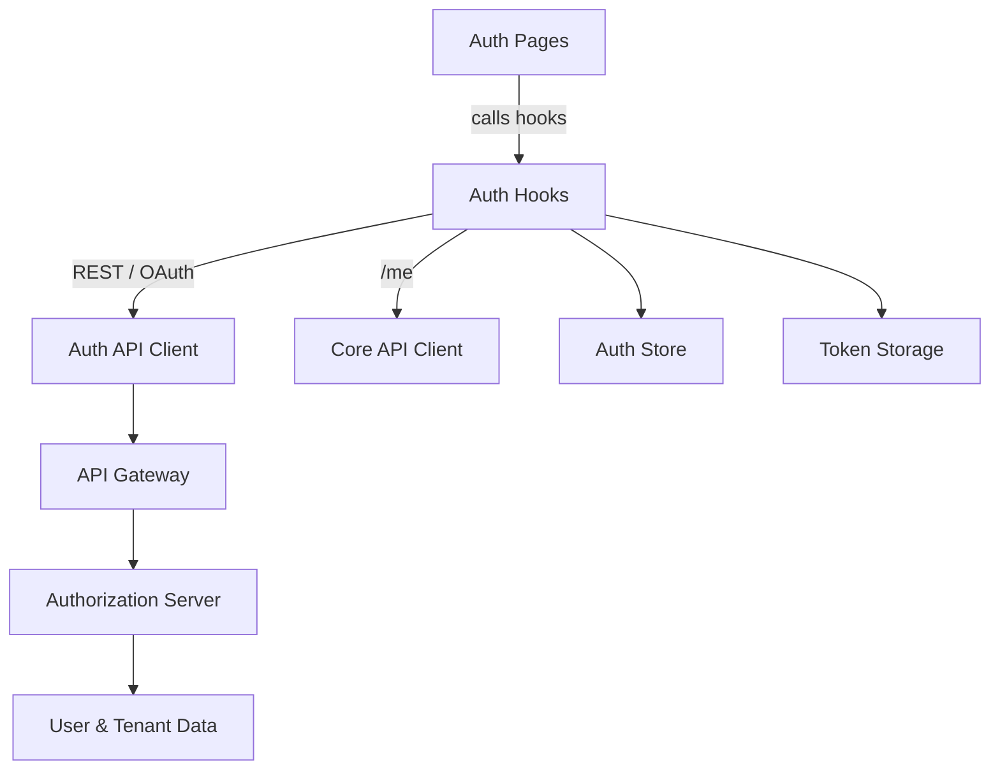

# Frontend Service – Core Auth Hooks

This module contains the **authentication-related React hooks** used by the OpenFrame frontend. These hooks orchestrate tenant discovery, registration, login (password and SSO), invitation-based onboarding, token handling, and session lifecycle management.

They form the **frontend entry point into the OpenFrame authentication and authorization stack**, integrating tightly with backend OAuth, authorization server, gateway, and user profile services.

---

## Purpose and Scope

The `frontend_service_core_auth_hooks` module provides:

- A unified `useAuth` hook that manages the full authentication lifecycle
- Discovery of tenants and available authentication providers
- Support for **SSO-based login and registration** (Google, Microsoft, etc.)
- Invitation-based provider discovery
- Persistent auth state via local storage and in-memory stores
- Periodic session validation and automatic logout handling

This module does **not** implement UI components. Instead, it exposes composable hooks that are consumed by authentication pages and layouts.

---

## High-Level Architecture

**Key idea:** frontend hooks coordinate browser state, backend auth flows, and user experience while delegating security enforcement to backend services.

---

## Core Hooks Overview

### 1. `useAuth`

**File:** `use-auth.ts`

The central authentication hook responsible for:

- Tenant discovery by email
- Organization registration (password and SSO)
- Login via SSO providers
- Session restoration and validation
- Logout and cleanup

➡️ Detailed documentation: [use_auth.md](use_auth.md)

---

### 2. `useInviteProviders`

**File:** `use-invite-providers.ts`

Fetches and exposes the **SSO providers available for a specific invitation**, enabling invitation-based onboarding flows.

➡️ Detailed documentation: [use_invite_providers.md](use_invite_providers.md)

---

### 3. `useRegistrationProviders`

**File:** `use-registration-providers.ts`

Fetches the list of **SSO providers enabled for new tenant registration**.

➡️ Detailed documentation: [use_registration_providers.md](use_registration_providers.md)

---

## How This Module Fits into the Platform

- **Frontend layer:** Provides hooks consumed by auth pages (`/auth/*`)
- **Client integration:** Uses `AuthApiClient` and `ApiClient` from `frontend_service_core_clients`
- **Security integration:** Works with OAuth, PKCE, cookies, and dev tickets
- **Backend alignment:** Mirrors capabilities exposed by authorization and gateway services

This module acts as the **glue between UI and the OpenFrame security model**.

---

## Related Modules (Conceptual)

- Frontend API clients (authentication, gateway routing)
- Authorization server and OAuth services
- Gateway security and token forwarding
- User and tenant data services

Refer to platform documentation for backend service details.
