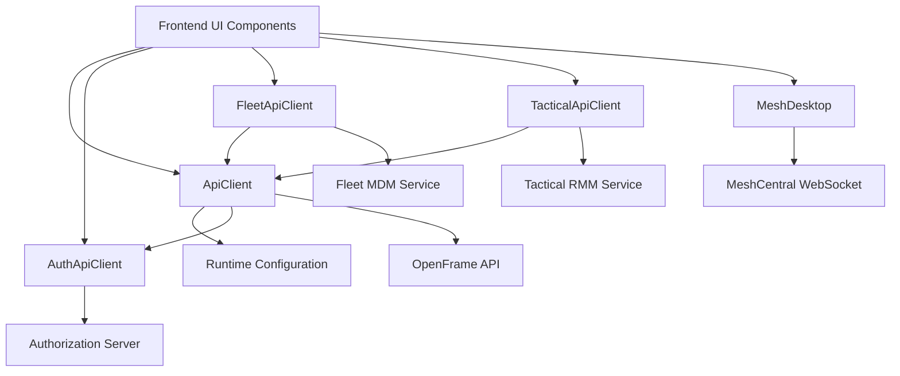

# Frontend Service Core Clients

This module provides **typed, authenticated client-side integrations** used by the OpenFrame frontend to communicate with backend services and embedded tools. It centralizes API access, authentication handling, and rich client-side protocols (such as remote desktop streaming).

The module is consumed by higher-level frontend features (auth hooks, Mingo chat, device management UIs) and abstracts differences between REST, OAuth, and tool-specific APIs.

## Purpose

- Provide a **single, consistent API access layer** for the frontend
- Handle **authentication, token refresh, and logout flows** transparently
- Expose **tool-specific clients** (Fleet, Tactical RMM, MeshCentral)
- Encapsulate complex binary protocols (remote desktop input and rendering)

---

## Architecture Overview

---

## Core Components

### ApiClient

The **ApiClient** is the foundation for all HTTP communication. It handles:

- Automatic inclusion of cookies and bearer tokens
- Transparent access-token refresh on `401 Unauthorized`
- Request queuing during token refresh to prevent race conditions
- Unified error and response handling

See detailed documentation: [ApiClient](api_client.md)

---

### AuthApiClient

The **AuthApiClient** is dedicated to authentication and tenant discovery flows. It manages:

- OAuth login, logout, and refresh flows
- SaaS shared-host vs tenant-host routing
- Registration, invitations, and SSO redirects

See detailed documentation: [AuthApiClient](auth_api_client.md)

---

### FleetApiClient

The **FleetApiClient** extends `ApiClient` to interact with Fleet MDM APIs. It provides typed methods for:

- Policies and queries
- Hosts, teams, labels, and packs
- Running live and scheduled queries

See detailed documentation: [FleetApiClient](fleet_api_client.md)

---

### TacticalApiClient

The **TacticalApiClient** integrates Tactical RMM APIs into the frontend. It supports:

- Agent inspection and management
- Script execution and automation
- Logs, checks, tasks, and system telemetry

See detailed documentation: [TacticalApiClient](tactical_api_client.md)

---

### MeshDesktop

The **MeshDesktop** component implements a full client-side remote desktop stack:

- Canvas-based rendering
- Mouse and keyboard input encoding
- Multi-display handling
- Incremental JPEG tile decoding and drawing

It is protocol-aware and communicates over a WebSocket transport.

See detailed documentation: [MeshDesktop](mesh_desktop.md)

---

## How This Module Fits the System

- Used by frontend feature modules such as authentication hooks and device management UIs
- Acts as the frontend counterpart to backend services exposed via the gateway
- Shields UI components from protocol, authentication, and routing complexity

For backend responsibilities, refer to the platform documentation for API, gateway, and authorization services.
