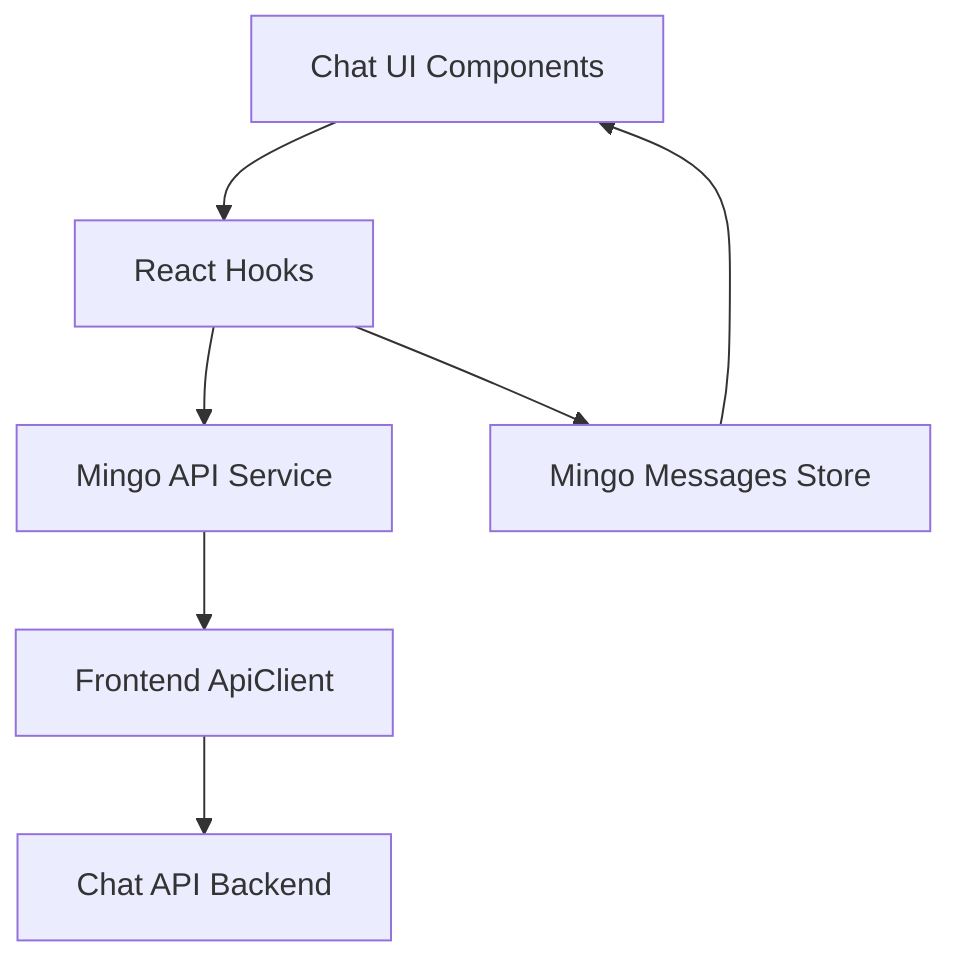
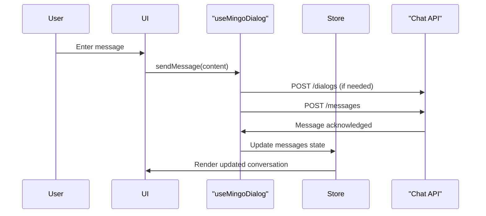

# Frontend Service Core – Mingo Chat

## Overview

The **frontend_service_core_mingo_chat** module implements the client-side chat experience for **Mingo**, Flamingo/OpenFrame’s AI-powered assistant. This module is responsible for:

- Creating and managing chat dialogs
- Sending and streaming messages
- Handling approval workflows inside conversations
- Managing real-time UI state (typing indicators, unread counts, streaming content)
- Providing strongly typed dialog and message models

This module lives entirely in the **OpenFrame frontend** and communicates with backend chat APIs through the shared `ApiClient`. It is designed to be reactive, resilient to partial failures, and optimized for real-time AI-driven conversations.

---

## High-Level Architecture

### Architectural Roles

- **React Hooks** – Orchestrate dialog lifecycle and message sending
- **API Service** – Encapsulates HTTP mutations for chat-related backend operations
- **State Store** – Centralized, dialog-scoped message and streaming state
- **Types** – Strong typing for dialogs, messages, and GraphQL responses

---

## Module Composition

The module is split into four logical sub-modules:

1. **Hooks** – Dialog creation and message orchestration
2. **Services** – API-layer abstractions using React Query
3. **Stores** – Zustand-based state management for messages
4. **Types** – Dialog and message domain models

Each sub-module is documented separately for clarity.

---

## Sub-Module Documentation

- [Mingo Dialog Hook](Mingo Dialog Hook.md)
- [Mingo API Service](Mingo API Service.md)
- [Mingo Messages Store](Mingo Messages Store.md)
- [Mingo Dialog and Message Types](Mingo Types.md)

---

## Data Flow Overview

---

## Integration Points

- **Frontend API Clients**: Uses the shared `ApiClient` from `frontend_service_core_clients`
- **Backend Services**: Communicates with Chat REST endpoints exposed by OpenFrame backend services
- **UI Components**: Consumed by chat panels, drawers, and AI assistant views

---

## Design Principles

- **Dialog-centric state**: All messages and streaming state are scoped by dialog ID
- **Optimistic UX**: UI remains responsive during async operations
- **Typed boundaries**: Strong TypeScript interfaces for all network and store interactions
- **Extensible message content**: Supports text, tool execution, and approval requests

---

## Summary

The **frontend_service_core_mingo_chat** module is the backbone of the Mingo AI chat experience in OpenFrame. It cleanly separates concerns between orchestration, API access, and state management while enabling advanced AI-driven features such as streaming responses and approval workflows.

For implementation details, refer to the individual sub-module documentation linked above.