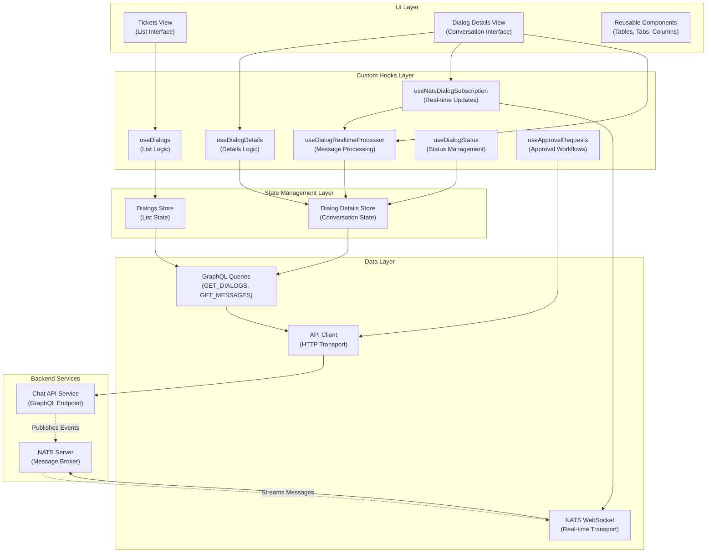
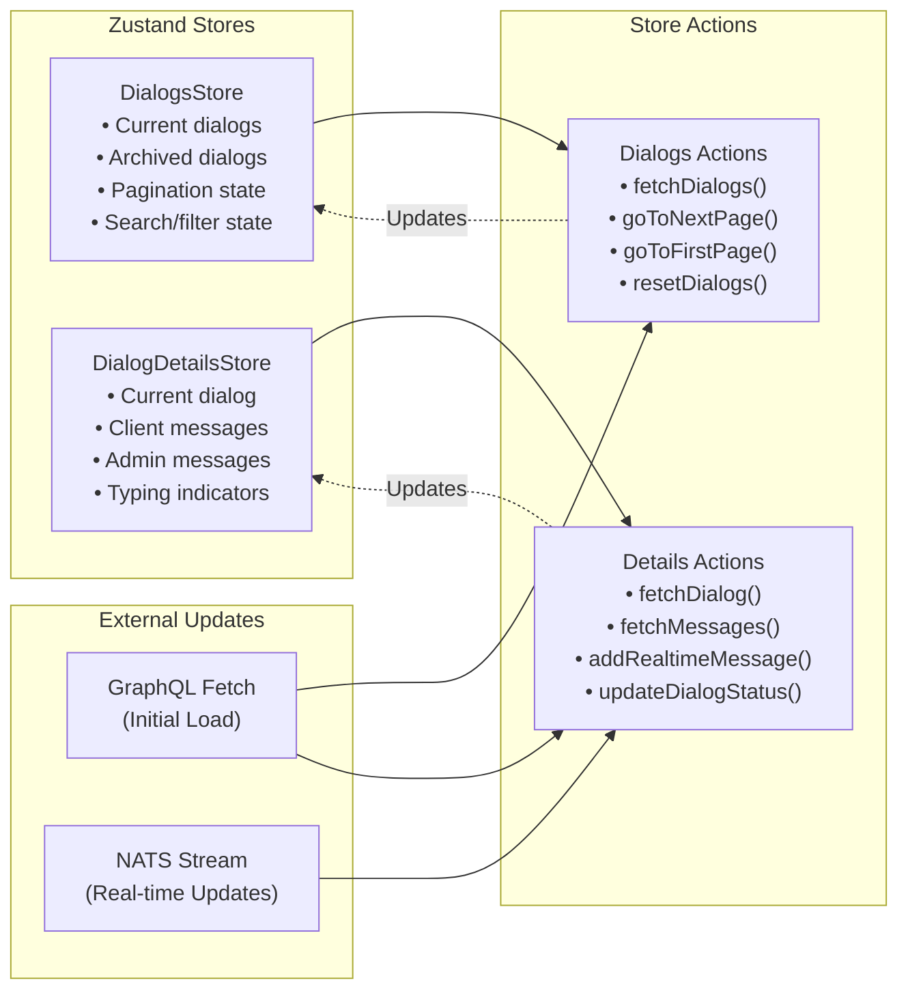
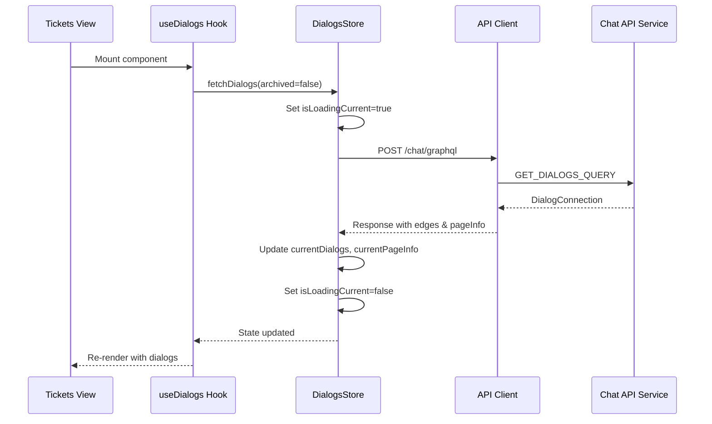
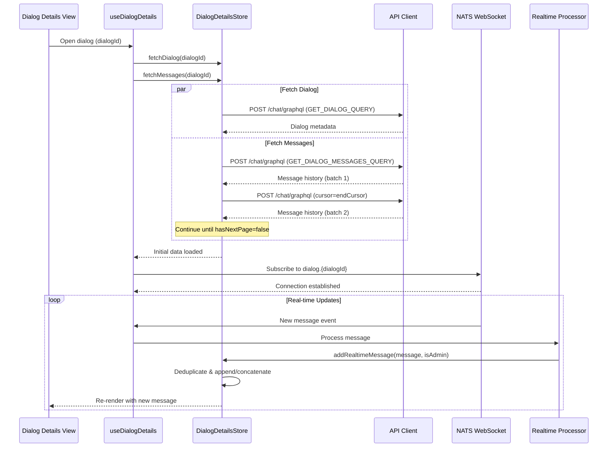
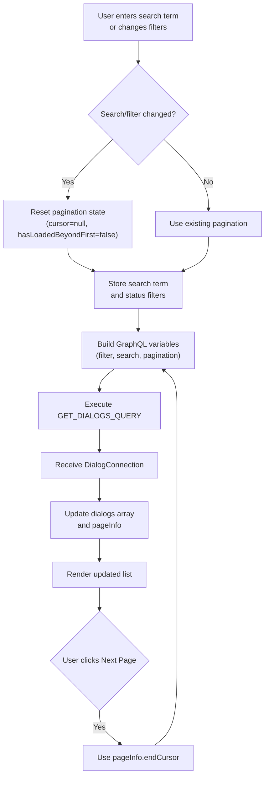
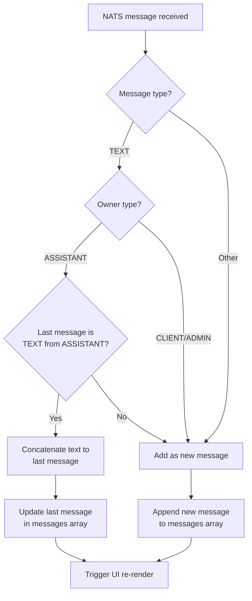
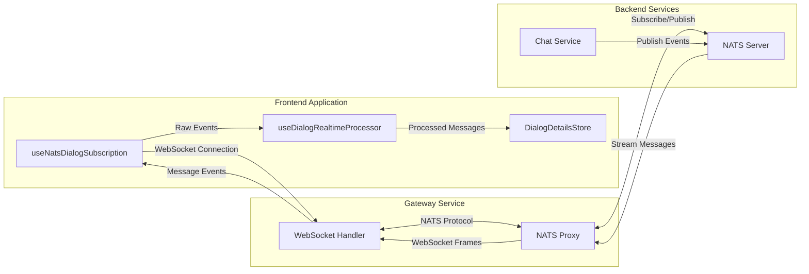

# Frontend Support Tickets Module

## Overview

The **Frontend Support Tickets** module provides a comprehensive client-side interface for managing IT support dialogs (tickets) within the OpenFrame platform. Built with React, TypeScript, and Zustand for state management, this module enables MSP technicians and administrators to view, track, and interact with support conversations initiated by end-user clients through the Fae AI assistant.

This module serves as the administrative interface for the support ticket system, complementing the [Mingo AI Assistant](mingo_ai_assistant.md) module which provides the technician-facing AI chat interface. Together, they form OpenFrame's intelligent support ticket management system.

**Key Capabilities:**
- Real-time support dialog management with live updates via NATS messaging
- Dual-chat interface: client conversations and admin AI assistance
- Advanced filtering, search, and pagination for ticket lists
- Status lifecycle management (Active → Action Required → On Hold → Resolved → Archived)
- Message streaming with cursor-based pagination
- Tool execution tracking and approval workflows
- GraphQL-based data fetching with optimistic updates

---

## Architecture Overview

### High-Level Component Architecture



### State Management Architecture



---

## Core Components

### 1. DialogsStore (List Management)

**Purpose:** Manages the state for dialog lists, including current (active) and archived tickets with pagination, search, and filtering capabilities.

**Location:** `openframe/services/openframe-frontend/src/app/tickets/stores/dialogs-store.ts`

**Key Responsibilities:**
- Maintain separate state for current and archived dialog lists
- Handle cursor-based pagination with GraphQL connections
- Manage search term and status filter state
- Coordinate GraphQL queries for dialog fetching
- Track loading and error states independently for each list

**State Structure:**

```typescript
interface DialogsStore {
  // Current (Active) Dialogs
  currentDialogs: Dialog[]
  currentPageInfo: CursorPageInfo | null
  currentHasLoadedBeyondFirst: boolean
  isLoadingCurrent: boolean
  currentError: string | null
  hasLoadedCurrent: boolean
  currentSearchTerm?: string
  currentStatusFilters?: string[]
  
  // Archived Dialogs
  archivedDialogs: Dialog[]
  archivedPageInfo: CursorPageInfo | null
  archivedHasLoadedBeyondFirst: boolean
  isLoadingArchived: boolean
  archivedError: string | null
  hasLoadedArchived: boolean
  archivedSearchTerm?: string
  archivedStatusFilters?: string[]
  
  // Actions
  fetchDialogs: (archived: boolean, searchParam?: string, force?: boolean, 
                 cursor?: string | null, statusFilters?: string[]) => Promise<void>
  goToNextPage: (archived: boolean) => Promise<void>
  goToFirstPage: (archived: boolean) => Promise<void>
  resetCurrentDialogs: () => void
  resetArchivedDialogs: () => void
}
```

**Key Features:**

1. **Dual List Management:** Maintains completely separate state for current and archived dialogs, allowing independent pagination and filtering.

2. **Smart Pagination Reset:** Automatically resets pagination when search terms or status filters change:
   ```typescript
   const isNewSearch = searchParam !== undefined && 
                       normalizedSearchParam !== normalizedCurrentSearch
   const filtersChanged = statusFilters !== undefined && 
                          JSON.stringify(statusFilters) !== JSON.stringify(currentFilters)
   const shouldResetPagination = isNewSearch || filtersChanged
   ```

3. **Status Filter Defaults:**
   - **Current dialogs:** `['ACTIVE', 'ACTION_REQUIRED', 'ON_HOLD', 'RESOLVED']`
   - **Archived dialogs:** `['ARCHIVED']`
   - **Custom filters:** Override defaults when explicitly provided

4. **Cursor-Based Pagination:** Uses GraphQL cursor pagination for efficient large dataset handling:
   ```typescript
   const paginationVars: any = { limit: 10 }
   if (cursor) {
     paginationVars.cursor = cursor
   }
   ```

**GraphQL Integration:**

```typescript
const response = await apiClient.post<GraphQLResponse<DialogsResponse>>(
  '/chat/graphql',
  {
    query: GET_DIALOGS_QUERY,
    variables: {
      filter: { statuses, agentTypes: ['CLIENT'] },
      pagination: paginationVars,
      search: effectiveSearchParam || undefined,
      slaSort: 'ASC'
    }
  }
)
```

**Usage Example:**

```typescript
import { useDialogsStore } from '@/app/tickets/stores/dialogs-store'

function TicketsList() {
  const { 
    currentDialogs, 
    isLoadingCurrent, 
    fetchDialogs,
    goToNextPage 
  } = useDialogsStore()
  
  useEffect(() => {
    fetchDialogs(false) // Fetch current dialogs
  }, [])
  
  return (
    <div>
      {currentDialogs.map(dialog => (
        <DialogCard key={dialog.id} dialog={dialog} />
      ))}
      <button onClick={() => goToNextPage(false)}>Next Page</button>
    </div>
  )
}
```

---

### 2. DialogDetailsStore (Conversation Management)

**Purpose:** Manages the state for individual dialog details, including the dialog metadata, message history (both client and admin chats), and real-time updates.

**Location:** `openframe/services/openframe-frontend/src/app/tickets/stores/dialog-details-store.ts`

**Key Responsibilities:**
- Load and cache individual dialog details
- Fetch and paginate message history with cursor-based pagination
- Maintain separate message streams for client chat and admin AI chat
- Handle real-time message updates via NATS
- Manage typing indicators for both client and admin chats
- Implement message deduplication and streaming concatenation

**State Structure:**

```typescript
interface DialogDetailsStore {
  // Current Dialog State
  currentDialogId: string | null
  currentDialog: Dialog | null
  currentMessages: Message[]      // Client chat messages
  adminMessages: Message[]        // Admin AI chat messages
  
  // Loading States
  isLoadingDialog: boolean
  isLoadingMessages: boolean
  loadingDialogId: string | null
  loadingMessagesId: string | null
  
  // Error States
  dialogError: string | null
  messagesError: string | null
  
  // Pagination
  hasMoreMessages: boolean
  messagesCursor: string | null
  newestMessageCursor: string | null
  
  // Typing Indicators
  isClientChatTyping: boolean
  isAdminChatTyping: boolean
  
  // Actions
  fetchDialog: (dialogId: string) => Promise<Dialog | null>
  fetchMessages: (dialogId: string, append?: boolean, pollNew?: boolean) => Promise<void>
  loadMore: () => Promise<void>
  clearCurrent: () => void
  updateDialogStatus: (status: string) => void
  addRealtimeMessage: (message: Message, isAdmin: boolean) => void
  setTypingIndicator: (isAdmin: boolean, typing: boolean) => void
}
```

**Key Features:**

1. **Dual Message Streams:** Separates client-facing messages from admin AI assistance messages:
   ```typescript
   const clientMessages = newMessages.filter(m => m.chatType === 'CLIENT_CHAT')
   const adminMessages = newMessages.filter(m => m.chatType === 'ADMIN_AI_CHAT')
   ```

2. **Batch Message Loading:** Fetches all historical messages in batches of 100 until no more pages exist:
   ```typescript
   while (hasNextPage) {
     const response = await apiClient.post('/chat/graphql', {
       query: GET_DIALOG_MESSAGES_QUERY,
       variables: { dialogId, cursor: currentCursor, limit: 100 }
     })
     // Accumulate messages...
     hasNextPage = connection?.pageInfo?.hasNextPage || false
     currentCursor = connection?.pageInfo?.endCursor || null
   }
   ```

3. **Real-time Message Streaming:** Handles streaming text messages from AI assistants by concatenating consecutive text chunks:
   ```typescript
   const isTextMessage = message.messageData?.type === TEXT_TYPE
   const isAssistantOwner = message.owner?.type === ASSISTANT_TYPE
   
   if (isTextMessage && messages.length > 0 && isAssistantOwner) {
     const lastMessage = messages[messages.length - 1]
     if (lastIsText && lastIsAssistant) {
       // Concatenate text to last message
       updatedMessages[updatedMessages.length - 1] = {
         ...lastMessage,
         messageData: {
           ...lastMessage.messageData,
           text: (lastMessageData.text || '') + (messageData.text || '')
         }
       }
     }
   }
   ```

4. **Message Deduplication:** Prevents duplicate messages when polling for new messages:
   ```typescript
   const existingClientIds = new Set(s.currentMessages.map(m => m.id))
   const uniqueNewClient = clientMessages.filter(m => !existingClientIds.has(m.id))
   ```

5. **Polling for New Messages:** Supports polling mode to fetch only new messages since the last known cursor:
   ```typescript
   if (pollNew) {
     const response = await apiClient.post('/chat/graphql', {
       query: GET_DIALOG_MESSAGES_QUERY,
       variables: {
         dialogId,
         cursor: state.newestMessageCursor, // Fetch only newer messages
         limit: 10
       }
     })
   }
   ```

**Message Types Supported:**

| Type | Description | Data Structure |
|------|-------------|----------------|
| `TEXT` | Standard text messages | `{ text: string }` |
| `ERROR` | Error messages | `{ error: string, details?: string }` |
| `EXECUTING_TOOL` | Tool execution in progress | `{ integratedToolType, toolFunction, parameters, requiresApproval }` |
| `EXECUTED_TOOL` | Tool execution completed | `{ integratedToolType, toolFunction, result, success }` |
| `APPROVAL_REQUEST` | Approval required for action | `{ approvalRequestId, approvalType, command, explanation }` |
| `APPROVAL_RESULT` | Approval decision result | `{ approvalRequestId, approved, approvalType }` |

**Usage Example:**

```typescript
import { useDialogDetailsStore } from '@/app/tickets/stores/dialog-details-store'

function DialogView({ dialogId }: { dialogId: string }) {
  const { 
    currentDialog,
    currentMessages,
    adminMessages,
    fetchDialog,
    fetchMessages,
    addRealtimeMessage
  } = useDialogDetailsStore()
  
  useEffect(() => {
    fetchDialog(dialogId)
    fetchMessages(dialogId)
  }, [dialogId])
  
  // Handle real-time message
  const handleNatsMessage = (message: Message, isAdmin: boolean) => {
    addRealtimeMessage(message, isAdmin)
  }
  
  return (
    <div>
      <h1>{currentDialog?.title}</h1>
      <ClientChat messages={currentMessages} />
      <AdminChat messages={adminMessages} />
    </div>
  )
}
```

---

## Data Flow Patterns

### 1. Initial Dialog List Load



### 2. Dialog Details with Real-time Updates



### 3. Search and Filter Flow



### 4. Message Streaming and Concatenation



---

## GraphQL Queries

### GET_DIALOGS_QUERY

**Purpose:** Fetch paginated list of dialogs with filtering and search capabilities.

**Query:**

```graphql
query GetDialogs($filter: DialogFilterInput, $pagination: CursorPaginationInput, $search: String) {
  dialogs(filter: $filter, pagination: $pagination, search: $search) {
    edges {
      cursor
      node {
        id
        title
        status
        owner {
          ... on ClientDialogOwner {
            machineId
            machine {
              id
              machineId
              hostname
              organizationId
            }
          }
        }
        createdAt
        statusUpdatedAt
        resolvedAt
        aiResolutionSuggestedAt
        rating {
          id
          dialogId
          createdAt
        }
      }
    }
    pageInfo {
      hasNextPage
      hasPreviousPage
      startCursor
      endCursor
    }
  }
}
```

**Variables:**

```typescript
{
  filter: {
    statuses: ['ACTIVE', 'ACTION_REQUIRED', 'ON_HOLD', 'RESOLVED'],
    agentTypes: ['CLIENT']
  },
  pagination: {
    cursor?: string,
    limit: 10
  },
  search?: string,
  slaSort: 'ASC'
}
```

**Response Structure:**

```typescript
interface DialogsResponse {
  dialogs: {
    edges: Array<{
      cursor: string
      node: Dialog
    }>
    pageInfo: {
      hasNextPage: boolean
      hasPreviousPage: boolean
      startCursor: string | null
      endCursor: string | null
    }
  }
}
```

---

### GET_DIALOG_QUERY

**Purpose:** Fetch detailed information for a single dialog.

**Query:**

```graphql
query GetDialog($id: ID!) {
  dialog(id: $id) {
    id
    title
    status
    owner {
      ... on ClientDialogOwner {
        machineId
        machine {
          id
          machineId
          hostname
        }
      }
    }
    createdAt
    statusUpdatedAt
    resolvedAt
    aiResolutionSuggestedAt
    rating {
      id
      dialogId
      createdAt
    }
  }
}
```

---

### GET_DIALOG_MESSAGES_QUERY

**Purpose:** Fetch paginated message history for a dialog with support for multiple message types.

**Query:**

```graphql
query GetAllMessages($dialogId: ID!, $cursor: String, $limit: Int) {
  messages(
    dialogId: $dialogId
    pagination: { cursor: $cursor, limit: $limit }
  ) {
    edges {
      cursor
      node {
        id
        dialogId
        chatType
        dialogMode
        createdAt
        owner {
          type
        }
        messageData {
          type
          ... on TextData {
            text
          }
          ... on ExecutingToolData {
            type
            integratedToolType
            toolFunction
            parameters
            requiresApproval
            approvalStatus
          }
          ... on ExecutedToolData {
            type
            integratedToolType
            toolFunction
            result
            success
            requiredApproval
            approvalStatus
          }
          ... on ApprovalRequestData {
            type  
            approvalRequestId
            approvalType
            command
            explanation
          }
          ... on ApprovalResultData {
            type
            approvalRequestId
            approved
            approvalType
          }
          ... on ErrorData {
            error
            details
          }
        }
      }
    }
    pageInfo {
      hasNextPage
      hasPreviousPage
      startCursor
      endCursor
    }
  }
}
```

**Variables:**

```typescript
{
  dialogId: string,
  cursor?: string,
  limit: number  // 100 for batch loading, 10 for polling
}
```

---

## Real-time Communication

### NATS WebSocket Integration

The module uses NATS WebSocket for real-time message streaming, enabling live updates without polling.

**Connection Architecture:**



**Subscription Topics:**

| Topic | Description | Payload Type |
|-------|-------------|--------------|
| `message` | Client chat messages | `Message` |
| `admin-message` | Admin AI chat messages | `Message` |

**Connection Configuration:**

```typescript
const clientConfig = {
  name: 'openframe-frontend-mingo',
  user: 'machine',
  pass: '',
}

const getNatsWsUrl = (): string | null => {
  if (!apiBaseUrl) return null
  
  return buildNatsWsUrl(apiBaseUrl, {
    token: token || undefined,
    includeAuthParam: isDevTicketEnabled,
  })
}
```

**Event Processing Flow:**

```typescript
// 1. Subscribe to dialog-specific topics
useNatsDialogSubscription({
  enabled: true,
  dialogId: currentDialogId,
  onEvent: (payload, messageType) => {
    // 2. Process incoming message
    const message = payload as Message
    const isAdmin = messageType === 'admin-message'
    
    // 3. Add to appropriate message stream
    addRealtimeMessage(message, isAdmin)
  },
  onConnect: () => console.log('NATS connected'),
  onDisconnect: () => console.log('NATS disconnected'),
})
```

**Message Deduplication:**

Real-time messages are deduplicated against existing messages to prevent duplicates when messages arrive via both NATS and GraphQL polling:

```typescript
const existingIds = new Set(messages.map((m) => m.id))
if (existingIds.has(message.id)) return messages
```

---

## Type Definitions

### Dialog Types

```typescript
type DialogStatus =
  | 'ACTIVE'           // New or ongoing conversation
  | 'ACTION_REQUIRED'  // Requires technician action
  | 'ON_HOLD'          // Waiting for external dependency
  | 'RESOLVED'         // Issue resolved, awaiting archive
  | 'ARCHIVED'         // Closed and archived

interface Dialog {
  id: string
  title: string
  status: DialogStatus
  owner: ClientDialogOwner | DialogOwner
  createdAt: string
  statusUpdatedAt?: string | null
  resolvedAt?: string | null
  aiResolutionSuggestedAt?: string | null
  rating?: DialogRating | null
}

interface ClientDialogOwner extends DialogOwner {
  machineId: string
  machine?: Machine
}

interface Machine {
  id: string
  machineId: string
  displayName?: string
  hostname?: string
  organizationId?: string
}

interface DialogRating {
  id: string
  dialogId: string
  rating: number
  createdAt: string
}
```

### Message Types

```typescript
type MessageOwnerType = 'CLIENT' | 'ASSISTANT' | 'ADMIN'
type ChatType = 'CLIENT_CHAT' | 'ADMIN_AI_CHAT'
type MessageDataType = 
  | 'TEXT' 
  | 'ERROR' 
  | 'EXECUTING_TOOL' 
  | 'EXECUTED_TOOL' 
  | 'APPROVAL_REQUEST' 
  | 'APPROVAL_RESULT'

interface Message {
  id: string
  dialogId: string
  chatType: ChatType
  dialogMode: DialogMode
  createdAt: string
  owner: ClientOwner | AssistantOwner | AdminOwner | MessageOwner
  messageData: TextData | ErrorData | ExecutingToolData | 
                ExecutedToolData | ApprovalRequestData | 
                ApprovalResultData | MessageData
}

interface ClientOwner extends MessageOwner {
  machineId: string
}

interface AssistantOwner extends MessageOwner {
  model: string
}

interface AdminOwner extends MessageOwner {
  userId: string
  user?: { id: string }
}

// Message Data Types
interface TextData extends MessageData {
  text: string
}

interface ErrorData extends MessageData {
  error: string
  details?: string
}

interface ExecutingToolData extends MessageData {
  type: 'EXECUTING_TOOL'
  integratedToolType: string
  toolFunction: string
  parameters?: Record<string, any>
  requiresApproval?: boolean
  approvalStatus?: string
}

interface ExecutedToolData extends MessageData {
  type: 'EXECUTED_TOOL'
  integratedToolType: string
  toolFunction: string
  result?: string
  success?: boolean
  requiredApproval?: boolean
  approvalStatus?: string
}

interface ApprovalRequestData extends MessageData {
  type: 'APPROVAL_REQUEST'
  approvalRequestId: string
  approvalType: string
  command: string
  explanation: string
}

interface ApprovalResultData extends MessageData {
  type: 'APPROVAL_RESULT'
  approvalRequestId: string
  approved: boolean
  approvalType: string
  command?: string
  description?: string
  risk?: string
  details?: any
}
```

### Pagination Types

```typescript
interface CursorPageInfo {
  hasNextPage: boolean
  hasPreviousPage: boolean
  startCursor?: string | null
  endCursor?: string | null
}

interface DialogEdge {
  cursor: string
  node: Dialog
}

interface DialogConnection {
  edges: DialogEdge[]
  pageInfo: CursorPageInfo
}

interface MessageEdge {
  cursor: string
  node: Message
}

interface MessageConnection {
  edges: MessageEdge[]
  pageInfo: CursorPageInfo
}
```

---

## Constants and Configuration

### Dialog and Message Constants

```typescript
// Dialog Status Constants
export const DIALOG_STATUS = {
  ON_HOLD: 'ON_HOLD',
  RESOLVED: 'RESOLVED',
  ACTIVE: 'ACTIVE',
} as const

// Chat Type Constants
export const CHAT_TYPE = {
  CLIENT: 'CLIENT_CHAT',
  ADMIN: 'ADMIN_AI_CHAT',
} as const

// Message Type Constants
export const MESSAGE_TYPE = {
  TEXT: 'TEXT',
  EXECUTING_TOOL: 'EXECUTING_TOOL',
  EXECUTED_TOOL: 'EXECUTED_TOOL',
  APPROVAL_REQUEST: 'APPROVAL_REQUEST',
  APPROVAL_RESULT: 'APPROVAL_RESULT',
  ERROR: 'ERROR',
  MESSAGE_START: 'MESSAGE_START',
  MESSAGE_END: 'MESSAGE_END',
  MESSAGE_REQUEST: 'MESSAGE_REQUEST',
} as const

// Owner Type Constants
export const OWNER_TYPE = {
  CLIENT: 'CLIENT',
  ADMIN: 'ADMIN',
  ASSISTANT: 'ASSISTANT',
} as const

// Approval Status Constants
export const APPROVAL_STATUS = {
  PENDING: 'pending',
  APPROVED: 'approved',
  REJECTED: 'rejected',
} as const
```

### Assistant Configuration

```typescript
export const ASSISTANT_CONFIG = {
  FAE: {
    type: 'fae' as const,
    name: 'Fae',
  },
  MINGO: {
    type: 'mingo' as const,
    name: 'Mingo',
  },
} as const
```

### API Endpoints

```typescript
export const API_ENDPOINTS = {
  APPROVAL_REQUEST: '/chat/api/v1/approval-requests',
  SEND_MESSAGE: '/chat/api/v2/messages',
  DIALOG_CHUNKS: '/chat/api/v1/dialogs',
} as const
```

### NATS Topics

```typescript
export const NATS_TOPICS = {
  MESSAGE: 'message',
  ADMIN_MESSAGE: 'admin-message',
} as const
```

### Network Configuration

```typescript
export const NETWORK_CONFIG = {
  SHARED_CLOSE_DELAY_MS: 3000,
  CONNECT_TIMEOUT_MS: 10_000,
  RECONNECT_TIME_WAIT_MS: 2000,
  PING_INTERVAL_MS: 30_000,
  MAX_PING_OUT: 3,
  DEFAULT_MESSAGE_LIMIT: 50,
  POLL_MESSAGE_LIMIT: 10,
} as const
```

---

## Integration Points

### 1. API Client Integration

The module uses the centralized API client for all HTTP requests. See [Frontend API Clients](frontend_api_clients.md) for details.

```typescript
import { apiClient } from '@lib/api-client'

const response = await apiClient.post<GraphQLResponse<DialogsResponse>>(
  '/chat/graphql',
  {
    query: GET_DIALOGS_QUERY,
    variables: { filter, pagination, search }
  }
)
```

### 2. Authentication Integration

Leverages the authentication system for user context and access tokens. See [Frontend Authentication](frontend_authentication.md) for details.

```typescript
import { STORAGE_KEYS } from '../constants'

function getAccessToken(): string | null {
  if (typeof window === 'undefined') return null
  try {
    return localStorage.getItem(STORAGE_KEYS.ACCESS_TOKEN) || null
  } catch {
    return null
  }
}
```

### 3. Device Management Integration

Dialog owners are linked to machines/devices. See [Frontend Device Management](frontend_device_management.md) for device data structures.

```typescript
interface ClientDialogOwner extends DialogOwner {
  machineId: string
  machine?: Machine  // Device information
}
```

### 4. Mingo AI Integration

The admin AI chat functionality integrates with the Mingo AI assistant. See [Mingo AI Assistant](mingo_ai_assistant.md) for AI capabilities.

```typescript
// Admin messages are processed by Mingo AI
const adminMessages = messages.filter(m => m.chatType === 'ADMIN_AI_CHAT')
```

### 5. Frontend Core Components

Uses shared UI components from the core library. See [Frontend Core Components](frontend_core_components.md) for reusable components.

```typescript
import { ChatContainer } from '@flamingo-stack/openframe-frontend-core'
```

---

## Usage Examples

### Example 1: Fetching and Displaying Dialog List

```typescript
import { useEffect } from 'react'
import { useDialogsStore } from '@/app/tickets/stores/dialogs-store'

function TicketsListView() {
  const {
    currentDialogs,
    isLoadingCurrent,
    currentError,
    currentPageInfo,
    fetchDialogs,
    goToNextPage,
    goToFirstPage
  } = useDialogsStore()
  
  useEffect(() => {
    // Fetch current (non-archived) dialogs on mount
    fetchDialogs(false)
  }, [fetchDialogs])
  
  if (isLoadingCurrent) return <LoadingSpinner />
  if (currentError) return <ErrorMessage error={currentError} />
  
  return (
    <div>
      <h1>Support Tickets</h1>
      <table>
        <thead>
          <tr>
            <th>Title</th>
            <th>Status</th>
            <th>Machine</th>
            <th>Created</th>
          </tr>
        </thead>
        <tbody>
          {currentDialogs.map(dialog => (
            <tr key={dialog.id}>
              <td>{dialog.title}</td>
              <td>{dialog.status}</td>
              <td>{dialog.owner.machine?.hostname}</td>
              <td>{new Date(dialog.createdAt).toLocaleString()}</td>
            </tr>
          ))}
        </tbody>
      </table>
      
      <div>
        {currentPageInfo?.hasPreviousPage && (
          <button onClick={() => goToFirstPage(false)}>First Page</button>
        )}
        {currentPageInfo?.hasNextPage && (
          <button onClick={() => goToNextPage(false)}>Next Page</button>
        )}
      </div>
    </div>
  )
}
```

### Example 2: Dialog Details with Real-time Updates

```typescript
import { useEffect } from 'react'
import { useDialogDetailsStore } from '@/app/tickets/stores/dialog-details-store'
import { useNatsDialogSubscription } from '@/app/tickets/hooks/use-nats-dialog-subscription'

function DialogDetailsView({ dialogId }: { dialogId: string }) {
  const {
    currentDialog,
    currentMessages,
    adminMessages,
    isLoadingDialog,
    isLoadingMessages,
    fetchDialog,
    fetchMessages,
    addRealtimeMessage,
    setTypingIndicator
  } = useDialogDetailsStore()
  
  // Fetch initial data
  useEffect(() => {
    fetchDialog(dialogId)
    fetchMessages(dialogId)
  }, [dialogId, fetchDialog, fetchMessages])
  
  // Subscribe to real-time updates
  useNatsDialogSubscription({
    enabled: true,
    dialogId,
    onEvent: (payload, messageType) => {
      const message = payload as Message
      const isAdmin = messageType === 'admin-message'
      
      if (message.messageData.type === 'MESSAGE_START') {
        setTypingIndicator(isAdmin, true)
      } else if (message.messageData.type === 'MESSAGE_END') {
        setTypingIndicator(isAdmin, false)
      } else {
        addRealtimeMessage(message, isAdmin)
      }
    },
    onConnect: () => console.log('Connected to real-time updates'),
    onDisconnect: () => console.log('Disconnected from real-time updates')
  })
  
  if (isLoadingDialog || isLoadingMessages) return <LoadingSpinner />
  
  return (
    <div className="dialog-details">
      <header>
        <h1>{currentDialog?.title}</h1>
        <span className={`status-badge ${currentDialog?.status}`}>
          {currentDialog?.status}
        </span>
      </header>
      
      <div className="chat-container">
        <div className="client-chat">
          <h2>Client Conversation</h2>
          <MessageList messages={currentMessages} />
        </div>
        
        <div className="admin-chat">
          <h2>Admin AI Assistance</h2>
          <MessageList messages={adminMessages} />
        </div>
      </div>
    </div>
  )
}
```

### Example 3: Searching and Filtering Dialogs

```typescript
import { useState } from 'react'
import { useDialogsStore } from '@/app/tickets/stores/dialogs-store'

function TicketsSearchView() {
  const [searchTerm, setSearchTerm] = useState('')
  const [selectedStatuses, setSelectedStatuses] = useState<string[]>([])
  
  const { fetchDialogs, currentDialogs, isLoadingCurrent } = useDialogsStore()
  
  const handleSearch = () => {
    fetchDialogs(
      false,              // Not archived
      searchTerm,         // Search term
      true,               // Force refresh
      null,               // Reset cursor
      selectedStatuses.length > 0 ? selectedStatuses : undefined
    )
  }
  
  const handleStatusToggle = (status: string) => {
    setSelectedStatuses(prev =>
      prev.includes(status)
        ? prev.filter(s => s !== status)
        : [...prev, status]
    )
  }
  
  return (
    <div>
      <div className="search-controls">
        <input
          type="text"
          value={searchTerm}
          onChange={(e) => setSearchTerm(e.target.value)}
          placeholder="Search tickets..."
        />
        <button onClick={handleSearch}>Search</button>
      </div>
      
      <div className="status-filters">
        {['ACTIVE', 'ACTION_REQUIRED', 'ON_HOLD', 'RESOLVED'].map(status => (
          <label key={status}>
            <input
              type="checkbox"
              checked={selectedStatuses.includes(status)}
              onChange={() => handleStatusToggle(status)}
            />
            {status}
          </label>
        ))}
      </div>
      
      {isLoadingCurrent ? (
        <LoadingSpinner />
      ) : (
        <DialogList dialogs={currentDialogs} />
      )}
    </div>
  )
}
```

### Example 4: Handling Tool Execution Messages

```typescript
import { Message, ExecutingToolData, ExecutedToolData } from '@/app/tickets/types/dialog.types'

function MessageRenderer({ message }: { message: Message }) {
  const renderMessageContent = () => {
    switch (message.messageData.type) {
      case 'TEXT':
        return <p>{(message.messageData as TextData).text}</p>
      
      case 'EXECUTING_TOOL':
        const executing = message.messageData as ExecutingToolData
        return (
          <div className="tool-executing">
            <span className="spinner" />
            <p>Executing {executing.toolFunction}...</p>
            {executing.requiresApproval && (
              <span className="approval-badge">Requires Approval</span>
            )}
          </div>
        )
      
      case 'EXECUTED_TOOL':
        const executed = message.messageData as ExecutedToolData
        return (
          <div className={`tool-executed ${executed.success ? 'success' : 'failure'}`}>
            <p>
              {executed.success ? '✓' : '✗'} 
              {executed.toolFunction} completed
            </p>
            {executed.result && <pre>{executed.result}</pre>}
          </div>
        )
      
      case 'APPROVAL_REQUEST':
        const approval = message.messageData as ApprovalRequestData
        return (
          <div className="approval-request">
            <h4>Approval Required</h4>
            <p>{approval.explanation}</p>
            <code>{approval.command}</code>
            <ApprovalButtons approvalRequestId={approval.approvalRequestId} />
          </div>
        )
      
      case 'ERROR':
        const error = message.messageData as ErrorData
        return (
          <div className="error-message">
            <p>Error: {error.error}</p>
            {error.details && <pre>{error.details}</pre>}
          </div>
        )
      
      default:
        return <p>Unknown message type</p>
    }
  }
  
  return (
    <div className={`message ${message.owner.type.toLowerCase()}`}>
      <div className="message-header">
        <span className="owner">{message.owner.type}</span>
        <span className="timestamp">
          {new Date(message.createdAt).toLocaleTimeString()}
        </span>
      </div>
      <div className="message-content">
        {renderMessageContent()}
      </div>
    </div>
  )
}
```

---

## Performance Considerations

### 1. Batch Message Loading

The store fetches all historical messages in batches of 100 to minimize round trips:

```typescript
// Efficient batch loading
while (hasNextPage) {
  const response = await apiClient.post('/chat/graphql', {
    query: GET_DIALOG_MESSAGES_QUERY,
    variables: { dialogId, cursor: currentCursor, limit: 100 }
  })
  allMessages = [...allMessages, ...batchMessages]
  hasNextPage = connection?.pageInfo?.hasNextPage || false
  currentCursor = connection?.pageInfo?.endCursor || null
}
```

**Benefits:**
- Reduces number of HTTP requests
- Loads complete conversation history quickly
- Minimizes UI loading states

### 2. Message Deduplication

Prevents duplicate messages when receiving updates from multiple sources:

```typescript
const existingIds = new Set(messages.map(m => m.id))
const uniqueNew = newMessages.filter(m => !existingIds.has(m.id))
```

**Benefits:**
- Prevents duplicate rendering
- Reduces memory usage
- Maintains data consistency

### 3. Streaming Text Concatenation

Optimizes AI assistant streaming by concatenating consecutive text chunks:

```typescript
if (isTextMessage && lastIsText && lastIsAssistant) {
  // Update existing message instead of creating new one
  updatedMessages[updatedMessages.length - 1] = {
    ...lastMessage,
    messageData: {
      ...lastMessage.messageData,
      text: lastText + newText
    }
  }
}
```

**Benefits:**
- Reduces number of message objects
- Smoother streaming animation
- Lower memory footprint

### 4. Separate Loading States

Tracks loading states independently for different operations:

```typescript
interface DialogDetailsStore {
  isLoadingDialog: boolean
  isLoadingMessages: boolean
  loadingDialogId: string | null
  loadingMessagesId: string | null
}
```

**Benefits:**
- Prevents race conditions
- Allows concurrent operations
- Better user experience with granular loading indicators

### 5. Cursor-Based Pagination

Uses GraphQL cursor pagination for efficient large dataset handling:

```typescript
interface CursorPageInfo {
  hasNextPage: boolean
  hasPreviousPage: boolean
  startCursor?: string | null
  endCursor?: string | null
}
```

**Benefits:**
- Consistent pagination even with data changes
- Efficient database queries
- Scalable to large datasets

---

## Error Handling

### GraphQL Error Handling

```typescript
const graphqlResponse = response.data

if (graphqlResponse?.errors && graphqlResponse.errors.length > 0) {
  throw new Error(graphqlResponse.errors[0].message || 'GraphQL error occurred')
}

if (!graphqlResponse?.data) {
  throw new Error('No data received from server')
}
```

### HTTP Error Handling

```typescript
if (!response.ok) {
  throw new Error(response.error || `Request failed with status ${response.status}`)
}
```

### Store Error States

```typescript
try {
  // Fetch operation
} catch (error) {
  const errorMessage = error instanceof Error ? error.message : 'Failed to fetch dialogs'
  set({ 
    currentError: errorMessage,
    isLoadingCurrent: false
  })
  throw error
}
```

### NATS Connection Error Handling

```typescript
useNatsDialogSubscription({
  enabled: true,
  dialogId,
  onEvent: handleMessage,
  onConnect: () => console.log('NATS connected'),
  onDisconnect: () => {
    console.warn('NATS disconnected - attempting reconnect')
    // Automatic reconnection handled by core library
  }
})
```

---

## Testing Considerations

### Unit Testing Stores

```typescript
import { renderHook, act } from '@testing-library/react'
import { useDialogsStore } from './dialogs-store'

describe('DialogsStore', () => {
  beforeEach(() => {
    const { result } = renderHook(() => useDialogsStore())
    act(() => {
      result.current.resetCurrentDialogs()
    })
  })
  
  it('should fetch dialogs successfully', async () => {
    const { result } = renderHook(() => useDialogsStore())
    
    await act(async () => {
      await result.current.fetchDialogs(false)
    })
    
    expect(result.current.currentDialogs).toHaveLength(10)
    expect(result.current.isLoadingCurrent).toBe(false)
  })
  
  it('should handle pagination correctly', async () => {
    const { result } = renderHook(() => useDialogsStore())
    
    await act(async () => {
      await result.current.fetchDialogs(false)
    })
    
    const firstPageDialogs = result.current.currentDialogs
    
    await act(async () => {
      await result.current.goToNextPage(false)
    })
    
    expect(result.current.currentDialogs).not.toEqual(firstPageDialogs)
  })
})
```

### Integration Testing with NATS

```typescript
import { renderHook } from '@testing-library/react'
import { useNatsDialogSubscription } from './use-nats-dialog-subscription'

describe('NATS Dialog Subscription', () => {
  it('should receive real-time messages', async () => {
    const mockOnEvent = jest.fn()
    
    const { result } = renderHook(() =>
      useNatsDialogSubscription({
        enabled: true,
        dialogId: 'test-dialog-id',
        onEvent: mockOnEvent
      })
    )
    
    // Wait for connection
    await waitFor(() => expect(result.current.isConnected).toBe(true))
    
    // Simulate message from backend
    // (requires test NATS server or mock)
    
    expect(mockOnEvent).toHaveBeenCalledWith(
      expect.objectContaining({ id: expect.any(String) }),
      'message'
    )
  })
})
```

---

## Future Enhancements

### Planned Features

1. **Offline Support**
   - Cache dialogs and messages locally
   - Queue actions when offline
   - Sync when connection restored

2. **Advanced Search**
   - Full-text search across message content
   - Date range filtering
   - Machine/organization filtering
   - Saved search queries

3. **Bulk Operations**
   - Multi-select dialogs
   - Bulk status updates
   - Bulk archiving

4. **Analytics Dashboard**
   - Average resolution time
   - Status distribution charts
   - Technician performance metrics
   - Client satisfaction ratings

5. **Export Functionality**
   - Export dialog transcripts
   - PDF report generation
   - CSV export for analytics

6. **Enhanced Notifications**
   - Browser push notifications
   - Email notifications for status changes
   - Slack/Teams integration

7. **Collaborative Features**
   - Assign dialogs to specific technicians
   - Internal notes and comments
   - Technician-to-technician handoff

---

## Related Documentation

- **[Mingo AI Assistant](mingo_ai_assistant.md)** - Technician-facing AI chat interface
- **[Frontend API Clients](frontend_api_clients.md)** - HTTP client implementation
- **[Frontend Authentication](frontend_authentication.md)** - Authentication and authorization
- **[Frontend Device Management](frontend_device_management.md)** - Device data structures
- **[Frontend Core Components](frontend_core_components.md)** - Reusable UI components
- **[API Service](api_service.md)** - Backend GraphQL API
- **[Gateway Service](gateway_service.md)** - WebSocket and routing gateway

---

## Troubleshooting

### Common Issues

#### 1. Messages Not Appearing in Real-time

**Symptoms:** New messages don't appear until page refresh.

**Possible Causes:**
- NATS WebSocket connection failed
- Incorrect dialog ID subscription
- Token authentication issues

**Solutions:**
```typescript
// Check NATS connection status
const { isConnected } = useNatsDialogSubscription({
  enabled: true,
  dialogId,
  onConnect: () => console.log('✓ NATS connected'),
  onDisconnect: () => console.error('✗ NATS disconnected')
})

// Verify dialog ID matches
console.log('Subscribed to dialog:', dialogId)
console.log('Current dialog:', currentDialogId)
```

#### 2. Duplicate Messages

**Symptoms:** Same message appears multiple times in the list.

**Possible Causes:**
- Deduplication logic not working
- Multiple subscriptions to same dialog
- Race condition between GraphQL and NATS

**Solutions:**
```typescript
// Ensure single subscription
useEffect(() => {
  // Cleanup previous subscription
  return () => {
    clearCurrent()
  }
}, [dialogId])

// Verify deduplication
const existingIds = new Set(messages.map(m => m.id))
console.log('Existing message IDs:', existingIds)
```

#### 3. Pagination Not Working

**Symptoms:** "Next Page" button doesn't load more dialogs.

**Possible Causes:**
- Missing `endCursor` in pageInfo
- Incorrect pagination state
- GraphQL query error

**Solutions:**
```typescript
// Check pageInfo
console.log('Page Info:', currentPageInfo)
console.log('Has Next Page:', currentPageInfo?.hasNextPage)
console.log('End Cursor:', currentPageInfo?.endCursor)

// Verify cursor is passed to query
const paginationVars = { 
  limit: 10,
  cursor: currentPageInfo?.endCursor 
}
console.log('Pagination variables:', paginationVars)
```

#### 4. Search Not Resetting Pagination

**Symptoms:** Search results show wrong page or stale data.

**Possible Causes:**
- Pagination state not reset on search
- Search term not properly normalized
- Filter state not cleared

**Solutions:**
```typescript
// Force pagination reset
await fetchDialogs(
  false,        // archived
  searchTerm,   // search
  true,         // force refresh
  null,         // reset cursor
  undefined     // reset filters
)

// Verify state reset
console.log('Has Loaded Beyond First:', currentHasLoadedBeyondFirst)
console.log('Current Cursor:', messagesCursor)
```

---

## Support and Community

For questions, issues, or contributions related to the Frontend Support Tickets module:

- **Slack Community:** [OpenMSP Slack](https://join.slack.com/t/openmsp/shared_invite/zt-36bl7mx0h-3~U2nFH6nqHqoTPXMaHEHA)
- **Documentation:** [OpenFrame Documentation](https://www.flamingo.run/openframe)
- **Main Website:** [Flamingo Platform](https://flamingo.run)

---

**Last Updated:** 2024  
**Module Version:** 1.0  
**Maintainers:** OpenFrame Frontend Team
