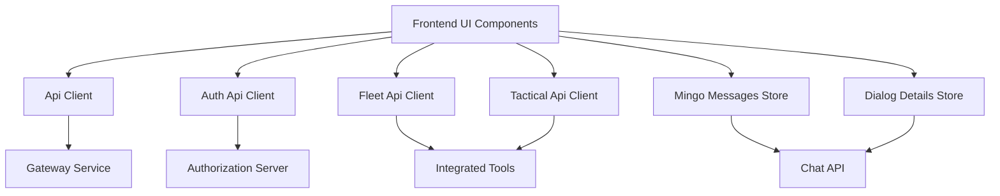
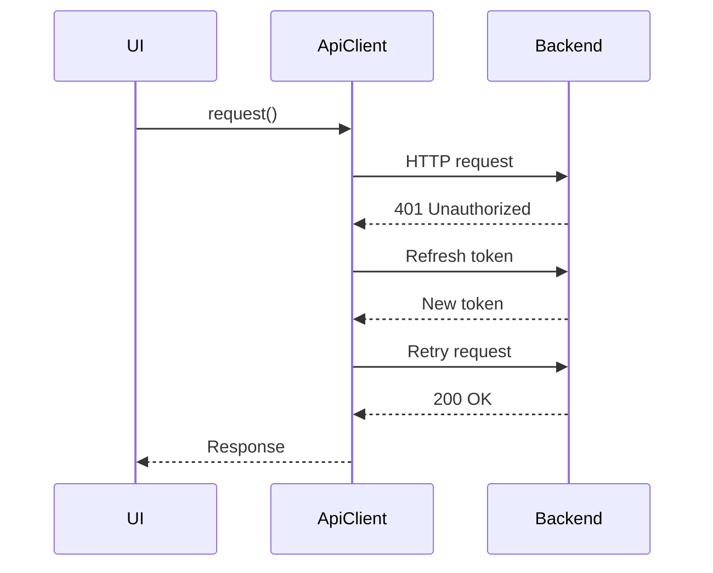
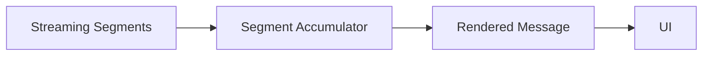

# Frontend Tenant Api Clients And Chat

## Overview

The **Frontend Tenant Api Clients And Chat** module is the primary frontend-side integration layer between the OpenFrame tenant UI and the backend platform services. It provides:

- A **centralized, resilient API client** abstraction with automatic authentication handling
- **Specialized API clients** for integrated tools (Fleet MDM and Tactical RMM)
- **Authentication-specific client logic** for OAuth, SSO, and tenant discovery
- **Chat and AI assistant state management** (Mingo) including streaming, approvals, and real-time UX
- **Unified domain models** used across the frontend (for example, Device)

This module acts as the glue between UI components, backend APIs (Gateway, API Service, Authorization Server), and real-time conversational experiences.

---

## Responsibilities at a Glance

- Abstract HTTP and authentication complexity away from UI components
- Enforce consistent request, error, and retry behavior across the frontend
- Provide typed, intention-revealing APIs for tool integrations
- Manage complex chat state including pagination, streaming messages, and approvals
- Serve as a single source of truth for shared frontend domain types

---

## High-Level Architecture

**Key idea:** UI components never talk directly to backend services. All communication flows through the clients and stores defined in this module.

---

## Core Building Blocks

### Central Api Client

**Primary component:** `ApiClient`

The Api Client is the foundation of all authenticated HTTP communication. It provides:

- Automatic handling of **cookie-based** and **header-based (Bearer)** authentication
- Transparent **token refresh** with request queueing
- Unified error and response handling
- Environment-aware URL resolution (tenant host, shared host, or relative paths)

#### Key Capabilities

- Injects authorization headers when required
- Detects `401 Unauthorized` responses and retries after refresh
- Queues concurrent requests during token refresh to prevent race conditions
- Forces logout only when recovery is no longer possible

This design ensures consistent authentication behavior across all frontend features.

---

### Auth Api Client

**Primary component:** `AuthApiClient`

The Auth Api Client is dedicated to **authentication and identity workflows**, separate from general API traffic.

#### Responsibilities

- OAuth login, logout, and refresh flows
- Tenant discovery and domain availability checks
- Organization registration (password and SSO)
- Invitation acceptance and password reset

#### Design Characteristics

- Supports **shared SaaS host** and **tenant-specific hosts**
- Gracefully retries failed requests after token refresh
- Handles browser redirects for SSO-based flows

This separation keeps authentication logic isolated and easier to reason about.

---

### Fleet Api Client

**Primary component:** `FleetApiClient`

The Fleet Api Client provides a typed interface to **Fleet MDM** functionality.

#### Supported Domains

- Policies (create, update, delete, run)
- Queries and live queries
- Hosts, teams, labels, and packs

#### Key Characteristics

- Built on top of the central Api Client
- Automatically prefixes requests with the Fleet tool base path
- Reuses authentication, retry, and error handling logic

This client allows UI components to interact with Fleet as a first-class citizen without knowing transport details.

---

### Tactical Api Client

**Primary component:** `TacticalApiClient`

The Tactical Api Client exposes **Tactical RMM** operations through a consistent frontend API.

#### Supported Operations

- Agent inspection and management
- Script execution and bulk actions
- Logs, checks, tasks, services, and system information

Like the Fleet client, it builds on the central Api Client and focuses purely on domain-specific behavior.

---

## Chat and AI (Mingo)

### Mingo Messages Store

**Primary component:** `MingoMessagesStore`

This store is responsible for **all AI chat state** within the frontend.

#### Managed State

- Messages grouped by dialog
- Active dialog tracking
- Typing indicators and unread counts
- Streaming messages and segment accumulators
- Approval request lifecycle

#### Streaming and Segments

Mingo supports incremental, streaming responses. Message content is processed through **segment accumulators**, enabling:

- Progressive text rendering
- Tool execution visualization
- Inline approval requests with approve/reject actions

This approach keeps the UI responsive and enables advanced conversational workflows.

---

### Dialog Details Store

**Primary component:** `DialogDetailsStore`

This store handles **ticket-style dialogs** and their message history.

#### Responsibilities

- Fetch dialog metadata via GraphQL
- Load, paginate, and poll messages
- Maintain separate client and admin message streams
- Merge real-time messages without duplication
- Track typing indicators for both sides

This store is optimized for operational and support-style chat experiences rather than streaming AI output.

---

### Mingo Api Service

**Primary component:** `MingoApiService`

The Mingo Api Service provides **React Query mutations** for chat operations.

#### Exposed Mutations

- Create dialog
- Send message
- Approve or reject approval requests

#### Design Goals

- Declarative, hook-friendly API
- Centralized error handling with user feedback
- Strong typing for request and response payloads

This service bridges the gap between chat UI components and the backend chat APIs.

---

## Shared Domain Models

### Unified Device Model

**Primary component:** `Device`

The Device type is a **single source of truth** for device data across the frontend.

#### Key Properties

- Flat structure (no deep nesting)
- Covers hardware, OS, network, software, and status
- Supports multiple integrated tools simultaneously
- Includes legacy fields for backward compatibility

This unified model allows different UI features (inventory, monitoring, automation) to operate on the same data shape.

---

## How This Module Fits Into the Platform

- Communicates with backend services through the Gateway and Authorization Server
- Encapsulates all frontend-side concerns related to authentication, API access, and chat
- Enables rapid UI development by providing stable, typed abstractions

In short, **Frontend Tenant Api Clients And Chat** is the backbone of frontend-to-backend communication and conversational interaction in OpenFrame.

---

## When to Extend This Module

Add or evolve components here when:

- Introducing a new backend API that should be consumed by the frontend
- Integrating an additional external tool
- Expanding chat or AI-driven workflows
- Introducing new shared domain models

Avoid placing UI-specific rendering logic here; keep this module focused on **data access, state, and orchestration**.

---

## Summary

The **Frontend Tenant Api Clients And Chat** module provides:

- A robust, reusable API communication layer
- Clear separation between auth, general APIs, and tool-specific APIs
- Sophisticated chat and AI state management
- Shared, consistent domain models

It is a critical foundation for building scalable, secure, and intelligent frontend experiences on the OpenFrame platform.
