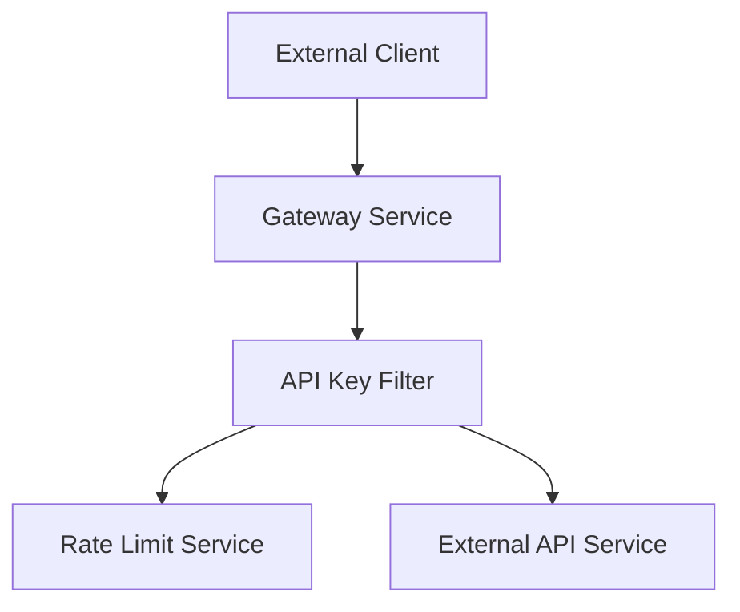
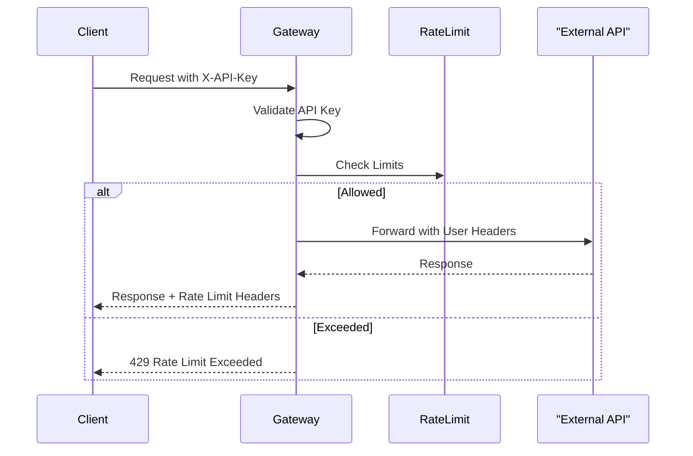

# API Key Authentication & Rate Limiting

## Overview

The **API Key Authentication Module** secures all `/external-api/**` endpoints exposed through the Gateway Service.

It provides:

- Mandatory API key authentication
- Per-key rate limiting (minute, hour, day)
- User context propagation to downstream services
- Standardized error handling and rate limit headers

This module allows safe third-party and integration access without exposing internal JWT-based authentication.

---

## Architecture

---

## Core Components

### ApiKeyAuthenticationFilter

A global gateway filter applied early in the filter chain.

**Responsibilities:**

1. Intercept `/external-api/**` requests
2. Require `X-API-Key` header
3. Validate API key and load associated user
4. Enforce rate limits
5. Inject user context headers
6. Record success and failure statistics

---

### Rate Limiting

- Enforced per API key
- Supports multiple time windows:
  - Per minute
  - Per hour
  - Per day

When limits are exceeded:

- HTTP status `429 TOO_MANY_REQUESTS`
- `Retry-After` header is set
- Rate limit headers are still included

---

## Request Handling Flow

---

## User Context Propagation

When a request is allowed, the gateway injects:

- API key identifier
- User identifier

The original `X-API-Key` header is removed before forwarding the request downstream.

---

## Error Handling

All errors are returned as structured JSON responses with:

- HTTP status code
- Error code
- Human-readable message

This ensures consistent error handling across integrations.

---

## Related Documentation

- See [Gateway Security Configuration](gateway-security.md)
- See [Gateway Service Overview](gateway-service.md)
