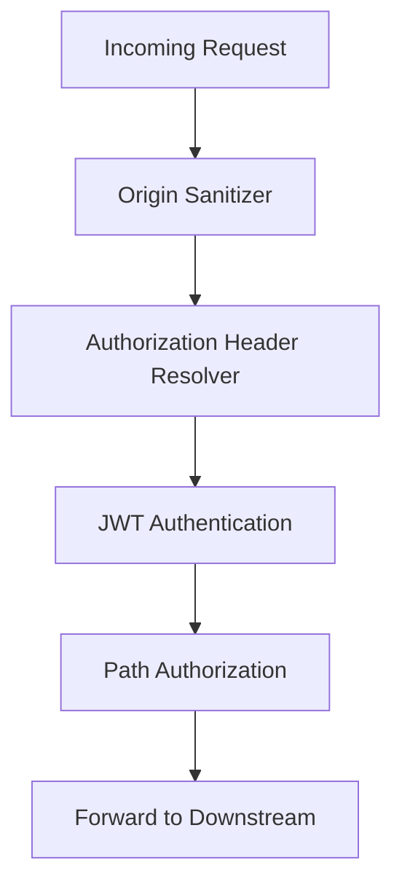
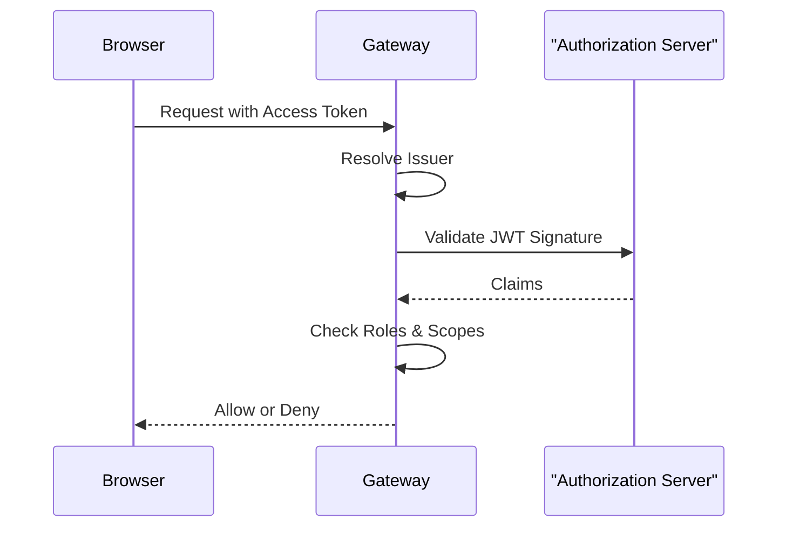

# Gateway Security Configuration

## Overview

The **Gateway Security Module** enforces authentication and authorization at the platform edge using **Spring Security WebFlux**.

It supports:

- JWT authentication with multi-tenant issuer resolution
- Role- and scope-based authorization
- Token propagation via headers, cookies, and query parameters
- CORS control and origin sanitization

---

## Security Architecture

---

## Core Components

### GatewaySecurityConfig

- Configures the main `SecurityWebFilterChain`
- Disables CSRF, form login, and HTTP basic auth
- Defines path-based authorization rules

**Examples:**

- `/api/**` → `ADMIN` role
- `/tools/agent/**` → `AGENT` role
- `/ws/nats` → `ADMIN` or `AGENT`
- Public endpoints (health, metrics, registration) → permitted

---

### JwtAuthConfig

- Configures JWT decoding and validation
- Supports multiple issuers using a cached `ReactiveAuthenticationManager`
- Enforces strict issuer validation via tenant-aware issuer resolution

---

### IssuerUrlProvider

- Dynamically resolves allowed JWT issuer URLs
- Uses tenant data to build issuer list
- Caches resolved issuers for performance

---

### AddAuthorizationHeaderFilter

- Ensures an `Authorization` header is present
- Resolves bearer tokens from:
  - Secure cookies
  - Alternate headers
  - Query parameters

This enables consistent authentication for HTTP and WebSocket requests.

---

### OriginSanitizerFilter

- Removes invalid `Origin: null` headers
- Prevents CORS-related failures caused by malformed origins

---

## CORS Handling

The gateway supports two mutually exclusive CORS modes:

### Standard CORS (Default)

- Controlled via `spring.cloud.gateway.globalcors` configuration
- Intended for OSS and multi-origin deployments

### Disabled CORS (SaaS Mode)

- Enabled with `openframe.gateway.disable-cors=true`
- Allows all origins with credentials
- Intended only for same-domain SaaS deployments

---

## Authorization Flow Example

---

## Related Documentation

- See [Gateway WebSocket Module](gateway-websocket.md)
- See [API Key Authentication](gateway-api-key.md)
