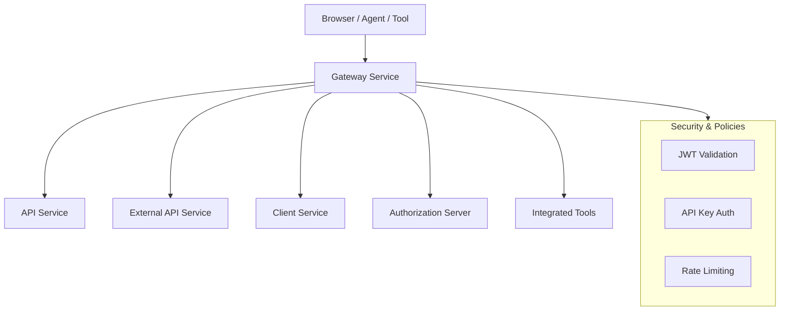
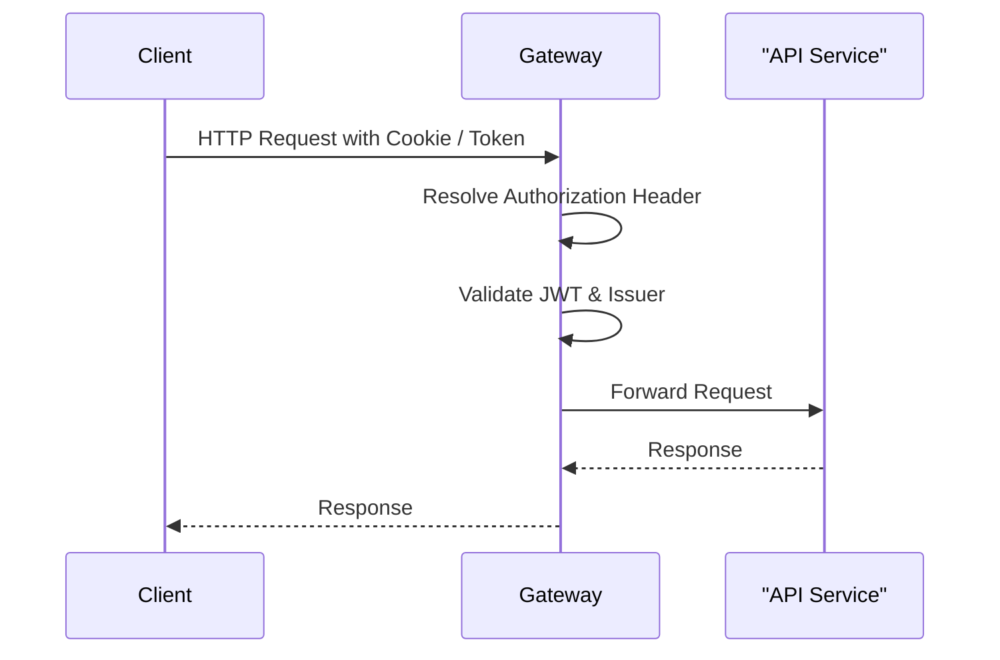
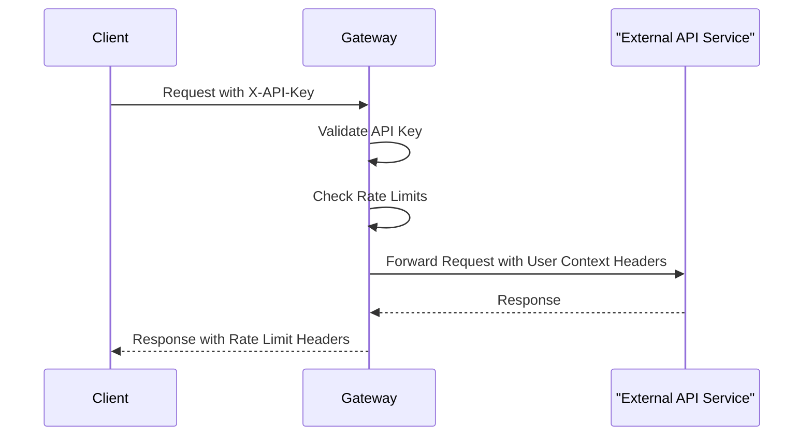

# Gateway Service

## Overview

The **Gateway Service** is the entry point to the OpenFrame platform. It is built on **Spring Cloud Gateway (Reactive/WebFlux)** and is responsible for:

- Acting as a unified ingress for UI, agents, tools, and external APIs
- Enforcing authentication and authorization (JWT, API keys)
- Handling rate limiting for external API consumers
- Proxying HTTP and WebSocket traffic to downstream services and tools
- Normalizing security headers, CORS behavior, and multi-tenant issuer validation

In the overall OpenFrame architecture, the gateway sits in front of services such as the **API Service**, **External API Service**, **Client Service**, **Authorization Server**, and tool backends.

---

## High-Level Architecture

---

## Core Responsibilities

### 1. Request Routing

- Routes HTTP traffic to internal OpenFrame services
- Proxies WebSocket connections for tools, agents, and NATS
- Applies path-based security rules

### 2. Security Enforcement

- JWT-based authentication for UI, agents, and internal services
- Multi-tenant issuer validation via dynamic issuer resolution
- API key authentication and rate limiting for `/external-api/**`

### 3. WebSocket Proxying

- Tool Agent WebSockets: `/ws/tools/agent/{toolId}/**`
- Tool API WebSockets: `/ws/tools/{toolId}/**`
- NATS WebSocket passthrough: `/ws/nats`

### 4. Cross-Cutting Filters

- Authorization header enrichment
- Origin header sanitization
- Configurable CORS behavior

---

## Main Components

### Application Bootstrap

- **GatewayApplication**
  - Spring Boot entry point
  - Scans gateway, security, data, and core modules

---

## Sub-Modules

The Gateway Service is organized into several focused sub-modules:

- [WebSocket Gateway](gateway-websocket.md)
- [Security Configuration](gateway-security.md)
- [API Key Authentication & Rate Limiting](gateway-api-key.md)

Each sub-module is documented separately to avoid duplication and to keep concerns isolated.

---

## Request Flow Example (JWT-protected API)

---

## Request Flow Example (External API with API Key)

---

## How It Fits Into OpenFrame

- **Upstream**: Clients, agents, browsers, third-party integrations
- **Downstream**: API Service, External API Service, Client Service, tools, NATS
- **Security Backbone**: Integrates with Authorization Server and shared security libraries

The Gateway Service centralizes all ingress concerns so that downstream services can focus on business logic rather than authentication, authorization, and transport-level complexity.
