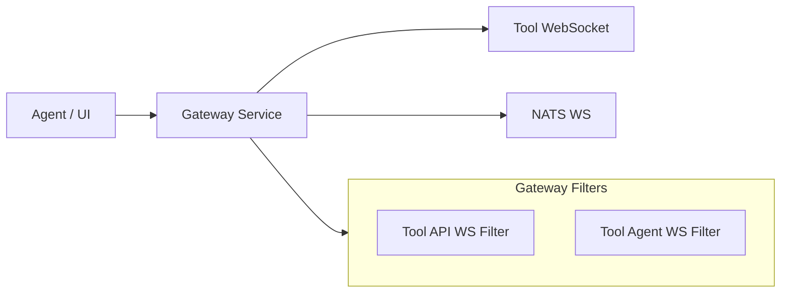
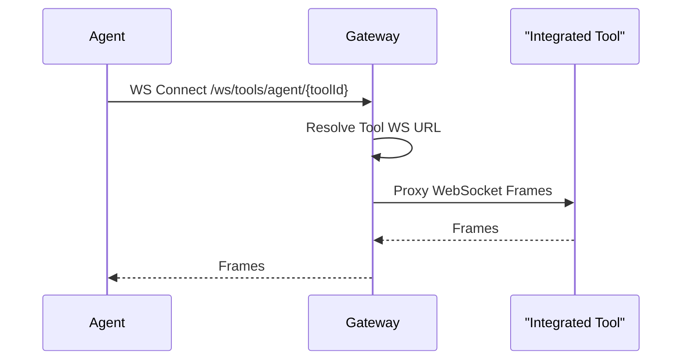

# Gateway WebSocket Module

## Overview

The **Gateway WebSocket Module** is responsible for proxying and securing WebSocket connections between clients (agents, UI, tools) and downstream real-time services.

It is implemented using **Spring Cloud Gateway WebSocket routing** and custom URL resolution filters.

---

## Supported WebSocket Endpoints

| Endpoint | Purpose |
|--------|---------|
| `/ws/tools/agent/{toolId}/**` | Tool agent real-time communication |
| `/ws/tools/{toolId}/**` | Tool API real-time communication |
| `/ws/nats` | NATS WebSocket passthrough |

---

## Architecture

---

## Core Components

### WebSocketGatewayConfig

- Registers WebSocket routes using `RouteLocator`
- Defines endpoint prefixes for tool and NATS connections
- Decorates the default `WebSocketService` with security logic

### ToolApiWebSocketProxyUrlFilter

- Resolves target WebSocket URLs for tool API connections
- Extracts `toolId` from request path
- Uses tool metadata and proxy URL resolution

### ToolAgentWebSocketProxyUrlFilter

- Resolves target WebSocket URLs for tool agent connections
- Extracts `toolId` from agent-specific paths

---

## WebSocket Security

- JWT claims are extracted from the request during the WebSocket handshake
- Security roles are enforced based on endpoint type:
  - Agent endpoints require `AGENT` role
  - Tool API endpoints require `ADMIN` role

---

## Data Flow Example

---

## Related Documentation

- See [Security Configuration](gateway-security.md) for WebSocket authorization rules
- See [API Key Authentication](gateway-api-key.md) for external API security (non-WebSocket)
