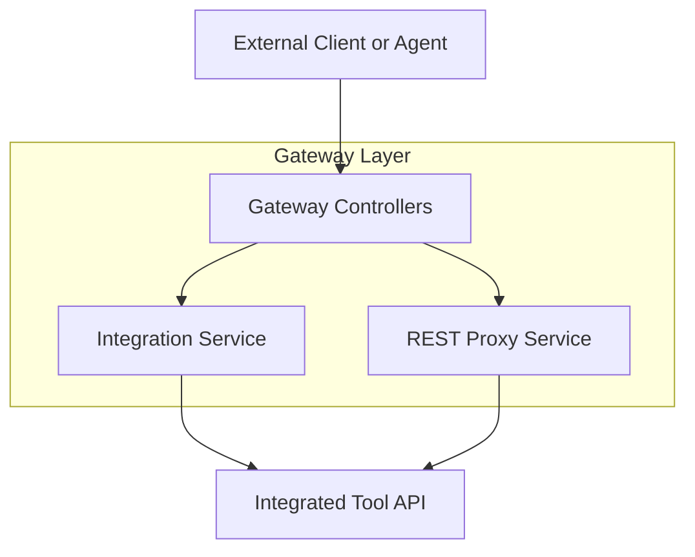
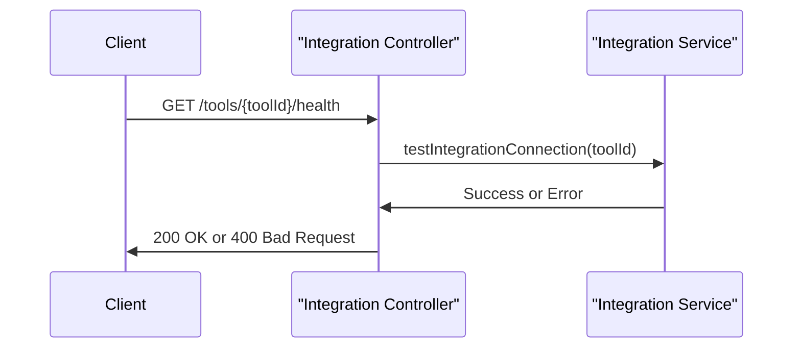
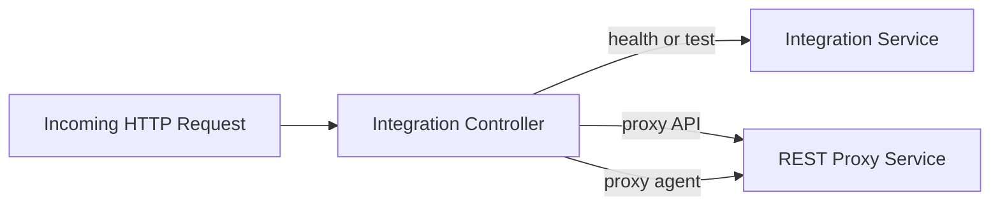
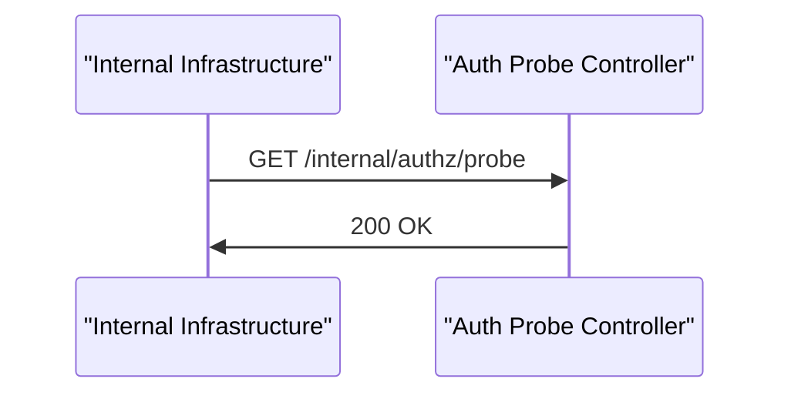

# Gateway Controllers Module

## Overview

The **gateway_controllers** module is part of the OpenFrame Gateway service. It exposes REST endpoints that act as the **entry point for tool integrations** and **internal authentication probing**. These controllers do not implement business logic themselves; instead, they validate and route incoming HTTP requests to lower-level gateway services responsible for security, routing, and proxying.

At a high level, this module:

- Provides health and connectivity checks for integrated tools
- Proxies API and agent traffic from clients to external or internal tool backends
- Exposes a lightweight internal authentication probe endpoint used for infrastructure-level checks

The module is reactive and built on **Spring WebFlux**, returning `Mono` responses for all endpoints.

---

## Architectural Context

The gateway controllers sit at the very edge of the OpenFrame platform. They receive inbound HTTP traffic, apply gateway security and filtering (configured elsewhere), and delegate request handling to gateway services.



**Key points:**

- Controllers are thin and stateless
- Authentication and authorization are enforced by gateway security filters before requests reach these controllers
- All downstream calls are performed in a non-blocking, reactive manner

---

## Core Controllers

This module currently contains two controllers:

- `IntegrationController`
- `InternalAuthProbeController`

Each controller has a clearly defined responsibility, described below.

---

## IntegrationController

**Class:** `IntegrationController`  
**Base Path:** `/tools`

The `IntegrationController` is responsible for **tool integration traffic**. It exposes endpoints for testing tool connectivity and for proxying arbitrary API and agent requests to integrated tools.

### Responsibilities

- Perform health and connectivity checks for tools
- Proxy REST API requests to tool backends
- Proxy agent-originated requests to tool backends
- Preserve request paths, HTTP methods, and request bodies

### Endpoints

#### Tool Health Check

- **GET** `/tools/{toolId}/health`

Used to verify that the gateway can successfully communicate with a specific integrated tool.

Flow:



---

#### Tool Integration Test

- **POST** `/tools/{toolId}/test`

Semantically similar to the health check, but intended for explicit testing workflows (for example, during configuration or onboarding).

---

#### Proxy Tool API Requests

- **ANY** `/tools/{toolId}/**`

This endpoint proxies arbitrary API requests to a tool backend. It supports the following HTTP methods:

- GET
- POST
- PUT
- PATCH
- DELETE
- OPTIONS

The controller extracts the incoming request path and delegates the forwarding logic to the `RestProxyService`.

**Typical use cases:**

- Frontend applications calling tool APIs through the gateway
- Normalizing authentication and headers at the gateway level

---

#### Proxy Tool Agent Requests

- **ANY** `/tools/agent/{toolId}/**`

This endpoint is similar to the API proxy but is specifically designed for **agent-originated traffic**. It allows agents to communicate with tool services through the gateway using a dedicated routing path.

---

### Internal Flow Summary



---

## InternalAuthProbeController

**Class:** `InternalAuthProbeController`  
**Base Path:** `/internal/authz`

The `InternalAuthProbeController` exposes a minimal endpoint used for **internal authentication and authorization checks**. It is typically used by infrastructure components such as load balancers, service meshes, or monitoring systems.

### Conditional Activation

This controller is only enabled when the following configuration property is set:

```text
openframe.gateway.internal.enable=true
```

If the property is not enabled, the controller is not registered in the application context.

---

### Probe Endpoint

- **GET** `/internal/authz/probe`

Returns an HTTP 200 response with an empty body when authentication and routing are functioning correctly.

**Characteristics:**

- No request body
- No response body
- Non-blocking (`Mono<Void>`)
- Designed for fast, low-overhead checks



---

## Error Handling Strategy

- Health and test endpoints convert integration errors into `400 Bad Request` responses with an error message
- Proxy endpoints delegate error handling to the `RestProxyService`, ensuring consistent behavior across all proxied routes

---

## How This Module Fits into the Platform

The **gateway_controllers** module works in close coordination with:

- Gateway security configuration and filters
- Gateway proxy and routing services
- Downstream tool APIs and agent services

It intentionally avoids embedding business logic, making it easy to extend, test, and reason about. Any changes to routing, authentication, or tool-specific behavior are handled in dedicated gateway services rather than in the controllers themselves.

---

## Summary

- Provides the public-facing gateway endpoints for tool integrations
- Acts as a thin, reactive routing layer
- Delegates all heavy logic to gateway services
- Supports both API and agent traffic patterns
- Includes an optional internal authentication probe for infrastructure health checks

This separation of concerns keeps the gateway robust, scalable, and easy to evolve as new integration types are added.