# Gateway Service

## Overview

The **Gateway Service** is the central entry point for all client requests in the OpenFrame platform. Built on Spring Cloud Gateway with reactive WebFlux, it provides intelligent routing, security enforcement, API key authentication, rate limiting, and WebSocket proxying capabilities. The gateway acts as a unified interface that routes traffic to backend microservices while enforcing security policies and managing cross-cutting concerns.

**Key Responsibilities:**
- **Unified API Gateway**: Single entry point for all HTTP/HTTPS and WebSocket traffic
- **Security Enforcement**: JWT-based authentication with multi-tenant issuer support
- **API Key Management**: External API authentication with rate limiting
- **WebSocket Proxying**: Intelligent routing for real-time communication channels
- **CORS Management**: Configurable cross-origin resource sharing
- **Request Routing**: Dynamic routing to backend services (API, Client, Authorization, External API)
- **Rate Limiting**: Token bucket algorithm with minute/hour/day windows

---

## Architecture Overview

The Gateway Service follows a reactive, filter-based architecture with multiple security layers and routing strategies.

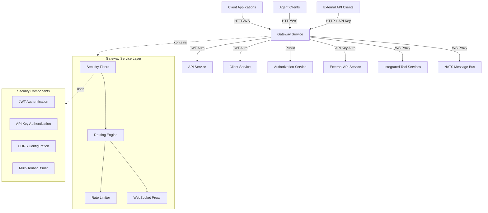

### Component Interaction Flow

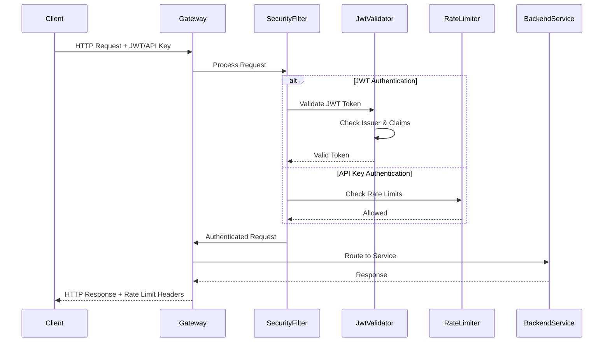

---

## Sub-Modules

The Gateway Service is organized into the following sub-modules:

### 1. [Gateway Configuration](gateway_service_configuration.md)
Core configuration components for HTTP clients, WebSocket routing, and CORS policies.

**Key Components:**
- `WebClientConfig`: Reactive HTTP client with timeout configuration
- `WebSocketGatewayConfig`: WebSocket route definitions and proxy filters
- `CorsConfig`: Cross-origin resource sharing policies

### 2. [Gateway Security](gateway_service_security.md)
Multi-layered security implementation with JWT validation, API key authentication, and tenant isolation.

**Key Components:**
- `GatewaySecurityConfig`: Main security filter chain configuration
- `JwtAuthConfig`: Multi-tenant JWT decoder with issuer caching
- `ApiKeyAuthenticationFilter`: External API authentication and rate limiting

### 3. [Gateway Application](gateway_service_application.md)
Spring Boot application entry point and component scanning configuration.

**Key Components:**
- `GatewayApplication`: Main application class with service discovery

---

## Core Features

### 1. Multi-Tenant JWT Authentication

The gateway supports multiple JWT issuers for tenant isolation:

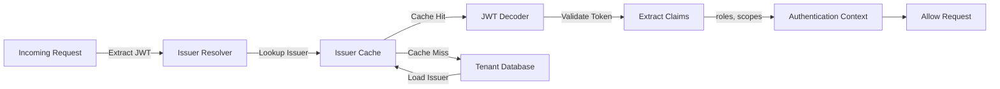

**Features:**
- Dynamic issuer discovery from tenant database
- Caffeine-based issuer cache (configurable TTL)
- Support for both roles and scopes in JWT claims
- Strict issuer validation with allowlist

**Configuration:**
```yaml
openframe:
  security:
    jwt:
      cache:
        expire-after: 1h
        refresh-after: 30m
        maximum-size: 100
      allowed-issuer-base: https://auth.openframe.ai
      super-tenant-id: system
```

### 2. API Key Authentication & Rate Limiting

External API endpoints (`/external-api/**`) require API key authentication with built-in rate limiting:

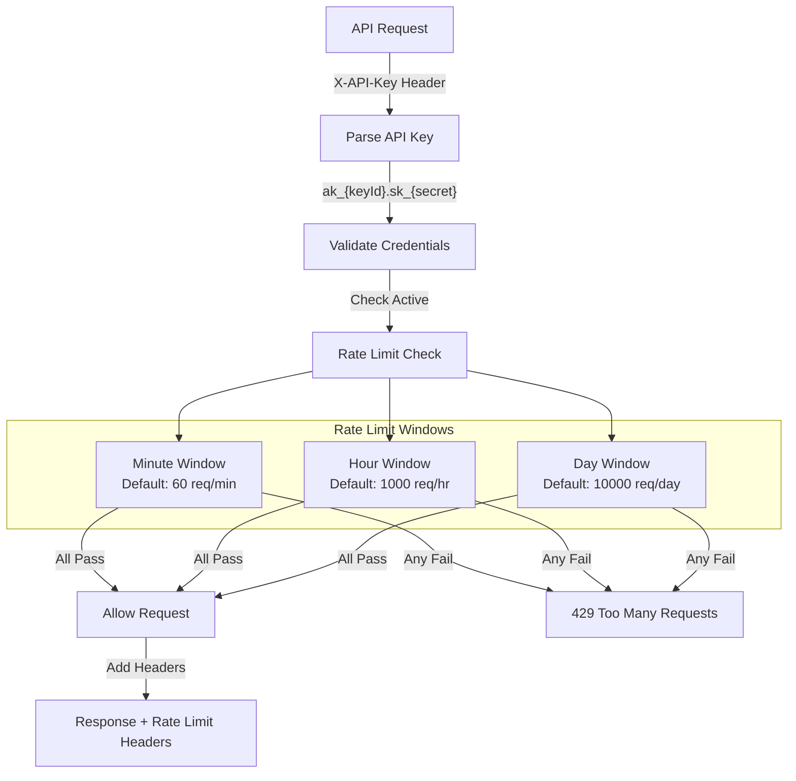

**API Key Format:**
```text
ak_{keyId}.sk_{secret}
Example: ak_1a2b3c4d5e6f7g8h.sk_9i0j1k2l3m4n5o6p7q8r9s0t
```

**Rate Limit Headers:**
```http
X-RateLimit-Limit-Minute: 60
X-RateLimit-Remaining-Minute: 45
X-RateLimit-Limit-Hour: 1000
X-RateLimit-Remaining-Hour: 850
X-RateLimit-Limit-Day: 10000
X-RateLimit-Remaining-Day: 9500
```

**Configuration:**
```yaml
openframe:
  rate-limit:
    enabled: true
    fail-open: true
    include-headers: true
    redis-ttl: 86400
    default-requests-per-minute: 60
    default-requests-per-hour: 1000
    default-requests-per-day: 10000
```

### 3. WebSocket Proxying

The gateway provides intelligent WebSocket proxying for real-time communication:

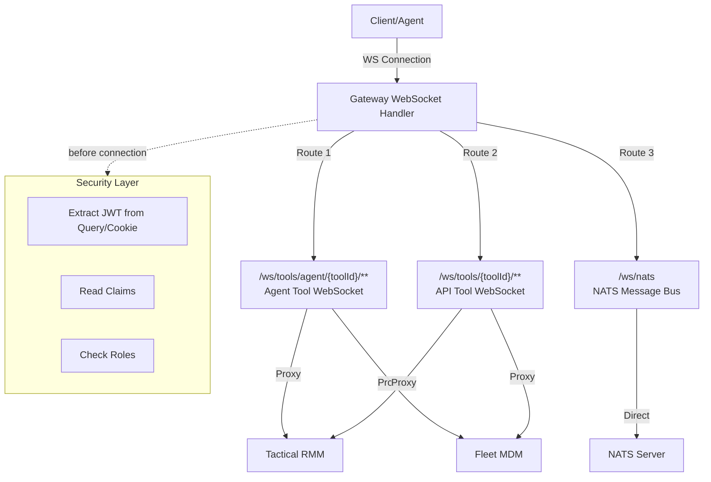

**WebSocket Routes:**

| Route Pattern | Target | Required Role | Description |
|--------------|--------|---------------|-------------|
| `/ws/tools/agent/{toolId}/**` | Tool Service | `AGENT` | Agent-to-tool WebSocket connections |
| `/ws/tools/{toolId}/**` | Tool Service | `ADMIN` | Admin-to-tool WebSocket connections |
| `/ws/nats` | NATS Server | `AGENT` or `ADMIN` | NATS message bus WebSocket |

**Security Features:**
- JWT extraction from query parameters or cookies
- Role-based access control per route
- Tenant isolation via JWT claims
- Connection-level authentication

### 4. Request Routing

The gateway routes requests to backend services based on path prefixes:

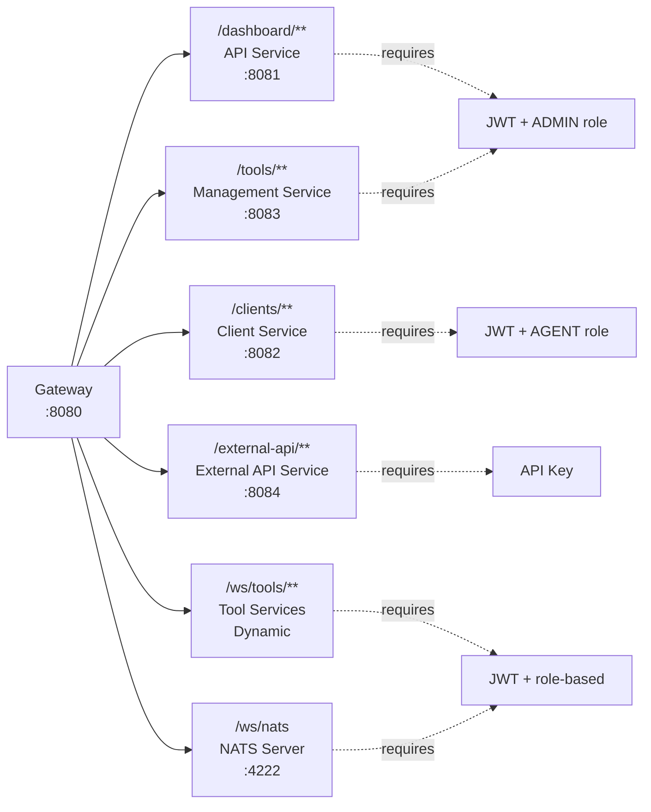

**Path-Based Routing:**

| Path Prefix | Target Service | Authentication | Authorization |
|-------------|---------------|----------------|---------------|
| `/dashboard/**` | [API Service](api_service.md) | JWT | `ROLE_ADMIN` |
| `/clients/**` | [Client Service](client_service.md) | JWT | `ROLE_AGENT` |
| `/tools/**` | [Management Service](management_service.md) | JWT | `ROLE_ADMIN` |
| `/external-api/**` | [External API Service](external_api.md) | API Key | Rate Limited |
| `/ws/tools/**` | Tool Services | JWT | Role-based |
| `/ws/nats` | NATS Server | JWT | `ROLE_AGENT` or `ROLE_ADMIN` |
| `/actuator/**` | Gateway Actuator | None | Public |
| `/error/**` | Error Handler | None | Public |

### 5. CORS Configuration

Configurable CORS policies for cross-origin requests:

```yaml
spring:
  cloud:
    gateway:
      globalcors:
        cors-configurations:
          '[/**]':
            allowed-origins:
              - "https://app.openframe.ai"
              - "https://*.openframe.ai"
            allowed-methods:
              - GET
              - POST
              - PUT
              - DELETE
              - OPTIONS
            allowed-headers:
              - "*"
            allow-credentials: true
            max-age: 3600
```

**Features:**
- Wildcard subdomain support
- Credential-aware CORS
- Preflight request caching
- Per-path CORS configuration

---

## Security Model

### Authentication Flow

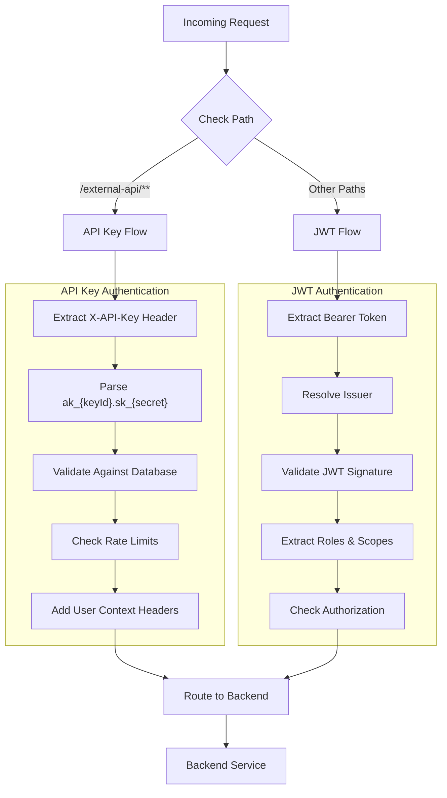

### Authorization Matrix

| Endpoint Pattern | Required Role | Additional Checks |
|-----------------|---------------|-------------------|
| `/dashboard/**` | `ROLE_ADMIN` | Valid JWT |
| `/clients/**` | `ROLE_AGENT` | Valid JWT, Tenant Match |
| `/tools/**` | `ROLE_ADMIN` | Valid JWT |
| `/external-api/**` | N/A | Valid API Key, Rate Limit |
| `/ws/tools/agent/**` | `ROLE_AGENT` | Valid JWT, WebSocket Upgrade |
| `/ws/tools/**` | `ROLE_ADMIN` | Valid JWT, WebSocket Upgrade |
| `/ws/nats` | `ROLE_AGENT` or `ROLE_ADMIN` | Valid JWT, WebSocket Upgrade |
| `/actuator/**` | None | Public Access |

### Token Sources

The gateway accepts authentication tokens from multiple sources (in order of precedence):

1. **Authorization Header**: `Authorization: Bearer {token}`
2. **Cookie**: `access_token={token}`
3. **Custom Header**: `Access-Token: {token}`
4. **Query Parameter**: `?authorization={token}` (WebSocket only)

---

## Data Flow

### HTTP Request Flow

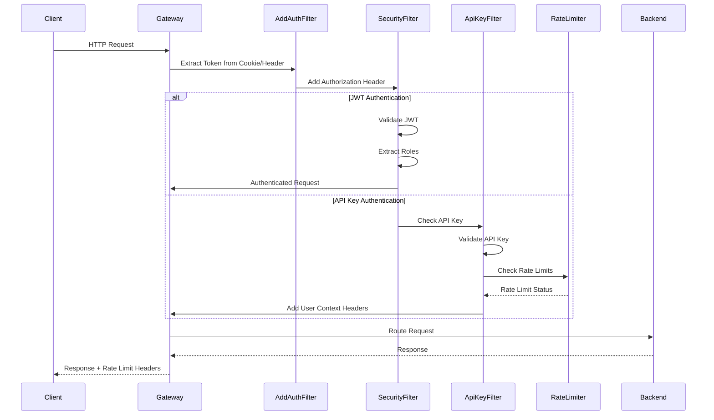

### WebSocket Connection Flow

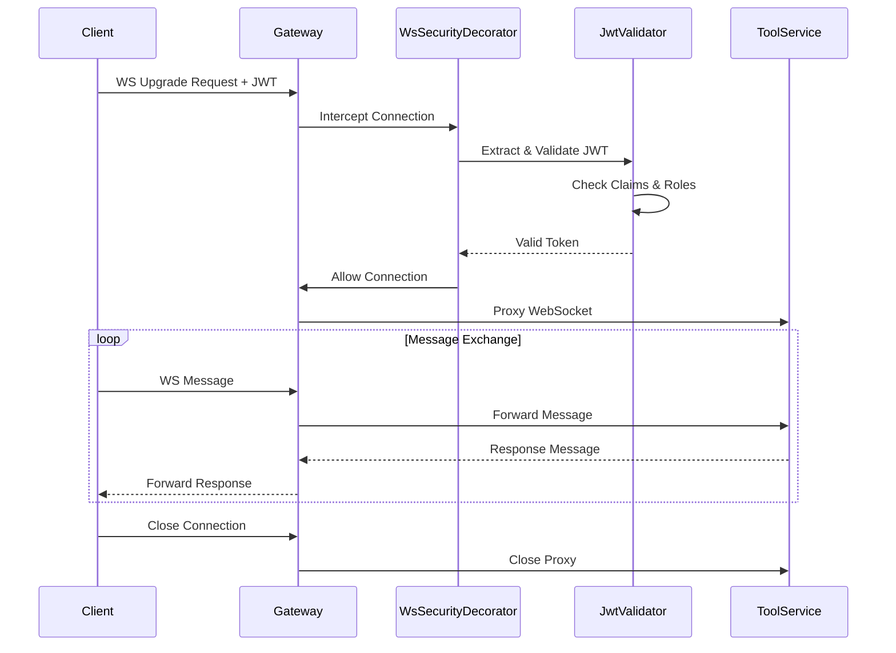

---

## Configuration

### Application Properties

```yaml
server:
  port: 8080

spring:
  application:
    name: openframe-gateway
  cloud:
    gateway:
      globalcors:
        cors-configurations:
          '[/**]':
            allowed-origins: "*"
            allowed-methods: "*"
            allowed-headers: "*"
            allow-credentials: true

openframe:
  gateway:
    disable-cors: false
  security:
    jwt:
      cache:
        expire-after: 1h
        refresh-after: 30m
        maximum-size: 100
      allowed-issuer-base: ${ISSUER_BASE:https://auth.openframe.ai}
      super-tenant-id: ${SUPER_TENANT_ID:system}
  rate-limit:
    enabled: true
    fail-open: true
    include-headers: true
    redis-ttl: 86400
    default-requests-per-minute: 60
    default-requests-per-hour: 1000
    default-requests-per-day: 10000

management:
  endpoints:
    web:
      base-path: /actuator
      exposure:
        include: health,info,metrics

nats-ws-url: ${NATS_WS_URL:ws://nats:4222}
```

### Environment Variables

| Variable | Description | Default |
|----------|-------------|---------|
| `ISSUER_BASE` | Base URL for JWT issuers | `https://auth.openframe.ai` |
| `SUPER_TENANT_ID` | Super tenant identifier | `system` |
| `NATS_WS_URL` | NATS WebSocket URL | `ws://nats:4222` |
| `REDIS_HOST` | Redis host for rate limiting | `localhost` |
| `REDIS_PORT` | Redis port | `6379` |

---

## Dependencies

### Internal Service Dependencies

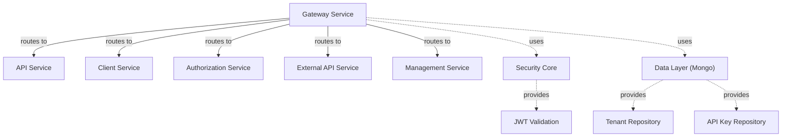

**Service References:**
- [API Service](api_service.md): Main API endpoints for admin dashboard
- [Client Service](client_service.md): Agent communication and device management
- [Authorization Service](authorization_service.md): OAuth2/OIDC authentication
- [External API Service](external_api.md): Public API with API key authentication
- [Management Service](management_service.md): Tool integration management
- [Security Core](security_core.md): JWT validation and security utilities
- [Data Layer (Mongo)](data_layer_mongo.md): Tenant and API key repositories

### External Dependencies

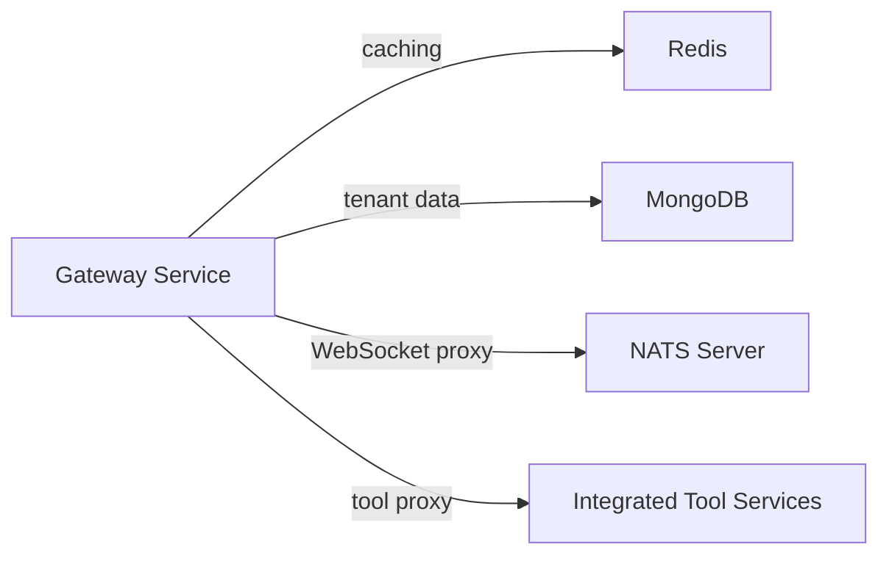

**External Systems:**
- **Redis**: Rate limiting counters and issuer cache
- **MongoDB**: Tenant configuration and API key storage
- **NATS**: Message bus for real-time communication
- **Tool Services**: Tactical RMM, Fleet MDM, etc.

---

## Deployment

### Docker Deployment

```dockerfile
FROM eclipse-temurin:21-jre-alpine
WORKDIR /app
COPY target/openframe-gateway.jar app.jar
EXPOSE 8080
ENTRYPOINT ["java", "-jar", "app.jar"]
```

### Kubernetes Deployment

```yaml
apiVersion: apps/v1
kind: Deployment
metadata:
  name: openframe-gateway
spec:
  replicas: 3
  selector:
    matchLabels:
      app: openframe-gateway
  template:
    metadata:
      labels:
        app: openframe-gateway
    spec:
      containers:
      - name: gateway
        image: openframe/gateway:latest
        ports:
        - containerPort: 8080
        env:
        - name: ISSUER_BASE
          value: "https://auth.openframe.ai"
        - name: REDIS_HOST
          value: "redis-service"
        - name: NATS_WS_URL
          value: "ws://nats-service:4222"
        resources:
          requests:
            memory: "512Mi"
            cpu: "500m"
          limits:
            memory: "1Gi"
            cpu: "1000m"
        livenessProbe:
          httpGet:
            path: /actuator/health
            port: 8080
          initialDelaySeconds: 30
          periodSeconds: 10
        readinessProbe:
          httpGet:
            path: /actuator/health
            port: 8080
          initialDelaySeconds: 20
          periodSeconds: 5
---
apiVersion: v1
kind: Service
metadata:
  name: openframe-gateway
spec:
  selector:
    app: openframe-gateway
  ports:
  - protocol: TCP
    port: 80
    targetPort: 8080
  type: LoadBalancer
```

---

## Monitoring & Observability

### Health Checks

```bash
# Liveness probe
curl http://localhost:8080/actuator/health

# Readiness probe
curl http://localhost:8080/actuator/health/readiness
```

### Metrics

The gateway exposes Prometheus-compatible metrics:

```bash
curl http://localhost:8080/actuator/metrics
```

**Key Metrics:**
- `gateway.requests.total`: Total requests processed
- `gateway.requests.duration`: Request duration histogram
- `gateway.rate_limit.exceeded`: Rate limit violations
- `gateway.jwt.validation.failures`: JWT validation failures
- `gateway.websocket.connections`: Active WebSocket connections

### Logging

```yaml
logging:
  level:
    com.openframe.gateway: DEBUG
    org.springframework.cloud.gateway: INFO
    org.springframework.security: DEBUG
  pattern:
    console: "%d{yyyy-MM-dd HH:mm:ss} - %msg%n"
```

---

## Error Handling

### HTTP Error Responses

```json
{
  "code": "UNAUTHORIZED",
  "message": "API key is required for /external-api/** endpoints"
}
```

**Error Codes:**

| Code | HTTP Status | Description |
|------|-------------|-------------|
| `UNAUTHORIZED` | 401 | Missing or invalid authentication |
| `RATE_LIMIT_EXCEEDED` | 429 | Rate limit exceeded |
| `FORBIDDEN` | 403 | Insufficient permissions |
| `INTERNAL_SERVER_ERROR` | 500 | Unexpected error |

### Rate Limit Error Response

```json
{
  "code": "RATE_LIMIT_EXCEEDED",
  "message": "Too many requests. Please try again later."
}
```

**Headers:**
```http
HTTP/1.1 429 Too Many Requests
Retry-After: 60
X-RateLimit-Limit-Minute: 60
X-RateLimit-Remaining-Minute: 0
X-RateLimit-Limit-Hour: 1000
X-RateLimit-Remaining-Hour: 450
```

---

## Security Considerations

### Best Practices

1. **JWT Validation**
   - Always validate issuer against allowlist
   - Check token expiration and not-before claims
   - Verify signature with cached public keys
   - Extract and validate roles/scopes

2. **API Key Management**
   - Store hashed keys only (BCrypt)
   - Use strong random secrets (min 16 chars)
   - Implement key rotation policies
   - Monitor failed authentication attempts

3. **Rate Limiting**
   - Configure appropriate limits per use case
   - Use fail-open strategy for high availability
   - Monitor rate limit violations
   - Implement exponential backoff for clients

4. **WebSocket Security**
   - Validate JWT before connection upgrade
   - Enforce role-based access per route
   - Implement connection timeouts
   - Monitor active connections

5. **CORS Configuration**
   - Use specific origins in production
   - Avoid wildcard origins with credentials
   - Limit allowed methods and headers
   - Set appropriate max-age for preflight

### Threat Mitigation

| Threat | Mitigation |
|--------|-----------|
| **Token Theft** | Short-lived JWTs, secure cookie flags, HTTPS only |
| **API Key Leakage** | Hashed storage, rate limiting, monitoring |
| **DDoS Attacks** | Rate limiting, connection limits, fail-open strategy |
| **CSRF** | SameSite cookies, CORS policies, token validation |
| **Man-in-the-Middle** | HTTPS enforcement, certificate pinning |

---

## Troubleshooting

### Common Issues

#### 1. JWT Validation Failures

**Symptom**: 401 Unauthorized with "Invalid JWT" message

**Possible Causes:**
- Expired token
- Invalid issuer
- Signature verification failure
- Missing required claims

**Solution:**
```bash
# Check JWT claims
echo $JWT_TOKEN | cut -d'.' -f2 | base64 -d | jq

# Verify issuer is in allowlist
curl http://localhost:8080/actuator/health
```

#### 2. Rate Limit Exceeded

**Symptom**: 429 Too Many Requests

**Possible Causes:**
- Exceeded minute/hour/day limits
- Redis connection issues
- Incorrect rate limit configuration

**Solution:**
```bash
# Check rate limit status
curl -H "X-API-Key: ak_xxx.sk_xxx" \
  http://localhost:8080/external-api/health

# Check Redis connectivity
redis-cli -h localhost -p 6379 ping
```

#### 3. WebSocket Connection Failures

**Symptom**: WebSocket upgrade fails with 403 Forbidden

**Possible Causes:**
- Missing JWT in query parameter
- Invalid role for route
- JWT expired during connection

**Solution:**
```javascript
// Include JWT in WebSocket URL
const ws = new WebSocket(
  `ws://localhost:8080/ws/nats?authorization=${jwtToken}`
);
```

#### 4. CORS Errors

**Symptom**: Browser blocks request with CORS error

**Possible Causes:**
- Origin not in allowed list
- Missing credentials flag
- Preflight request failure

**Solution:**
```yaml
# Update CORS configuration
spring:
  cloud:
    gateway:
      globalcors:
        cors-configurations:
          '[/**]':
            allowed-origins:
              - "https://your-domain.com"
            allow-credentials: true
```

---

## Performance Tuning

### Reactive Configuration

```yaml
spring:
  webflux:
    base-path: /
  reactor:
    netty:
      pool:
        max-connections: 500
        max-idle-time: 30s
        max-life-time: 60s
```

### Cache Tuning

```yaml
openframe:
  security:
    jwt:
      cache:
        expire-after: 2h      # Increase for better performance
        refresh-after: 1h     # Refresh before expiration
        maximum-size: 500     # Increase for more tenants
```

### Rate Limit Optimization

```yaml
openframe:
  rate-limit:
    redis-ttl: 172800         # 2 days for better cleanup
    fail-open: true           # High availability over strict limits
```

---

## Related Documentation

- [API Service](api_service.md): Backend API service for admin dashboard
- [Client Service](client_service.md): Agent communication service
- [Authorization Service](authorization_service.md): OAuth2/OIDC authentication
- [External API Service](external_api.md): Public API with API key authentication
- [Security Core](security_core.md): Shared security utilities
- [Data Layer (Mongo)](data_layer_mongo.md): Database repositories

---

## Support & Community

For questions, issues, or contributions, join our OpenMSP Slack community:

**Slack Community**: [OpenMSP Slack](https://join.slack.com/t/openmsp/shared_invite/zt-36bl7mx0h-3~U2nFH6nqHqoTPXMaHEHA)

**Resources:**
- [OpenFrame Platform](https://www.flamingo.run/openframe)
- [Flamingo AI MSP](https://flamingo.run)
- [OpenMSP Community](https://www.openmsp.ai/)

---

**Last Updated**: 2024  
**Version**: 1.0
