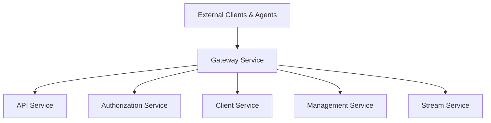
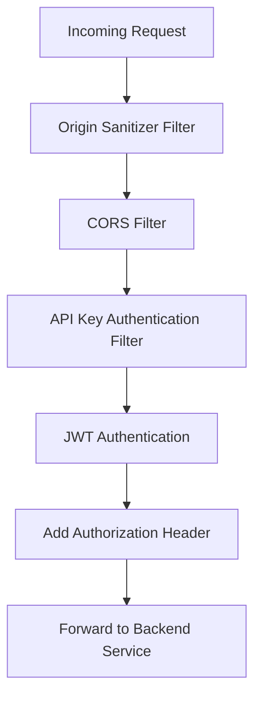
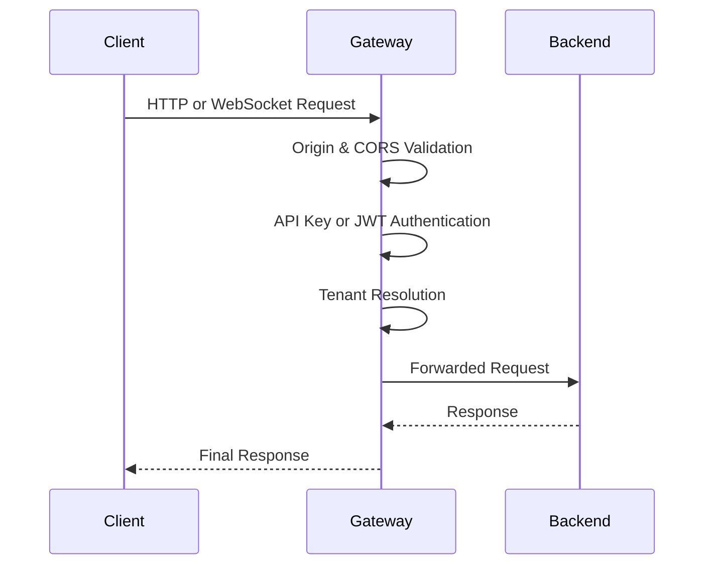

# Gateway Service Application

## Overview
The **Gateway Service Application** is the primary edge entry point for the OpenFrame platform. It is responsible for securely routing external client, agent, and tool traffic to the appropriate backend services while enforcing authentication, authorization, rate limiting, CORS, and protocol translation (HTTP and WebSocket).

Within the Flamingo / OpenFrame architecture, the gateway acts as:
- A **security boundary** between the public internet and internal services
- A **protocol-aware reverse proxy** for REST and WebSocket traffic
- A **tenant-aware request router** for multi-tenant SaaS deployments

The gateway is implemented as a Spring Boot application and relies heavily on shared security and gateway-core libraries for consistent behavior across environments.

---

## Entry Point

### GatewayApplication

The module is bootstrapped by the `GatewayApplication` class.

```java
@SpringBootApplication
@ComponentScan(basePackages = {
    "com.openframe.gateway",
    "com.openframe.core",
    "com.openframe.data",
    "com.openframe.security"
})
public class GatewayApplication {
    public static void main(String[] args) {
        SpringApplication.run(GatewayApplication.class, args);
    }
}
```

**Responsibilities:**
- Starts the Spring Boot runtime
- Enables auto-configuration
- Aggregates gateway, core, data, and security components into a single runtime context

---

## High-Level Architecture

The gateway sits in front of multiple backend services (API, AuthZ, Client, Stream, Management) and applies cross-cutting concerns before forwarding requests.



---

## Core Responsibilities

### 1. Request Routing
- Routes HTTP and WebSocket traffic to internal services
- Normalizes paths and headers
- Handles tool-specific and agent-specific proxying

### 2. Security Enforcement
- JWT validation and issuer resolution
- API key authentication for integrations
- Origin and CORS enforcement
- Authorization header injection for downstream services

### 3. Multi-Tenancy Awareness
- Resolves tenant context from tokens, headers, or issuer URLs
- Ensures tenant isolation across all proxied requests

### 4. Protocol Mediation
- HTTP REST forwarding
- WebSocket proxying for tools and agents

---

## Gateway Core Components

The gateway behavior is primarily implemented in the **gateway_service_core** library.

### Configuration

| Component | Responsibility |
|----------|----------------|
| WebClientConfig | Reactive HTTP client configuration for downstream calls |
| WebSocketGatewayConfig | Enables and configures WebSocket proxy support |
| RateLimitConstants | Centralized rate-limiting configuration values |

### WebSocket Routing

| Component | Responsibility |
|---------|----------------|
| ToolAgentWebSocketProxyUrlFilter | Routes agent WebSocket traffic to tool agents |
| ToolApiWebSocketProxyUrlFilter | Routes WebSocket traffic to tool APIs |

### Controllers

| Controller | Purpose |
|-----------|---------|
| IntegrationController | Handles external integration callbacks and API access |
| InternalAuthProbeController | Internal authentication and health probes |

---

## Security Architecture

Security is enforced using a layered filter-based model.



### Key Security Components

| Component | Description |
|----------|-------------|
| GatewaySecurityConfig | Main Spring Security configuration |
| JwtAuthConfig | JWT validation and decoding configuration |
| IssuerUrlProvider | Resolves tenant-specific issuer URLs |
| ApiKeyAuthenticationFilter | Validates API keys for integrations |
| AddAuthorizationHeaderFilter | Injects downstream Authorization headers |
| OriginSanitizerFilter | Cleans and validates request origin headers |
| CorsConfig / CorsDisableConfig | Enables or disables CORS per environment |

---

## Request Lifecycle

The typical lifecycle of a request through the gateway is shown below.



---

## Interaction With Other Services

The gateway does not contain business logic. Instead, it delegates responsibilities:

- **API Service**: Domain APIs, GraphQL, REST controllers, DTO handling
- **Authorization Service**: OAuth2, OIDC, SSO, tenant registration, login flows
- **Client Service**: Agent registration, heartbeats, metrics ingestion
- **Management Service**: Tool management, release versions, schedulers
- **Stream Service**: Event streaming, Kafka processing, enrichment

The gateway ensures all interactions are:
- Authenticated
- Authorized
- Tenant-scoped

---

## Deployment Characteristics

- Stateless Spring Boot service
- Horizontally scalable
- Designed to sit behind a load balancer or ingress controller
- Supports both HTTP and WebSocket traffic

---

## Summary

The **Gateway Service Application** is a critical infrastructure component of OpenFrame. It centralizes security, routing, and protocol handling while keeping backend services focused on domain-specific logic. By leveraging shared gateway and security libraries, it ensures consistent enforcement of authentication, authorization, and tenant isolation across the entire platform.
