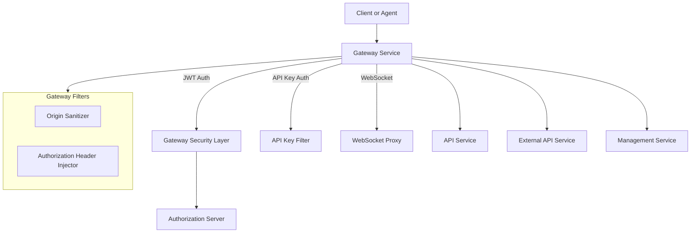

# Gateway Service – Application & Security

## Overview
The **Gateway Service** is the unified entry point for the OpenFrame / Flamingo platform. It is built on **Spring Cloud Gateway (WebFlux)** and is responsible for:

- Acting as the single ingress for UI, agent, tool, WebSocket, and external API traffic
- Enforcing authentication and authorization (JWT, API keys)
- Performing request pre-processing (token resolution, CORS, origin sanitization)
- Routing traffic to downstream services (API, authorization server, management, stream, external API)

This module focuses on **application bootstrap**, **reactive security**, and **cross-cutting gateway concerns**.

---

## Core Responsibilities

- **Reactive Gateway Bootstrap** – application startup and component scanning
- **JWT-based Security** – multi-issuer, multi-tenant JWT validation
- **API Key Authentication** – secure access to `/external-api/**`
- **Request Enrichment** – inject authorization headers and user context
- **CORS & Origin Handling** – SaaS vs OSS deployment flexibility
- **Rate Limiting Signals** – response headers and enforcement hooks

---

## High-Level Architecture



---

## Application Bootstrap

### `GatewayApplication`

**Component:** `GatewayApplication`

- Entry point for the Gateway Service
- Uses `@SpringBootApplication` and explicit `@ComponentScan`
- Brings together gateway, security, data, and core modules

**Key Scanned Packages:**
- `com.openframe.gateway`
- `com.openframe.core`
- `com.openframe.data`
- `com.openframe.security`

---

## Configuration Overview

### WebClient Configuration

The gateway uses a shared **reactive WebClient** for outbound calls.

**Component:** `WebClientConfig`

Responsibilities:
- Centralized timeout configuration
- Netty-based reactive HTTP client
- Consistent behavior for downstream service calls

---

## Security Architecture

Security in the Gateway is **reactive**, **multi-tenant**, and **multi-strategy**.

### Key Concepts

- **JWT Resource Server** – validates bearer tokens
- **Issuer-based Authentication Manager Resolution** – supports multiple tenants
- **Role & Scope Mapping** – unified authority model
- **Pre-auth Filters** – normalize token location

A detailed breakdown is provided in:
- [Gateway Security Configuration](gateway_security.md)

---

## API Key Authentication

External APIs are protected using **API key authentication**.

**Scope:** `/external-api/**`

Flow summary:
1. Request intercepted by API key filter
2. `X-API-Key` header required
3. API key validated and usage recorded
4. Rate limits evaluated
5. User context headers injected

Detailed behavior is documented in:
- [API Key Authentication Filter](gateway_api_key_filter.md)

---

## Gateway Filters

The gateway applies multiple **WebFlux filters** before routing requests.

| Filter | Purpose |
|------|--------|
| OriginSanitizerFilter | Removes invalid `Origin: null` headers |
| AddAuthorizationHeaderFilter | Resolves tokens from cookies, headers, or query params |
| ApiKeyAuthenticationFilter | Secures `/external-api/**` endpoints |

See:
- [Gateway Request Filters](gateway_filters.md)

---

## Multi-Tenant JWT Handling

JWT validation supports:

- Static issuer (platform-level)
- Dynamic tenant issuers
- Super-tenant fallback

Issuer resolution is backed by tenant data and cached for performance.

See:
- [JWT Authentication & Issuer Resolution](gateway_jwt_auth.md)

---

## CORS Strategy

The gateway supports two CORS modes:

- **Standard CORS** – configurable via Spring Cloud Gateway
- **Disabled CORS** – permissive mode for SaaS deployments

Behavior is controlled via:

```text
openframe.gateway.disable-cors=true|false
```

---

## How This Module Fits the System

The Gateway Service:

- Sits in front of **all backend services**
- Delegates authentication to the Authorization Server
- Forwards authenticated requests to API, Management, Stream, and External API services
- Provides a single, secure surface for frontend, agents, and integrations

It is tightly coupled with:
- Authorization Server (JWT issuing)
- API Service (business APIs)
- External API Service (third-party access)

---

## Summary

The `gateway_service_app_and_security` module provides:

- A robust, reactive entry point for OpenFrame
- Centralized security enforcement
- Flexible authentication strategies (JWT + API keys)
- Deployment-aware CORS and request handling

This makes it a **critical backbone service** for both OSS and SaaS deployments.
