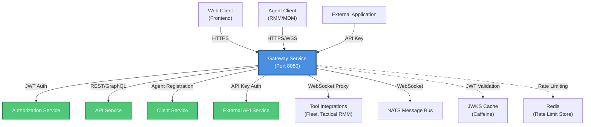
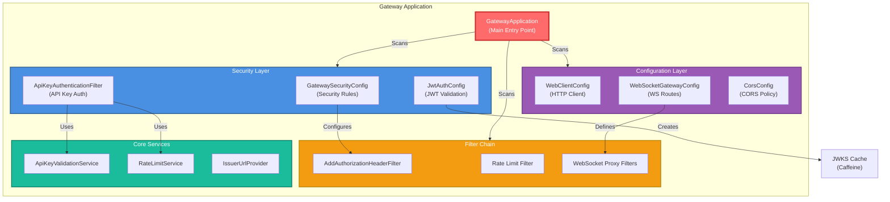
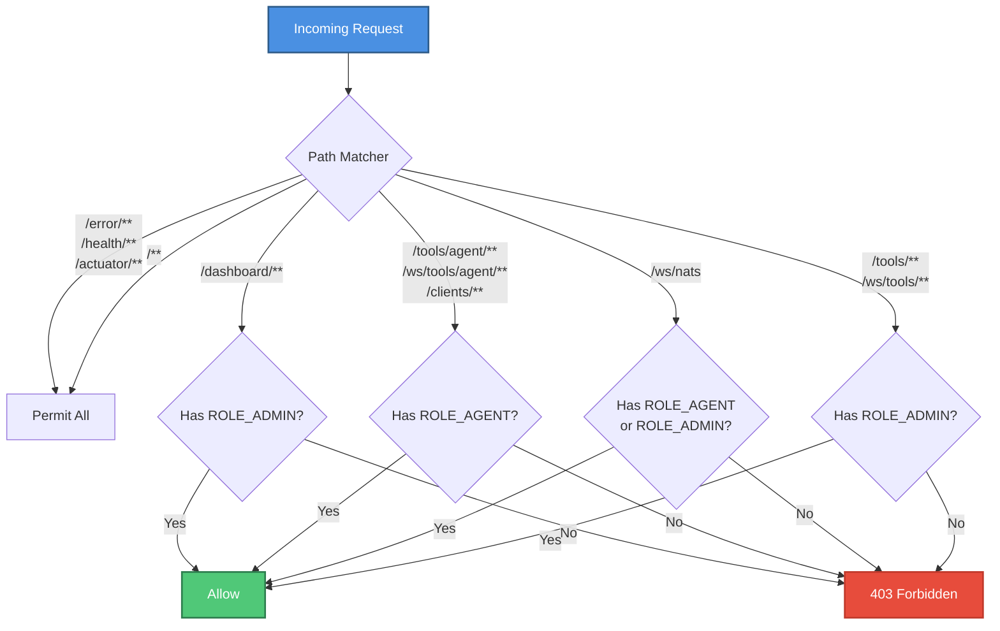
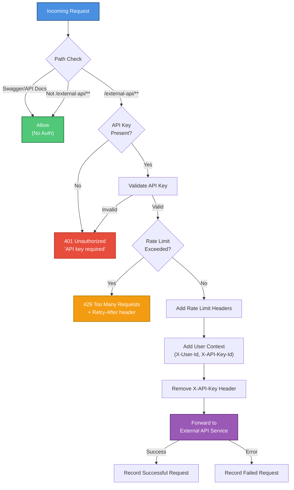
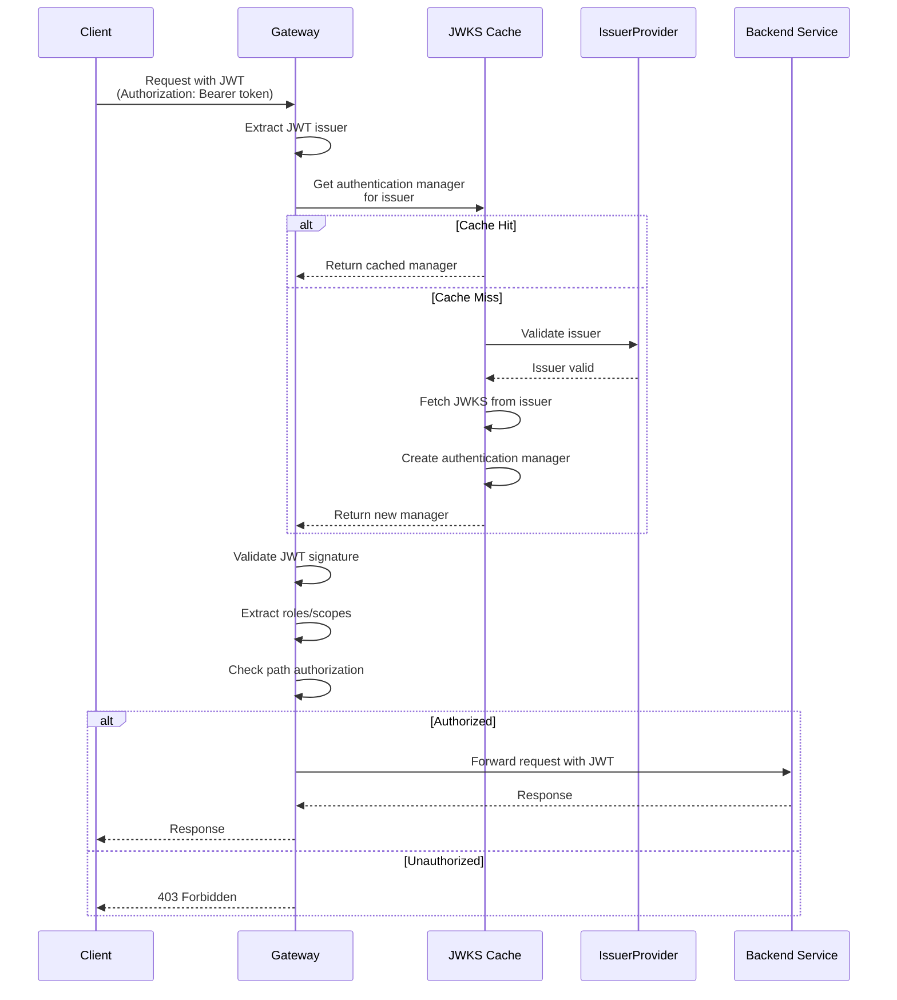
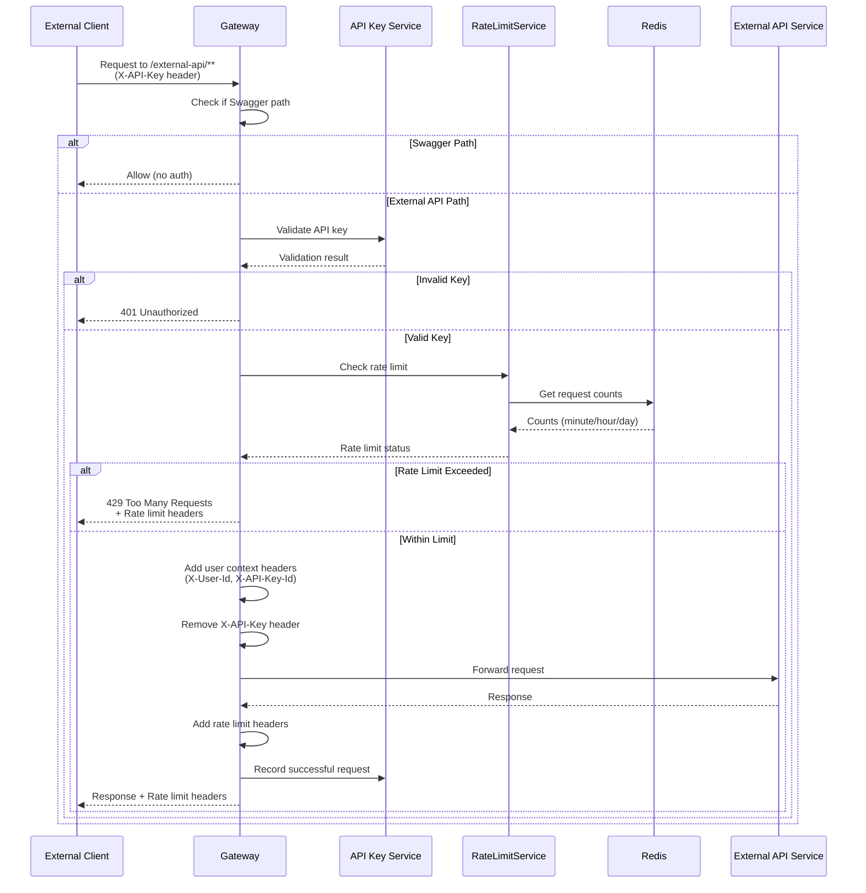
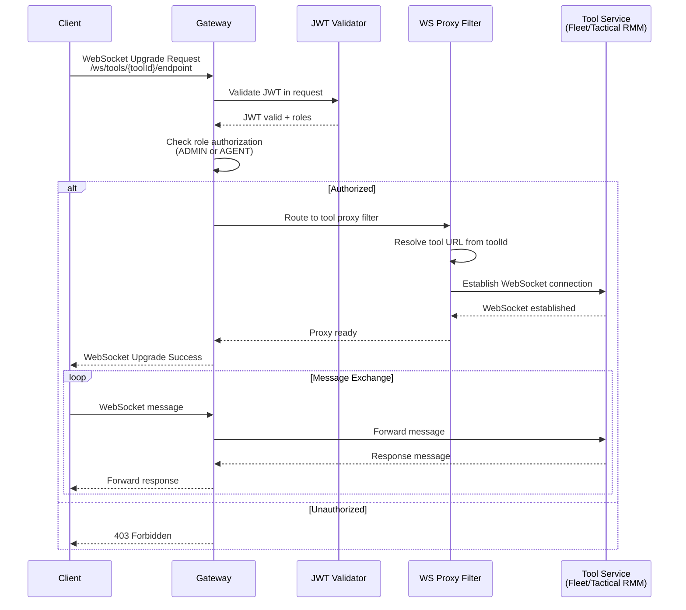

# Gateway Service Application

## Overview

The **Gateway Service Application** is the central entry point and API gateway for the OpenFrame platform. Built on Spring Cloud Gateway with reactive WebFlux, it provides intelligent request routing, authentication/authorization, rate limiting, WebSocket proxying, and security enforcement across all backend microservices.

As the unified ingress point, the gateway handles:
- **JWT-based authentication** with multi-tenant issuer support
- **API key authentication** for external API access with rate limiting
- **WebSocket proxying** for real-time tool integrations and NATS messaging
- **Request routing** to backend services (API, Client, Authorization, External API)
- **Security enforcement** with role-based access control (RBAC)
- **CORS management** for cross-origin requests

---

## Architecture Overview

### System Context



### Component Architecture



---

## Core Components

### 1. GatewayApplication (Main Entry Point)

**Location:** `openframe.services.openframe-gateway.src.main.java.com.openframe.gateway.GatewayApplication`

**Purpose:** Spring Boot application entry point that bootstraps the gateway service with component scanning across gateway, core, data, and security packages.

**Key Responsibilities:**
- Application initialization and startup
- Component scanning configuration
- Spring context bootstrapping

**Component Scanning:**
```java
@ComponentScan(basePackages = {
    "com.openframe.gateway",    // Gateway-specific components
    "com.openframe.core",       // Shared core utilities
    "com.openframe.data",       // Data layer components
    "com.openframe.security"    // Security infrastructure
})
```

**Configuration:**
```java
@SpringBootApplication
@RequiredArgsConstructor
public class GatewayApplication {
    public static void main(String[] args) {
        SpringApplication.run(GatewayApplication.class, args);
    }
}
```

---

## Configuration Components

### 2. WebClientConfig

**Purpose:** Configures reactive `WebClient` for HTTP communication with backend services.

**Features:**
- Connection timeout: 30 seconds
- Read/write timeout: 30 seconds
- Reactive HTTP client with Netty

**Configuration:**
```java
@Bean
public WebClient.Builder webClientBuilder() {
    HttpClient httpClient = HttpClient.create()
        .option(ChannelOption.CONNECT_TIMEOUT_MILLIS, 30000)
        .responseTimeout(Duration.ofSeconds(30))
        .doOnConnected(conn -> 
            conn.addHandlerLast(new ReadTimeoutHandler(30, TimeUnit.SECONDS))
                .addHandlerLast(new WriteTimeoutHandler(30, TimeUnit.SECONDS))
        );
    
    return WebClient.builder()
        .clientConnector(new ReactorClientHttpConnector(httpClient));
}
```

### 3. WebSocketGatewayConfig

**Purpose:** Configures WebSocket routing for tool integrations and NATS messaging.

**WebSocket Routes:**

| Route Pattern | Purpose | Target |
|---------------|---------|--------|
| `/ws/tools/agent/{toolId}/**` | Agent-to-tool WebSocket proxy | Dynamic tool URL |
| `/ws/tools/{toolId}/**` | API-to-tool WebSocket proxy | Dynamic tool URL |
| `/ws/nats` | NATS WebSocket connection | NATS server |

**Route Configuration:**
```java
@Bean
public RouteLocator customRouteLocator(
    RouteLocatorBuilder builder,
    ToolApiWebSocketProxyUrlFilter toolApiWebSocketProxyUrlFilter,
    ToolAgentWebSocketProxyUrlFilter toolAgentWebSocketProxyUrlFilter,
    @Value("${nats-ws-url}") String natsWsUrl
) {
    return builder.routes()
        .route("agent_gateway_websocket_route", r -> r
            .path(TOOLS_AGENT_WS_ENDPOINT_PREFIX + "{toolId}/**")
            .filters(f -> f.filter(toolAgentWebSocketProxyUrlFilter))
            .uri("no://op"))
        .route("api_gateway_websocket_route", r -> r
            .path(TOOLS_API_WS_ENDPOINT_PREFIX + "{toolId}/**")
            .filters(f -> f.filter(toolApiWebSocketProxyUrlFilter))
            .uri("no://op"))
        .route("nats_websocket_route", r -> r
            .path(NATS_WS_ENDPOINT_PATH)
            .uri(natsWsUrl))
        .build();
}
```

**Security Decorator:**
```java
@Bean
@Primary
public WebSocketService webSocketServiceDecorator(
    RequestJwtСlaimsReader requestJwtСlaimsReader,
    WebSocketService defaultWebSocketService
) {
    return new WebSocketServiceSecurityDecorator(
        defaultWebSocketService, 
        requestJwtСlaimsReader
    );
}
```

### 4. CorsConfig

**Purpose:** Configures Cross-Origin Resource Sharing (CORS) for web client access.

**Features:**
- Configurable via `spring.cloud.gateway.globalcors.cors-configurations`
- Can be disabled with `openframe.gateway.disable-cors=true`
- Global CORS policy for all routes

**Configuration:**
```java
@Bean
@ConfigurationProperties(prefix = "spring.cloud.gateway.globalcors.cors-configurations.[/**]")
public CorsConfiguration corsConfiguration() {
    return new CorsConfiguration();
}

@Bean
public CorsWebFilter corsWebFilter(CorsConfiguration corsConfiguration) {
    UrlBasedCorsConfigurationSource source = new UrlBasedCorsConfigurationSource();
    source.registerCorsConfiguration("/**", corsConfiguration);
    return new CorsWebFilter(source);
}
```

---

## Security Components

### 5. GatewaySecurityConfig

**Purpose:** Central security configuration defining authentication, authorization, and access control rules.

**Security Features:**
- JWT-based authentication with multi-issuer support
- Role-based access control (RBAC)
- OAuth2 resource server configuration
- Path-based authorization rules

**Role Definitions:**
- `ADMIN` - Administrative users (dashboard access)
- `AGENT` - RMM/MDM agents (client service access)

**Authorization Rules:**



**Path Authorization Configuration:**
```java
.authorizeExchange(exchanges -> exchanges
    .pathMatchers(HttpMethod.OPTIONS, "/**").permitAll()
    .pathMatchers(
        "/error/**",
        "/health/**",
        CLIENTS_PREFIX + "/metrics/**",
        CLIENTS_PREFIX + "/api/agents/register",
        CLIENTS_PREFIX + "/oauth/token",
        managementContextPath + "/**"
    ).permitAll()
    // API service - Admin only
    .pathMatchers(DASHBOARD_PREFIX + "/**").hasRole(ADMIN)
    // Agent tools - Agent only
    .pathMatchers(TOOLS_PREFIX + "/agent/**").hasRole(AGENT)
    .pathMatchers(WS_TOOLS_PREFIX + "/agent/**").hasRole(AGENT)
    // NATS - Agent or Admin
    .pathMatchers(NATS_WS_ENDPOINT_PATH).hasAnyRole(AGENT, ADMIN)
    // Client service - Agent only
    .pathMatchers(CLIENTS_PREFIX + "/**").hasRole(AGENT)
    // API tools - Admin only
    .pathMatchers(TOOLS_PREFIX + "/**").hasRole(ADMIN)
    .pathMatchers(WS_TOOLS_PREFIX + "/**").hasRole(ADMIN)
    // UI - Permit all
    .pathMatchers("/**").permitAll()
)
```

**JWT Authentication Converter:**
```java
@Bean
public ReactiveJwtAuthenticationConverter reactiveJwtAuthenticationConverter() {
    JwtGrantedAuthoritiesConverter rolesConverter = new JwtGrantedAuthoritiesConverter();
    rolesConverter.setAuthoritiesClaimName("roles");
    rolesConverter.setAuthorityPrefix("ROLE_");
    
    JwtGrantedAuthoritiesConverter scopesConverter = new JwtGrantedAuthoritiesConverter();
    scopesConverter.setAuthoritiesClaimName("scope");
    scopesConverter.setAuthorityPrefix("SCOPE_");
    
    ReactiveJwtAuthenticationConverter jwtAuthenticationConverter = 
        new ReactiveJwtAuthenticationConverter();
    
    jwtAuthenticationConverter.setJwtGrantedAuthoritiesConverter(jwt -> {
        Flux<GrantedAuthority> roles = Flux.fromIterable(rolesConverter.convert(jwt));
        Flux<GrantedAuthority> scopes = Flux.fromIterable(scopesConverter.convert(jwt));
        return Flux.concat(roles, scopes);
    });
    
    jwtAuthenticationConverter.setPrincipalClaimName("sub");
    
    return jwtAuthenticationConverter;
}
```

### 6. JwtAuthConfig

**Purpose:** Configures JWT validation with multi-tenant issuer support and caching.

**Features:**
- **JWKS Caching** - Caffeine cache for JWT public keys
- **Multi-Issuer Support** - Validates JWTs from multiple authorization servers
- **Dynamic Issuer Discovery** - Fetches JWKS from issuer URLs
- **Strict Issuer Validation** - Validates against allowed issuer list

**Cache Configuration:**
```java
@Bean
public LoadingCache<String, ReactiveAuthenticationManager> issuerManagersCache(
    ReactiveJwtAuthenticationConverter converter,
    JwtConfig jwtConfig,
    IssuerUrlProvider issuerUrlProvider
) {
    return Caffeine.newBuilder()
        .maximumSize(maximumSize)
        .expireAfterWrite(expireAfter)
        .refreshAfterWrite(refreshAfter)
        .build(issuer -> {
            if (issuer.equals(jwtConfig.getIssuer())) {
                // Use local public key for primary issuer
                var pub = jwtConfig.loadPublicKey();
                var dec = NimbusReactiveJwtDecoder.withPublicKey(pub).build();
                dec.setJwtValidator(JwtValidators.createDefaultWithIssuer(issuer));
                var m = new JwtReactiveAuthenticationManager(dec);
                m.setJwtAuthenticationConverter(converter);
                return m;
            }
            
            // Fetch JWKS from remote issuer
            var dec = (NimbusReactiveJwtDecoder) 
                ReactiveJwtDecoders.fromIssuerLocation(issuer);
            
            var defaultValidator = JwtValidators.createDefault();
            var strictIssuerValidator = createStrictIssuerValidator(issuerUrlProvider);
            dec.setJwtValidator(
                new DelegatingOAuth2TokenValidator<>(defaultValidator, strictIssuerValidator)
            );
            
            var jwtManager = new JwtReactiveAuthenticationManager(dec);
            jwtManager.setJwtAuthenticationConverter(converter);
            return jwtManager;
        });
}
```

**Issuer Validation:**
```java
private OAuth2TokenValidator<Jwt> createStrictIssuerValidator(IssuerUrlProvider issuerUrlProvider) {
    return jwt -> {
        String iss = (jwt.getIssuer() != null ? jwt.getIssuer().toString() : null);
        var expectedList = issuerUrlProvider.getCachedIssuerUrl();
        if (expectedList == null || expectedList.isEmpty()) {
            return success();
        }
        if (expectedList.contains(iss)) return success();
        return OAuth2TokenValidatorResult.failure(
            new OAuth2Error(OAuth2ErrorCodes.INVALID_TOKEN, "Unexpected issuer", null)
        );
    };
}
```

**Configuration Properties:**
```yaml
openframe:
  security:
    jwt:
      cache:
        expire-after: 1h
        refresh-after: 30m
        maximum-size: 100
```

### 7. ApiKeyAuthenticationFilter

**Purpose:** Global filter for API key authentication and rate limiting on external API endpoints.

**Features:**
- **API Key Validation** - Validates API keys for `/external-api/**` endpoints
- **Rate Limiting** - Enforces per-minute, per-hour, and per-day limits
- **Request Tracking** - Records successful/failed requests
- **Rate Limit Headers** - Returns rate limit status in response headers
- **Swagger Bypass** - Allows unauthenticated access to API documentation

**Filter Order:** `-100` (executes early in filter chain)

**Request Flow:**



**Protected Paths:**
```java
private static final String EXTERNAL_API_PREFIX = "/external-api/";
```

**Bypassed Paths (Swagger):**
```java
private static final String API_DOCS_PATH = "/api-docs";
private static final String SWAGGER_UI_PATH = "/swagger-ui";
private static final String SWAGGER_UI_HTML = "/swagger-ui.html";
private static final String WEBJARS_PATH = "/webjars";
```

**API Key Validation:**
```java
return apiKeyValidationService.validateApiKey(apiKey)
    .flatMap(validationResult -> {
        if (!validationResult.isValid()) {
            return handleUnauthorized(exchange, validationResult.getErrorMessage());
        }
        
        ApiKey apiKeyObj = validationResult.getApiKey();
        String keyId = apiKeyObj.getKeyId();
        
        return rateLimitService.isAllowed(keyId)
            .flatMap(allowed -> {
                if (!allowed) {
                    return handleRateLimitExceeded(exchange, keyId);
                }
                return processAllowedRequest(keyId, exchange, chain, apiKeyObj);
            });
    });
```

**Rate Limit Headers:**
```java
private void addHeadersToResponse(HttpHeaders headers, RateLimitStatus rateLimitStatus) {
    headers.add(X_RATE_LIMIT_LIMIT_MINUTE, 
        String.valueOf(rateLimitStatus.minuteLimit()));
    headers.add(X_RATE_LIMIT_REMAINING_MINUTE, 
        String.valueOf(Math.max(0, rateLimitStatus.minuteLimit() - rateLimitStatus.minuteRequests())));
    headers.add(X_RATE_LIMIT_LIMIT_HOUR, 
        String.valueOf(rateLimitStatus.hourLimit()));
    headers.add(X_RATE_LIMIT_REMAINING_HOUR, 
        String.valueOf(Math.max(0, rateLimitStatus.hourLimit() - rateLimitStatus.hourRequests())));
    headers.add(X_RATE_LIMIT_LIMIT_DAY, 
        String.valueOf(rateLimitStatus.dayLimit()));
    headers.add(X_RATE_LIMIT_REMAINING_DAY, 
        String.valueOf(Math.max(0, rateLimitStatus.dayLimit() - rateLimitStatus.dayRequests())));
}
```

**User Context Propagation:**
```java
private Mono<Void> addUserContextAndContinue(
    ServerWebExchange exchange, 
    GatewayFilterChain chain, 
    ApiKey apiKey
) {
    var modifiedRequest = exchange.getRequest().mutate()
        .header(X_API_KEY_ID, apiKey.getKeyId())
        .header(X_USER_ID, apiKey.getUserId())
        .headers(headers -> headers.remove(X_API_KEY))
        .build();
    
    var modifiedExchange = exchange.mutate()
        .request(modifiedRequest)
        .build();
    
    return chain.filter(modifiedExchange);
}
```

---

## Request Flow

### JWT Authentication Flow



### API Key Authentication Flow



### WebSocket Proxy Flow



---

## Integration Points

### Upstream Services (Routed To)

| Service | Path Pattern | Authentication | Purpose |
|---------|--------------|----------------|---------|
| **Authorization Service** | `/oauth/**`, `/login/**` | None (public) | OAuth2 flows, login, registration |
| **API Service** | `/dashboard/**`, `/api/**` | JWT (ADMIN) | GraphQL/REST API for admin dashboard |
| **Client Service** | `/clients/**` | JWT (AGENT) | Agent registration, heartbeat, metrics |
| **External API Service** | `/external-api/**` | API Key | Public API for external integrations |
| **Tool Integrations** | `/tools/**`, `/ws/tools/**` | JWT (ADMIN/AGENT) | RMM/MDM tool proxying |
| **NATS** | `/ws/nats` | JWT (ADMIN/AGENT) | Real-time messaging |

### Downstream Dependencies

| Dependency | Purpose | Configuration |
|------------|---------|---------------|
| **Redis** | Rate limiting storage | `spring.redis.*` |
| **MongoDB** | API key storage | Via `ApiKeyValidationService` |
| **NATS** | WebSocket messaging | `nats-ws-url` property |
| **Authorization Server** | JWT issuer, JWKS endpoint | `openframe.security.jwt.issuer` |

### Related Modules

- **[gateway_service_configuration](gateway_service_configuration.md)** - Configuration components (WebClient, WebSocket, CORS)
- **[gateway_service_security](gateway_service_security.md)** - Security components (JWT, API Key, filters)
- **[authorization_service](authorization_service.md)** - JWT issuer and OAuth2 flows
- **[api_service](api_service.md)** - Backend API service
- **[client_service](client_service.md)** - Agent client service
- **[external_api](external_api.md)** - External API service
- **[security_core](security_core.md)** - Shared security utilities

---

## Configuration

### Application Properties

**Gateway Configuration:**
```yaml
server:
  port: 8080

spring:
  application:
    name: openframe-gateway
  
  cloud:
    gateway:
      globalcors:
        cors-configurations:
          '[/**]':
            allowed-origins: "*"
            allowed-methods: "*"
            allowed-headers: "*"
            allow-credentials: true
            max-age: 3600
      
      routes:
        # Routes defined programmatically in WebSocketGatewayConfig
        # and via Spring Cloud Gateway auto-configuration
```

**Security Configuration:**
```yaml
openframe:
  security:
    jwt:
      issuer: ${JWT_ISSUER:http://localhost:9000}
      public-key-location: ${JWT_PUBLIC_KEY_LOCATION:classpath:public-key.pem}
      cache:
        expire-after: ${JWT_CACHE_EXPIRE:1h}
        refresh-after: ${JWT_CACHE_REFRESH:30m}
        maximum-size: ${JWT_CACHE_SIZE:100}
  
  gateway:
    disable-cors: ${DISABLE_CORS:false}
```

**Rate Limiting Configuration:**
```yaml
openframe:
  rate-limit:
    include-headers: ${RATE_LIMIT_HEADERS:true}
    default:
      minute: ${RATE_LIMIT_MINUTE:60}
      hour: ${RATE_LIMIT_HOUR:1000}
      day: ${RATE_LIMIT_DAY:10000}
```

**WebSocket Configuration:**
```yaml
nats-ws-url: ${NATS_WS_URL:ws://localhost:4222}
```

**Management Endpoints:**
```yaml
management:
  endpoints:
    web:
      base-path: /actuator
      exposure:
        include: health,info,metrics,prometheus
  endpoint:
    health:
      show-details: when-authorized
```

### Environment Variables

| Variable | Description | Default |
|----------|-------------|---------|
| `JWT_ISSUER` | Primary JWT issuer URL | `http://localhost:9000` |
| `JWT_PUBLIC_KEY_LOCATION` | Public key for JWT validation | `classpath:public-key.pem` |
| `JWT_CACHE_EXPIRE` | JWKS cache expiration | `1h` |
| `JWT_CACHE_REFRESH` | JWKS cache refresh interval | `30m` |
| `JWT_CACHE_SIZE` | Maximum cached issuers | `100` |
| `NATS_WS_URL` | NATS WebSocket URL | `ws://localhost:4222` |
| `DISABLE_CORS` | Disable CORS filter | `false` |
| `RATE_LIMIT_HEADERS` | Include rate limit headers | `true` |
| `RATE_LIMIT_MINUTE` | Requests per minute | `60` |
| `RATE_LIMIT_HOUR` | Requests per hour | `1000` |
| `RATE_LIMIT_DAY` | Requests per day | `10000` |

---

## Deployment

### Docker Deployment

**Dockerfile:**
```dockerfile
FROM eclipse-temurin:17-jre-alpine

WORKDIR /app

COPY target/openframe-gateway-*.jar app.jar

EXPOSE 8080

ENV JAVA_OPTS="-Xmx512m -Xms256m"

ENTRYPOINT ["sh", "-c", "java $JAVA_OPTS -jar app.jar"]
```

**Docker Compose:**
```yaml
version: '3.8'

services:
  gateway:
    image: openframe/gateway:latest
    ports:
      - "8080:8080"
    environment:
      - JWT_ISSUER=http://authorization-service:9000
      - NATS_WS_URL=ws://nats:4222
      - SPRING_REDIS_HOST=redis
      - SPRING_DATA_MONGODB_URI=mongodb://mongo:27017/openframe
    depends_on:
      - redis
      - mongo
      - nats
      - authorization-service
    networks:
      - openframe-network

  redis:
    image: redis:7-alpine
    ports:
      - "6379:6379"
    networks:
      - openframe-network

  nats:
    image: nats:latest
    ports:
      - "4222:4222"
      - "8222:8222"
    command: "--websocket_port 4222"
    networks:
      - openframe-network

networks:
  openframe-network:
    driver: bridge
```

### Kubernetes Deployment

**Deployment:**
```yaml
apiVersion: apps/v1
kind: Deployment
metadata:
  name: gateway-service
  namespace: openframe
spec:
  replicas: 3
  selector:
    matchLabels:
      app: gateway-service
  template:
    metadata:
      labels:
        app: gateway-service
    spec:
      containers:
      - name: gateway
        image: openframe/gateway:latest
        ports:
        - containerPort: 8080
          name: http
        env:
        - name: JWT_ISSUER
          value: "http://authorization-service:9000"
        - name: NATS_WS_URL
          value: "ws://nats:4222"
        - name: SPRING_REDIS_HOST
          value: "redis-service"
        - name: SPRING_DATA_MONGODB_URI
          valueFrom:
            secretKeyRef:
              name: mongodb-secret
              key: connection-string
        resources:
          requests:
            memory: "512Mi"
            cpu: "500m"
          limits:
            memory: "1Gi"
            cpu: "1000m"
        livenessProbe:
          httpGet:
            path: /actuator/health/liveness
            port: 8080
          initialDelaySeconds: 30
          periodSeconds: 10
        readinessProbe:
          httpGet:
            path: /actuator/health/readiness
            port: 8080
          initialDelaySeconds: 20
          periodSeconds: 5
```

**Service:**
```yaml
apiVersion: v1
kind: Service
metadata:
  name: gateway-service
  namespace: openframe
spec:
  type: LoadBalancer
  selector:
    app: gateway-service
  ports:
  - port: 80
    targetPort: 8080
    protocol: TCP
    name: http
```

**Ingress:**
```yaml
apiVersion: networking.k8s.io/v1
kind: Ingress
metadata:
  name: gateway-ingress
  namespace: openframe
  annotations:
    cert-manager.io/cluster-issuer: "letsencrypt-prod"
    nginx.ingress.kubernetes.io/websocket-services: "gateway-service"
spec:
  ingressClassName: nginx
  tls:
  - hosts:
    - api.openframe.example.com
    secretName: gateway-tls
  rules:
  - host: api.openframe.example.com
    http:
      paths:
      - path: /
        pathType: Prefix
        backend:
          service:
            name: gateway-service
            port:
              number: 80
```

---

## Monitoring and Observability

### Health Checks

**Endpoints:**
- `GET /actuator/health` - Overall health status
- `GET /actuator/health/liveness` - Kubernetes liveness probe
- `GET /actuator/health/readiness` - Kubernetes readiness probe

**Health Indicators:**
- Redis connectivity
- MongoDB connectivity
- NATS connectivity
- Downstream service availability

### Metrics

**Prometheus Metrics:**
```text
# Gateway-specific metrics
gateway_requests_total{path, method, status}
gateway_request_duration_seconds{path, method}
gateway_websocket_connections{route}
gateway_rate_limit_exceeded_total{api_key_id}
gateway_jwt_validation_duration_seconds{issuer}
gateway_jwt_cache_hits_total
gateway_jwt_cache_misses_total

# Spring Cloud Gateway metrics
spring_cloud_gateway_requests_seconds{route, status}
spring_cloud_gateway_route_count
```

**Metrics Endpoint:**
```bash
curl http://localhost:8080/actuator/prometheus
```

### Logging

**Log Levels:**
```yaml
logging:
  level:
    com.openframe.gateway: INFO
    com.openframe.gateway.filter: DEBUG
    com.openframe.gateway.security: DEBUG
    org.springframework.cloud.gateway: INFO
    org.springframework.security: DEBUG
```

**Structured Logging:**
```json
{
  "timestamp": "2024-01-15T10:30:45.123Z",
  "level": "INFO",
  "logger": "com.openframe.gateway.filter.ApiKeyAuthenticationFilter",
  "message": "API key validated successfully",
  "context": {
    "keyId": "key_abc123",
    "userId": "user_xyz789",
    "path": "/external-api/devices",
    "method": "GET",
    "rateLimitStatus": {
      "minuteRequests": 15,
      "minuteLimit": 60,
      "hourRequests": 234,
      "hourLimit": 1000
    }
  }
}
```

---

## Security Considerations

### JWT Security

1. **Multi-Issuer Validation**
   - Validates JWTs from multiple authorization servers
   - Strict issuer whitelist validation
   - JWKS caching to prevent JWKS endpoint abuse

2. **Token Validation**
   - Signature verification using RSA public keys
   - Expiration time validation
   - Issuer validation
   - Audience validation (if configured)

3. **Role-Based Access Control**
   - Extracts roles from JWT claims
   - Enforces path-based authorization
   - Supports both roles and scopes

### API Key Security

1. **Key Validation**
   - Validates API key against MongoDB
   - Checks key expiration
   - Verifies key is active

2. **Rate Limiting**
   - Per-minute, per-hour, and per-day limits
   - Redis-based distributed rate limiting
   - Prevents API abuse

3. **Request Tracking**
   - Records successful/failed requests
   - Monitors API key usage patterns
   - Detects anomalous behavior

### WebSocket Security

1. **JWT Authentication**
   - Validates JWT before WebSocket upgrade
   - Enforces role-based access
   - Decorates WebSocket service with security

2. **Connection Limits**
   - Limits concurrent WebSocket connections
   - Prevents resource exhaustion

### CORS Security

1. **Configurable Origins**
   - Whitelist allowed origins
   - Supports wildcard for development
   - Enforces credentials policy

2. **Method Restrictions**
   - Configurable allowed methods
   - Preflight request handling

---

## Troubleshooting

### Common Issues

#### 1. JWT Validation Failures

**Symptoms:**
- 401 Unauthorized responses
- "Invalid token" errors in logs

**Causes:**
- Expired JWT
- Invalid signature
- Issuer not in whitelist
- JWKS endpoint unreachable

**Solutions:**
```bash
# Check JWT claims
echo $JWT_TOKEN | cut -d'.' -f2 | base64 -d | jq

# Verify issuer is accessible
curl http://authorization-service:9000/.well-known/jwks.json

# Check JWKS cache
curl http://localhost:8080/actuator/metrics/gateway_jwt_cache_hits_total
curl http://localhost:8080/actuator/metrics/gateway_jwt_cache_misses_total

# Enable debug logging
export LOGGING_LEVEL_COM_OPENFRAME_GATEWAY_SECURITY=DEBUG
```

#### 2. Rate Limit Issues

**Symptoms:**
- 429 Too Many Requests responses
- Rate limit headers showing 0 remaining

**Causes:**
- Exceeded rate limits
- Redis connectivity issues
- Incorrect rate limit configuration

**Solutions:**
```bash
# Check Redis connectivity
redis-cli -h redis ping

# Check rate limit status
curl -H "X-API-Key: your-key" \
  -v http://localhost:8080/external-api/devices \
  | grep X-Rate-Limit

# Reset rate limit (Redis)
redis-cli DEL "rate_limit:key_abc123:minute"
redis-cli DEL "rate_limit:key_abc123:hour"
redis-cli DEL "rate_limit:key_abc123:day"

# Adjust rate limits
export RATE_LIMIT_MINUTE=120
export RATE_LIMIT_HOUR=2000
```

#### 3. WebSocket Connection Failures

**Symptoms:**
- WebSocket upgrade fails
- Connection drops immediately
- "403 Forbidden" on WebSocket upgrade

**Causes:**
- Invalid JWT
- Missing role authorization
- Tool service unreachable
- NATS connectivity issues

**Solutions:**
```bash
# Test WebSocket connection
wscat -c "ws://localhost:8080/ws/nats" \
  -H "Authorization: Bearer $JWT_TOKEN"

# Check NATS connectivity
curl http://nats:8222/varz

# Verify tool service URL
curl http://localhost:8080/actuator/configprops | jq '.nats-ws-url'

# Enable WebSocket debug logging
export LOGGING_LEVEL_ORG_SPRINGFRAMEWORK_WEB_SOCKET=DEBUG
```

#### 4. CORS Errors

**Symptoms:**
- "CORS policy" errors in browser console
- Preflight requests failing

**Causes:**
- Origin not in allowed list
- Missing CORS headers
- CORS disabled

**Solutions:**
```bash
# Check CORS configuration
curl http://localhost:8080/actuator/configprops | jq '.spring.cloud.gateway.globalcors'

# Test preflight request
curl -X OPTIONS http://localhost:8080/api/devices \
  -H "Origin: http://localhost:3000" \
  -H "Access-Control-Request-Method: GET" \
  -v

# Enable CORS (if disabled)
export OPENFRAME_GATEWAY_DISABLE_CORS=false

# Add allowed origin
export SPRING_CLOUD_GATEWAY_GLOBALCORS_CORS_CONFIGURATIONS_[/**]_ALLOWED_ORIGINS=http://localhost:3000
```

---

## Performance Tuning

### JVM Tuning

```bash
# Production JVM settings
export JAVA_OPTS="-Xmx2g -Xms1g \
  -XX:+UseG1GC \
  -XX:MaxGCPauseMillis=200 \
  -XX:+HeapDumpOnOutOfMemoryError \
  -XX:HeapDumpPath=/var/log/gateway/heap-dump.hprof"
```

### Connection Pool Tuning

```yaml
spring:
  cloud:
    gateway:
      httpclient:
        pool:
          max-connections: 500
          max-idle-time: 30s
          max-life-time: 60s
        connect-timeout: 5000
        response-timeout: 30s
```

### Cache Tuning

```yaml
openframe:
  security:
    jwt:
      cache:
        maximum-size: 1000
        expire-after: 2h
        refresh-after: 1h
```

### Rate Limit Tuning

```yaml
openframe:
  rate-limit:
    default:
      minute: 120
      hour: 5000
      day: 50000
```

---

## Development

### Local Development Setup

**Prerequisites:**
- Java 17+
- Maven 3.8+
- Docker & Docker Compose
- Redis
- MongoDB
- NATS

**Start Dependencies:**
```bash
docker-compose up -d redis mongo nats authorization-service
```

**Run Gateway:**
```bash
mvn spring-boot:run \
  -Dspring-boot.run.arguments="\
    --jwt.issuer=http://localhost:9000 \
    --nats-ws-url=ws://localhost:4222 \
    --spring.redis.host=localhost \
    --spring.data.mongodb.uri=mongodb://localhost:27017/openframe"
```

**Test Endpoints:**
```bash
# Health check
curl http://localhost:8080/actuator/health

# JWT authentication
curl -H "Authorization: Bearer $JWT_TOKEN" \
  http://localhost:8080/dashboard/api/devices

# API key authentication
curl -H "X-API-Key: your-api-key" \
  http://localhost:8080/external-api/devices

# WebSocket connection
wscat -c "ws://localhost:8080/ws/nats" \
  -H "Authorization: Bearer $JWT_TOKEN"
```

### Testing

**Unit Tests:**
```bash
mvn test
```

**Integration Tests:**
```bash
mvn verify -P integration-tests
```

**Load Testing:**
```bash
# Install k6
brew install k6

# Run load test
k6 run scripts/load-test.js
```

**Load Test Script (k6):**
```javascript
import http from 'k6/http';
import { check } from 'k6';

export let options = {
  stages: [
    { duration: '30s', target: 50 },
    { duration: '1m', target: 100 },
    { duration: '30s', target: 0 },
  ],
};

export default function () {
  let response = http.get('http://localhost:8080/actuator/health', {
    headers: { 'Authorization': `Bearer ${__ENV.JWT_TOKEN}` },
  });
  
  check(response, {
    'status is 200': (r) => r.status === 200,
    'response time < 500ms': (r) => r.timings.duration < 500,
  });
}
```

---

## API Reference

### Health Endpoints

| Endpoint | Method | Description |
|----------|--------|-------------|
| `/actuator/health` | GET | Overall health status |
| `/actuator/health/liveness` | GET | Liveness probe |
| `/actuator/health/readiness` | GET | Readiness probe |

### Metrics Endpoints

| Endpoint | Method | Description |
|----------|--------|-------------|
| `/actuator/metrics` | GET | Available metrics |
| `/actuator/prometheus` | GET | Prometheus metrics |

### Routed Endpoints

| Path Pattern | Target Service | Authentication |
|--------------|----------------|----------------|
| `/oauth/**` | Authorization Service | None |
| `/login/**` | Authorization Service | None |
| `/dashboard/**` | API Service | JWT (ADMIN) |
| `/api/**` | API Service | JWT (ADMIN) |
| `/clients/**` | Client Service | JWT (AGENT) |
| `/external-api/**` | External API Service | API Key |
| `/tools/**` | Tool Integrations | JWT (ADMIN) |
| `/tools/agent/**` | Tool Integrations | JWT (AGENT) |
| `/ws/tools/**` | Tool Integrations | JWT (ADMIN) |
| `/ws/tools/agent/**` | Tool Integrations | JWT (AGENT) |
| `/ws/nats` | NATS | JWT (ADMIN/AGENT) |

---

## Additional Resources

### Documentation
- [Gateway Service Configuration](gateway_service_configuration.md)
- [Gateway Service Security](gateway_service_security.md)
- [Authorization Service](authorization_service.md)
- [API Service](api_service.md)
- [External API Service](external_api.md)

### External References
- [Spring Cloud Gateway Documentation](https://spring.io/projects/spring-cloud-gateway)
- [Spring Security OAuth2 Resource Server](https://docs.spring.io/spring-security/reference/servlet/oauth2/resource-server/index.html)
- [WebFlux Security](https://docs.spring.io/spring-security/reference/reactive/index.html)
- [Caffeine Cache](https://github.com/ben-manes/caffeine)

### Community
- **OpenMSP Slack:** [Join Community](https://join.slack.com/t/openmsp/shared_invite/zt-36bl7mx0h-3~U2nFH6nqHqoTPXMaHEHA)
- **Website:** [https://www.flamingo.run/openframe](https://www.flamingo.run/openframe)

---

**Last Updated:** 2024-01-15  
**Version:** 1.0.0  
**Maintainer:** OpenFrame Team
