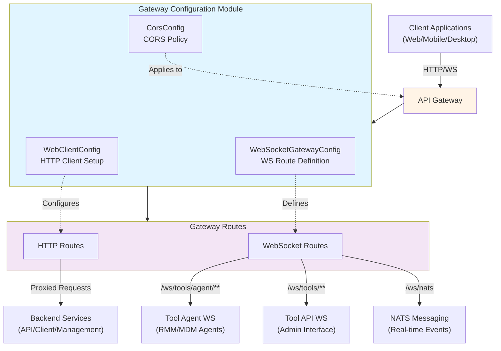
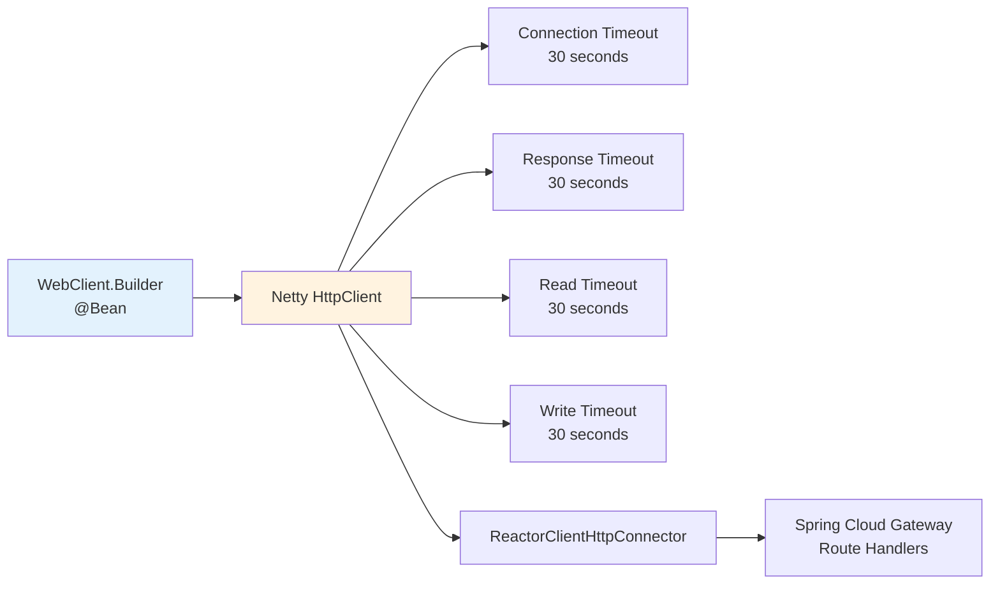
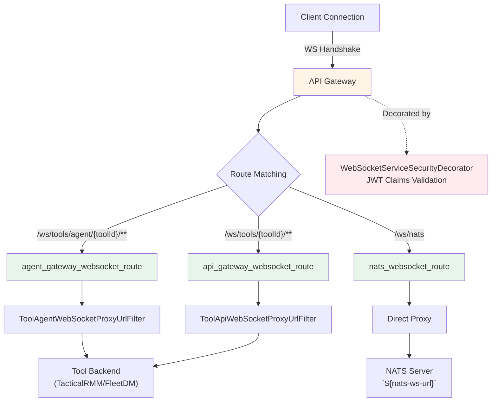
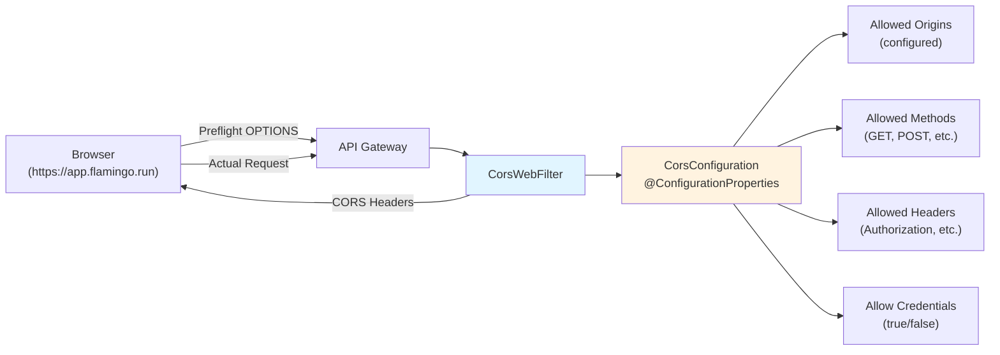
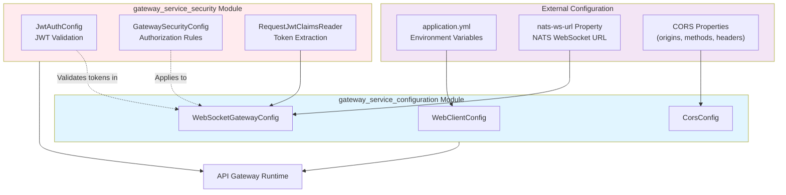
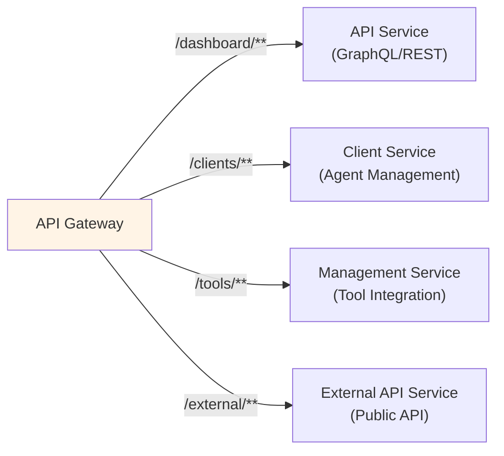
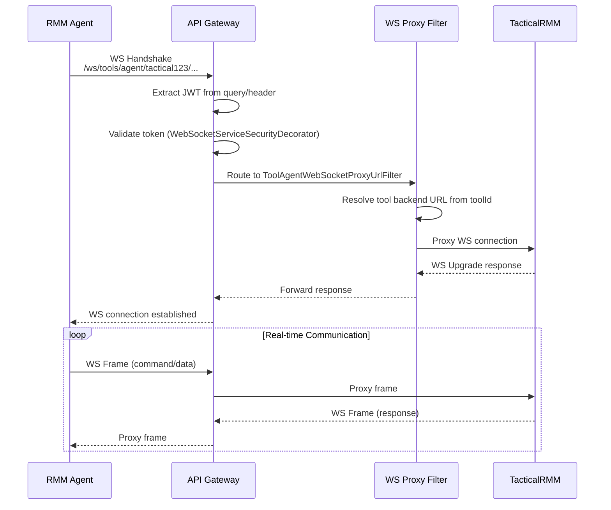
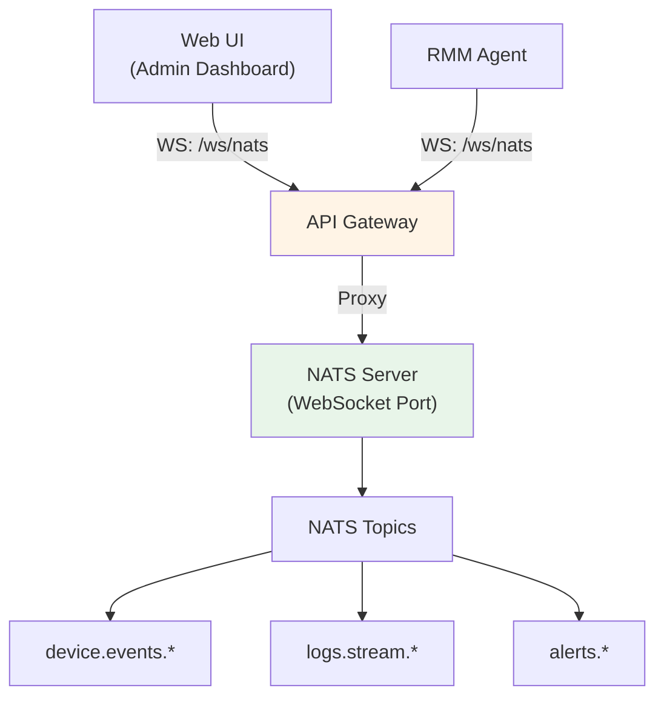
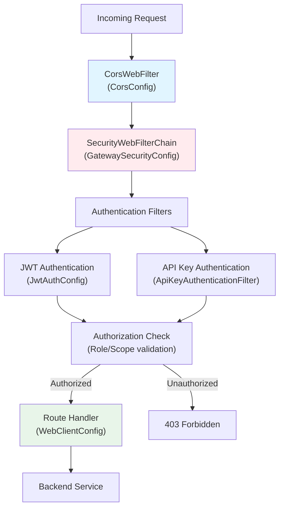
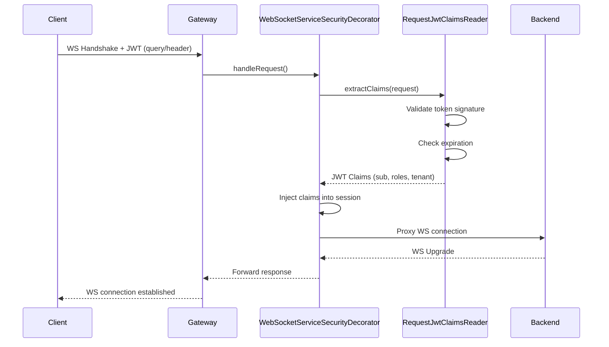

# Gateway Service Configuration Module

## Overview

The **Gateway Service Configuration** module provides the foundational configuration layer for OpenFrame's API Gateway, implementing Spring Cloud Gateway with reactive WebFlux architecture. This module configures HTTP client behavior, WebSocket routing, and CORS policies that enable secure, high-performance communication between frontend clients, backend services, and integrated tools.

As the entry point for all external requests, this configuration module establishes:
- **Reactive HTTP client** infrastructure with timeout and connection management
- **WebSocket gateway routing** for real-time bidirectional communication with tools and NATS messaging
- **CORS policies** for cross-origin resource sharing in multi-domain deployments

This module works in conjunction with the [gateway_service_security](gateway_service_security.md) module to provide a complete gateway solution.

---

## Architecture Overview



---

## Core Components

### 1. WebClientConfig

**Purpose**: Configures the reactive HTTP client used by Spring Cloud Gateway for proxying requests to backend services.

**Location**: `com.openframe.gateway.config.WebClientConfig`

**Key Responsibilities**:
- Configure Netty-based HTTP client with connection pooling
- Set connection, read, and write timeouts
- Provide `WebClient.Builder` bean for service-to-service communication



**Configuration Details**:

| Parameter | Value | Purpose |
|-----------|-------|---------|
| **Connection Timeout** | 30,000 ms | Maximum time to establish TCP connection |
| **Response Timeout** | 30 seconds | Maximum time to receive complete response |
| **Read Timeout** | 30 seconds | Maximum idle time reading response data |
| **Write Timeout** | 30 seconds | Maximum idle time writing request data |

**Code Highlights**:

```java
@Bean
public WebClient.Builder webClientBuilder() {
    HttpClient httpClient = HttpClient.create()
        .option(ChannelOption.CONNECT_TIMEOUT_MILLIS, 30000)
        .responseTimeout(Duration.ofSeconds(30))
        .doOnConnected(conn -> 
            conn.addHandlerLast(new ReadTimeoutHandler(30, TimeUnit.SECONDS))
                .addHandlerLast(new WriteTimeoutHandler(30, TimeUnit.SECONDS))
        );

    return WebClient.builder()
        .clientConnector(new ReactorClientHttpConnector(httpClient));
}
```

**Why These Timeouts?**
- **30-second timeouts** balance responsiveness with tolerance for slow backend services
- Prevents indefinite hanging on network issues or unresponsive services
- Allows time for complex queries (e.g., device inventory, log aggregation)
- Consistent timeout across all layers (connection, read, write, response)

---

### 2. WebSocketGatewayConfig

**Purpose**: Defines WebSocket routing rules for real-time bidirectional communication with integrated tools and messaging systems.

**Location**: `com.openframe.gateway.config.ws.WebSocketGatewayConfig`

**Key Responsibilities**:
- Route WebSocket connections to appropriate backend services
- Apply security filters to WebSocket handshakes
- Proxy WebSocket frames between clients and tools



**WebSocket Routes**:

| Route Pattern | Route ID | Filter | Target | Purpose |
|---------------|----------|--------|--------|---------|
| `/ws/tools/agent/{toolId}/**` | `agent_gateway_websocket_route` | `ToolAgentWebSocketProxyUrlFilter` | Dynamic (tool-specific) | Agent-to-tool communication (RMM/MDM agents) |
| `/ws/tools/{toolId}/**` | `api_gateway_websocket_route` | `ToolApiWebSocketProxyUrlFilter` | Dynamic (tool-specific) | Admin-to-tool communication (UI dashboards) |
| `/ws/nats` | `nats_websocket_route` | None | `${nats-ws-url}` | NATS messaging for real-time events |

**Route Configuration**:

```java
@Bean
public RouteLocator customRouteLocator(
        RouteLocatorBuilder builder,
        ToolApiWebSocketProxyUrlFilter toolApiWebSocketProxyUrlFilter,
        ToolAgentWebSocketProxyUrlFilter toolAgentWebSocketProxyUrlFilter,
        @Value("${nats-ws-url}") String natsWsUrl
) {
    return builder.routes()
            .route("agent_gateway_websocket_route", r -> r
                    .path(TOOLS_AGENT_WS_ENDPOINT_PREFIX + "{toolId}/**")
                    .filters(f -> f.filter(toolAgentWebSocketProxyUrlFilter))
                    .uri("no://op"))
            .route("api_gateway_websocket_route", r -> r
                    .path(TOOLS_API_WS_ENDPOINT_PREFIX + "{toolId}/**")
                    .filters(f -> f.filter(toolApiWebSocketProxyUrlFilter))
                    .uri("no://op"))
            .route("nats_websocket_route", r -> r
                    .path(NATS_WS_ENDPOINT_PATH)
                    .uri(natsWsUrl))
            .build();
}
```

**Key Design Patterns**:

1. **Dynamic URI Resolution**: Tool-specific routes use `uri("no://op")` placeholder, with actual target resolved by filters based on `{toolId}` path variable
2. **Security Decoration**: `WebSocketServiceSecurityDecorator` wraps default `WebSocketService` to inject JWT claims validation
3. **Path-based Routing**: Different URL patterns distinguish between agent connections, admin connections, and messaging

**WebSocket Security Decorator**:

```java
@Bean
@Primary
public WebSocketService webSocketServiceDecorator(
        RequestJwtСlaimsReader requestJwtСlaimsReader,
        WebSocketService defaultWebSocketService
) {
    return new WebSocketServiceSecurityDecorator(
        defaultWebSocketService, 
        requestJwtСlaimsReader
    );
}
```

This decorator intercepts WebSocket handshakes to:
- Extract JWT from query parameters or headers
- Validate token signature and expiration
- Inject claims into WebSocket session context
- Reject unauthorized connections before upgrade

---

### 3. CorsConfig

**Purpose**: Configures Cross-Origin Resource Sharing (CORS) policies to allow frontend applications from different domains to access the gateway.

**Location**: `com.openframe.gateway.security.cors.CorsConfig`

**Key Responsibilities**:
- Define allowed origins, methods, and headers
- Enable credentials (cookies, authorization headers)
- Apply CORS policies globally to all routes



**Configuration Properties**:

The CORS configuration is externalized via Spring Boot properties:

```yaml
spring:
  cloud:
    gateway:
      globalcors:
        cors-configurations:
          '[/**]':
            allowedOrigins: 
              - "https://app.flamingo.run"
              - "http://localhost:3000"
            allowedMethods:
              - GET
              - POST
              - PUT
              - DELETE
              - OPTIONS
            allowedHeaders:
              - "*"
            allowCredentials: true
            maxAge: 3600
```

**Conditional Activation**:

```java
@ConditionalOnProperty(
    name = "openframe.gateway.disable-cors",
    havingValue = "false",
    matchIfMissing = true
)
```

CORS is **enabled by default** but can be disabled for:
- Development environments with same-origin setup
- Internal deployments behind a reverse proxy handling CORS
- Testing scenarios

**Bean Configuration**:

```java
@Bean
@ConfigurationProperties(prefix = "spring.cloud.gateway.globalcors.cors-configurations.[/**]")
public CorsConfiguration corsConfiguration() {
    return new CorsConfiguration();
}

@Bean
public CorsWebFilter corsWebFilter(CorsConfiguration corsConfiguration) {
    UrlBasedCorsConfigurationSource source = new UrlBasedCorsConfigurationSource();
    source.registerCorsConfiguration("/**", corsConfiguration);
    return new CorsWebFilter(source);
}
```

**CORS Flow**:

1. **Preflight Request**: Browser sends `OPTIONS` request with `Origin` header
2. **Filter Processing**: `CorsWebFilter` checks origin against allowed list
3. **Response Headers**: Gateway adds `Access-Control-Allow-*` headers
4. **Actual Request**: Browser proceeds with actual request if preflight succeeds

---

## Configuration Dependencies



**Key Dependencies**:

| Dependency | Type | Purpose |
|------------|------|---------|
| **Spring Cloud Gateway** | Framework | Reactive gateway routing and filtering |
| **Spring WebFlux** | Framework | Reactive web stack (Netty-based) |
| **Reactor Netty** | Library | HTTP client and server implementation |
| **Caffeine Cache** | Library | JWT issuer manager caching (via JwtAuthConfig) |
| **Spring Security** | Framework | Authentication and authorization |
| **gateway_service_security** | Module | JWT validation, authorization rules |

---

## Integration Points

### 1. Backend Service Integration

The gateway proxies requests to multiple backend services:



**Service Discovery**: Backend service URLs are configured via:
- Spring Cloud Gateway route definitions
- Environment-specific properties (`application-{profile}.yml`)
- Service mesh integration (future: Consul/Eureka)

### 2. WebSocket Tool Integration

WebSocket routes enable real-time communication with integrated tools:



**Tool ID Resolution**:
- `{toolId}` path variable identifies the target tool (e.g., `tactical123`, `fleet456`)
- Filters query the [management_service](management_service.md) to resolve tool backend URLs
- Dynamic routing allows adding new tools without gateway reconfiguration

### 3. NATS Messaging Integration

The `/ws/nats` route provides WebSocket access to NATS messaging:



**Use Cases**:
- **Real-time device events**: Agent status changes, heartbeats
- **Log streaming**: Live log tailing from devices
- **Alert notifications**: Security alerts, threshold breaches
- **Command/control**: Remote command execution responses

See [stream_processing](stream_processing.md) for NATS topic structure and message formats.

---

## Configuration Properties

### WebClient Configuration

No external properties required - hardcoded timeouts for consistency.

**Customization** (if needed):
```yaml
# Not currently supported, but could be added:
openframe:
  gateway:
    webclient:
      connect-timeout: 30000
      response-timeout: 30s
      read-timeout: 30s
      write-timeout: 30s
```

### WebSocket Configuration

```yaml
# NATS WebSocket URL
nats-ws-url: ws://nats-server:8080

# Tool WebSocket endpoints (constants in code)
# /ws/tools/agent/{toolId}/** - Agent connections
# /ws/tools/{toolId}/**       - Admin connections
# /ws/nats                    - NATS messaging
```

### CORS Configuration

```yaml
spring:
  cloud:
    gateway:
      globalcors:
        cors-configurations:
          '[/**]':
            allowedOrigins: 
              - "https://app.flamingo.run"
              - "https://staging.flamingo.run"
              - "http://localhost:3000"
            allowedMethods:
              - GET
              - POST
              - PUT
              - DELETE
              - PATCH
              - OPTIONS
            allowedHeaders:
              - "*"
            allowCredentials: true
            maxAge: 3600  # Preflight cache duration (seconds)

# Disable CORS (for development/testing)
openframe:
  gateway:
    disable-cors: false  # Set to true to disable
```

**Security Considerations**:
- **Production**: Use specific origins, avoid wildcards
- **Development**: Allow `localhost` origins for local testing
- **Credentials**: Required for cookie-based authentication
- **Max Age**: Balance between performance and security updates

---

## Security Integration

This module works closely with [gateway_service_security](gateway_service_security.md):



**Security Flow**:

1. **CORS Validation**: `CorsWebFilter` checks origin and adds CORS headers
2. **Authentication**: JWT or API key extracted and validated
3. **Authorization**: Role/scope checked against route requirements
4. **Routing**: Request proxied to backend service with authentication context

**WebSocket Security**:



**JWT Claims Used**:
- `sub`: User/agent identifier
- `roles`: Authorization roles (ADMIN, AGENT)
- `tenant_id`: Multi-tenancy isolation
- `scope`: OAuth2 scopes (if applicable)

---

## Deployment Considerations

### Environment-Specific Configuration

```yaml
# application-dev.yml
nats-ws-url: ws://localhost:8080
spring.cloud.gateway.globalcors.cors-configurations.[/**].allowedOrigins:
  - "http://localhost:3000"
  - "http://localhost:5173"

# application-staging.yml
nats-ws-url: ws://nats.staging.internal:8080
spring.cloud.gateway.globalcors.cors-configurations.[/**].allowedOrigins:
  - "https://staging.flamingo.run"

# application-prod.yml
nats-ws-url: ws://nats.prod.internal:8080
spring.cloud.gateway.globalcors.cors-configurations.[/**].allowedOrigins:
  - "https://app.flamingo.run"
```

### Scaling Considerations

**Horizontal Scaling**:
- Gateway is **stateless** - can scale horizontally without session affinity
- WebSocket connections are **sticky** - use load balancer session affinity for WS routes
- HTTP routes can use **round-robin** load balancing

**Load Balancer Configuration**:
```text
# Nginx example
upstream gateway {
    least_conn;  # For HTTP routes
    server gateway-1:8080;
    server gateway-2:8080;
    server gateway-3:8080;
}

upstream gateway_ws {
    ip_hash;  # Sticky sessions for WebSocket
    server gateway-1:8080;
    server gateway-2:8080;
    server gateway-3:8080;
}

server {
    location /ws/ {
        proxy_pass http://gateway_ws;
        proxy_http_version 1.1;
        proxy_set_header Upgrade $http_upgrade;
        proxy_set_header Connection "upgrade";
    }
    
    location / {
        proxy_pass http://gateway;
    }
}
```

### Monitoring and Observability

**Key Metrics**:
- **HTTP client metrics**: Connection pool usage, timeout rates
- **WebSocket metrics**: Active connections, frame throughput
- **CORS metrics**: Preflight request rates, rejection rates

**Actuator Endpoints**:
```yaml
management:
  endpoints:
    web:
      exposure:
        include: health,metrics,gateway
  metrics:
    tags:
      application: openframe-gateway
```

**Health Checks**:
```bash
# Gateway health
curl http://gateway:8080/actuator/health

# Gateway routes
curl http://gateway:8080/actuator/gateway/routes
```

---

## Troubleshooting

### Common Issues

#### 1. WebSocket Connection Failures

**Symptom**: WebSocket handshake fails with 403 or 401

**Diagnosis**:
```bash
# Check JWT in WebSocket handshake
curl -i -N \
  -H "Connection: Upgrade" \
  -H "Upgrade: websocket" \
  -H "Sec-WebSocket-Version: 13" \
  -H "Sec-WebSocket-Key: $(openssl rand -base64 16)" \
  "http://gateway:8080/ws/nats?token=YOUR_JWT"
```

**Solutions**:
- Verify JWT is passed in query parameter or `Authorization` header
- Check JWT expiration and signature
- Ensure user has required role (AGENT for `/ws/tools/agent/**`, ADMIN for `/ws/tools/**`)
- Review `WebSocketServiceSecurityDecorator` logs

#### 2. CORS Preflight Failures

**Symptom**: Browser console shows CORS error, preflight request fails

**Diagnosis**:
```bash
# Test preflight request
curl -X OPTIONS http://gateway:8080/dashboard/api/devices \
  -H "Origin: https://app.flamingo.run" \
  -H "Access-Control-Request-Method: GET" \
  -H "Access-Control-Request-Headers: Authorization" \
  -v
```

**Expected Response**:
```text
HTTP/1.1 200 OK
Access-Control-Allow-Origin: https://app.flamingo.run
Access-Control-Allow-Methods: GET, POST, PUT, DELETE, OPTIONS
Access-Control-Allow-Headers: Authorization
Access-Control-Allow-Credentials: true
Access-Control-Max-Age: 3600
```

**Solutions**:
- Add origin to `allowedOrigins` list
- Ensure `allowCredentials: true` if using cookies/auth headers
- Check `openframe.gateway.disable-cors` is not set to `true`
- Verify `CorsWebFilter` is registered (check logs)

#### 3. HTTP Client Timeouts

**Symptom**: Requests fail with `ReadTimeoutException` or `ConnectTimeoutException`

**Diagnosis**:
```bash
# Check backend service health
curl http://backend-service:8080/actuator/health

# Test with increased timeout (if possible)
# Review gateway logs for timeout patterns
```

**Solutions**:
- Verify backend service is responsive
- Check network connectivity between gateway and backend
- Consider increasing timeouts for specific slow endpoints (requires code change)
- Implement circuit breaker pattern for failing services

#### 4. Tool WebSocket Routing Issues

**Symptom**: WebSocket connection to `/ws/tools/{toolId}/**` fails with 404 or 500

**Diagnosis**:
```bash
# Check tool registration
curl http://management-service:8080/api/tools/{toolId}

# Verify filter is resolving URL correctly
# Check ToolApiWebSocketProxyUrlFilter logs
```

**Solutions**:
- Ensure tool is registered in [management_service](management_service.md)
- Verify `{toolId}` matches registered tool ID
- Check tool backend is accessible from gateway
- Review filter logs for URL resolution errors

---

## Testing

### Unit Tests

```java
@WebFluxTest
class WebClientConfigTest {
    
    @Autowired
    private WebClient.Builder webClientBuilder;
    
    @Test
    void shouldConfigureTimeouts() {
        WebClient client = webClientBuilder.build();
        // Verify timeout configuration
    }
}
```

### Integration Tests

```java
@SpringBootTest(webEnvironment = RANDOM_PORT)
@AutoConfigureWebTestClient
class WebSocketGatewayConfigIntegrationTest {
    
    @Autowired
    private WebTestClient webTestClient;
    
    @Test
    void shouldRouteWebSocketToNATS() {
        webTestClient.get()
            .uri("/ws/nats")
            .header("Upgrade", "websocket")
            .exchange()
            .expectStatus().isSwitchingProtocols();
    }
}
```

### CORS Testing

```java
@SpringBootTest(webEnvironment = RANDOM_PORT)
class CorsConfigIntegrationTest {
    
    @Autowired
    private WebTestClient webTestClient;
    
    @Test
    void shouldAllowConfiguredOrigin() {
        webTestClient.options()
            .uri("/dashboard/api/devices")
            .header("Origin", "https://app.flamingo.run")
            .header("Access-Control-Request-Method", "GET")
            .exchange()
            .expectStatus().isOk()
            .expectHeader().valueEquals("Access-Control-Allow-Origin", 
                "https://app.flamingo.run");
    }
}
```

---

## Related Documentation

- **[gateway_service_security](gateway_service_security.md)**: JWT authentication, authorization rules, API key authentication
- **[gateway_service](gateway_service.md)**: Parent module overview and architecture
- **[api_service_configuration](api_service_configuration.md)**: Backend API service configuration
- **[management_service](management_service.md)**: Tool registration and management
- **[stream_processing](stream_processing.md)**: NATS messaging and event streaming

---

## Additional Resources

### Spring Cloud Gateway Documentation
- **Official Docs**: https://docs.spring.io/spring-cloud-gateway/docs/current/reference/html/
- **WebSocket Support**: https://docs.spring.io/spring-cloud-gateway/docs/current/reference/html/#websocket-routing-filter

### Reactor Netty
- **HTTP Client**: https://projectreactor.io/docs/netty/release/reference/index.html#http-client

### CORS Best Practices
- **MDN CORS Guide**: https://developer.mozilla.org/en-US/docs/Web/HTTP/CORS
- **Spring CORS Docs**: https://docs.spring.io/spring-framework/reference/web/webflux-cors.html

---

## Questions or Issues?

For questions about gateway configuration or issues with routing, CORS, or WebSocket connections, please reach out on the **OpenMSP Slack community**:

- **Slack**: https://join.slack.com/t/openmsp/shared_invite/zt-36bl7mx0h-3~U2nFH6nqHqoTPXMaHEHA
- **Community**: https://www.openmsp.ai/

---

**Last Updated**: 2024  
**Module Version**: 1.0  
**Maintainers**: OpenFrame Gateway Team
