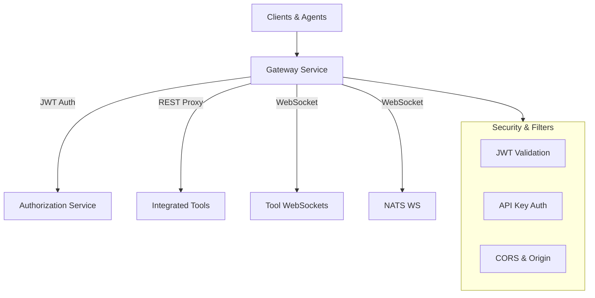

# Gateway Service Core

## Overview

The **gateway_service_core** module implements the central API Gateway for the OpenFrame / Flamingo platform. It is built on **Spring Cloud Gateway (Reactive)** and is responsible for:

- Acting as the single entry point for UI, agents, and external integrations
- Enforcing authentication and authorization (JWT, API Keys)
- Routing HTTP and WebSocket traffic to downstream services and integrated tools
- Applying cross-cutting concerns such as CORS, origin sanitization, and rate limiting

This module is consumed by the `gateway_service_app` runtime and integrates closely with the API service, authorization service, and shared security libraries.

---

## High-Level Architecture

The gateway operates entirely in **reactive mode**, ensuring non-blocking request handling for both HTTP and WebSocket traffic.

---

## Core Responsibilities

- **Routing**: HTTP and WebSocket routing to internal services and external tools
- **Security Enforcement**:
  - JWT validation with multi-issuer support
  - API key authentication and rate limiting for external APIs
- **Protocol Bridging**:
  - REST-to-REST proxying
  - Secure WebSocket proxying
- **Cross-Cutting Filters**:
  - CORS handling
  - Origin header sanitization
  - Authorization header enrichment

---

## Module Structure

The gateway core is split into focused sub-modules:

- **Configuration** – WebClient and Gateway infrastructure
- **WebSocket Gateway** – Secure WebSocket routing for tools and NATS
- **Controllers** – REST endpoints exposed by the gateway
- **Filters** – Global and per-request filters
- **Security** – Authentication, authorization, JWT handling, and CORS
- **Tenant & Issuer Resolution** – Dynamic JWT issuer validation

Detailed documentation for each area:

- [Gateway Configuration](gateway_service_core_configuration.md)
- [WebSocket Gateway](gateway_service_core_websocket.md)
- [Controllers](gateway_service_core_controllers.md)
- [Filters](gateway_service_core_filters.md)
- [Security](gateway_service_core_security.md)

---

## Runtime Context

The gateway sits in front of the following services:

- **API Service** – Business APIs and GraphQL
- **Authorization Service** – OAuth2 / OIDC authentication
- **Client & Agent Services** – Agent registration and communication
- **Integrated Tools** – Proxied REST and WebSocket endpoints

It relies heavily on shared libraries for:

- JWT validation and OAuth utilities
- Reactive MongoDB repositories
- Tenant-aware configuration

---

## Key Design Principles

- **Reactive-first**: All IO is non-blocking
- **Zero-trust gateway**: Every request is authenticated and authorized
- **Tenant-aware security**: JWT issuers resolved dynamically per tenant
- **Extensibility**: New routes, filters, and integrations can be added without impacting core logic

---

## Related Modules

- gateway_service_app – Application bootstrap
- authz_service_core_* – Authorization and OAuth flows
- shared_security_oauth_utilities – JWT and OAuth helpers

(Refer to platform documentation for details on these modules.)
