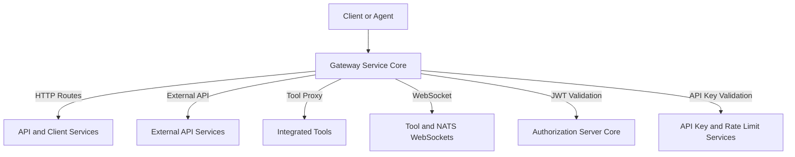
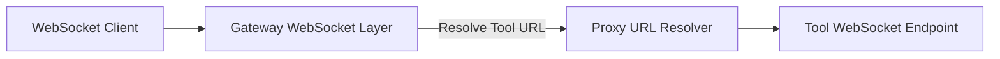
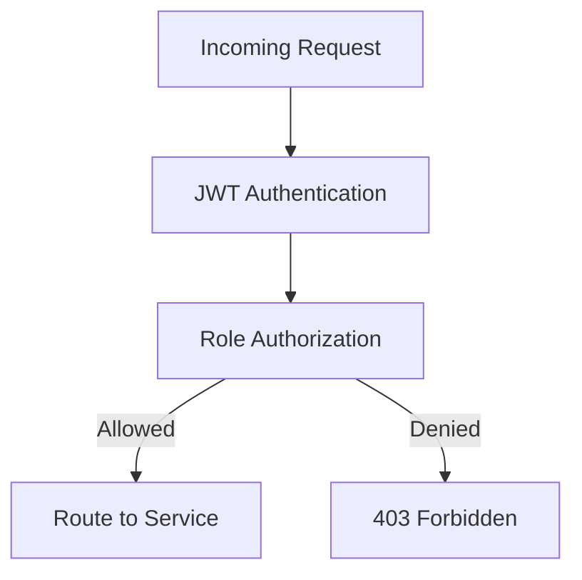
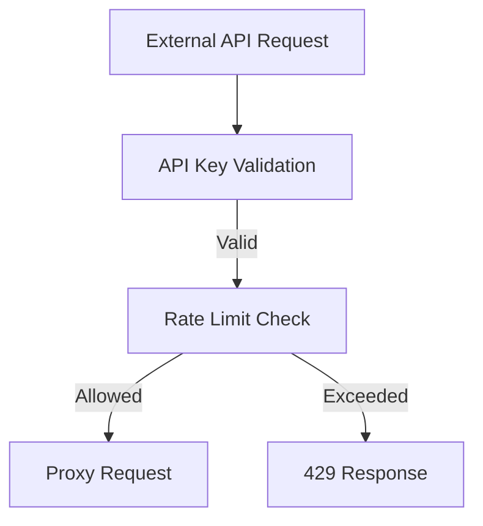

# Gateway Service Core

## Overview

The **Gateway Service Core** module is the primary entry point and traffic coordinator for the OpenFrame platform. It is built on **Spring Cloud Gateway** and **Spring WebFlux**, and is responsible for:

- Acting as a secure API gateway for internal services, external APIs, agents, and tools
- Enforcing authentication and authorization using JWTs and API keys
- Applying rate limiting and request context enrichment
- Proxying HTTP and WebSocket traffic to downstream services and integrated tools
- Normalizing cross-cutting concerns such as CORS handling, origin sanitization, and token propagation

In the overall OpenFrame architecture, the Gateway Service Core sits in front of:
- API services and dashboards
- External API endpoints
- Client and agent services
- Integrated third-party tools (HTTP and WebSocket based)

It ensures that all inbound traffic is validated, secured, and routed correctly before reaching downstream systems.

---

## High-Level Architecture

The Gateway Service Core combines several functional layers:

- **Routing layer**: HTTP and WebSocket routing using Spring Cloud Gateway
- **Security layer**: JWT-based authentication, role-based authorization, API key validation
- **Filtering layer**: Global and path-specific filters for headers, origins, and rate limits
- **Proxy layer**: Transparent proxying to integrated tools and internal services

---

## Core Responsibilities

### 1. Reactive HTTP Client Configuration

The Gateway Service Core provides a shared, reactive HTTP client configuration used when proxying requests to downstream services.

- **Component**: `WebClientConfig`
- Uses Reactor Netty with:
  - Connection timeout configuration
  - Read and write timeouts
  - Non-blocking, backpressure-aware execution

This ensures consistent and resilient outbound communication from the gateway.

---

### 2. HTTP and WebSocket Routing

#### HTTP Routing

The gateway exposes HTTP endpoints for tools and agents and transparently proxies requests:

- Tool API requests under `/tools/{toolId}/**`
- Tool agent requests under `/tools/agent/{toolId}/**`

These routes are handled by the **Integration Controller**, which delegates to proxy services for execution.

#### WebSocket Routing

WebSocket support is a first-class concern, enabling real-time communication with tools and messaging systems.

- **Tool API WebSockets**: `/ws/tools/{toolId}/**`
- **Tool Agent WebSockets**: `/ws/tools/agent/{toolId}/**`
- **NATS WebSocket bridge**: `/ws/nats`

Custom WebSocket proxy URL filters dynamically resolve the target endpoint for each tool based on its identifier.

---

## Security Model

Security in the Gateway Service Core is layered and context-aware.

### 1. JWT-Based Authentication

- Incoming requests are authenticated using **OAuth 2.0 JWT access tokens**
- Multiple issuers are supported to enable multi-tenant deployments
- Authentication managers are cached per issuer for performance

The issuer validation logic ensures that only tokens issued by trusted tenant-specific or super-tenant issuers are accepted.

### 2. Authorization and Role Enforcement

Role-based access control is enforced at the gateway level:

- **ADMIN** role for dashboard and tool management APIs
- **AGENT** role for agent-facing endpoints and WebSocket connections

Authorization rules are defined declaratively based on request paths and HTTP methods.

---

## API Key Authentication and Rate Limiting

For external API access, the Gateway Service Core enforces API key–based authentication.

### API Key Flow

- Applies only to requests under `/external-api/**`
- Requires a valid API key header
- Validates the key and enriches the request with user context

### Rate Limiting

- Per-key rate limits are enforced
- Limits are evaluated across multiple windows:
  - Per minute
  - Per hour
  - Per day
- Standard rate limit headers are optionally returned in responses

If limits are exceeded, the gateway responds with `429 Too Many Requests` and appropriate retry hints.

---

## Request Enrichment and Filtering

Several global and path-aware filters are applied to requests as they pass through the gateway:

### Authorization Header Injection

If an incoming request does not contain an `Authorization` header, the gateway attempts to resolve a bearer token from:

- Secure cookies
- Alternate access-token headers
- Query parameters

The resolved token is then normalized into a standard `Authorization: Bearer` header for downstream services.

### Origin Sanitization

Requests containing an invalid or literal `null` Origin header are sanitized to prevent downstream CORS or security issues.

### CORS Handling

- CORS support is configurable via properties
- Can be enabled or disabled at runtime
- Applied globally to all gateway routes when enabled

---

## Multi-Tenant Issuer Resolution

The Gateway Service Core dynamically determines the set of valid JWT issuers based on tenant data.

- Tenant identifiers are loaded reactively from persistence
- Allowed issuer URLs are cached and reused
- Supports an optional super-tenant issuer for cross-tenant administration

This design enables secure, scalable multi-tenant authentication without static issuer configuration.

---

## How This Module Fits Into the System

Within the OpenFrame platform, the Gateway Service Core:

- Serves as the **single ingress point** for UI, agents, tools, and APIs
- Offloads authentication, authorization, and rate limiting from downstream services
- Provides protocol bridging (HTTP ↔ WebSocket) where needed
- Enables consistent security and routing behavior across the entire stack

Downstream services can focus on business logic, trusting the gateway to handle identity, access control, and traffic management.

---

## Summary

The Gateway Service Core is a foundational infrastructure module that:

- Centralizes routing and security
- Supports both REST and WebSocket communication
- Enforces API key and JWT-based access models
- Enables multi-tenant, role-aware request handling

It is critical to the scalability, security, and maintainability of the OpenFrame ecosystem.