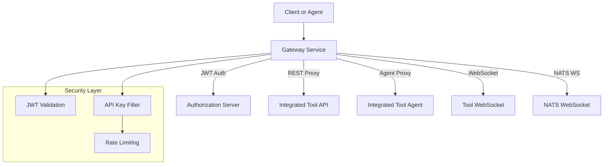
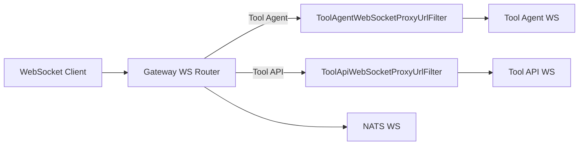
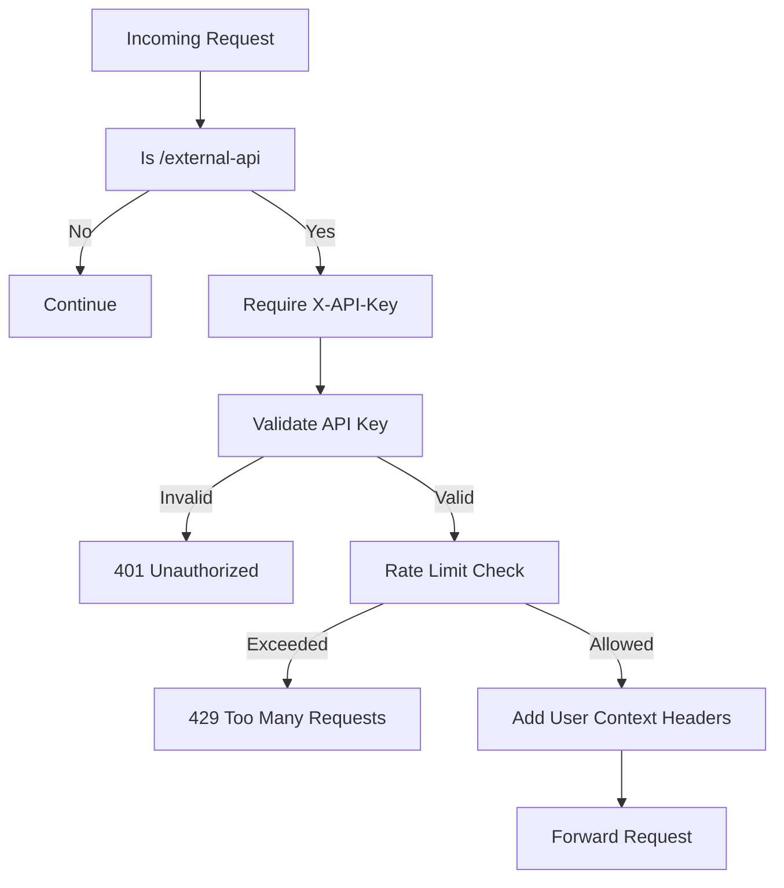
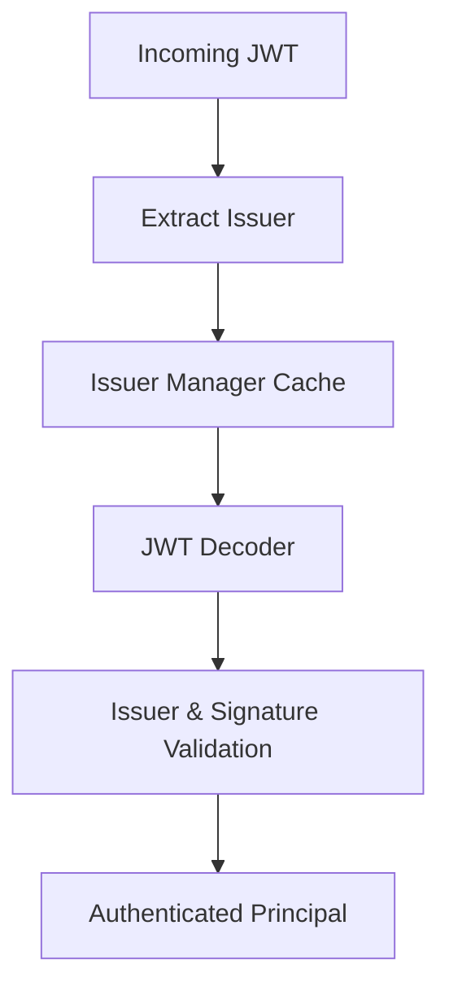

# Gateway Service Core

## Overview
The **Gateway Service Core** module provides the reactive, security-aware edge gateway for the OpenFrame platform. It is responsible for:

- Acting as a **single entry point** for HTTP and WebSocket traffic
- Enforcing **authentication, authorization, and rate limiting**
- **Proxying REST and WebSocket traffic** to integrated tools and internal services
- Normalizing security context (JWT, API keys, cookies) for downstream services

This module is used by the `service_gateway` runtime application and integrates tightly with the authorization server, external API services, and tool integrations.

---

## Responsibilities at a Glance

- HTTP proxying for `/tools/**` and agent endpoints
- WebSocket proxying for tool APIs, tool agents, and NATS
- JWT-based authentication with multi-issuer (tenant-aware) validation
- API key authentication and rate limiting for `/external-api/**`
- CORS handling for SaaS and OSS deployment modes
- Security context enrichment (Authorization header injection)

---

## High-Level Architecture

---

## Core Configuration Components

### WebClientConfig
**Component:** `WebClientConfig`

Provides a shared, preconfigured `WebClient.Builder` with:

- Connection timeout: 30 seconds
- Read/Write timeout: 30 seconds
- Reactor Netty HTTP client

This configuration is used by downstream proxy services to ensure consistent timeout behavior when forwarding requests.

---

## WebSocket Gateway

### WebSocketGatewayConfig

Defines WebSocket routing rules using Spring Cloud Gateway:

- **Tool Agent WebSocket**: `/ws/tools/agent/{toolId}/**`
- **Tool API WebSocket**: `/ws/tools/{toolId}/**`
- **NATS WebSocket**: `/ws/nats`

Routes for tools use a `no://op` URI and rely on custom filters to dynamically resolve the real upstream WebSocket destination.

### Tool WebSocket Proxy Filters

- **ToolAgentWebSocketProxyUrlFilter**
  - Extracts `toolId` from `/ws/tools/agent/{toolId}/...`
  - Resolves the upstream agent WebSocket URL

- **ToolApiWebSocketProxyUrlFilter**
  - Extracts `toolId` from `/ws/tools/{toolId}/...`
  - Resolves the upstream API WebSocket URL

Both rely on:

- Reactive tool repository
- Tool URL service
- Proxy URL resolver

---

## REST Gateway Controllers

### IntegrationController

Handles all REST traffic under `/tools/**`:

- `GET /tools/{toolId}/health`
- `POST /tools/{toolId}/test`
- Proxying of arbitrary API paths: `/{toolId}/**`
- Proxying of agent paths: `/agent/{toolId}/**`

All requests are forwarded using a reactive proxy service while preserving method, headers, and body.

---

### InternalAuthProbeController

Exposes a lightweight probe endpoint:

- `GET /internal/authz/probe`

This endpoint is conditionally enabled and used for internal authentication and readiness checks.

---

## API Key Authentication and Rate Limiting

### ApiKeyAuthenticationFilter

A global gateway filter applied to `/external-api/**` endpoints.

**Execution Flow:**

**Key Behaviors:**

- Validates API keys
- Applies per-minute, per-hour, and per-day limits
- Adds standard rate limit headers to responses
- Records success and failure statistics

### RateLimitConstants

Centralized logging constants used by rate limiting and statistics components.

---

## Security Configuration

### GatewaySecurityConfig

Defines the **reactive security filter chain**:

- Disables CSRF, HTTP Basic, and form login
- Configures OAuth2 Resource Server with dynamic issuer resolution
- Injects a pre-auth Authorization header filter

**Authorization Rules (Simplified):**

- Admin access: `/api/**`, `/tools/**`
- Agent access: `/clients/**`, `/tools/agent/**`
- WebSocket access aligned with REST roles
- Public access: health, metrics, registration endpoints

---

### JWT Authentication (JwtAuthConfig)

Supports **multi-tenant JWT validation**:

- Uses a Caffeine cache of authentication managers per issuer
- Supports both static and dynamically discovered issuers
- Enforces strict issuer validation via `IssuerUrlProvider`

---

### IssuerUrlProvider

Resolves and caches allowed JWT issuer URLs based on:

- Tenant repository
- Configured issuer base URL
- Optional super-tenant

This enables secure, tenant-aware authentication across the platform.

---

## Request Pre-Processing Filters

### AddAuthorizationHeaderFilter

Ensures an `Authorization: Bearer` header exists by resolving tokens from:

- Cookies
- Custom headers
- Query parameters

Applied only to protected paths and executed **before authentication**.

---

### OriginSanitizerFilter

- Removes invalid `Origin: null` headers
- Prevents CORS-related issues with malformed requests
- Executes at highest precedence

---

## CORS Configuration

### CorsConfig

Default behavior (enabled):

- Uses Gateway global CORS configuration
- Suitable for OSS and multi-origin deployments

### CorsDisableConfig

SaaS mode (explicitly enabled):

- Allows all origins
- Supports credentials
- Intended only for same-domain SaaS deployments

---

## How This Module Fits in the Platform

The Gateway Service Core sits between clients and all backend services:

- Frontend and agents authenticate once at the gateway
- Downstream services receive normalized security context
- Tool integrations are isolated behind proxy boundaries

This design allows:

- Centralized security enforcement
- Simplified downstream services
- Flexible multi-tenant routing and integration

---

## Summary

The **gateway_service_core** module is the backbone of OpenFrame’s edge architecture. It combines:

- Reactive proxying
- Strong security guarantees
- Multi-tenant JWT handling
- API key and rate limit enforcement
- WebSocket and REST unification

Together, these capabilities provide a secure, scalable, and extensible entry point for the entire OpenFrame platform.
