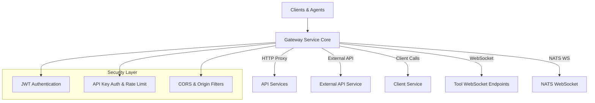
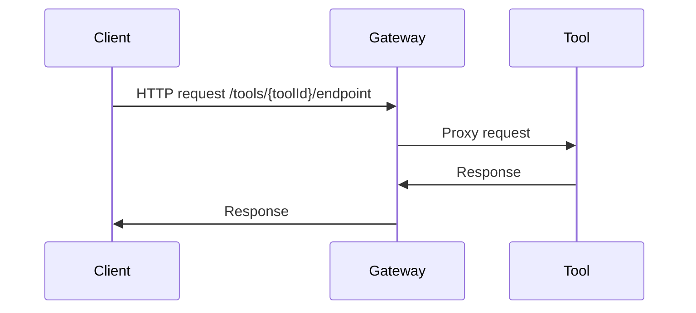
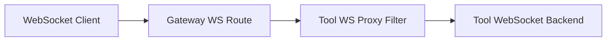
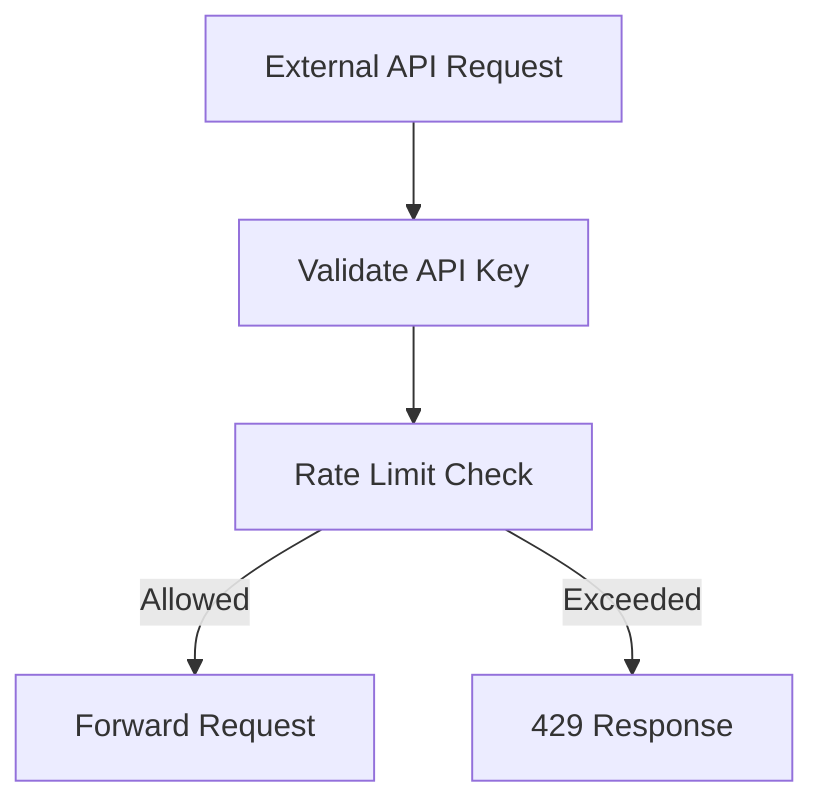

# Gateway Service Core

## Overview

Gateway Service Core is the central ingress layer of the OpenFrame platform. It acts as a **reactive API gateway** responsible for:

- Securely routing HTTP and WebSocket traffic to internal and external services
- Enforcing authentication and authorization using JWTs and API keys
- Applying rate limiting, CORS handling, and request sanitization
- Proxying tool-specific REST and WebSocket traffic

Built on **Spring Cloud Gateway** and **Spring WebFlux**, Gateway Service Core is designed for high concurrency, low latency, and multi-tenant security.

---

## Responsibilities in the Platform

Gateway Service Core sits between clients (UI, agents, external consumers) and the backend services such as API Service, External API Service, Client Service, and Tool integrations.

Key responsibilities include:

- **Traffic routing**: HTTP and WebSocket routing based on path and tenant context
- **Security enforcement**: JWT validation, issuer resolution, API key authentication
- **Protocol bridging**: REST ↔ WebSocket ↔ downstream services
- **Operational safety**: rate limiting, CORS, origin sanitization

---

## High-Level Architecture

---

## Application Bootstrap

The gateway is started by the **GatewayApplication** entry point, which enables component scanning across gateway, core, data, and security packages.

Responsibilities:
- Bootstraps Spring WebFlux and Spring Cloud Gateway
- Registers all global filters, routes, and security configuration

---

## Routing and Proxying

### REST Proxying for Tools

The **IntegrationController** exposes dynamic proxy endpoints under `/tools/**`.

Capabilities:
- Health checks for integrated tools
- Test connectivity to tool backends
- Transparent proxying of REST requests to tool APIs and agents

Flow:
1. Incoming request targets `/tools/{toolId}/**` or `/tools/agent/{toolId}/**`
2. Tool identifier is extracted from the path
3. Request is forwarded via RestProxyService to the resolved tool URL

---

## WebSocket Gateway

Gateway Service Core provides first-class WebSocket proxying for tools and messaging.

### Supported WebSocket Routes

- **Tool API WebSockets**: `/ws/tools/{toolId}/**`
- **Tool Agent WebSockets**: `/ws/tools/agent/{toolId}/**`
- **NATS WebSocket**: `/ws/nats`

Routing is defined in **WebSocketGatewayConfig** using Spring Cloud Gateway routes.

### WebSocket URL Resolution

Custom proxy filters dynamically resolve the downstream WebSocket target:

- **ToolApiWebSocketProxyUrlFilter**: resolves API-facing tool WebSocket URLs
- **ToolAgentWebSocketProxyUrlFilter**: resolves agent-facing tool WebSocket URLs

These filters:
- Extract the tool identifier from the request path
- Look up the tool configuration from the data layer
- Rewrite the request URI before forwarding

---

## Security Architecture

Security in Gateway Service Core is layered and path-aware.

### JWT-Based Authentication

JWT validation is configured through:

- **JwtAuthConfig**: multi-issuer JWT decoding and caching
- **IssuerUrlProvider**: dynamically resolves allowed issuers per tenant
- **GatewaySecurityConfig**: path-based authorization rules

Key characteristics:
- Supports multiple issuers (multi-tenant)
- Caches authentication managers for performance
- Combines role-based and scope-based authorities

### Authorization Header Resolution

The **AddAuthorizationHeaderFilter** ensures a bearer token is always available by resolving it from:

- Secure cookies
- Alternative headers
- Query parameters (for WebSocket and special clients)

This enables consistent downstream authentication without forcing clients to always set the `Authorization` header.

---

## API Key Authentication and Rate Limiting

For `/external-api/**` endpoints, Gateway Service Core enforces API key security using **ApiKeyAuthenticationFilter**.

### Authentication Flow

1. Request path is checked for `/external-api/**`
2. `X-API-Key` header is required
3. API key is validated
4. Rate limits are checked
5. User context headers are injected

### Rate Limiting

Rate limiting is applied per API key with:

- Minute limits
- Hour limits
- Day limits

When enabled, standard rate limit headers are added to responses, including remaining quota.

---

## CORS and Request Sanitization

### CORS Handling

Gateway Service Core supports two modes:

- **Standard CORS**: configured via Spring Cloud Gateway properties
- **Disabled CORS**: permissive mode for SaaS deployments

The active mode is controlled by the `openframe.gateway.disable-cors` property.

### Origin Sanitization

The **OriginSanitizerFilter** removes invalid `Origin: null` headers to prevent downstream CORS and security issues caused by misbehaving clients.

---

## Internal Probing and Health

An internal authentication probe endpoint is available when explicitly enabled:

- Path: `/internal/authz/probe`
- Purpose: verify that internal authentication and routing are operational

This endpoint is guarded by configuration and is not exposed by default.

---

## Outbound HTTP Client Configuration

The **WebClientConfig** provides a shared reactive HTTP client with:

- Connection timeout configuration
- Read and write timeouts
- Netty-based non-blocking I/O

This client is used for outbound calls to downstream services and integrations.

---

## Summary

Gateway Service Core is a foundational component of OpenFrame that:

- Centralizes ingress traffic for REST and WebSockets
- Enforces security, rate limits, and tenant isolation
- Simplifies downstream services by handling cross-cutting concerns

Its reactive, filter-driven architecture allows the platform to scale efficiently while maintaining strong security and observability guarantees.
