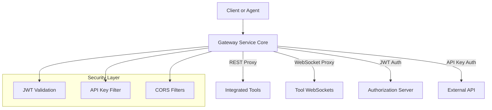

# Gateway Service Core

The **Gateway Service Core** module provides the central entry point for all HTTP and WebSocket traffic into the OpenFrame platform. Built on **Spring Cloud Gateway (Reactive/WebFlux)**, it is responsible for:

- Routing and proxying REST and WebSocket requests to downstream services and integrated tools
- Enforcing authentication and authorization (JWT, API keys)
- Applying rate limiting and request sanitization
- Handling CORS and security headers
- Acting as the boundary between external clients, agents, and internal services

This module is used by the **GatewayApplication** service entrypoint and sits in front of API, management, authorization, and tool integrations.

---

## High-Level Architecture

---

## Core Responsibilities

1. **Request Routing**
   - HTTP routing for REST APIs and integrated tools
   - WebSocket routing for tools, agents, and NATS

2. **Security Enforcement**
   - JWT validation with multi-issuer support
   - API key authentication and rate limiting for external APIs
   - Role-based access control (ADMIN, AGENT)

3. **Protocol Bridging**
   - REST-to-REST proxying
   - WebSocket proxying with dynamic target resolution

4. **Edge Concerns**
   - CORS configuration (strict or permissive)
   - Origin header sanitization
   - Authorization header normalization

---

## Module Structure Overview

The Gateway Service Core is composed of the following logical sub-modules:

- **Configuration** – WebClient, WebSocket, and Gateway setup
- **Controllers** – Entry points for integration and health probes
- **Filters** – Authentication, authorization, sanitization, and rate limiting
- **Security** – JWT, path rules, CORS, and tenant-aware issuer resolution

Each section below links to detailed documentation for that sub-module.

---

## Sub-Modules

### Configuration
Responsible for low-level HTTP/WebSocket client and gateway route configuration.

- WebClient configuration with timeouts and Netty tuning
- WebSocket routing for tools, agents, and NATS

See: [Configuration](Configuration.md)

---

### Controllers
Defines REST endpoints exposed directly by the gateway.

- Integration proxy endpoints for tools and agents
- Internal authentication probe endpoint

See: [Controllers](Controllers.md)

---

### Filters
Global and per-request filters applied at the gateway edge.

- API key authentication and rate limiting
- Authorization header enrichment
- Origin sanitization

See: [Filters](Filters.md)

---

### Security
Reactive security configuration and JWT validation.

- Role-based route authorization
- Multi-issuer JWT authentication with caching
- Tenant-aware issuer resolution
- CORS enable/disable modes

See: [Security](Security.md)

---

## How It Fits Into the OpenFrame Platform

The Gateway Service Core depends on and interacts with several other platform modules:

- **authorization_server_core** – JWT issuance and tenant-aware authentication
- **api_service_core** – Backend APIs routed behind `/api` and `/clients`
- **management_service_core** – Management and provisioning APIs
- **data_mongo_layer** – Tenant and API key data used for auth decisions
- **security_shared_core** – Shared JWT and OAuth utilities

The gateway does not contain business logic; instead, it enforces **policy, security, and routing**, delegating all domain-specific work to downstream services.

---

## Key Design Principles

- **Zero Trust Edge** – Every request is authenticated and authorized
- **Reactive & Non-Blocking** – Built entirely on WebFlux
- **Multi-Tenant Aware** – JWT issuer validation per tenant
- **Pluggable Integrations** – Dynamic routing for external tools

---

## Operational Notes

- API key authentication applies only to `/external-api/**` paths
- WebSocket routes use dynamic proxy resolution and do not terminate traffic
- CORS behavior is environment-driven via configuration flags

---

This document serves as the entry point for understanding the Gateway Service Core. Refer to the sub-module documents for implementation-level details.
