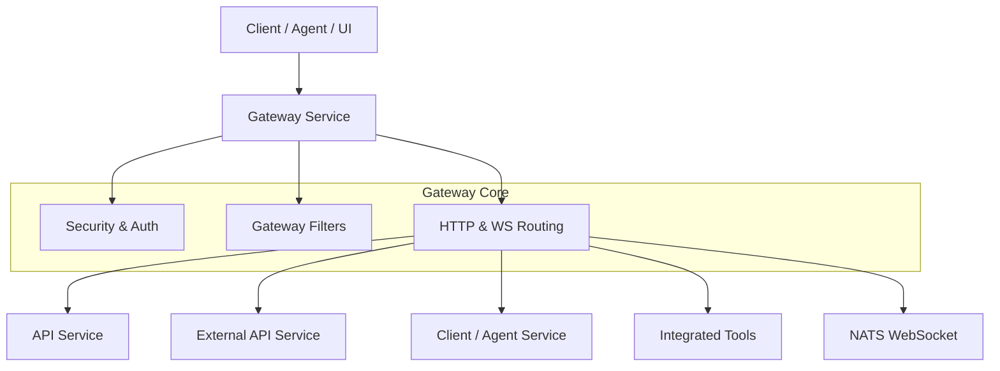
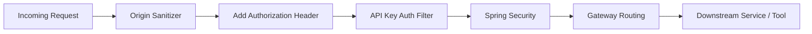
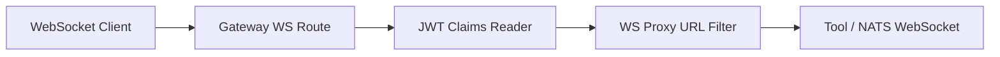

# Gateway Service Core

## Overview

The **gateway_service_core** module is the central ingress layer of the OpenFrame platform. It is responsible for:

- Acting as the single entry point for HTTP and WebSocket traffic
- Enforcing authentication and authorization (JWT, API keys)
- Applying rate limiting and request enrichment
- Proxying requests to internal microservices and integrated third-party tools
- Handling multi-tenant security concerns such as dynamic JWT issuers

This module is built on **Spring Cloud Gateway** with **Spring WebFlux**, making it fully reactive and suitable for high-throughput, low-latency workloads.

At runtime, this core library is used by the **GatewayApplication** from the `service_bootstrap_apps` layer.

---

## High-Level Architecture

**Key responsibilities:**
- Authentication: JWT validation, API key authentication
- Authorization: Role-based access control (ADMIN, AGENT)
- Traffic control: Rate limiting, CORS handling
- Protocol support: HTTP, WebSocket

---

## Core Sub-Modules

The gateway core is organized into focused sub-modules. Each sub-module has its own detailed documentation.

### 1. Configuration

Handles shared infrastructure configuration such as HTTP clients and timeouts.

- Reactive `WebClient` configuration
- Connection and read/write timeout enforcement

📄 See: [Configuration](configuration.md)

---

### 2. WebSocket Gateway

Provides WebSocket routing and proxying for:

- Tool API WebSockets
- Tool Agent WebSockets
- NATS WebSocket connections

Includes dynamic URL resolution and security decoration.

📄 See: [WebSocket Gateway](websocket.md)

---

### 3. Controllers

Defines REST entry points exposed by the gateway, primarily for:

- Tool integration health checks
- API and agent request proxying
- Internal authentication probes

Controllers are thin by design and delegate most logic to services.

📄 See: [Controllers](controllers.md)

---

### 4. Security

Implements the gateway security model using Spring Security (WebFlux):

- JWT authentication with multi-issuer support
- Role-based authorization rules
- Path-based access control
- Tenant-aware issuer validation

📄 See: [Security](security.md)

---

### 5. Filters

Contains global and ordered gateway filters that process requests before routing:

- API key authentication and rate limiting for `/external-api/**`
- Authorization header enrichment
- Origin header sanitization

Filters are critical to enforcing cross-cutting concerns consistently.

📄 See: [Filters](filters.md)

---

## Request Flow (HTTP)

**Notes:**
- API key authentication is applied only to `/external-api/**` paths
- JWT authentication is enforced by the reactive security chain
- Headers are enriched before proxying to downstream services

---

## Request Flow (WebSocket)

**Highlights:**
- Tool WebSocket URLs are dynamically resolved per tool ID
- JWT context is preserved and enforced for WebSocket connections

---

## Integration with Other Modules

The gateway_service_core module depends heavily on and integrates with:

- **authorization_service_core**: JWT issuance and OAuth/OIDC flows
- **api_service_core**: Core business APIs
- **external_api_service_core**: API-key-protected external APIs
- **client_agent_service_core**: Agent-facing endpoints
- **data_persistence_mongo**: Tenant and API key resolution

Rather than duplicating logic, the gateway focuses on orchestration, security, and routing.

---

## Design Principles

- **Reactive First**: Built on Spring WebFlux for scalability
- **Thin Gateway**: Minimal business logic, heavy delegation
- **Security-Centric**: Authentication and authorization enforced early
- **Multi-Tenant Aware**: Dynamic issuer and tenant resolution
- **Extensible**: New routes, filters, and tools can be added incrementally

---

## Summary

The **gateway_service_core** module is the backbone of OpenFrame request handling. It ensures that every incoming request—HTTP or WebSocket—is authenticated, authorized, rate-limited where necessary, and routed correctly to the appropriate internal service or external integration.

For deeper details, refer to the individual sub-module documentation linked above.
