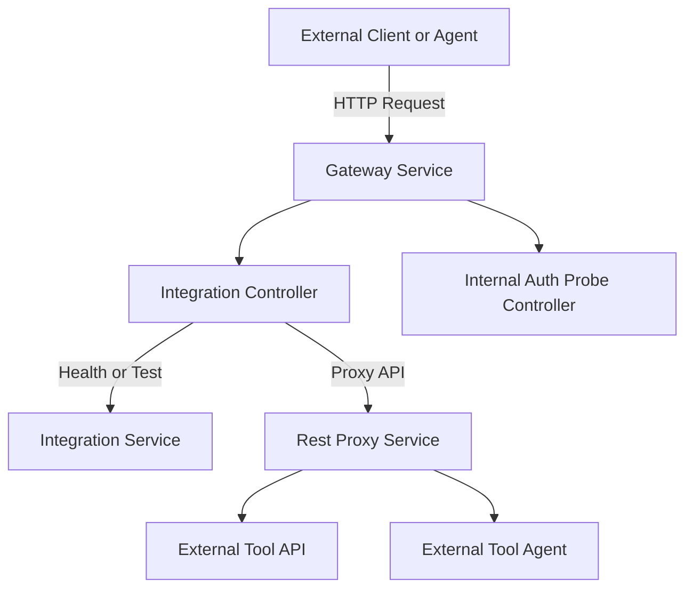
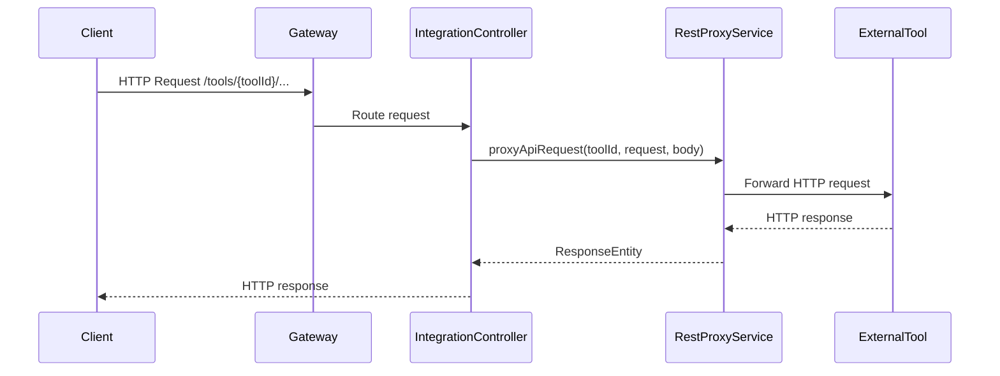

# Gateway Controllers Module

## Overview

The **controllers** module is part of the **gateway_service_core** and exposes HTTP endpoints that act as the primary entry points into the OpenFrame Gateway service. These controllers are responsible for:

- Routing and proxying tool-specific API and agent traffic
- Providing lightweight operational endpoints for internal health and authorization probing
- Acting as the boundary between external callers (UI, agents, integrations) and downstream gateway services

The module is implemented using **Spring WebFlux**, enabling fully reactive, non-blocking request handling.

---

## Core Controllers

### IntegrationController

**Class:** `IntegrationController`  
**Base Path:** `/tools`

The `IntegrationController` is responsible for managing and proxying requests related to integrated tools. It supports both control-plane operations (health checks and test calls) and full data-plane proxying of API and agent requests.

#### Responsibilities

- Validate connectivity and configuration for integrated tools
- Proxy arbitrary HTTP requests to external tool APIs
- Proxy agent-related requests to tool agent endpoints
- Preserve HTTP method, path, headers, and body during proxying

#### Endpoints

| Method | Path | Description |
|------|------|-------------|
| GET | `/tools/{toolId}/health` | Perform a health check against the configured tool integration |
| POST | `/tools/{toolId}/test` | Explicitly test connectivity to the tool integration |
| * | `/tools/{toolId}/**` | Proxy generic API requests to the tool |
| * | `/tools/agent/{toolId}/**` | Proxy agent-specific requests to the tool |

> Supported proxy methods: `GET`, `POST`, `PUT`, `PATCH`, `DELETE`, `OPTIONS`

#### Key Dependencies

- **IntegrationService**  
  Performs validation and connectivity tests for tool integrations.

- **RestProxyService**  
  Handles request forwarding, response mapping, and error propagation when proxying requests to external tools.

---

### InternalAuthProbeController

**Class:** `InternalAuthProbeController`  
**Base Path:** `/internal/authz`

The `InternalAuthProbeController` exposes a minimal internal endpoint used to verify that authentication and authorization paths through the gateway are functioning correctly.

#### Responsibilities

- Provide a fast, dependency-free authorization probe
- Enable internal health checks without exposing public APIs

#### Endpoint

| Method | Path | Description |
|------|------|-------------|
| GET | `/internal/authz/probe` | Returns HTTP 200 when authorization flow is operational |

#### Conditional Activation

This controller is only enabled when the following property is set:

```yaml
openframe:
  gateway:
    internal:
      enable: true
```

This ensures the endpoint is available only in controlled environments.

---

## Architecture Overview



---

## Request Flow: Tool API Proxying



---

## Error Handling Strategy

- Integration test and health endpoints catch downstream errors and return `400 Bad Request` with the error message
- Proxy endpoints rely on `RestProxyService` to translate downstream failures into appropriate HTTP responses
- All request handling remains reactive (`Mono<ResponseEntity<...>>`) to avoid blocking gateway threads

---

## Security Considerations

- Controllers rely on gateway-level security configuration for authentication and authorization
- The `Authentication` object is injected where applicable to ensure requests are executed in a secured context
- Internal endpoints are protected via configuration flags and are not publicly exposed

---

## Role Within the Gateway Service

The controllers module forms the **API surface** of the gateway:

- It does **not** implement business logic directly
- It delegates validation, routing, and proxying to dedicated services
- It enables OpenFrame to act as a unified ingress point for tools, agents, and internal platform services

This separation keeps the gateway lightweight, scalable, and focused on traffic orchestration rather than domain processing.
