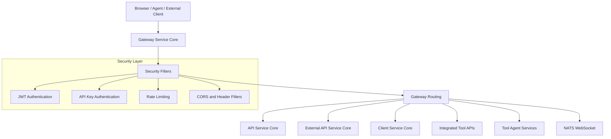
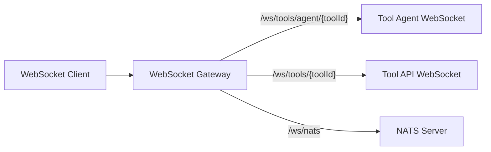
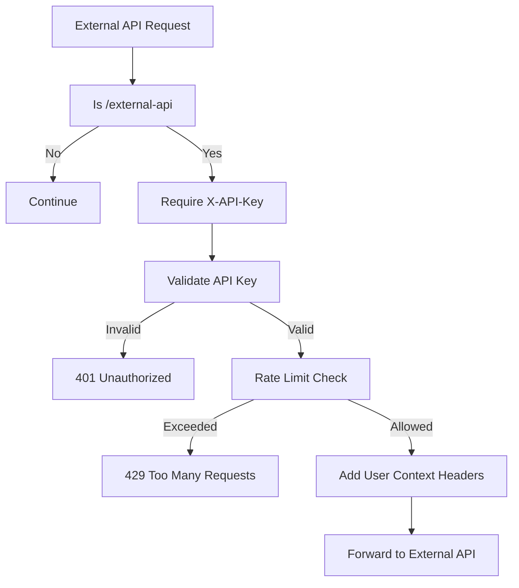
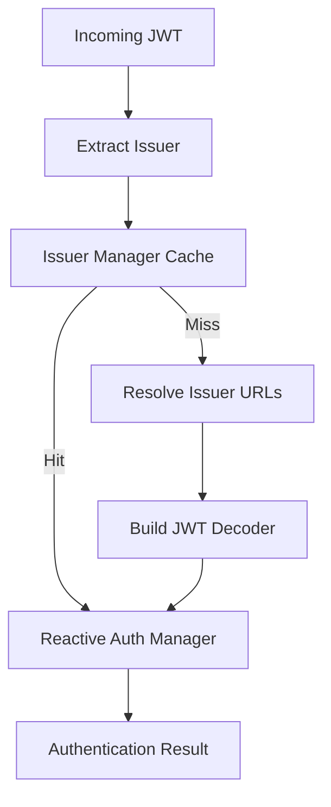

# Gateway Service Core

## Overview

The **Gateway Service Core** module is the primary edge and routing layer of the OpenFrame platform. It acts as the unified entry point for HTTP and WebSocket traffic, enforcing authentication, authorization, rate limiting, and request enrichment before forwarding traffic to downstream internal services and external integrated tools.

Built on **Spring Cloud Gateway** and **Spring WebFlux**, the Gateway Service Core is fully reactive and optimized for high concurrency, low latency, and multi-tenant security.

In the broader Flamingo / OpenFrame architecture, this module:
- Terminates client, agent, and UI traffic
- Validates JWTs and API keys
- Applies tenant-aware security policies
- Proxies REST and WebSocket traffic to tools, agents, and internal services
- Acts as the control plane boundary between users, agents, and the backend service mesh

---

## Responsibilities

The Gateway Service Core is responsible for:

- **Request routing** for HTTP and WebSocket endpoints
- **JWT-based authentication** with dynamic, tenant-aware issuers
- **API key authentication and rate limiting** for external APIs
- **Authorization enforcement** based on roles and scopes
- **Security header normalization** (Authorization, Origin, CORS)
- **Transparent proxying** of REST and WebSocket traffic to integrated tools

---

## High-Level Architecture

---

## Core Components

### Web Client Configuration

**Component:** WebClientConfig

The Gateway Service Core provides a centrally configured reactive `WebClient` used for outbound HTTP calls when proxying requests to downstream services.

Key characteristics:
- Connection timeout: 30 seconds
- Read and write timeouts: 30 seconds
- Reactor Netty–based HTTP client

This ensures consistent timeout behavior and backpressure-aware networking across all proxied requests.

---

### WebSocket Gateway Configuration

**Component:** WebSocketGatewayConfig

The Gateway Service Core defines explicit WebSocket routing rules to support:

- Tool agent WebSocket connections
- Tool API WebSocket connections
- Direct NATS WebSocket access

WebSocket routes are dynamically resolved and proxied based on tool identifiers, without exposing internal tool URLs to clients.

Custom WebSocket filters resolve the target tool and dynamically compute the proxy destination using repository and URL resolution services.

---

### WebSocket Proxy URL Filters

**Components:**
- ToolAgentWebSocketProxyUrlFilter
- ToolApiWebSocketProxyUrlFilter

These filters:
- Extract the tool identifier from the request path
- Resolve the corresponding tool endpoint
- Rewrite the WebSocket destination dynamically

This allows a single public WebSocket entry point to securely multiplex connections to many different tools and agents.

---

### API Key Authentication and Rate Limiting

**Component:** ApiKeyAuthenticationFilter

The Gateway Service Core enforces API key authentication for all `/external-api/**` endpoints.

Authentication flow:

Features:
- API key validation
- Per-key rate limiting (minute, hour, day)
- Automatic rate limit headers in responses
- Detailed success and failure tracking

Swagger and OpenAPI endpoints are explicitly excluded from API key enforcement to allow public documentation access.

---

### Gateway Security Configuration

**Component:** GatewaySecurityConfig

The Gateway Service Core acts as an OAuth2 resource server with reactive JWT validation.

Security configuration highlights:
- JWT authentication with issuer-based resolution
- Role and scope mapping from JWT claims
- Fine-grained path-based authorization
- Stateless, reactive security filter chain

Path-based authorization includes:
- Admin-only dashboard and tool APIs
- Agent-only client and agent tool endpoints
- Shared access for NATS WebSocket endpoints
- Public access for health, metrics, and registration endpoints

---

### JWT Authentication and Issuer Resolution

**Components:**
- JwtAuthConfig
- IssuerUrlProvider

The Gateway Service Core supports **multi-tenant JWT validation** by dynamically resolving authentication managers based on the token issuer.

Key capabilities:
- Per-issuer JWT decoder caching
- Support for static and tenant-derived issuers
- Strict issuer validation against allowed tenant issuer URLs
- Automatic cache refresh and eviction

---

### Authorization Header Normalization

**Component:** AddAuthorizationHeaderFilter

This filter ensures that authenticated requests always include a standard `Authorization: Bearer` header, even if the token originates from:

- Secure cookies
- Custom headers
- Query parameters

This design allows frontend applications, agents, and WebSocket clients to use flexible authentication mechanisms while keeping downstream services consistent and standards-compliant.

---

### Origin Sanitization and CORS Handling

**Components:**
- OriginSanitizerFilter
- CorsConfig

Security hardening includes:
- Removal of invalid or `null` Origin headers
- Configurable CORS policies via Spring Cloud Gateway
- Conditional enablement based on configuration

These measures prevent malformed browser requests from interfering with security enforcement.

---

### Integration and Proxy Controllers

**Components:**
- IntegrationController
- InternalAuthProbeController

The Gateway Service Core exposes REST endpoints that:

- Perform health and connectivity checks for integrated tools
- Transparently proxy REST API and agent requests to tools
- Provide an internal authentication probe endpoint for infrastructure validation

All proxied requests preserve authentication context and are subject to the same security and routing rules as native Gateway traffic.

---

## Role in the Overall System

Within the OpenFrame platform, the Gateway Service Core:

- Serves as the **single ingress point** for all user, agent, and tool traffic
- Protects backend services from unauthorized or malformed requests
- Encapsulates complex multi-tenant security logic
- Enables seamless integration of third-party tools via REST and WebSocket proxying

By centralizing these concerns, downstream services can remain focused on business logic while relying on the Gateway for consistent security and routing behavior.

---

## Summary

The **Gateway Service Core** is a foundational module that combines reactive networking, strong security, and flexible routing to power the OpenFrame platform. Its design enables secure multi-tenant operation, scalable integrations, and a clean separation between edge concerns and backend services.
