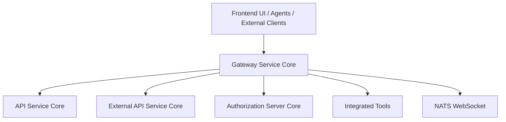
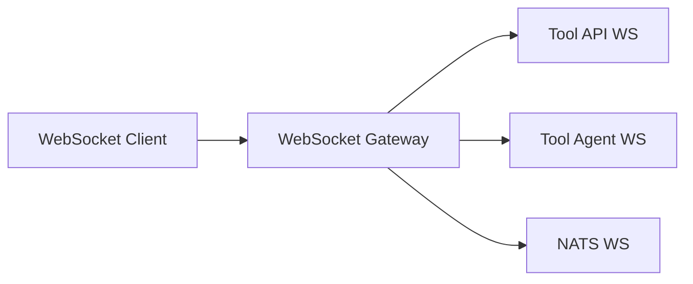
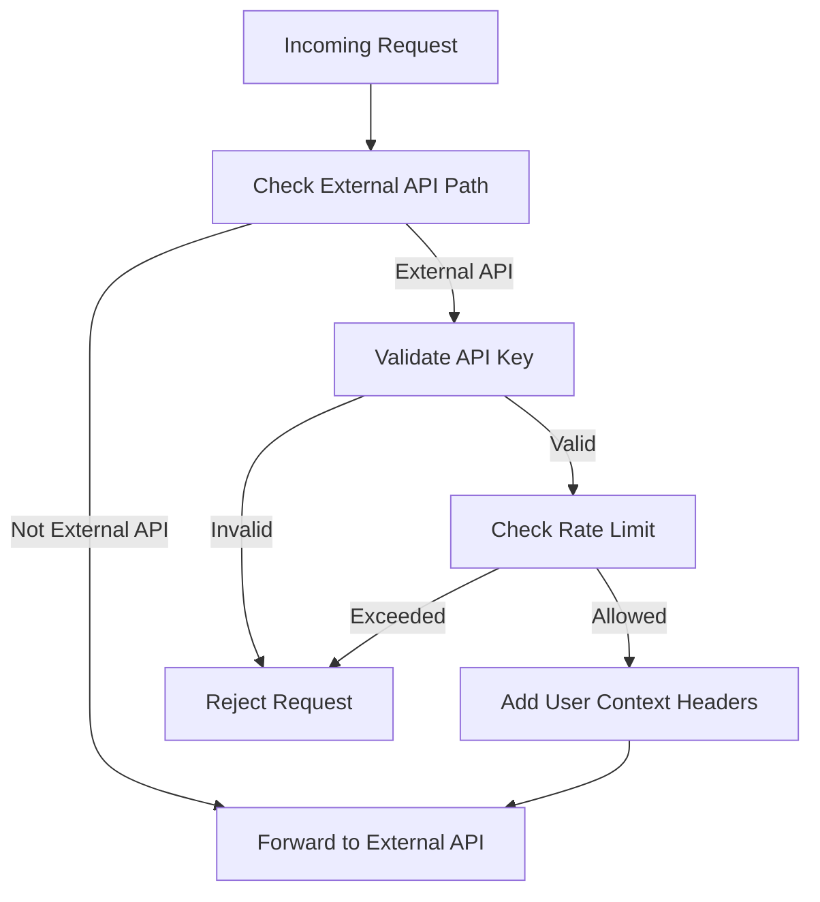

# Gateway Service Core

## Overview

The **Gateway Service Core** is the central ingress layer of the OpenFrame platform. It acts as a **reactive API gateway** responsible for:

- Routing HTTP and WebSocket traffic to internal and external services
- Enforcing authentication and authorization (JWT, API keys)
- Applying rate limiting and request sanitization
- Proxying requests to integrated tools and agents
- Providing a single, secure entry point for frontend, agents, and third-party integrations

Built on **Spring Cloud Gateway** and **Spring WebFlux**, the Gateway Service Core is designed for high concurrency, low latency, and multi-tenant SaaS deployments.

---

## Position in the Platform Architecture

The Gateway Service Core sits between clients (UI, agents, external integrations) and backend services such as API Service Core, Authorization Server Core, External API Service Core, and tool-specific services.

---

## Core Responsibilities

### 1. Reactive Routing and Proxying

- HTTP routing using Spring Cloud Gateway
- Dynamic proxying to integrated tools (API and Agent endpoints)
- WebSocket routing for tools and NATS

### 2. Security Enforcement

- JWT-based authentication with multi-issuer support
- Role-based access control (ADMIN, AGENT)
- API key authentication for external APIs
- Token propagation via headers, cookies, or query parameters

### 3. Rate Limiting

- Per–API key rate limiting (minute, hour, day)
- Standard rate limit headers
- Centralized logging and statistics hooks

### 4. Cross-Cutting Filters

- CORS handling (configurable and disable-able)
- Origin sanitization
- Authorization header enrichment

---

## Main Component Groups

### Web Client Configuration

**Component:** WebClientConfig

- Provides a preconfigured reactive `WebClient.Builder`
- Applies connection, read, and write timeouts
- Used by downstream proxy and integration services

---

### WebSocket Gateway

**Components:**
- WebSocketGatewayConfig
- ToolApiWebSocketProxyUrlFilter
- ToolAgentWebSocketProxyUrlFilter

The Gateway supports multiple WebSocket entry points:

- Tool API WebSockets: `/ws/tools/{toolId}/**`
- Tool Agent WebSockets: `/ws/tools/agent/{toolId}/**`
- NATS WebSocket bridge: `/ws/nats`

Routing is dynamic and resolved per tool using repository and URL resolver services.

---

### HTTP Integration Proxy

**Component:** IntegrationController

Handles all `/tools/**` HTTP traffic:

- Health checks for integrations
- Test connectivity for tools
- Transparent proxying of arbitrary API and agent requests

This allows OpenFrame to interact with heterogeneous third-party tools without hardcoding their APIs.

---

### API Key Authentication and Rate Limiting

**Component:** ApiKeyAuthenticationFilter

Applied globally to `/external-api/**` routes.

Flow:

1. Detect external API request
2. Require `X-API-Key` header
3. Validate API key
4. Enforce rate limits
5. Inject user context headers
6. Forward request downstream

---

### Gateway Security Configuration

**Components:**
- GatewaySecurityConfig
- JwtAuthConfig
- PathConstants

Key features:

- Reactive OAuth2 Resource Server
- JWT validation with dynamic issuer resolution
- Role and scope mapping from JWT claims
- Fine-grained path-based authorization rules

Roles:
- **ADMIN**: Dashboard, tools, APIs
- **AGENT**: Client and agent endpoints

---

### JWT Issuer Resolution (Multi-Tenant)

**Component:** IssuerUrlProvider

- Resolves allowed JWT issuers dynamically from tenant data
- Supports super-tenant issuer
- Caches issuer lists for performance
- Enforced by strict JWT validators

This enables secure multi-tenant authentication across the platform.

---

### Authorization Header Enrichment

**Component:** AddAuthorizationHeaderFilter

Ensures downstream services always receive a standard `Authorization: Bearer` header by resolving tokens from:

- HTTP cookies
- Custom headers
- Query parameters

This is critical for WebSockets, agents, and browser-based flows.

---

### CORS and Origin Handling

**Components:**
- CorsConfig
- CorsDisableConfig
- OriginSanitizerFilter

Capabilities:

- Configurable CORS policies via properties
- Fully permissive CORS mode for SaaS deployments
- Sanitization of invalid `Origin: null` headers

---

### Internal Health and Auth Probing

**Component:** InternalAuthProbeController

- Exposes `/internal/authz/probe`
- Enabled only via configuration
- Used for internal readiness and security checks

---

## How Gateway Service Core Fits with Other Modules

- Delegates authentication to **Authorization Server Core** via JWT validation
- Proxies business APIs to **API Service Core** and **External API Service Core**
- Bridges real-time communication to tools and **NATS**
- Serves as the only public-facing backend entry point

For deeper details on downstream behavior, refer to the respective service documentation.

---

## Summary

The **Gateway Service Core** is a critical foundation of OpenFrame:

- It centralizes security, routing, and cross-cutting concerns
- Enables scalable, multi-tenant SaaS operation
- Shields internal services from direct exposure
- Provides flexibility for integrating diverse tools and agents

Any change to authentication, routing, or rate limiting logic should be carefully evaluated due to its platform-wide impact.
