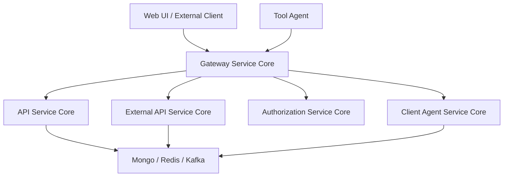
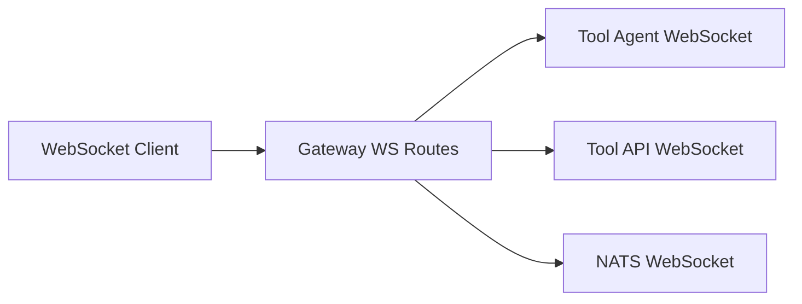
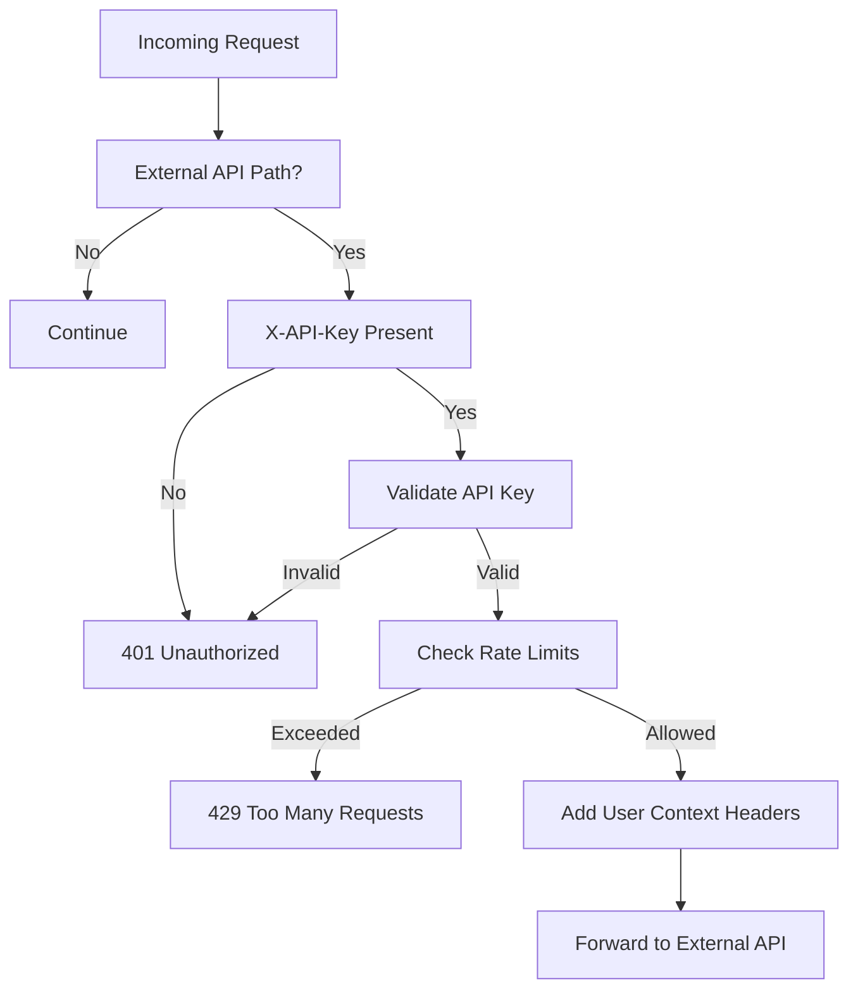

# Gateway Service Core

## Overview

The **Gateway Service Core** is the central ingress point for the OpenFrame platform. It is built on **Spring Cloud Gateway (Reactive)** and is responsible for:

- Routing HTTP and WebSocket traffic to internal services and integrated tools
- Enforcing authentication and authorization (JWT, roles, API keys)
- Applying rate limiting and request context enrichment
- Acting as a secure boundary between clients, agents, tools, and backend services

In practice, the Gateway Service Core unifies traffic coming from:
- Web frontends
- External API consumers
- Tool agents and integrations
- Internal platform services

while ensuring consistent security, observability, and multi-tenant isolation.

---

## Position in the Platform Architecture

The Gateway Service Core sits in front of multiple backend services and shared infrastructure layers:

- **API Service Core** – business APIs and GraphQL/data fetchers
- **Authorization Service Core** – OAuth2 / OIDC authentication and tenant identity
- **External API Service Core** – public-facing APIs protected by API keys
- **Client Agent Service Core** – agent registration and lifecycle APIs
- **Stream and Data Layers** – Kafka, MongoDB, Redis-backed services

It does not implement business logic itself. Instead, it focuses on **traffic orchestration and security enforcement**.

---

## Core Responsibilities

### 1. Request Routing

The gateway defines routing rules for:
- REST APIs (`/api`, `/clients`, `/tools`, `/external-api`)
- WebSocket connections (`/ws/tools/**`, `/ws/nats`)

Routing is handled declaratively using **Spring Cloud Gateway routes** and custom filters.

### 2. Security Enforcement

The Gateway Service Core enforces multiple security models:

- **JWT-based authentication** for UI, agents, and internal services
- **Role-based authorization** (ADMIN, AGENT)
- **API key authentication** for external APIs
- **Issuer validation** for multi-tenant OAuth2 tokens

All security is applied before requests reach downstream services.

### 3. WebSocket Proxying

The gateway transparently proxies WebSocket connections to:
- Integrated tools (API and agent channels)
- NATS WebSocket endpoints

It resolves target URLs dynamically based on tool configuration and tenant context.

### 4. Cross-Cutting Filters

Several global and ordered filters are applied:
- Authorization header enrichment
- Origin sanitization
- Rate limiting
- CORS handling

These filters ensure consistent behavior across all entry points.

---

## Main Components

### Web Client Configuration

**Component:** `WebClientConfig`

Provides a shared, reactive `WebClient.Builder` with:
- Connection timeouts
- Read/write timeouts
- Reactor Netty configuration

This client is used internally for proxying and integration calls.

---

### WebSocket Gateway Configuration

**Component:** `WebSocketGatewayConfig`

Defines WebSocket routes and security decoration:

- `/ws/tools/agent/{toolId}/**` → Agent WebSocket proxy
- `/ws/tools/{toolId}/**` → Tool API WebSocket proxy
- `/ws/nats` → NATS WebSocket endpoint

Custom proxy URL filters resolve the final upstream URL based on tool metadata.

---

### Integration Controller

**Component:** `IntegrationController`

Exposes tool-related proxy and health endpoints under `/tools`:

- `GET /tools/{toolId}/health` – integration health check
- `POST /tools/{toolId}/test` – test connectivity
- `/{toolId}/**` – proxy arbitrary API requests
- `/agent/{toolId}/**` – proxy agent-specific requests

This controller delegates all logic to:
- `IntegrationService`
- `RestProxyService`

ensuring the gateway remains thin and stateless.

---

### API Key Authentication Filter

**Component:** `ApiKeyAuthenticationFilter`

A global gateway filter that protects `/external-api/**` endpoints.

**Flow:**

Key features:
- API key validation
- Per-minute, per-hour, per-day rate limiting
- Standard rate limit response headers
- Success and failure statistics tracking

---

### Security Configuration

**Component:** `GatewaySecurityConfig`

Defines the reactive security filter chain:

- Disables CSRF, HTTP Basic, and form login
- Configures OAuth2 Resource Server support
- Resolves authentication managers dynamically by issuer
- Applies role-based access control by path

**Examples:**
- `/api/**` → `ROLE_ADMIN`
- `/tools/agent/**` → `ROLE_AGENT`
- `/ws/nats` → `ROLE_AGENT` or `ROLE_ADMIN`

---

### JWT Authentication and Issuer Resolution

**Components:**
- `JwtAuthConfig`
- `IssuerUrlProvider`

Responsibilities:
- Cache authentication managers per JWT issuer
- Validate JWT signatures and claims
- Enforce strict issuer allow-lists derived from tenant data

This design enables **multi-tenant authentication** while keeping runtime overhead low through caching.

---

### Authorization Header Enrichment

**Component:** `AddAuthorizationHeaderFilter`

Ensures downstream services always receive a standard `Authorization: Bearer` header.

Token resolution order:
1. Secure cookies
2. Alternate access token headers
3. Query parameters (for WebSocket and special flows)

This allows flexibility at the edge while keeping internal services consistent.

---

### CORS Handling

**Components:**
- `CorsConfig`
- `CorsDisableConfig`

Behavior is environment-driven:
- Default: standard CORS configuration from gateway properties
- SaaS mode: fully permissive CORS (same-domain deployment)

---

### Supporting Utilities

- `RateLimitConstants` – shared logging and rate-limit constants
- `PathConstants` – centralized path prefixes
- `OriginSanitizerFilter` – removes invalid `Origin: null` headers
- `InternalAuthProbeController` – internal auth reachability probe

---

## Summary

The **Gateway Service Core** is a foundational platform component that:

- Centralizes ingress traffic
- Enforces consistent, multi-tenant security
- Proxies REST and WebSocket traffic
- Protects external APIs with API keys and rate limits

By keeping business logic out of the gateway and focusing on orchestration, it enables the OpenFrame platform to scale securely while remaining flexible for new services, tools, and integrations.
