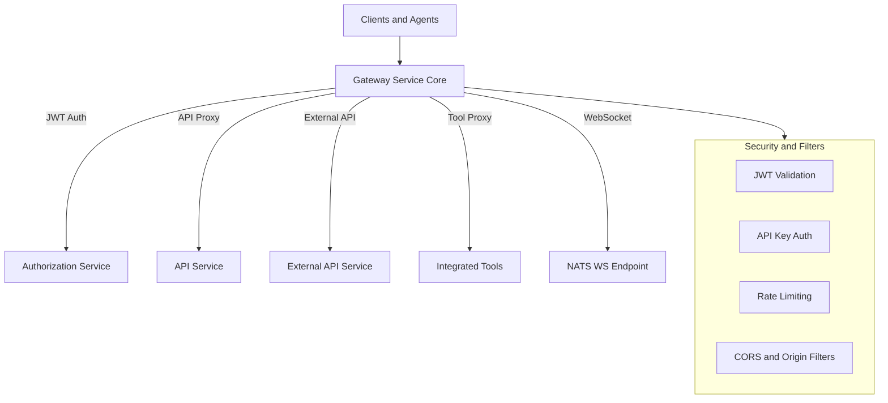
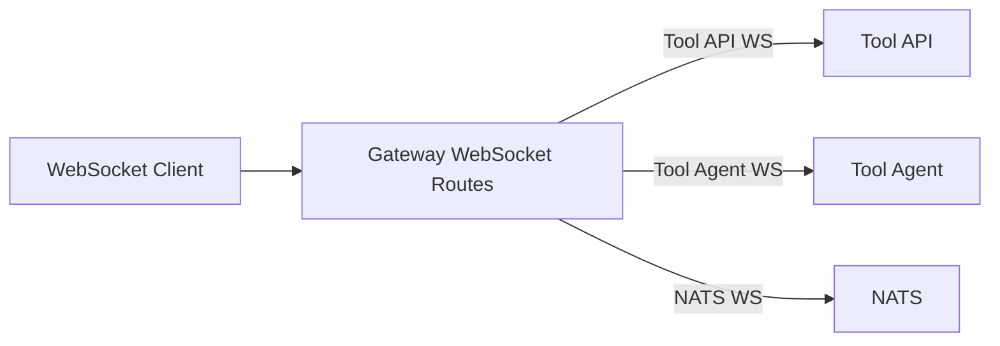
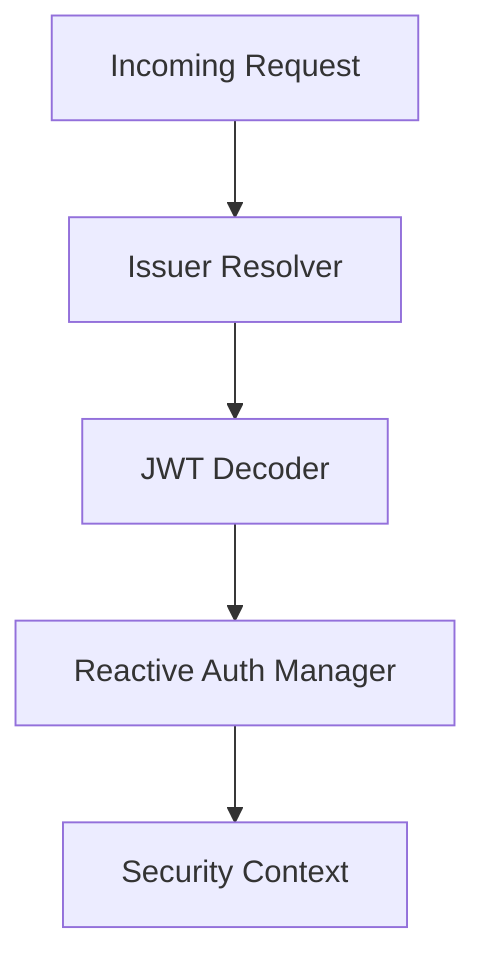
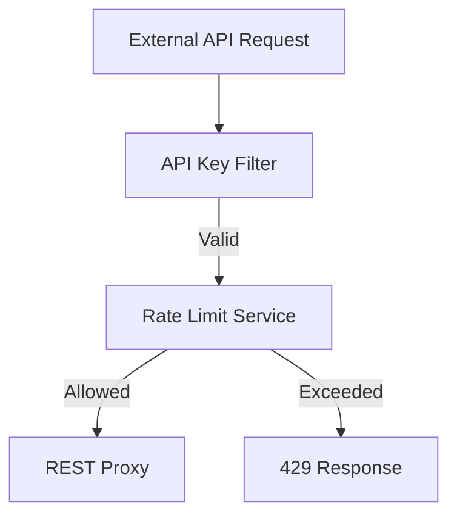

# Gateway Service Core

## Overview

The **Gateway Service Core** module is the central ingress point for the OpenFrame platform. It is responsible for routing, securing, and proxying HTTP and WebSocket traffic between clients (UI, agents, external consumers) and downstream internal services.

At a high level, Gateway Service Core provides:

- Centralized **API gateway** based on Spring Cloud Gateway (reactive)
- **Authentication and authorization** enforcement using JWTs and API keys
- **WebSocket routing and proxying** for tools, agents, and NATS
- **Rate limiting** and API key–based access control for external APIs
- **CORS handling**, origin sanitization, and request normalization
- Secure propagation of identity and authorization context to downstream services

This module does not implement business logic itself. Instead, it enforces cross-cutting concerns (security, routing, observability) and forwards requests to other OpenFrame services such as API Service Core, External API Service Core, Authorization Service Core, and tenant-specific tool endpoints.

---

## Position in the System

Gateway Service Core sits at the edge of the platform and mediates access to nearly all other backend services.

- **Upstream callers**: Web UI, agents, third-party integrations, WebSocket clients
- **Downstream services**:
  - API Service Core
  - External API Service Core
  - Authorization Service Core
  - Tenant Client Service Core
  - Tool-specific APIs and agents
  - NATS WebSocket endpoint

It is typically deployed as the `openframe-gateway` service entrypoint.

---

## High-Level Architecture

---

## Core Responsibilities

### 1. HTTP and WebSocket Routing

Gateway Service Core defines and manages routing rules for both HTTP and WebSocket traffic. It uses Spring Cloud Gateway to dynamically route requests based on path prefixes and request metadata.

Key routing categories:

- **REST APIs** under `/api`, `/clients`, `/tools`, `/external-api`
- **WebSockets** for:
  - Tool APIs: `/ws/tools/{toolId}/**`
  - Tool agents: `/ws/tools/agent/{toolId}/**`
  - NATS: `/ws/nats`

Routing decisions are combined with filters that dynamically resolve target URLs based on tenant and tool configuration.

---

### 2. WebSocket Gateway Configuration

WebSocket routing is configured centrally and supports dynamic proxying to tenant-specific tool endpoints.

Key components involved:

- **WebSocketGatewayConfig**: Declares WebSocket routes
- **ToolApiWebSocketProxyUrlFilter**: Resolves tool API WebSocket targets
- **ToolAgentWebSocketProxyUrlFilter**: Resolves tool agent WebSocket targets
- **WebSocketServiceSecurityDecorator**: Enforces JWT-based security on WebSocket connections

---

### 3. Security Model

Gateway Service Core enforces security at the edge using a layered approach.

#### JWT-Based Authentication

For internal and UI-driven APIs, the gateway acts as an OAuth2 Resource Server:

- JWTs are validated using **issuer-based authentication managers**
- Multiple issuers are supported for multi-tenant deployments
- Roles and scopes are extracted from JWT claims

Key components:

- **GatewaySecurityConfig**: Defines authorization rules per path
- **JwtAuthConfig**: Configures issuer-based JWT authentication
- **IssuerUrlProvider**: Resolves allowed issuer URLs dynamically from tenants

---

#### API Key Authentication for External APIs

Requests targeting `/external-api/**` are protected using API keys instead of JWTs.

Flow:

1. Extract `X-API-Key` header
2. Validate API key
3. Enforce rate limits
4. Inject user context headers
5. Forward request to downstream service

Key components:

- **ApiKeyAuthenticationFilter**: Global gateway filter for API key validation
- **RateLimitService**: Enforces per-minute, per-hour, and per-day limits
- **RateLimitConstants**: Logging and rate limit constants

---

### 4. Authorization Header Normalization

Gateway Service Core supports multiple token delivery mechanisms and normalizes them into a standard `Authorization: Bearer` header before authentication.

Supported sources:

- Secure HTTP-only cookies
- Custom access token headers
- Query parameters (for WebSocket and special flows)

This logic ensures downstream security components can rely on a consistent authorization model.

Key component:

- **AddAuthorizationHeaderFilter**

---

### 5. Integration and Tool Proxying

The gateway provides dynamic proxying to integrated tools, both for REST APIs and agent endpoints.

Endpoints:

- `/tools/{toolId}/**` → Tool API
- `/tools/agent/{toolId}/**` → Tool Agent API

The gateway resolves the correct backend URL per tool and tenant, then transparently proxies the request.

Key components:

- **IntegrationController**: Entry point for tool-related requests
- **RestProxyService**: Handles request forwarding and response streaming

---

### 6. CORS and Origin Handling

CORS behavior is configurable depending on deployment mode:

- **OSS / multi-origin**: Strict CORS configuration
- **SaaS / same-domain**: Fully permissive CORS

Additionally, invalid `Origin: null` headers are sanitized to prevent browser and proxy issues.

Key components:

- **CorsConfig**: Standard CORS configuration
- **CorsDisableConfig**: Permissive CORS for SaaS
- **OriginSanitizerFilter**: Removes invalid origin headers

---

### 7. Internal Probes and Health Checks

Gateway Service Core exposes lightweight internal endpoints for infrastructure-level checks.

- `/internal/authz/probe`: Verifies internal authorization wiring

These endpoints are conditionally enabled and intended for internal use only.

Key component:

- **InternalAuthProbeController**

---

## Key Configuration Points

Gateway behavior is heavily driven by configuration:

- JWT issuer and caching settings
- API key rate limits and headers
- CORS enablement or disablement
- WebSocket target URLs (for NATS and tools)

This allows the same codebase to support OSS, SaaS, and hybrid deployments.

---

## Summary

The **Gateway Service Core** module is a foundational infrastructure component that:

- Centralizes ingress traffic for the OpenFrame platform
- Enforces authentication, authorization, and rate limiting
- Provides flexible HTTP and WebSocket proxying
- Normalizes security context for downstream services
- Adapts to multi-tenant and multi-deployment environments

By isolating these concerns in the gateway, the rest of the platform can focus on business logic while relying on consistent, secure, and observable request handling.
