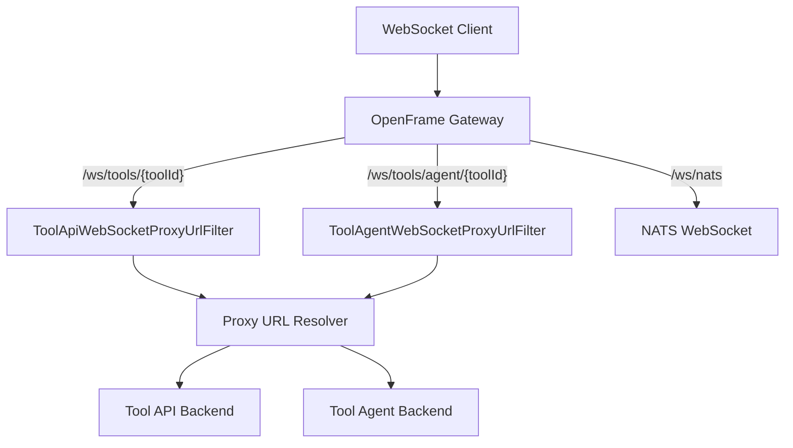
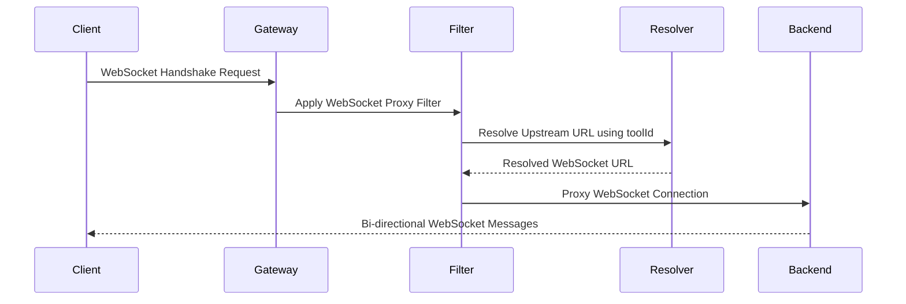

# WebSocket Gateway Module

## Overview

The **WebSocket Gateway** module is part of the `gateway_service_core` and is responsible for routing, securing, and proxying WebSocket connections through the OpenFrame Gateway. It enables real-time, bidirectional communication between:

- **Integrated tools APIs** (tool backends)
- **Integrated tool agents** (machine-side or connector agents)
- **Internal messaging infrastructure** (NATS over WebSocket)

This module builds on **Spring Cloud Gateway** and **Spring WebFlux WebSocket** support, adding OpenFrame-specific routing, security decoration, and dynamic proxy URL resolution based on tool metadata.

---

## Responsibilities

The websocket module provides the following core capabilities:

- Define WebSocket routes at the gateway level
- Dynamically resolve upstream WebSocket targets per integrated tool
- Enforce JWT-based security on WebSocket connections
- Separate API-facing and agent-facing WebSocket traffic
- Proxy internal NATS WebSocket traffic

---

## Key Components

### 1. `WebSocketGatewayConfig`

**Package:** `com.openframe.gateway.config.ws`

This configuration class defines:

- WebSocket endpoint prefixes
- Gateway routing rules for WebSocket traffic
- A security-decorated `WebSocketService`

#### Defined Endpoint Prefixes

```text
/ws/tools/{toolId}/**        -> Tool API WebSocket traffic
/ws/tools/agent/{toolId}/** -> Tool Agent WebSocket traffic
/ws/nats                    -> NATS WebSocket endpoint
```

#### Route Configuration

The `customRouteLocator` bean registers three WebSocket routes:

- **Agent Gateway Route**
  - Matches `/ws/tools/agent/{toolId}/**`
  - Applies `ToolAgentWebSocketProxyUrlFilter`
  - Dynamically proxies to the agent-specific backend URL

- **API Gateway Route**
  - Matches `/ws/tools/{toolId}/**`
  - Applies `ToolApiWebSocketProxyUrlFilter`
  - Dynamically proxies to the tool API backend URL

- **NATS WebSocket Route**
  - Matches `/ws/nats`
  - Proxies directly to the configured `nats-ws-url`

#### WebSocket Security Decoration

A `WebSocketServiceSecurityDecorator` wraps the default `WebSocketService` to:

- Extract JWT claims from the initial WebSocket handshake
- Bind authentication context to the WebSocket session
- Enforce gateway-level security consistently with HTTP traffic

---

### 2. `ToolApiWebSocketProxyUrlFilter`

**Extends:** `ToolWebSocketProxyUrlFilter`

This filter handles **API-facing** WebSocket connections for integrated tools.

#### Responsibilities

- Extract the `toolId` from the request path
- Resolve the correct backend WebSocket URL for the tool API
- Rewrite and proxy the WebSocket request to the resolved upstream

#### Tool ID Extraction Logic

```text
/ws/tools/{toolId}/...  -> toolId is at index 3 after splitting by '/'
```

#### Dependencies

- `ReactiveIntegratedToolRepository`
- `ToolUrlService`
- `ProxyUrlResolver`

These dependencies allow dynamic resolution of tool endpoints at runtime.

---

### 3. `ToolAgentWebSocketProxyUrlFilter`

**Extends:** `ToolWebSocketProxyUrlFilter`

This filter handles **agent-facing** WebSocket connections.

#### Responsibilities

- Extract the `toolId` from agent-specific paths
- Resolve the correct backend WebSocket URL for agent communication
- Proxy agent WebSocket traffic securely through the gateway

#### Tool ID Extraction Logic

```text
/ws/tools/agent/{toolId}/...  -> toolId is at index 4 after splitting by '/'
```

#### Dependencies

- `ReactiveIntegratedToolRepository`
- `ToolUrlService`
- `ProxyUrlResolver`

---

## Architecture Overview



---

## WebSocket Request Flow



---

## Security Model

- WebSocket connections pass through the **Gateway Security layer**
- JWT claims are extracted during the handshake
- The decorated `WebSocketService` ensures:
  - Tenant context propagation
  - Authentication consistency with HTTP routes
  - Centralized enforcement of access control

This ensures WebSocket traffic adheres to the same zero-trust principles as REST and GraphQL traffic.

---

## How This Module Fits Into the System

The websocket module acts as the **real-time communication backbone** of OpenFrame:

- Enables live agent connectivity
- Powers streaming integrations and tool control channels
- Bridges frontend clients, backend tools, and messaging systems

It integrates tightly with:

- Gateway routing and security infrastructure
- Tool metadata and URL resolution services
- JWT and tenant-aware authentication mechanisms

---

## Summary

The WebSocket Gateway module provides a secure, extensible, and dynamically routed WebSocket layer for OpenFrame. By centralizing WebSocket routing and security in the gateway, it enables scalable real-time integrations across tools, agents, and internal messaging systems without exposing backend topology to clients.