# Gateway Service Security Module

## Overview

The **Gateway Service Security** module is the primary security enforcement layer for the OpenFrame platform, implementing comprehensive authentication and authorization mechanisms for the API Gateway. This module provides multi-tenant JWT authentication, API key validation with rate limiting, role-based access control (RBAC), and dynamic issuer resolution for OAuth2/OIDC flows.

**Key Responsibilities:**
- **JWT Authentication**: Multi-tenant JWT token validation with dynamic issuer resolution
- **API Key Authentication**: Secure API key validation for external API access with rate limiting
- **Authorization**: Role-based access control (RBAC) for different user types (ADMIN, AGENT)
- **Rate Limiting**: Request throttling per API key with minute/hour/day limits
- **Security Filters**: Custom filters for authentication header management and API key validation
- **CORS & CSRF**: Cross-origin and CSRF protection configuration

**Related Modules:**
- [Authorization Service](authorization_service.md) - Issues JWT tokens and manages OAuth2 flows
- [Security Core](security_core.md) - Provides shared JWT configuration and security utilities
- [Gateway Service Configuration](gateway_service_configuration.md) - General gateway configuration including WebClient and WebSocket setup
- [API Service Configuration](api_service_configuration.md) - Downstream service security configuration

---

## Architecture

### High-Level Security Flow

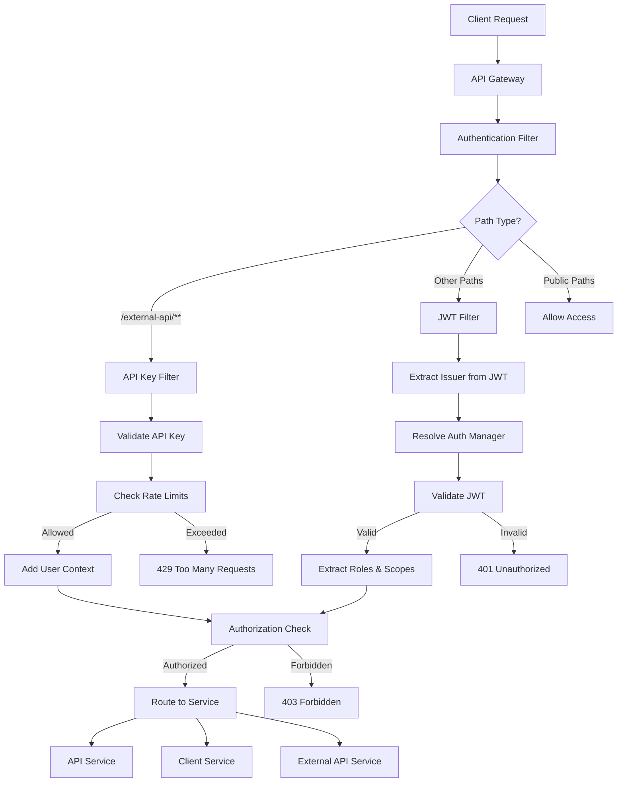

### Component Architecture

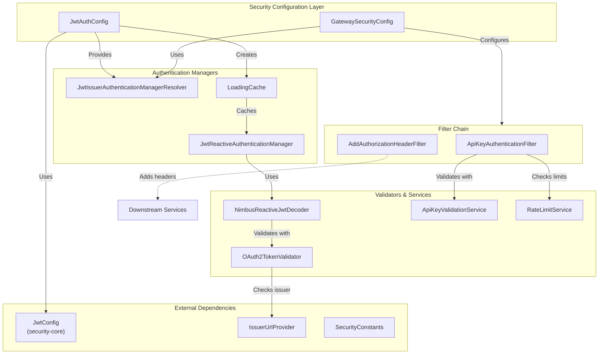

---

## Core Components

### 1. GatewaySecurityConfig

**Purpose**: Main security configuration class that defines the Spring Security filter chain, authentication mechanisms, and authorization rules for the API Gateway.

**Key Features:**
- Configures reactive security filter chain
- Defines path-based authorization rules
- Integrates JWT authentication with dynamic issuer resolution
- Configures CORS, CSRF, and HTTP Basic/Form login settings
- Role-based access control (RBAC) for ADMIN and AGENT roles

**Configuration:**

```java
@Configuration
@EnableWebFluxSecurity
@EnableConfigurationProperties({ManagementServerProperties.class, ServerProperties.class})
public class GatewaySecurityConfig {
    
    @Bean
    public SecurityWebFilterChain springSecurityFilterChain(
            ServerHttpSecurity http,
            @Value("${management.endpoints.web.base-path}") String managementBasePath,
            ReactiveAuthenticationManagerResolver<ServerWebExchange> issuerResolver,
            AddAuthorizationHeaderFilter addAuthorizationHeaderFilter
    ) {
        // Security configuration
    }
}
```

**Authorization Rules:**

| Path Pattern | Access Control | Description |
|-------------|----------------|-------------|
| `OPTIONS /**` | Permit All | CORS preflight requests |
| `/error/**` | Permit All | Error handling endpoints |
| `/health/**` | Permit All | Health check endpoints |
| `/clients/metrics/**` | Permit All | Client metrics endpoints |
| `/clients/api/agents/register` | Permit All | Agent registration |
| `/clients/oauth/token` | Permit All | OAuth token endpoint |
| `/actuator/**` | Permit All | Spring Boot actuator endpoints |
| `/dashboard/**` | `ROLE_ADMIN` | Admin dashboard API |
| `/tools/agent/**` | `ROLE_AGENT` | Agent tool endpoints |
| `/ws-tools/agent/**` | `ROLE_AGENT` | Agent WebSocket tools |
| `/nats-ws` | `ROLE_AGENT` or `ROLE_ADMIN` | NATS WebSocket endpoint |
| `/clients/**` | `ROLE_AGENT` | Client service endpoints |
| `/tools/**` | `ROLE_ADMIN` | Admin tool endpoints |
| `/ws-tools/**` | `ROLE_ADMIN` | Admin WebSocket tools |
| `/**` | Permit All | Frontend UI and other paths |

**JWT Authentication Converter:**

```java
@Bean
public ReactiveJwtAuthenticationConverter reactiveJwtAuthenticationConverter() {
    // Extracts roles from "roles" claim with "ROLE_" prefix
    JwtGrantedAuthoritiesConverter rolesConverter = new JwtGrantedAuthoritiesConverter();
    rolesConverter.setAuthoritiesClaimName("roles");
    rolesConverter.setAuthorityPrefix("ROLE_");

    // Extracts scopes from "scope" claim with "SCOPE_" prefix
    JwtGrantedAuthoritiesConverter scopesConverter = new JwtGrantedAuthoritiesConverter();
    scopesConverter.setAuthoritiesClaimName("scope");
    scopesConverter.setAuthorityPrefix("SCOPE_");

    // Combines both roles and scopes
    ReactiveJwtAuthenticationConverter jwtAuthenticationConverter = 
        new ReactiveJwtAuthenticationConverter();
    
    jwtAuthenticationConverter.setJwtGrantedAuthoritiesConverter(jwt -> {
        Flux<GrantedAuthority> roles = Flux.fromIterable(rolesConverter.convert(jwt));
        Flux<GrantedAuthority> scopes = Flux.fromIterable(scopesConverter.convert(jwt));
        return Flux.concat(roles, scopes);
    });

    jwtAuthenticationConverter.setPrincipalClaimName("sub");
    
    return jwtAuthenticationConverter;
}
```

**Security Features:**
- ✅ CSRF disabled (stateless API)
- ✅ CORS disabled (handled by CorsConfig)
- ✅ HTTP Basic disabled
- ✅ Form login disabled
- ✅ OAuth2 Resource Server with dynamic issuer resolution
- ✅ BCrypt password encoding

---

### 2. JwtAuthConfig

**Purpose**: Configures JWT authentication with multi-tenant support, dynamic issuer resolution, and caching for performance optimization.

**Key Features:**
- **Dynamic Issuer Resolution**: Supports multiple JWT issuers for multi-tenant scenarios
- **Caching**: Uses Caffeine cache to store authentication managers per issuer
- **Dual JWT Validation**: Handles both internal (OpenFrame) and external (tenant-specific) JWT tokens
- **Strict Issuer Validation**: Validates JWT issuer against allowed issuer list

**Cache Configuration:**

```java
@Bean
public LoadingCache<String, ReactiveAuthenticationManager> issuerManagersCache(
        ReactiveJwtAuthenticationConverter converter,
        JwtConfig jwtConfig,
        IssuerUrlProvider issuerUrlProvider) {
    
    return Caffeine.newBuilder()
            .maximumSize(maximumSize)           // Default: configurable
            .expireAfterWrite(expireAfter)      // Default: configurable
            .refreshAfterWrite(refreshAfter)    // Default: configurable
            .build(issuer -> {
                // Create authentication manager for issuer
            });
}
```

**Configuration Properties:**

| Property | Default | Description |
|----------|---------|-------------|
| `openframe.security.jwt.cache.maximum-size` | - | Maximum number of cached authentication managers |
| `openframe.security.jwt.cache.expire-after` | - | Cache entry expiration time |
| `openframe.security.jwt.cache.refresh-after` | - | Cache entry refresh time |

**JWT Validation Flow:**

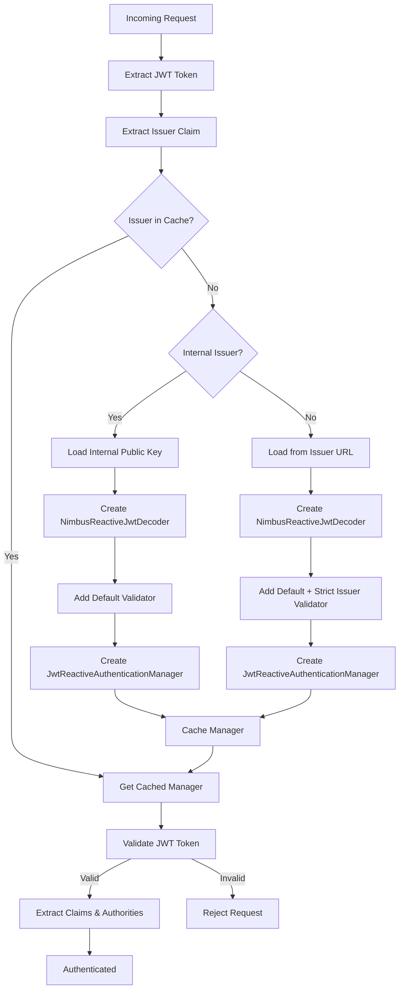

**Internal vs External JWT Handling:**

**Internal JWT (OpenFrame Issuer):**
```java
if (issuer.equals(jwtConfig.getIssuer())) {
    // Load public key from configuration
    var pub = jwtConfig.loadPublicKey();
    var dec = NimbusReactiveJwtDecoder.withPublicKey(pub).build();
    dec.setJwtValidator(JwtValidators.createDefaultWithIssuer(issuer));
    
    var m = new JwtReactiveAuthenticationManager(dec);
    m.setJwtAuthenticationConverter(converter);
    return m;
}
```

**External JWT (Tenant Issuer):**
```java
// Load from issuer's JWKS endpoint
var dec = (NimbusReactiveJwtDecoder) ReactiveJwtDecoders.fromIssuerLocation(issuer);

// Add strict issuer validation
var defaultValidator = JwtValidators.createDefault();
var strictIssuerValidator = createStrictIssuerValidator(issuerUrlProvider);
dec.setJwtValidator(new DelegatingOAuth2TokenValidator<>(defaultValidator, strictIssuerValidator));

var jwtManager = new JwtReactiveAuthenticationManager(dec);
jwtManager.setJwtAuthenticationConverter(converter);
return jwtManager;
```

**Strict Issuer Validation:**

```java
private OAuth2TokenValidator<Jwt> createStrictIssuerValidator(IssuerUrlProvider issuerUrlProvider) {
    return jwt -> {
        String iss = (jwt.getIssuer() != null ? jwt.getIssuer().toString() : null);
        var expectedList = issuerUrlProvider.getCachedIssuerUrl();
        
        if (expectedList == null || expectedList.isEmpty()) {
            return success();
        }
        
        if (expectedList.contains(iss)) return success();
        
        return OAuth2TokenValidatorResult.failure(
                new OAuth2Error(OAuth2ErrorCodes.INVALID_TOKEN, "Unexpected issuer", null)
        );
    };
}
```

**Benefits:**
- ✅ **Performance**: Caches authentication managers to avoid repeated JWKS fetches
- ✅ **Multi-Tenancy**: Supports multiple JWT issuers for different tenants
- ✅ **Security**: Strict issuer validation prevents token reuse across tenants
- ✅ **Flexibility**: Handles both internal and external identity providers

---

### 3. ApiKeyAuthenticationFilter

**Purpose**: Global filter that enforces API key authentication for external API endpoints (`/external-api/**`) with comprehensive rate limiting and request tracking.

**Key Features:**
- **Path-Based Authentication**: Only applies to `/external-api/**` endpoints
- **API Key Validation**: Validates API keys against database
- **Rate Limiting**: Enforces minute/hour/day request limits per API key
- **Request Tracking**: Records successful and failed requests for analytics
- **Rate Limit Headers**: Returns standard rate limit headers in responses
- **Swagger Bypass**: Allows unauthenticated access to API documentation

**Filter Order**: `-100` (executes before authentication filters)

**Authentication Flow:**

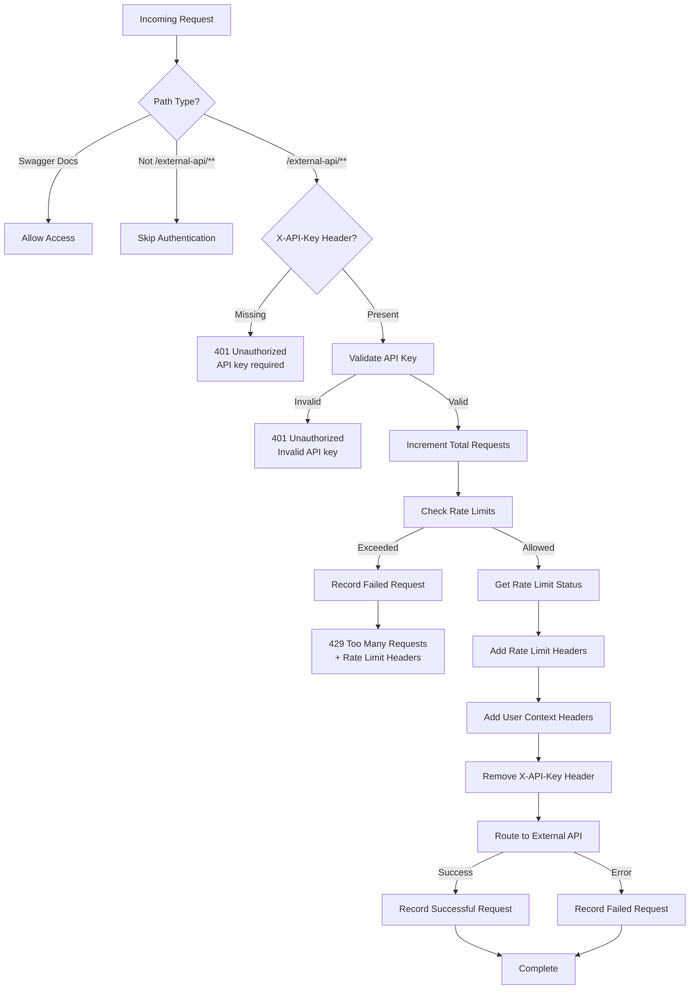

**Protected Paths:**

| Path Pattern | Authentication Required | Description |
|-------------|------------------------|-------------|
| `/external-api/**` | ✅ API Key | External API endpoints |
| `/api-docs/**` | ❌ Public | OpenAPI documentation |
| `/swagger-ui/**` | ❌ Public | Swagger UI |
| `/swagger-ui.html` | ❌ Public | Swagger UI HTML |
| `/webjars/**` | ❌ Public | Swagger UI assets |

**API Key Validation:**

```java
@Override
public Mono<Void> filter(ServerWebExchange exchange, GatewayFilterChain chain) {
    String path = exchange.getRequest().getPath().value();
    
    // Skip Swagger paths
    if (isDirectSwaggerPath(path)) {
        return chain.filter(exchange);
    }
    
    // Skip non-external-api paths
    if (!path.startsWith(EXTERNAL_API_PREFIX)) {
        return chain.filter(exchange);
    }
    
    // Require API key
    String apiKey = exchange.getRequest().getHeaders().getFirst(X_API_KEY);
    
    if (apiKey == null || apiKey.trim().isEmpty()) {
        return handleUnauthorized(exchange, "API key is required for /external-api/** endpoints");
    }
    
    // Validate and process
    return apiKeyValidationService.validateApiKey(apiKey)
            .flatMap(validationResult -> processValidationResult(validationResult, exchange, chain, path))
            .onErrorResume(error -> handleInternalError(exchange));
}
```

**Rate Limiting:**

```java
private Mono<Void> processRateLimitCheck(Boolean allowed, String keyId, ServerWebExchange exchange,
                                         GatewayFilterChain chain, ApiKey apiKeyObj, String path) {
    if (!allowed) {
        return processRateLimitExceeded(keyId, exchange, path);
    }
    
    return processAllowedRequest(keyId, exchange, chain, apiKeyObj);
}

private Mono<Void> processRateLimitExceeded(String keyId, ServerWebExchange exchange, String path) {
    return rateLimitService.getRateLimitStatus(keyId)
            .flatMap(rateLimitStatus -> {
                log.warn("Rate limit exceeded for API key: {} on path: {}", keyId, path);
                apiKeyValidationService.recordFailedRequest(keyId);
                return handleRateLimitExceeded(exchange, rateLimitStatus);
            });
}
```

**Rate Limit Headers:**

The filter adds standard rate limiting headers to all responses:

| Header | Description | Example |
|--------|-------------|---------|
| `X-RateLimit-Limit-Minute` | Requests allowed per minute | `60` |
| `X-RateLimit-Remaining-Minute` | Remaining requests this minute | `45` |
| `X-RateLimit-Limit-Hour` | Requests allowed per hour | `1000` |
| `X-RateLimit-Remaining-Hour` | Remaining requests this hour | `850` |
| `X-RateLimit-Limit-Day` | Requests allowed per day | `10000` |
| `X-RateLimit-Remaining-Day` | Remaining requests today | `9200` |
| `Retry-After` | Seconds until retry (on 429) | `60` |

**User Context Headers:**

After successful validation, the filter adds user context headers and removes the API key:

```java
private Mono<Void> addUserContextAndContinue(ServerWebExchange exchange, GatewayFilterChain chain, ApiKey apiKey) {
    var modifiedRequest = exchange.getRequest().mutate()
        .header(X_API_KEY_ID, apiKey.getKeyId())      // Add API key ID
        .header(X_USER_ID, apiKey.getUserId())        // Add user ID
        .headers(headers -> headers.remove(X_API_KEY)) // Remove raw API key
        .build();
    
    var modifiedExchange = exchange.mutate()
        .request(modifiedRequest)
        .build();
    
    return chain.filter(modifiedExchange);
}
```

**Error Responses:**

All error responses follow a consistent JSON format:

```json
{
  "code": "UNAUTHORIZED",
  "message": "API key is required for /external-api/** endpoints"
}
```

**Error Codes:**

| HTTP Status | Code | Message | Scenario |
|------------|------|---------|----------|
| 401 | `UNAUTHORIZED` | API key is required | Missing `X-API-Key` header |
| 401 | `UNAUTHORIZED` | Invalid API key | API key validation failed |
| 429 | `RATE_LIMIT_EXCEEDED` | Too many requests | Rate limit exceeded |
| 500 | `INTERNAL_SERVER_ERROR` | An unexpected error occurred | Server error |

**Request Tracking:**

The filter tracks all requests for analytics and monitoring:

```java
return addUserContextAndContinue(exchange, chain, apiKeyObj)
        .doOnSuccess(unused -> {
            log.debug("Request completed successfully for API key: {}", keyId);
            apiKeyValidationService.recordSuccessfulRequest(keyId);
        })
        .doOnError(error -> {
            log.warn("Request failed for API key {}: {}", keyId, error.getMessage());
            apiKeyValidationService.recordFailedRequest(keyId);
        });
```

**Configuration:**

Rate limit header inclusion can be controlled via configuration:

```yaml
openframe:
  gateway:
    rate-limit:
      include-headers: true  # Include rate limit headers in responses
```

**Benefits:**
- ✅ **Security**: Protects external APIs with API key authentication
- ✅ **Rate Limiting**: Prevents abuse with configurable limits
- ✅ **Observability**: Tracks all requests for monitoring and analytics
- ✅ **Standards Compliance**: Uses standard HTTP headers and status codes
- ✅ **Developer Experience**: Clear error messages and rate limit information

---

## Security Patterns

### Multi-Tenant JWT Authentication

The gateway supports multiple JWT issuers for multi-tenant scenarios:

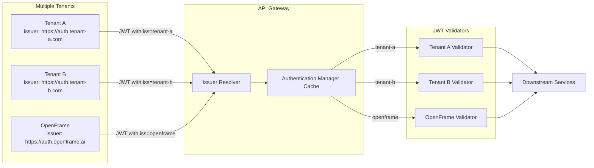

**Implementation:**

1. **Extract Issuer**: JWT issuer claim is extracted from the token
2. **Resolve Manager**: Authentication manager is resolved from cache or created
3. **Validate Token**: Token is validated using issuer-specific public key
4. **Extract Claims**: Roles and scopes are extracted from validated token
5. **Authorize**: Request is authorized based on extracted authorities

### API Key Authentication with Rate Limiting

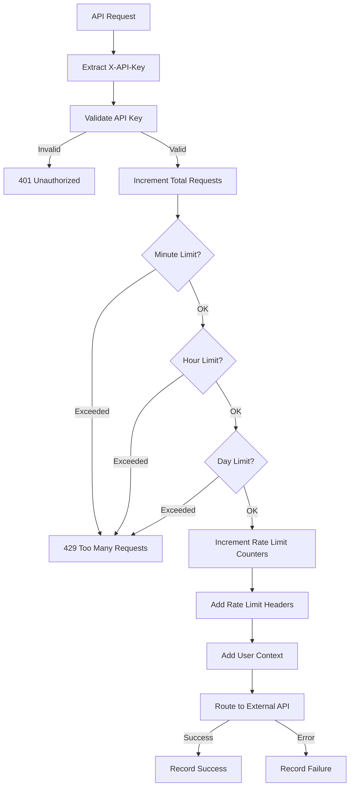

**Rate Limit Storage:**

Rate limits are typically stored in Redis with time-based expiration:

```text
Key Pattern: rate_limit:{keyId}:{window}
Windows: minute, hour, day

Example:
rate_limit:key_abc123:minute = 45 (TTL: 60s)
rate_limit:key_abc123:hour = 850 (TTL: 3600s)
rate_limit:key_abc123:day = 9200 (TTL: 86400s)
```

### Role-Based Access Control (RBAC)

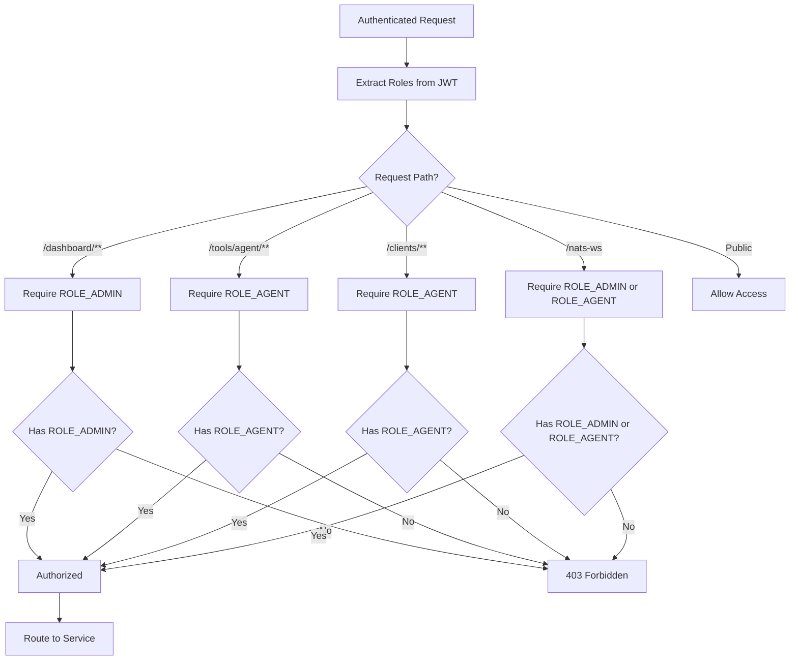

**Role Extraction:**

Roles are extracted from JWT claims and prefixed with `ROLE_`:

```json
{
  "sub": "user123",
  "roles": ["ADMIN", "USER"],
  "scope": "read write",
  "iss": "https://auth.openframe.ai",
  "exp": 1234567890
}
```

Converted to Spring Security authorities:
- `ROLE_ADMIN`
- `ROLE_USER`
- `SCOPE_read`
- `SCOPE_write`

---

## Data Flow

### JWT Authentication Flow

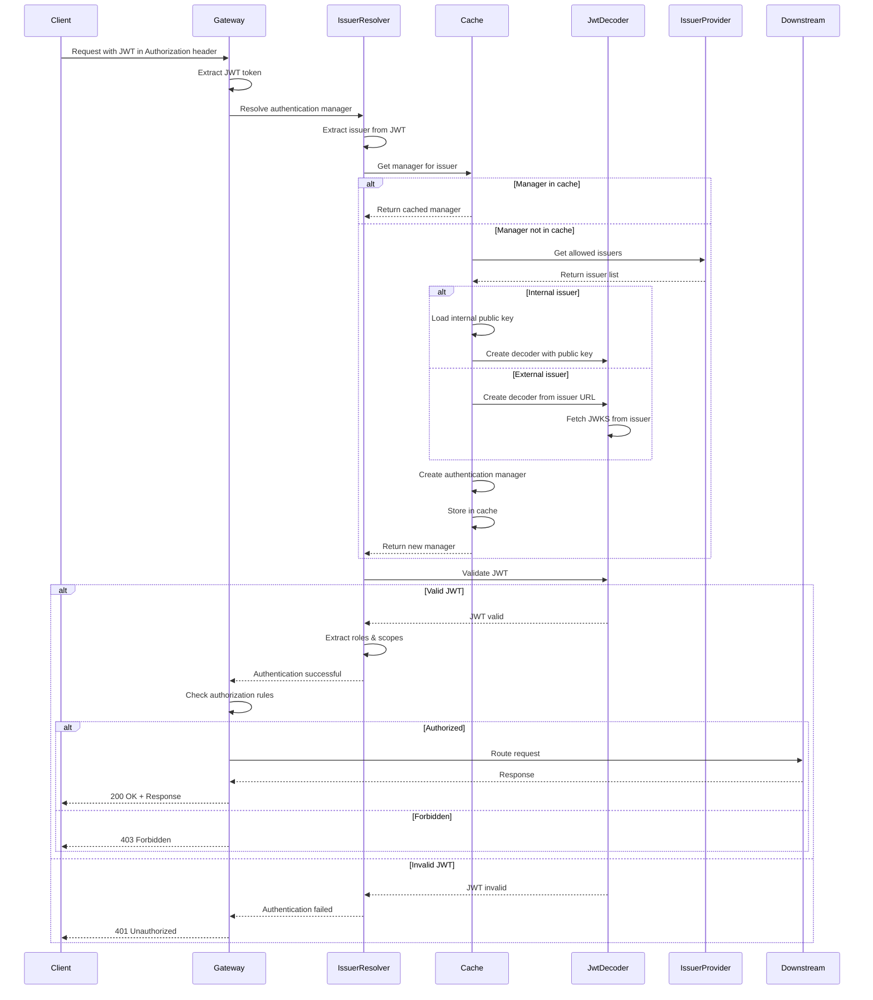

### API Key Authentication Flow

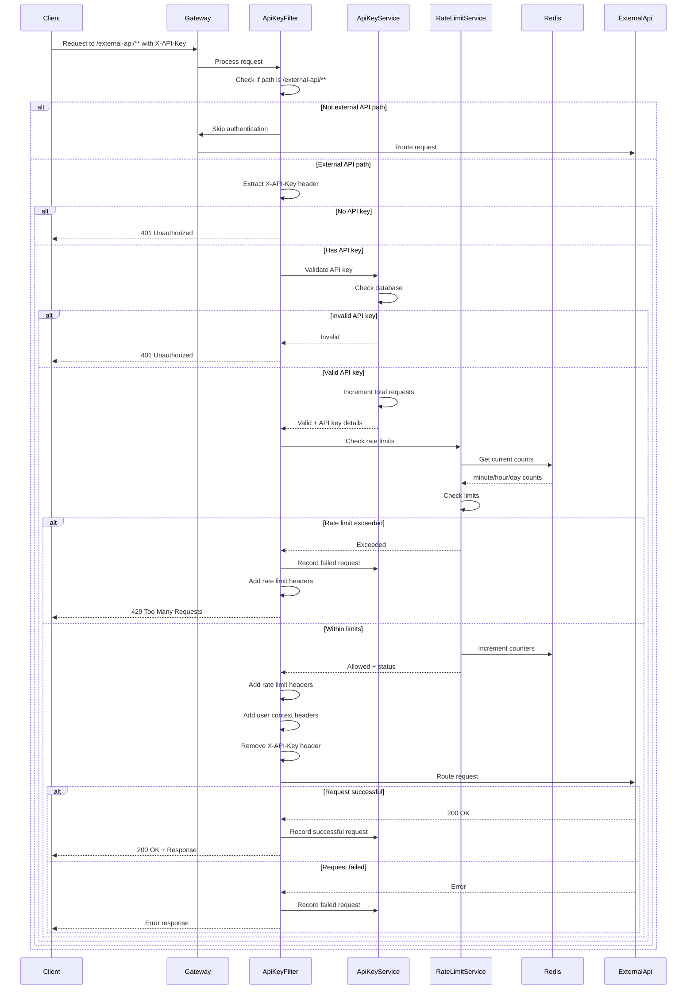

---

## Integration Points

### Upstream Dependencies

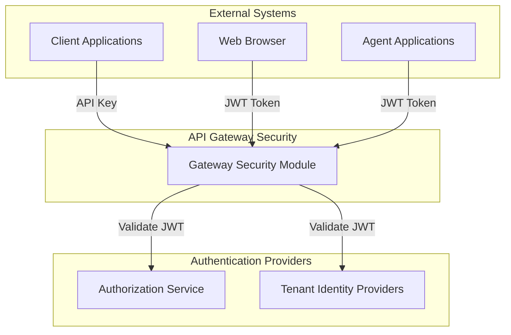

### Downstream Dependencies

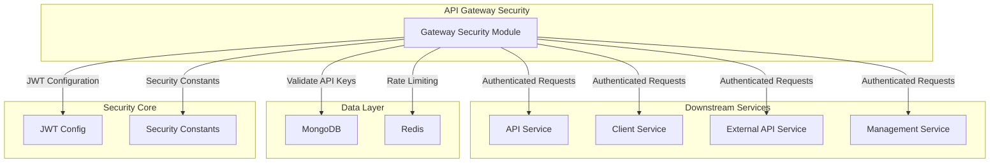

### Related Modules

| Module | Relationship | Description |
|--------|--------------|-------------|
| [Authorization Service](authorization_service.md) | **Upstream** | Issues JWT tokens that gateway validates |
| [Security Core](security_core.md) | **Dependency** | Provides JWT configuration and utilities |
| [Gateway Service Configuration](gateway_service_configuration.md) | **Sibling** | General gateway configuration |
| [API Service Configuration](api_service_configuration.md) | **Downstream** | Receives authenticated requests |
| [External API Service](external_api.md) | **Downstream** | Protected by API key authentication |
| [Data Layer MongoDB](data_layer_mongo.md) | **Dependency** | Stores API keys and user data |
| [Data Layer Redis](data_layer_redis.md) | **Dependency** | Stores rate limit counters |

---

## Configuration

### Application Properties

```yaml
# JWT Configuration
jwt:
  issuer: https://auth.openframe.ai
  audience: openframe-api
  public-key:
    type: file  # or inline
    value: classpath:keys/public.pem
  private-key:
    type: file
    value: classpath:keys/private.pem

# JWT Cache Configuration
openframe:
  security:
    jwt:
      cache:
        maximum-size: 100
        expire-after: 1h
        refresh-after: 30m

# Rate Limiting Configuration
openframe:
  gateway:
    rate-limit:
      include-headers: true
      limits:
        minute: 60
        hour: 1000
        day: 10000

# Management Endpoints
management:
  endpoints:
    web:
      base-path: /actuator
      exposure:
        include: health,info,metrics

# Server Configuration
server:
  port: 8080
```

### Environment Variables

| Variable | Description | Default | Required |
|----------|-------------|---------|----------|
| `JWT_ISSUER` | JWT issuer URL | - | ✅ |
| `JWT_AUDIENCE` | JWT audience claim | - | ✅ |
| `JWT_PUBLIC_KEY` | Public key for JWT validation | - | ✅ |
| `JWT_PRIVATE_KEY` | Private key for JWT signing | - | ❌ |
| `RATE_LIMIT_MINUTE` | Requests per minute limit | `60` | ❌ |
| `RATE_LIMIT_HOUR` | Requests per hour limit | `1000` | ❌ |
| `RATE_LIMIT_DAY` | Requests per day limit | `10000` | ❌ |
| `MANAGEMENT_BASE_PATH` | Actuator base path | `/actuator` | ❌ |

### Security Headers

**Request Headers:**

| Header | Description | Required | Example |
|--------|-------------|----------|---------|
| `Authorization` | JWT bearer token | For JWT auth | `Bearer eyJhbGc...` |
| `X-API-Key` | API key for external API | For API key auth | `key_abc123...` |

**Response Headers:**

| Header | Description | Example |
|--------|-------------|---------|
| `X-RateLimit-Limit-Minute` | Minute request limit | `60` |
| `X-RateLimit-Remaining-Minute` | Remaining minute requests | `45` |
| `X-RateLimit-Limit-Hour` | Hour request limit | `1000` |
| `X-RateLimit-Remaining-Hour` | Remaining hour requests | `850` |
| `X-RateLimit-Limit-Day` | Day request limit | `10000` |
| `X-RateLimit-Remaining-Day` | Remaining day requests | `9200` |
| `Retry-After` | Seconds until retry (on 429) | `60` |

**Internal Headers (Added by Gateway):**

| Header | Description | Example |
|--------|-------------|---------|
| `X-API-Key-ID` | API key identifier | `key_abc123` |
| `X-User-ID` | User identifier | `user_xyz789` |

---

## Security Considerations

### JWT Security

**Best Practices:**
- ✅ Use RSA-256 or stronger algorithms
- ✅ Validate issuer, audience, and expiration claims
- ✅ Use short-lived access tokens (15-30 minutes)
- ✅ Implement token refresh mechanism
- ✅ Store private keys securely (never in code)
- ✅ Rotate keys periodically

**Issuer Validation:**
```java
// Strict issuer validation prevents token reuse across tenants
var strictIssuerValidator = createStrictIssuerValidator(issuerUrlProvider);
dec.setJwtValidator(new DelegatingOAuth2TokenValidator<>(defaultValidator, strictIssuerValidator));
```

**Token Claims:**
```json
{
  "sub": "user123",
  "iss": "https://auth.openframe.ai",
  "aud": "openframe-api",
  "exp": 1234567890,
  "iat": 1234567800,
  "roles": ["ADMIN"],
  "scope": "read write"
}
```

### API Key Security

**Best Practices:**
- ✅ Generate cryptographically secure random keys
- ✅ Hash keys before storing in database
- ✅ Implement key rotation mechanism
- ✅ Set expiration dates for keys
- ✅ Monitor and alert on suspicious activity
- ✅ Implement rate limiting per key

**API Key Format:**
```text
key_[random_string]
Example: key_abc123def456ghi789
```

**Storage:**
```javascript
{
  keyId: "key_abc123",
  hashedKey: "$2a$10$...",  // BCrypt hash
  userId: "user_xyz789",
  createdAt: "2024-01-01T00:00:00Z",
  expiresAt: "2025-01-01T00:00:00Z",
  lastUsedAt: "2024-06-15T10:30:00Z",
  totalRequests: 12345,
  successfulRequests: 12000,
  failedRequests: 345
}
```

### Rate Limiting

**Limits:**
- **Minute**: Prevents burst attacks
- **Hour**: Prevents sustained abuse
- **Day**: Prevents long-term abuse

**Configuration:**
```yaml
openframe:
  gateway:
    rate-limit:
      limits:
        minute: 60    # 1 request per second average
        hour: 1000    # ~16 requests per minute average
        day: 10000    # ~416 requests per hour average
```

**Redis Storage:**
```text
Key: rate_limit:{keyId}:minute
Value: 45
TTL: 60 seconds

Key: rate_limit:{keyId}:hour
Value: 850
TTL: 3600 seconds

Key: rate_limit:{keyId}:day
Value: 9200
TTL: 86400 seconds
```

### CORS & CSRF

**CORS:**
- Handled by separate `CorsConfig` (see [Gateway Service Configuration](gateway_service_configuration.md))
- Disabled in security config to avoid conflicts

**CSRF:**
- Disabled for stateless API (no session cookies)
- JWT and API key authentication are CSRF-resistant

```java
http
    .csrf(CsrfSpec::disable)
    .cors(CorsSpec::disable)  // Handled by CorsConfig
```

---

## Monitoring & Observability

### Metrics

**JWT Authentication Metrics:**
- `jwt.authentication.success` - Successful JWT validations
- `jwt.authentication.failure` - Failed JWT validations
- `jwt.cache.hit` - Authentication manager cache hits
- `jwt.cache.miss` - Authentication manager cache misses
- `jwt.issuer.count` - Number of unique issuers

**API Key Metrics:**
- `apikey.authentication.success` - Successful API key validations
- `apikey.authentication.failure` - Failed API key validations
- `apikey.ratelimit.exceeded` - Rate limit exceeded events
- `apikey.requests.total` - Total requests per API key
- `apikey.requests.success` - Successful requests per API key
- `apikey.requests.failed` - Failed requests per API key

### Logging

**Log Levels:**

```yaml
logging:
  level:
    com.openframe.gateway.security: DEBUG
    com.openframe.gateway.filter: DEBUG
    org.springframework.security: INFO
```

**Log Examples:**

```text
# JWT Authentication
DEBUG [GatewaySecurityConfig] Processing JWT authentication for issuer: https://auth.tenant-a.com
DEBUG [JwtAuthConfig] Loading authentication manager for issuer: https://auth.tenant-a.com
DEBUG [JwtAuthConfig] Authentication manager cached for issuer: https://auth.tenant-a.com

# API Key Authentication
DEBUG [ApiKeyAuthenticationFilter] Processing external API request with API key authentication: /external-api/devices
DEBUG [ApiKeyAuthenticationFilter] API key validated successfully: key_abc123 for path: /external-api/devices
DEBUG [ApiKeyAuthenticationFilter] Rate limit status for key_abc123: minute=45/60, hour=850/1000, day=9200/10000
WARN  [ApiKeyAuthenticationFilter] Rate limit exceeded for API key: key_abc123 on path: /external-api/devices

# Authorization
DEBUG [GatewaySecurityConfig] Authorizing request to /dashboard/users with roles: [ROLE_ADMIN]
WARN  [GatewaySecurityConfig] Access denied to /dashboard/users for user with roles: [ROLE_USER]
```

### Health Checks

**Actuator Endpoints:**

```bash
# Health check
curl http://localhost:8080/actuator/health

# Metrics
curl http://localhost:8080/actuator/metrics

# JWT cache metrics
curl http://localhost:8080/actuator/metrics/jwt.cache.size
```

**Health Response:**

```json
{
  "status": "UP",
  "components": {
    "diskSpace": {
      "status": "UP"
    },
    "mongo": {
      "status": "UP"
    },
    "redis": {
      "status": "UP"
    }
  }
}
```

---

## Troubleshooting

### Common Issues

#### 1. JWT Validation Fails

**Symptoms:**
- 401 Unauthorized responses
- Log: "JWT validation failed: Invalid signature"

**Causes:**
- Incorrect public key configuration
- Token signed with different key
- Token expired
- Invalid issuer

**Solutions:**

```bash
# Verify public key configuration
cat config/keys/public.pem

# Check JWT claims
echo "eyJhbGc..." | base64 -d

# Verify issuer matches configuration
grep jwt.issuer application.yml

# Check token expiration
# JWT exp claim should be in the future
```

#### 2. Rate Limit Not Working

**Symptoms:**
- Requests not being rate limited
- Rate limit headers not appearing

**Causes:**
- Redis connection issues
- Rate limit configuration disabled
- Cache not updating

**Solutions:**

```bash
# Check Redis connection
redis-cli ping

# Verify rate limit configuration
grep -A 5 "rate-limit" application.yml

# Check Redis keys
redis-cli KEYS "rate_limit:*"

# Monitor rate limit counters
redis-cli GET "rate_limit:key_abc123:minute"
```

#### 3. API Key Authentication Fails

**Symptoms:**
- 401 Unauthorized for valid API keys
- Log: "Invalid API key"

**Causes:**
- API key not in database
- API key expired
- Incorrect header name
- Database connection issues

**Solutions:**

```bash
# Verify API key exists
mongo openframe --eval 'db.api_keys.findOne({keyId: "key_abc123"})'

# Check header name
curl -H "X-API-Key: key_abc123" http://localhost:8080/external-api/devices

# Verify database connection
curl http://localhost:8080/actuator/health
```

#### 4. CORS Issues

**Symptoms:**
- Browser console: "CORS policy blocked"
- Preflight OPTIONS requests fail

**Causes:**
- CORS configuration missing
- Incorrect allowed origins
- Missing allowed headers

**Solutions:**

See [Gateway Service Configuration](gateway_service_configuration.md) for CORS configuration.

```yaml
# Verify CORS configuration
openframe:
  gateway:
    cors:
      allowed-origins: "*"
      allowed-methods: "*"
      allowed-headers: "*"
```

#### 5. Multi-Tenant JWT Issues

**Symptoms:**
- JWT from tenant A works, but tenant B fails
- Log: "Unexpected issuer"

**Causes:**
- Issuer not in allowed list
- JWKS endpoint unreachable
- Cache not refreshing

**Solutions:**

```bash
# Check issuer provider configuration
# Verify tenant issuer URLs are registered

# Test JWKS endpoint
curl https://auth.tenant-b.com/.well-known/jwks.json

# Clear cache and retry
# Cache will refresh automatically
```

### Debug Mode

Enable debug logging for detailed troubleshooting:

```yaml
logging:
  level:
    com.openframe.gateway.security: DEBUG
    com.openframe.gateway.filter: DEBUG
    org.springframework.security: DEBUG
    org.springframework.security.oauth2: TRACE
```

---

## Testing

### Unit Tests

**JWT Authentication Tests:**

```java
@Test
void testJwtAuthenticationConverter() {
    // Given
    Jwt jwt = createMockJwt();
    
    // When
    Mono<AbstractAuthenticationToken> result = 
        reactiveJwtAuthenticationConverter.convert(jwt);
    
    // Then
    StepVerifier.create(result)
        .assertNext(auth -> {
            assertThat(auth.getAuthorities())
                .extracting(GrantedAuthority::getAuthority)
                .containsExactlyInAnyOrder("ROLE_ADMIN", "SCOPE_read", "SCOPE_write");
        })
        .verifyComplete();
}

@Test
void testIssuerCaching() {
    // Given
    String issuer = "https://auth.tenant-a.com";
    
    // When
    ReactiveAuthenticationManager manager1 = issuerManagersCache.get(issuer);
    ReactiveAuthenticationManager manager2 = issuerManagersCache.get(issuer);
    
    // Then
    assertThat(manager1).isSameAs(manager2);
}
```

**API Key Filter Tests:**

```java
@Test
void testApiKeyAuthentication_Success() {
    // Given
    ServerWebExchange exchange = createExchangeWithApiKey("key_abc123");
    when(apiKeyValidationService.validateApiKey("key_abc123"))
        .thenReturn(Mono.just(validResult));
    when(rateLimitService.isAllowed("key_abc123"))
        .thenReturn(Mono.just(true));
    
    // When
    Mono<Void> result = apiKeyAuthenticationFilter.filter(exchange, chain);
    
    // Then
    StepVerifier.create(result)
        .verifyComplete();
    
    verify(apiKeyValidationService).recordSuccessfulRequest("key_abc123");
}

@Test
void testApiKeyAuthentication_RateLimitExceeded() {
    // Given
    ServerWebExchange exchange = createExchangeWithApiKey("key_abc123");
    when(apiKeyValidationService.validateApiKey("key_abc123"))
        .thenReturn(Mono.just(validResult));
    when(rateLimitService.isAllowed("key_abc123"))
        .thenReturn(Mono.just(false));
    
    // When
    Mono<Void> result = apiKeyAuthenticationFilter.filter(exchange, chain);
    
    // Then
    StepVerifier.create(result)
        .verifyComplete();
    
    assertThat(exchange.getResponse().getStatusCode())
        .isEqualTo(HttpStatus.TOO_MANY_REQUESTS);
}
```

### Integration Tests

**Security Filter Chain Tests:**

```java
@SpringBootTest(webEnvironment = WebEnvironment.RANDOM_PORT)
@AutoConfigureWebTestClient
class GatewaySecurityIntegrationTest {
    
    @Autowired
    private WebTestClient webTestClient;
    
    @Test
    void testJwtAuthentication() {
        String jwt = generateValidJwt();
        
        webTestClient.get()
            .uri("/dashboard/users")
            .header("Authorization", "Bearer " + jwt)
            .exchange()
            .expectStatus().isOk();
    }
    
    @Test
    void testApiKeyAuthentication() {
        webTestClient.get()
            .uri("/external-api/devices")
            .header("X-API-Key", "key_abc123")
            .exchange()
            .expectStatus().isOk()
            .expectHeader().exists("X-RateLimit-Limit-Minute");
    }
    
    @Test
    void testUnauthorizedAccess() {
        webTestClient.get()
            .uri("/dashboard/users")
            .exchange()
            .expectStatus().isUnauthorized();
    }
}
```

### Load Tests

**Rate Limiting Load Test:**

```bash
# Test rate limiting with Apache Bench
ab -n 100 -c 10 -H "X-API-Key: key_abc123" \
   http://localhost:8080/external-api/devices

# Expected: First 60 requests succeed, rest return 429
```

**JWT Authentication Load Test:**

```bash
# Test JWT authentication performance
ab -n 1000 -c 50 -H "Authorization: Bearer $JWT_TOKEN" \
   http://localhost:8080/dashboard/users

# Monitor cache hit rate
curl http://localhost:8080/actuator/metrics/jwt.cache.hit
```

---

## Performance Optimization

### Caching Strategy

**Authentication Manager Cache:**

```java
Caffeine.newBuilder()
    .maximumSize(100)              // Limit memory usage
    .expireAfterWrite(1h)          // Refresh JWKS periodically
    .refreshAfterWrite(30m)        // Background refresh
    .build(issuer -> createManager(issuer));
```

**Benefits:**
- ✅ Reduces JWKS endpoint calls
- ✅ Improves response time
- ✅ Handles multiple tenants efficiently

**Tuning:**

```yaml
openframe:
  security:
    jwt:
      cache:
        maximum-size: 100      # Increase for more tenants
        expire-after: 1h       # Decrease for faster key rotation
        refresh-after: 30m     # Adjust based on JWKS update frequency
```

### Rate Limiting Performance

**Redis Optimization:**

```yaml
spring:
  redis:
    lettuce:
      pool:
        max-active: 20
        max-idle: 10
        min-idle: 5
    timeout: 2000ms
```

**Pipeline Commands:**

```java
// Use Redis pipeline for multiple operations
RedisConnection connection = redisTemplate.getConnectionFactory().getConnection();
connection.openPipeline();
connection.incr("rate_limit:key_abc123:minute");
connection.incr("rate_limit:key_abc123:hour");
connection.incr("rate_limit:key_abc123:day");
connection.closePipeline();
```

### Filter Order Optimization

```java
// ApiKeyAuthenticationFilter runs early to reject invalid requests
@Override
public int getOrder() {
    return -100;  // Before authentication filters
}
```

**Benefits:**
- ✅ Rejects invalid API keys early
- ✅ Reduces load on downstream filters
- ✅ Improves overall gateway performance

---

## Migration Guide

### From Basic Authentication

**Before:**

```java
http
    .httpBasic()
    .and()
    .authorizeExchange()
        .anyExchange().authenticated();
```

**After:**

```java
http
    .httpBasic(HttpBasicSpec::disable)
    .oauth2ResourceServer(oauth2 -> oauth2
        .authenticationManagerResolver(issuerResolver)
    )
    .authorizeExchange(exchanges -> exchanges
        .pathMatchers("/dashboard/**").hasRole("ADMIN")
        .anyExchange().permitAll()
    );
```

### From Single Issuer to Multi-Tenant

**Before:**

```java
http
    .oauth2ResourceServer(oauth2 -> oauth2
        .jwt(jwt -> jwt.jwkSetUri("https://auth.openframe.ai/.well-known/jwks.json"))
    );
```

**After:**

```java
http
    .oauth2ResourceServer(oauth2 -> oauth2
        .authenticationManagerResolver(issuerResolver)  // Dynamic issuer resolution
    );
```

### Adding API Key Authentication

**Step 1: Add Filter**

```java
@Bean
public ApiKeyAuthenticationFilter apiKeyAuthenticationFilter(
        ApiKeyValidationService apiKeyValidationService,
        RateLimitService rateLimitService) {
    return new ApiKeyAuthenticationFilter(apiKeyValidationService, rateLimitService);
}
```

**Step 2: Configure Filter Chain**

```java
http
    .addFilterBefore(apiKeyAuthenticationFilter, SecurityWebFiltersOrder.AUTHENTICATION);
```

**Step 3: Configure Rate Limits**

```yaml
openframe:
  gateway:
    rate-limit:
      include-headers: true
      limits:
        minute: 60
        hour: 1000
        day: 10000
```

---

## Best Practices

### Security

1. **Use Strong Algorithms**: RSA-256 or stronger for JWT signing
2. **Validate All Claims**: Issuer, audience, expiration, not-before
3. **Short-Lived Tokens**: 15-30 minutes for access tokens
4. **Secure Key Storage**: Never commit keys to version control
5. **Regular Key Rotation**: Rotate keys every 90 days
6. **Monitor Suspicious Activity**: Alert on unusual patterns
7. **Rate Limit Aggressively**: Protect against abuse
8. **Use HTTPS**: Always use TLS in production

### Performance

1. **Cache Authentication Managers**: Reduce JWKS fetches
2. **Use Redis for Rate Limiting**: Fast, distributed storage
3. **Pipeline Redis Commands**: Reduce network round trips
4. **Optimize Filter Order**: Reject invalid requests early
5. **Monitor Cache Hit Rates**: Tune cache settings
6. **Use Connection Pooling**: For Redis and database connections

### Observability

1. **Log Security Events**: Authentication, authorization, rate limiting
2. **Track Metrics**: Success/failure rates, cache hit rates
3. **Set Up Alerts**: Rate limit exceeded, authentication failures
4. **Monitor Performance**: Response times, throughput
5. **Audit API Key Usage**: Track requests per key

### Configuration

1. **Externalize Configuration**: Use environment variables
2. **Use Profiles**: Different settings for dev/staging/prod
3. **Document Settings**: Clear comments in configuration files
4. **Validate Configuration**: Fail fast on startup if misconfigured
5. **Version Configuration**: Track changes in version control

---

## Additional Resources

### Related Documentation

- [Authorization Service](authorization_service.md) - JWT token issuance
- [Security Core](security_core.md) - Shared security utilities
- [Gateway Service Configuration](gateway_service_configuration.md) - General gateway setup
- [API Service Configuration](api_service_configuration.md) - Downstream service security
- [External API Service](external_api.md) - API key protected endpoints

### External References

- [Spring Security WebFlux](https://docs.spring.io/spring-security/reference/reactive/index.html)
- [OAuth 2.0 Resource Server](https://docs.spring.io/spring-security/reference/servlet/oauth2/resource-server/index.html)
- [JWT Best Practices](https://datatracker.ietf.org/doc/html/rfc8725)
- [Rate Limiting Patterns](https://cloud.google.com/architecture/rate-limiting-strategies-techniques)
- [Caffeine Cache](https://github.com/ben-manes/caffeine)

### Community

- **OpenMSP Slack**: [Join Community](https://join.slack.com/t/openmsp/shared_invite/zt-36bl7mx0h-3~U2nFH6nqHqoTPXMaHEHA)
- **GitHub Discussions**: Not used - use Slack instead
- **GitHub Issues**: Not used - use Slack instead

---

**Last Updated**: 2024  
**Module Version**: 1.0  
**Maintained By**: OpenFrame Security Team
