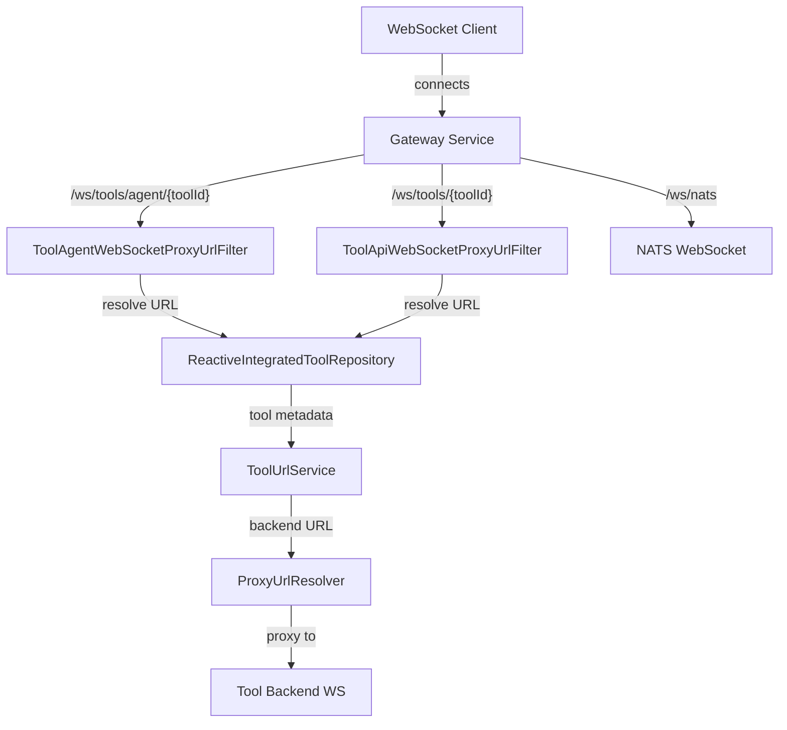
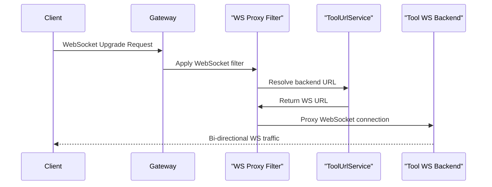

# Gateway WebSocket Proxying Module

## Overview

The **gateway_websocket_proxying** module is part of the OpenFrame Gateway service. Its responsibility is to **securely terminate, route, and proxy WebSocket connections** from external clients to internal tool backends and infrastructure services.

This module enables real-time, bidirectional communication for:

- **Tool agent connections** (agents running on managed devices)
- **Tool API WebSocket connections** (UI or automation clients)
- **NATS WebSocket connections** (event-driven messaging)

It is implemented on top of **Spring Cloud Gateway (reactive)** and integrates with OpenFrame security, multi-tenant routing, and tool discovery services.

---

## Responsibilities

- Define WebSocket routes in the Gateway
- Intercept WebSocket upgrade requests
- Resolve the correct backend WebSocket URL dynamically
- Enforce authentication and tenant isolation
- Proxy traffic transparently without terminating the WebSocket protocol

---

## High-Level Architecture

---

## Routing Model

All WebSocket routing is declared in a single Spring configuration class:

- `WebSocketGatewayConfig`

Routes are matched **by path prefix**, then dynamically rewritten at runtime by custom Gateway filters.

### Supported WebSocket Endpoints

| Endpoint | Purpose |
|--------|--------|
| `/ws/tools/agent/{toolId}/**` | Tool agent WebSocket traffic |
| `/ws/tools/{toolId}/**` | Tool API WebSocket traffic |
| `/ws/nats` | NATS WebSocket endpoint |

---

## Core Components

### 1. WebSocketGatewayConfig

**File:** `WebSocketGatewayConfig.java`

This class:

- Registers WebSocket routes with Spring Cloud Gateway
- Binds WebSocket paths to proxy filters
- Configures a security-decorated `WebSocketService`

See detailed documentation in:

- [websocket_gateway_config.md](websocket_gateway_config.md)

---

### 2. ToolAgentWebSocketProxyUrlFilter

**File:** `ToolAgentWebSocketProxyUrlFilter.java`

Handles WebSocket connections coming from **tool agents**.

Key traits:

- Extracts `toolId` from agent-style URL paths
- Uses tool metadata to dynamically resolve backend URLs
- Inherits shared proxy logic from a common WebSocket filter base

See detailed documentation in:

- [tool_agent_websocket_proxy_filter.md](tool_agent_websocket_proxy_filter.md)

---

### 3. ToolApiWebSocketProxyUrlFilter

**File:** `ToolApiWebSocketProxyUrlFilter.java`

Handles WebSocket connections coming from **API or UI clients**.

Key traits:

- Extracts `toolId` from API-style URL paths
- Uses the same resolution and proxy pipeline as agent traffic
- Enforces consistent routing and security semantics

See detailed documentation in:

- [tool_api_websocket_proxy_filter.md](tool_api_websocket_proxy_filter.md)

---

## Security Integration

WebSocket connections are secured using:

- JWT-based authentication
- Gateway security filters (from `gateway_service_app_and_security`)
- A decorated `WebSocketService` that injects request claims

Authentication is enforced **before the WebSocket upgrade completes**, ensuring:

- Only authorized tenants can access tool backends
- Tool access is scoped by resolved `toolId`

---

## Data Flow Summary

---

## Operational Notes

- WebSocket routes use `no://op` URIs because routing is fully handled by filters
- Tool backends can change without Gateway restarts
- Reactive repositories ensure non-blocking resolution at scale

---

## Summary

The **gateway_websocket_proxying** module provides a **secure, dynamic, and scalable WebSocket proxy layer** for OpenFrame. It bridges clients and tools while preserving tenant isolation, authentication, and real-time performance.

This module is foundational for agent communication, live tool integrations, and event streaming across the OpenFrame platform.
