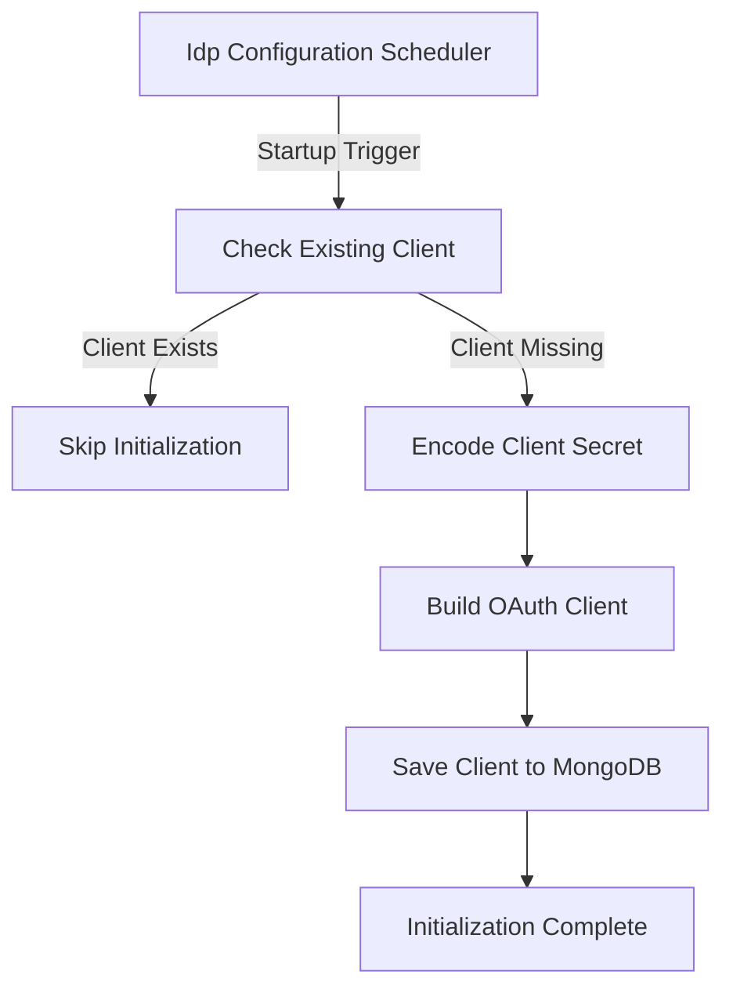

# Idp Configuration

## Overview

The **Idp Configuration** module is responsible for initializing and maintaining the default OAuth2 / OpenID Connect client configuration used by the OpenFrame platform gateway when integrating with the internal Identity Provider (IdP).

This module ensures that, on startup, a known and consistent OAuth client exists for the gateway service. It performs this initialization automatically and safely, avoiding duplicate registrations and supporting clustered deployments.

At its core, Idp Configuration bridges:
- Gateway OAuth requirements
- Authorization Server client registration
- Persistent storage in MongoDB

---

## Core Responsibilities

The Idp Configuration module focuses on a single, critical responsibility:

- **Automatic initialization of the default OAuth client for the gateway service**

This includes:
- Creating the client only if it does not already exist
- Encoding and securely storing the client secret
- Defining supported grant types, scopes, and redirect URIs
- Configuring token lifetimes and refresh behavior
- Ensuring safe execution in distributed environments

---

## Key Component

### Idp Configuration Scheduler

The module is implemented through a single scheduled component:

- **Idp Configuration Scheduler**

This scheduler executes once after startup and is responsible for registering the default OAuth client used by the gateway.

#### Execution Characteristics

- **Conditional activation**: Enabled only when the configuration flag is set
- **One-time execution**: Uses an effectively infinite fixed delay
- **Cluster-safe**: Uses a distributed lock to prevent duplicate execution

---

## Configuration Properties

The behavior of Idp Configuration is driven entirely by configuration properties.

### Enablement

The scheduler only runs when explicitly enabled:

```text
openframe.management.idp.init.enabled=true
```

### Gateway OAuth Client Settings

```text
openframe.gateway.oauth.client-id
openframe.gateway.oauth.client-secret
openframe.gateway.oauth.redirect-uri
```

### Token Expiration Settings

```text
security.oauth2.token.access.expiration-seconds
security.oauth2.token.refresh.expiration-seconds
```

These values are used to configure access token and refresh token lifetimes for the registered client.

---

## Initialization Flow

The following diagram illustrates how the Idp Configuration module initializes the default OAuth client.



---

## Detailed Processing Logic

### Client Existence Check

Before creating any data, the scheduler queries persistent storage to determine whether a client with the configured client ID already exists.

This ensures:
- Idempotent startup behavior
- Safe restarts
- No accidental duplication

### Secret Handling

The client secret is never stored in plain text. It is:

- Passed through a password encoder
- Persisted only in encoded form

This aligns with security best practices for OAuth client credentials.

### Client Capabilities

The registered OAuth client is configured with:

- **Grant types**: Authorization Code, Refresh Token
- **Authentication methods**: None, Client Secret Basic
- **Scopes**: OpenID, profile, email, offline access
- **PKCE enforcement**: Enabled
- **Consent requirement**: Disabled

These defaults are optimized for browser-based and gateway-mediated authentication flows.

### Token Management

The client configuration explicitly controls:

- Access token lifetime
- Refresh token lifetime
- Refresh token reuse policy

This allows the platform to balance security and usability based on environment-specific settings.

---

## Distributed Safety and Reliability

### Scheduler Locking

To support horizontal scaling, the scheduler uses a distributed lock mechanism:

- Prevents concurrent execution across nodes
- Guarantees only one node performs initialization
- Ensures consistency in multi-instance deployments

### Error Handling

If initialization fails:

- The error is logged with full context
- The exception is rethrown to surface startup issues

This makes misconfiguration visible early in the deployment lifecycle.

---

## Interaction With Other Modules

Although lightweight, Idp Configuration plays a foundational role in the platform:

- **Authorization Service Core** relies on the registered client for OAuth flows
- **Gateway Service Core** uses this client to authenticate users and services
- **Data Persistence Mongo** stores the registered client definition
- **Security OAuth Support** enforces token and PKCE policies

The module itself does not expose APIs or user-facing functionality. Instead, it ensures that downstream authentication and authorization components are correctly bootstrapped.

---

## When to Modify Idp Configuration

You may need to adjust this module when:

- Changing gateway OAuth client behavior
- Adding or removing supported OAuth scopes
- Modifying token lifetime defaults
- Adapting to a new authorization flow

For most deployments, the default behavior is sufficient and requires no customization.

---

## Summary

The **Idp Configuration** module provides a reliable, secure, and automated way to initialize the gateway OAuth client in OpenFrame.

By combining conditional execution, distributed locking, and secure credential handling, it ensures that authentication infrastructure is correctly prepared every time the platform starts.