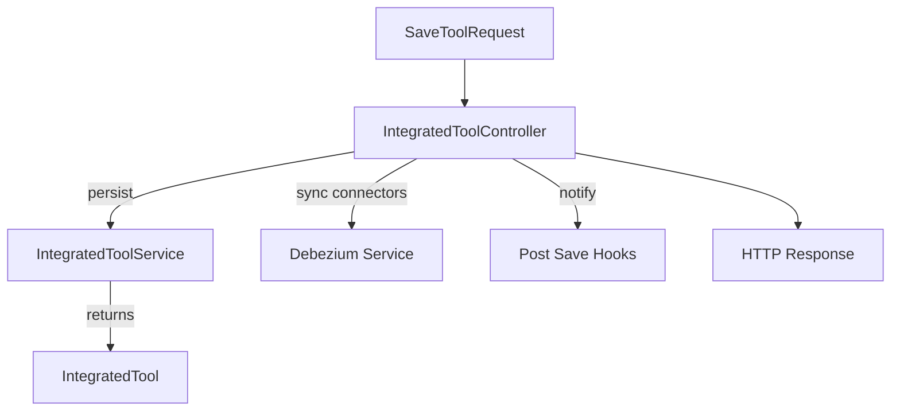

# Integrated Tool Controller

The **IntegratedToolController** exposes REST endpoints for managing **Integrated Tools** within the OpenFrame platform. Integrated tools represent external systems (RMMs, MDMs, security tools) that are connected to OpenFrame and continuously synchronized via Debezium.

## Purpose

- List all configured integrated tools
- Fetch a single tool configuration
- Create or update a tool configuration
- Trigger downstream side effects after tool persistence

This controller is designed to be **idempotent** and **side-effect aware**, ensuring that configuration changes propagate safely across the platform.

## Exposed Endpoints

| Method | Path | Description |
|------|------|-------------|
| GET | /v1/tools | Retrieve all integrated tools |
| GET | /v1/tools/{id} | Retrieve a single tool by ID |
| POST | /v1/tools/{id} | Create or update a tool configuration |

## Core Components

- `IntegratedToolController`
- `SaveToolRequest`

## Dependencies

- **IntegratedToolService** – persistence and retrieval of tool definitions
- **DebeziumService** – manages Debezium connectors for CDC
- **IntegratedToolPostSaveHook** – extension points for post-save logic

These dependencies are injected and executed in a strict order to preserve consistency.

## Save Tool Flow



### Key Behaviors

- The tool ID is taken from the **path parameter**, not the payload
- Tools are automatically marked as `enabled = true` when saved
- Debezium connectors are created or updated **after persistence**
- Hook failures are logged but **do not fail the request**

This design ensures partial failures do not leave the system unusable.

## SaveToolRequest DTO

```java
@Data
public static class SaveToolRequest {
    private IntegratedTool tool;
}
```

The request wraps the full `IntegratedTool` document, allowing flexible configuration without controller-level validation logic.

## Error Handling

- Missing tools return a structured error response
- Persistence or connector failures result in `500 Internal Server Error`
- Hook exceptions are isolated and logged

This ensures operational visibility without blocking critical workflows.
