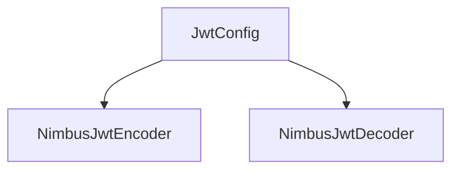
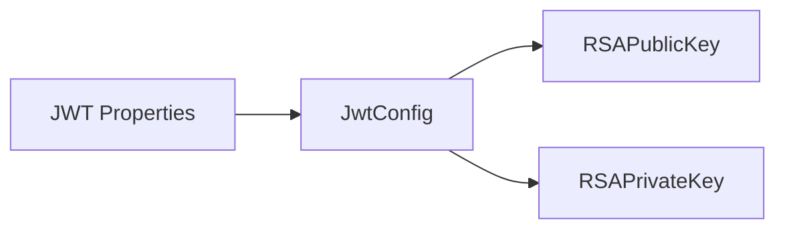

# JWT Security

This document describes the JWT-related components provided by the **security_shared_core** module. These components define how JWTs are created, signed, and validated across OpenFrame services.

---

## Components

### JwtSecurityConfig

**Component ID**
- `deps.openframe-oss-lib.openframe-security-core.src.main.java.com.openframe.security.config.JwtSecurityConfig.JwtSecurityConfig`

**Responsibility**

- Registers Spring beans for:
  - `JwtEncoder` (JWT signing)
  - `JwtDecoder` (JWT verification)
- Uses RSA key material provided by `JwtConfig`
- Relies on Nimbus JOSE + JWT for cryptographic operations

**Key Behavior**

- Builds a JWK set from the RSA public/private key pair
- Ensures consistent JWT cryptography across services

---

### JwtConfig

**Component ID**
- `deps.openframe-oss-lib.openframe-security-core.src.main.java.com.openframe.security.jwt.JwtConfig.JwtConfig`

**Responsibility**

- Binds JWT-related configuration from application properties
- Loads and parses RSA public and private keys
- Exposes JWT metadata such as issuer and audience

**Key Properties**

- `jwt.publicKey`
- `jwt.privateKey`
- `jwt.issuer`
- `jwt.audience`

**Key Loading Flow**

---

## Usage Context

These components are typically consumed by:

- `authorization_server_core` for token issuance
- `gateway_service_core` for token validation
- `api_service_core` for request authentication

They provide a **single, consistent JWT implementation** across all services.
