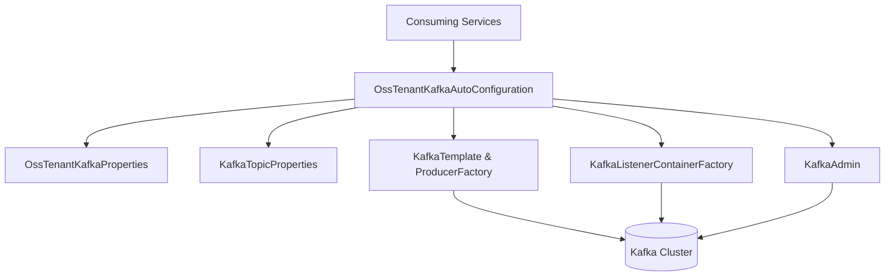

# Kafka Shared Config and Models

This module provides **shared Kafka configuration, topic definitions, headers, and common message models** used across the OpenFrame / Flamingo platform. It acts as the foundational Kafka integration layer for multi-tenant OSS deployments, ensuring consistent producer, consumer, admin, and message semantics across services.

The module is consumed primarily by **stream processing**, **management**, and **API services**, and is designed to be auto-configured via Spring Boot properties.

---

## Purpose and Responsibilities

- Centralize Kafka **configuration and auto-configuration** for OSS tenant clusters
- Provide **typed configuration properties** for topics and brokers
- Define **shared Kafka headers** used for routing and processing
- Provide **common Kafka message models**, including Debezium CDC payloads
- Offer **recovery and logging hooks** for Kafka producer failures

---

## High-Level Architecture

**Key idea:** services only depend on this module and configuration properties; Kafka infrastructure beans are created automatically when enabled.

---

## Module Structure Overview

This module can be logically divided into the following sub-modules:

| Sub-module | Description | Documentation |
|-----------|-------------|---------------|
| Kafka Configuration | Spring Boot auto-configuration and properties | Kafka Configuration.md |
| Kafka Models | Shared message and CDC payload models | Kafka Models.md |
| Kafka Producer Utilities | Recovery and retry-related utilities | Kafka Producer Utilities.md |

---

## How This Module Fits into the Platform

- **stream_processing_core** consumes Debezium messages and Kafka topics defined here
- **management_service_core** relies on shared Kafka configuration for admin and initialization tasks
- **api_service_core** and **gateway_service_core** depend on consistent headers and topic naming

This module deliberately avoids business logic and focuses on **infrastructure-level concerns**.

---

## Key Design Principles

- **Convention over configuration** using Spring Boot auto-configuration
- **Multi-tenant readiness** via isolated OSS tenant Kafka properties
- **Strong typing** for Kafka topics and CDC payloads
- **Fail-safe behavior** with explicit recovery logging

---

## When to Use This Module

Use this module whenever a service:

- Produces or consumes Kafka messages in OpenFrame
- Needs access to Debezium CDC event structures
- Requires standardized Kafka headers or topic definitions
- Should automatically provision Kafka topics in OSS environments

---

## Next Steps

- See **Kafka Configuration** for property-driven setup details
- See **Kafka Models** for Debezium message structures
- See **Kafka Producer Utilities** for failure handling behavior
