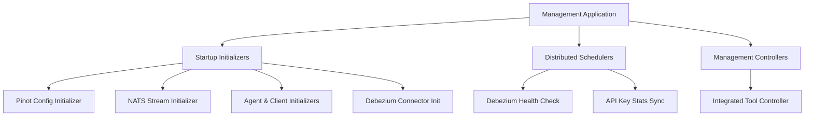

# Management Service

## Overview
The **management-service** is responsible for platform-wide lifecycle management and background orchestration tasks in OpenFrame. It bootstraps core configurations, manages integrated tools, initializes external systems (Pinot, NATS, Debezium), and runs distributed scheduled jobs using ShedLock.

This service does **not** serve end-user traffic directly. Instead, it ensures that the OpenFrame control plane remains consistent, healthy, and correctly configured across tenants.

---

## Responsibilities

- Bootstrap and initialize platform configuration on startup
- Manage **Integrated Tools** and their Debezium connectors
- Initialize and maintain **Pinot** schemas and tables
- Provision **NATS JetStream** streams used by agents and tools
- Seed **agent registration secrets** and client configurations
- Run **distributed schedulers** for health checks and stats sync

---

## High-Level Architecture

---

## Application Bootstrap

### ManagementApplication

The entry point of the service.

- Enables Spring Boot auto-configuration
- Scans `com.openframe.management`, `com.openframe.data`, and `com.openframe.core`
- Explicitly excludes `CassandraHealthIndicator` to avoid unnecessary health wiring

---

## Configuration Layer

### ManagementConfiguration

- Central Spring configuration for the service
- Provides a `PasswordEncoder` bean using **BCrypt**
- Performs broad component scanning while excluding Cassandra health checks

### ShedLockConfig

Enables **distributed scheduling** using Redis-backed locks.

- Uses ShedLock with Redis
- Lock keys are **tenant-scoped** via `OpenframeRedisKeyBuilder`
- Prevents concurrent execution across multiple service replicas

---

## Startup Initializers

Startup initializers are executed either via `@PostConstruct`, `ApplicationRunner`, or `ApplicationReadyEvent`.

### PinotConfigInitializer

- Deploys Pinot **schemas** and **tables** at startup
- Supports retry with backoff
- Reads JSON configs from classpath and resolves environment placeholders
- Handles both CREATE and UPDATE logic

### NatsStreamConfigurationInitializer

- Creates required **NATS JetStream** streams
- Streams cover:
  - Tool installation
  - Client updates
  - Tool updates
  - Tool connections
  - Installed agents

### AgentRegistrationSecretInitializer

- Ensures a default **agent registration secret** exists
- Runs once at startup

### IntegratedToolAgentInitializer

- Loads Integrated Tool Agent definitions from classpath JSON
- Updates existing agents while preserving release versions
- Publishes update events when agent versions change

### OpenFrameClientConfigurationInitializer

- Seeds the default OpenFrame client configuration
- Preserves existing version to avoid overwrites

### TacticalRmmScriptsInitializer

- Ensures required scripts exist in **Tactical RMM**
- Creates or updates scripts idempotently
- Uses Tactical RMM API via SDK

---

## Controllers

### IntegratedToolController

REST API for managing **Integrated Tools**.

- `GET /v1/tools` – List all tools
- `GET /v1/tools/{id}` – Fetch a tool by ID
- `POST /v1/tools/{id}` – Create or update a tool

On save:
- Persists tool configuration
- Creates or updates Debezium connectors
- Executes registered `IntegratedToolPostSaveHook` extensions

---

## Extension Points

### IntegratedToolPostSaveHook

A lightweight extension mechanism invoked **after a tool is saved**.

- Allows service-specific side effects
- Avoids full Spring event infrastructure

---

## Debezium Management

### DebeziumConnectorInitializer

- Runs on application ready (conditional)
- Initializes Debezium connectors from MongoDB if none exist

### ConnectorStatus DTO

Represents Debezium connector and task health:

- Connector state
- Task states and traces

---

## Scheduled Jobs

All scheduled jobs use **ShedLock** to ensure single execution across replicas.

### ApiKeyStatsSyncScheduler

- Periodically syncs API key usage stats from Redis to MongoDB
- Enabled by default

### DebeziumHealthCheckScheduler

- Periodically checks Debezium connector health
- Restarts failed tasks automatically
- Enabled via configuration flag

---

## Client Update Handling

### OpenFrameClientVersionUpdateService

- Entry point for triggering OpenFrame client version updates
- Publishes update events to downstream systems

(Current implementation is a placeholder for future logic.)

---

## Related Modules

The management-service collaborates closely with:

- Data layer (MongoDB, Redis, Kafka, NATS, Pinot)
- Stream service (event propagation)
- Client service (agent lifecycle)
- External integrations (Tactical RMM, Debezium)

Refer to platform documentation for detailed behavior of those modules.

---

## Summary

The **management-service** acts as the operational backbone of OpenFrame. It ensures that configuration, integrations, background processing, and infrastructure coordination are consistently applied across tenants and environments, enabling the rest of the platform to operate reliably.
