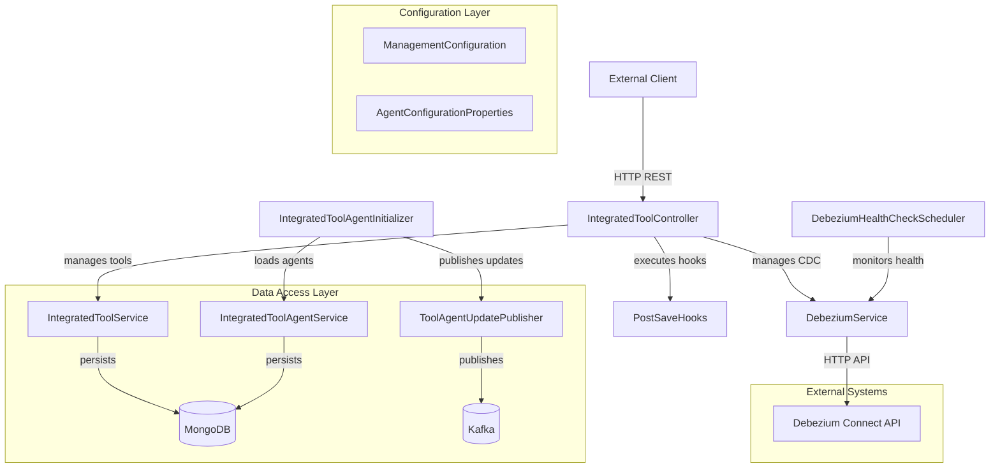
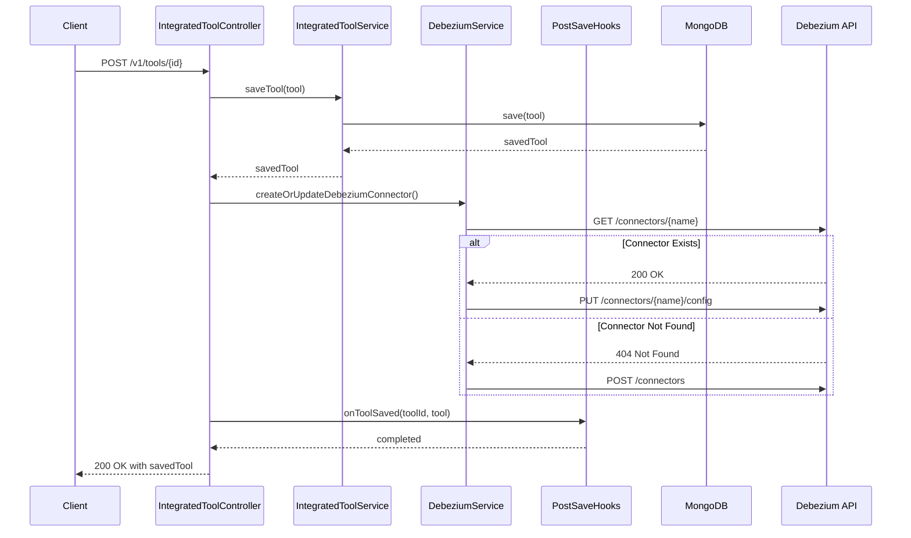
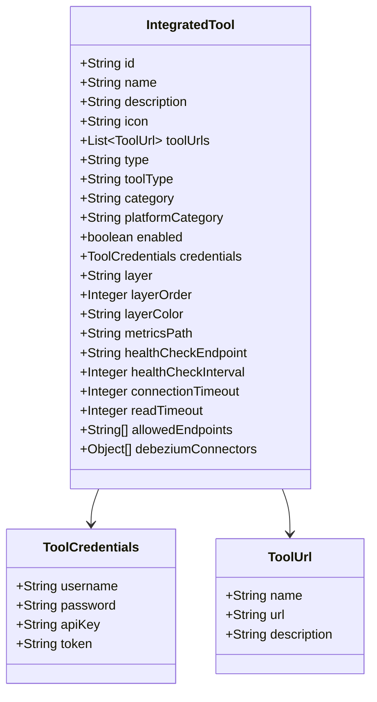
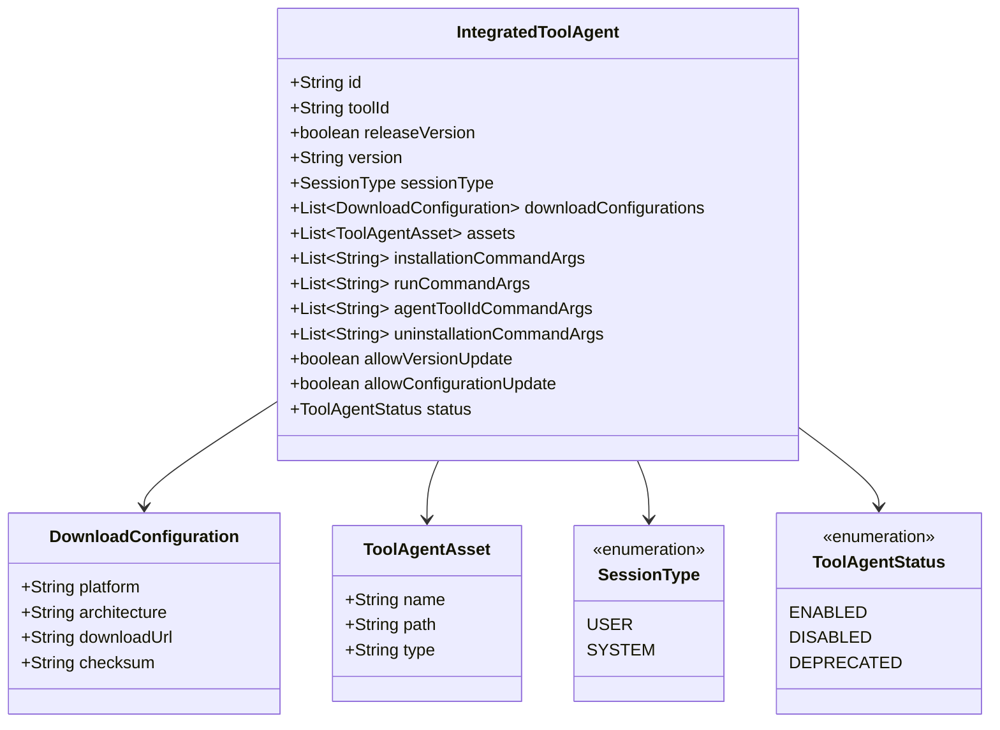
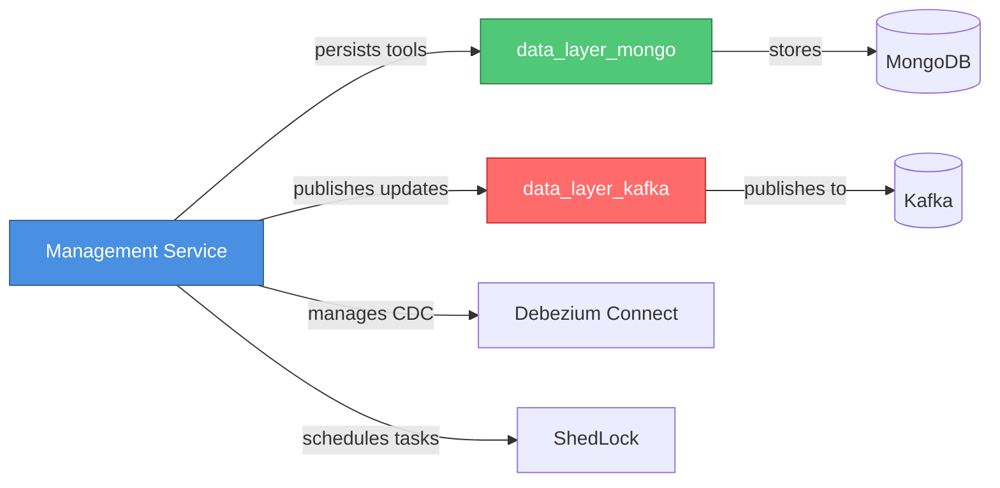

# Management Service

## Overview

The **Management Service** is a critical administrative component of the OpenFrame platform that handles the configuration, lifecycle management, and health monitoring of integrated tools and their agents. It serves as the central control plane for managing third-party tool integrations (like Fleet MDM, Tactical RMM, MeshCentral) and their associated Change Data Capture (CDC) connectors through Debezium.

### Key Responsibilities

- **Integrated Tool Management**: CRUD operations for third-party tool configurations
- **Agent Lifecycle Management**: Initialization, versioning, and updates of tool agents
- **CDC Connector Management**: Automated creation, configuration, and health monitoring of Debezium connectors
- **Health Monitoring**: Scheduled health checks and automatic recovery of failed CDC tasks
- **Extensibility**: Hook-based architecture for custom post-save operations

### Technology Stack

- **Framework**: Spring Boot with Spring MVC
- **Data Layer**: MongoDB (via [data_layer_mongo](data_layer_mongo.md))
- **Messaging**: Kafka for agent update notifications (via [data_layer_kafka](data_layer_kafka.md))
- **CDC**: Debezium for change data capture
- **Scheduling**: ShedLock for distributed task scheduling
- **Security**: BCrypt password encoding

---

## Architecture Overview

The Management Service follows a layered architecture with clear separation of concerns:



### Component Interaction Flow



---

## Module Structure

The Management Service is organized into the following sub-modules:

### 1. [Configuration](management_service_configuration.md)

Handles Spring Boot configuration, component scanning, and bean definitions.

**Core Components:**
- `ManagementConfiguration`: Main configuration class with password encoder
- `AgentConfigurationProperties`: Configuration properties for agent initialization

**Key Features:**
- Component scanning across OpenFrame packages
- BCrypt password encoder bean
- Exclusion of Cassandra health indicators

### 2. [Tool Management](management_service_tool_management.md)

Provides REST API endpoints and business logic for managing integrated tools.

**Core Components:**
- `IntegratedToolController`: REST controller for tool CRUD operations
- `IntegratedToolService`: Business logic for tool persistence
- `IntegratedToolPostSaveHook`: Extension point for custom post-save logic

**Key Features:**
- RESTful API for tool configuration
- Automatic Debezium connector provisioning
- Hook-based extensibility

### 3. [Agent Management](management_service_agent_management.md)

Manages the lifecycle of integrated tool agents including initialization, versioning, and updates.

**Core Components:**
- `IntegratedToolAgentInitializer`: Loads and initializes agents from configuration files
- `IntegratedToolAgentService`: Business logic for agent persistence
- `ToolAgentUpdatePublisher`: Publishes agent update events to Kafka

**Key Features:**
- Automatic agent initialization from classpath resources
- Version management with release/development distinction
- Update notification via Kafka

### 4. [CDC Management](management_service_cdc_management.md)

Manages Debezium CDC connectors and monitors their health.

**Core Components:**
- `DebeziumService`: Service for Debezium connector lifecycle management
- `DebeziumHealthCheckScheduler`: Scheduled health monitoring with distributed locking

**Key Features:**
- Automatic connector creation and updates
- Health monitoring with automatic task restart
- Distributed scheduling with ShedLock

### 5. [Application Bootstrap](management_service_application.md)

Spring Boot application entry point and configuration.

**Core Components:**
- `ManagementApplication`: Main application class

**Key Features:**
- Spring Boot auto-configuration
- Component scanning configuration
- Application startup

---

## Data Model

### IntegratedTool

Represents a third-party tool integration configuration.



### IntegratedToolAgent

Represents an agent that can be deployed to client machines for tool integration.



---

## API Reference

### Tool Management Endpoints

#### Get All Tools

```http
GET /v1/tools
```

**Response:**
```json
{
  "status": "success",
  "tools": [
    {
      "id": "fleet-mdm",
      "name": "Fleet MDM",
      "description": "Device management and monitoring",
      "enabled": true,
      "type": "mdm",
      "category": "security"
    }
  ]
}
```

#### Get Tool by ID

```http
GET /v1/tools/{id}
```

**Response:**
```json
{
  "status": "success",
  "tool": {
    "id": "fleet-mdm",
    "name": "Fleet MDM",
    "enabled": true,
    "credentials": {
      "apiKey": "***"
    },
    "debeziumConnectors": [...]
  }
}
```

#### Save/Update Tool

```http
POST /v1/tools/{id}
Content-Type: application/json

{
  "tool": {
    "name": "Fleet MDM",
    "description": "Device management",
    "credentials": {
      "apiKey": "your-api-key"
    },
    "debeziumConnectors": [
      {
        "name": "fleet-mdm-connector",
        "config": {
          "connector.class": "io.debezium.connector.mongodb.MongoDbConnector",
          "mongodb.connection.string": "mongodb://localhost:27017",
          "collection.include.list": "openframe.devices"
        }
      }
    ]
  }
}
```

**Response:**
```json
{
  "status": "success",
  "tool": {
    "id": "fleet-mdm",
    "enabled": true,
    ...
  }
}
```

---

## Configuration

### Application Properties

```yaml
# Management Service Configuration
openframe:
  management:
    agent-configurations:
      - "agents/fleet-mdm-agent.json"
      - "agents/tactical-rmm-agent.json"
      - "agents/meshcentral-agent.json"
  
  # Debezium Configuration
  debezium:
    base-url: "http://debezium-connect:8083"
    health-check:
      enabled: true
      interval: 300000  # 5 minutes
      lock-at-most-for: 5m
      lock-at-least-for: 1m
  
  # Integration Configuration
  integration:
    tool:
      enabled: true

# ShedLock Configuration (for distributed scheduling)
spring:
  data:
    mongodb:
      uri: ${MONGODB_URI:mongodb://localhost:27017/openframe}
```

### Agent Configuration File Format

Agent configurations are loaded from JSON files on the classpath:

```json
{
  "id": "fleet-mdm-agent",
  "toolId": "fleet-mdm",
  "releaseVersion": false,
  "version": "1.0.0",
  "sessionType": "SYSTEM",
  "downloadConfigurations": [
    {
      "platform": "linux",
      "architecture": "amd64",
      "downloadUrl": "https://example.com/agent-linux-amd64.tar.gz",
      "checksum": "sha256:abc123..."
    }
  ],
  "installationCommandArgs": ["install", "--silent"],
  "runCommandArgs": ["run", "--daemon"],
  "agentToolIdCommandArgs": ["--tool-id", "fleet-mdm"],
  "uninstallationCommandArgs": ["uninstall"],
  "allowVersionUpdate": true,
  "allowConfigurationUpdate": true,
  "status": "ENABLED"
}
```

---

## Integration Points

### Dependencies on Other Modules



**Data Layer Dependencies:**
- **[data_layer_mongo](data_layer_mongo.md)**: Persistence of tools and agents
  - `IntegratedToolService`: Tool CRUD operations
  - `IntegratedToolAgentService`: Agent CRUD operations
  - `IntegratedToolRepository`: MongoDB repository for tools
  - `IntegratedToolAgentRepository`: MongoDB repository for agents

- **[data_layer_kafka](data_layer_kafka.md)**: Event publishing
  - `ToolAgentUpdatePublisher`: Publishes agent version updates

**External System Dependencies:**
- **Debezium Connect**: CDC connector management via REST API
- **ShedLock**: Distributed lock management for scheduled tasks

### Consumed By

The Management Service is consumed by:

- **[api_service](api_service.md)**: Exposes tool configurations to frontend
- **[client_service](client_service.md)**: Retrieves agent configurations for deployment
- **[stream_processing](stream_processing.md)**: Receives CDC events from managed connectors

---

## Operational Considerations

### Health Monitoring

The service includes automatic health monitoring for Debezium connectors:

1. **Scheduled Checks**: Runs every 5 minutes (configurable)
2. **Distributed Locking**: Uses ShedLock to prevent duplicate checks in clustered deployments
3. **Automatic Recovery**: Restarts failed tasks automatically
4. **Logging**: Comprehensive logging of connector status and failures

### Deployment

**Environment Variables:**

```bash
# MongoDB Connection
MONGODB_URI=mongodb://mongodb:27017/openframe

# Debezium Connect
DEBEZIUM_BASE_URL=http://debezium-connect:8083

# Health Check Configuration
DEBEZIUM_HEALTH_CHECK_ENABLED=true
DEBEZIUM_HEALTH_CHECK_INTERVAL=300000
```

**Docker Compose Example:**

```yaml
services:
  management-service:
    image: openframe/management-service:latest
    environment:
      - MONGODB_URI=mongodb://mongodb:27017/openframe
      - DEBEZIUM_BASE_URL=http://debezium-connect:8083
      - SPRING_PROFILES_ACTIVE=production
    depends_on:
      - mongodb
      - debezium-connect
    ports:
      - "8084:8080"
```

### Scaling Considerations

- **Stateless Design**: Service is stateless and can be horizontally scaled
- **Distributed Locking**: ShedLock ensures only one instance runs scheduled tasks
- **Database Connection Pooling**: Configure MongoDB connection pool for high load
- **Debezium API Rate Limiting**: Consider rate limiting for Debezium API calls

### Monitoring and Observability

**Key Metrics to Monitor:**

- Tool configuration changes
- Agent initialization success/failure rates
- Debezium connector health status
- Failed task restart attempts
- API response times

**Log Levels:**

```yaml
logging:
  level:
    com.openframe.management: INFO
    com.openframe.management.scheduler: DEBUG
    com.openframe.management.service.DebeziumService: DEBUG
```

---

## Security Considerations

### Password Encoding

The service provides a BCrypt password encoder bean for secure password hashing:

```java
@Bean
public PasswordEncoder passwordEncoder() {
    return new BCryptPasswordEncoder();
}
```

### API Security

- Tool credentials are stored securely in MongoDB
- Sensitive fields should be encrypted at rest
- API endpoints should be protected by the [gateway_service](gateway_service.md)
- Debezium API access should be restricted to internal network

### Best Practices

1. **Credential Management**: Use environment variables or secret management systems for Debezium credentials
2. **Network Isolation**: Keep Debezium Connect API on internal network only
3. **Audit Logging**: Log all tool configuration changes
4. **Access Control**: Implement role-based access control for tool management endpoints

---

## Development Guide

### Adding a New Tool Integration

1. **Create Tool Configuration**:
```java
IntegratedTool tool = IntegratedTool.builder()
    .id("new-tool")
    .name("New Tool")
    .type("monitoring")
    .enabled(true)
    .debeziumConnectors(new Object[]{
        Map.of(
            "name", "new-tool-connector",
            "config", Map.of(
                "connector.class", "io.debezium.connector.mongodb.MongoDbConnector",
                "mongodb.connection.string", "mongodb://localhost:27017"
            )
        )
    })
    .build();
```

2. **Create Agent Configuration** (`agents/new-tool-agent.json`):
```json
{
  "id": "new-tool-agent",
  "toolId": "new-tool",
  "version": "1.0.0",
  "status": "ENABLED"
}
```

3. **Register Agent Configuration**:
```yaml
openframe:
  management:
    agent-configurations:
      - "agents/new-tool-agent.json"
```

### Implementing a Post-Save Hook

```java
@Component
public class CustomToolPostSaveHook implements IntegratedToolPostSaveHook {
    
    @Override
    public void onToolSaved(String toolId, IntegratedTool tool) {
        // Custom logic after tool is saved
        log.info("Tool {} was saved with config: {}", toolId, tool);
        
        // Example: Send notification, update cache, etc.
    }
}
```

### Testing

**Unit Test Example**:

```java
@SpringBootTest
class IntegratedToolControllerTest {
    
    @Autowired
    private IntegratedToolController controller;
    
    @MockBean
    private IntegratedToolService toolService;
    
    @MockBean
    private DebeziumService debeziumService;
    
    @Test
    void testSaveTool() {
        IntegratedTool tool = IntegratedTool.builder()
            .id("test-tool")
            .name("Test Tool")
            .build();
        
        when(toolService.saveTool(any())).thenReturn(tool);
        
        SaveToolRequest request = new SaveToolRequest();
        request.setTool(tool);
        
        ResponseEntity<Map<String, Object>> response = 
            controller.saveTool("test-tool", request);
        
        assertEquals(200, response.getStatusCodeValue());
        verify(debeziumService).createOrUpdateDebeziumConnector(any());
    }
}
```

---

## Troubleshooting

### Common Issues

#### 1. Debezium Connector Creation Fails

**Symptoms**: Tool saves successfully but connector is not created

**Possible Causes**:
- Debezium Connect service is not running
- Invalid connector configuration
- Network connectivity issues

**Solution**:
```bash
# Check Debezium Connect status
curl http://debezium-connect:8083/

# Check connector status
curl http://debezium-connect:8083/connectors/connector-name/status

# Review logs
kubectl logs -f deployment/management-service | grep DebeziumService
```

#### 2. Agent Initialization Fails

**Symptoms**: Agent configuration not loaded on startup

**Possible Causes**:
- Configuration file not found on classpath
- Invalid JSON format
- Missing required fields

**Solution**:
```bash
# Verify configuration file exists
ls -la src/main/resources/agents/

# Validate JSON format
cat agents/agent-config.json | jq .

# Check application logs
grep "IntegratedToolAgentInitializer" application.log
```

#### 3. Health Check Not Running

**Symptoms**: Failed tasks are not automatically restarted

**Possible Causes**:
- Health check disabled in configuration
- ShedLock not configured properly
- Multiple instances competing for lock

**Solution**:
```yaml
# Enable health check
openframe:
  debezium:
    health-check:
      enabled: true

# Verify ShedLock collection exists
db.shedLock.find()
```

---

## Related Documentation

- [API Service](api_service.md) - Exposes tool configurations via REST and GraphQL
- [Client Service](client_service.md) - Deploys agents to client machines
- [Stream Processing](stream_processing.md) - Processes CDC events from Debezium
- [Data Layer - MongoDB](data_layer_mongo.md) - Data persistence layer
- [Data Layer - Kafka](data_layer_kafka.md) - Event streaming layer
- [Gateway Service](gateway_service.md) - API gateway and security

---

## Contributing

For questions or issues related to the Management Service, please reach out on the **OpenMSP Slack community**:

- **Slack**: [https://www.openmsp.ai/](https://www.openmsp.ai/)
- **Join**: [https://join.slack.com/t/openmsp/shared_invite/zt-36bl7mx0h-3~U2nFH6nqHqoTPXMaHEHA](https://join.slack.com/t/openmsp/shared_invite/zt-36bl7mx0h-3~U2nFH6nqHqoTPXMaHEHA)

**Note**: We do not use GitHub Issues or GitHub Discussions. All support and development discussions happen on Slack.

---

## License

Part of the OpenFrame platform by Flamingo. See the main repository for license information.
