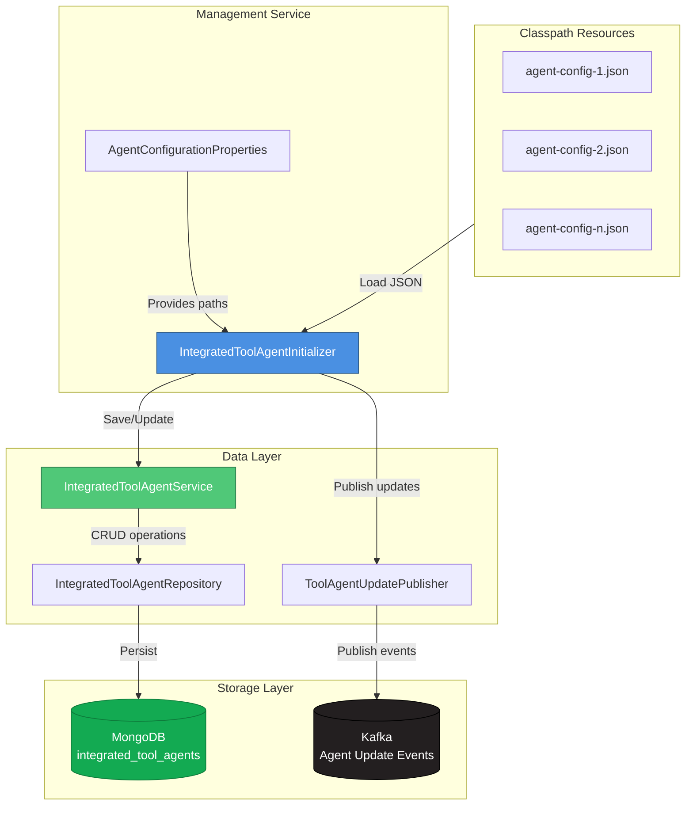
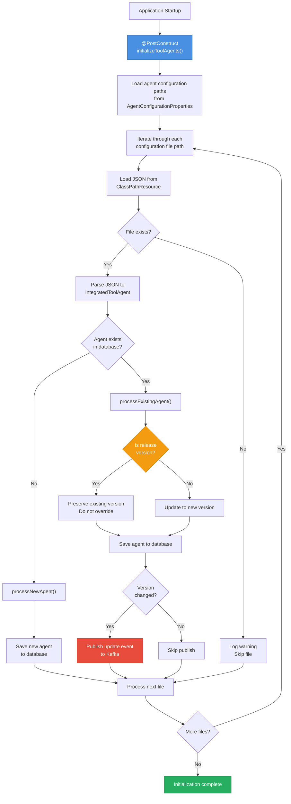
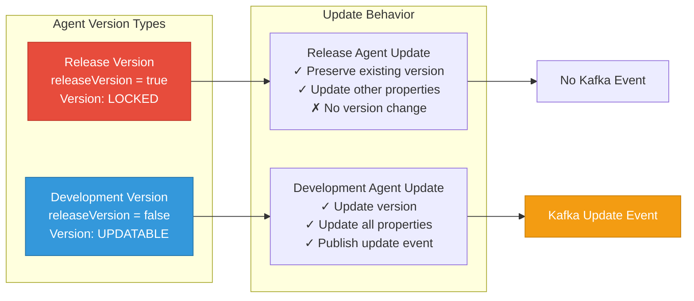
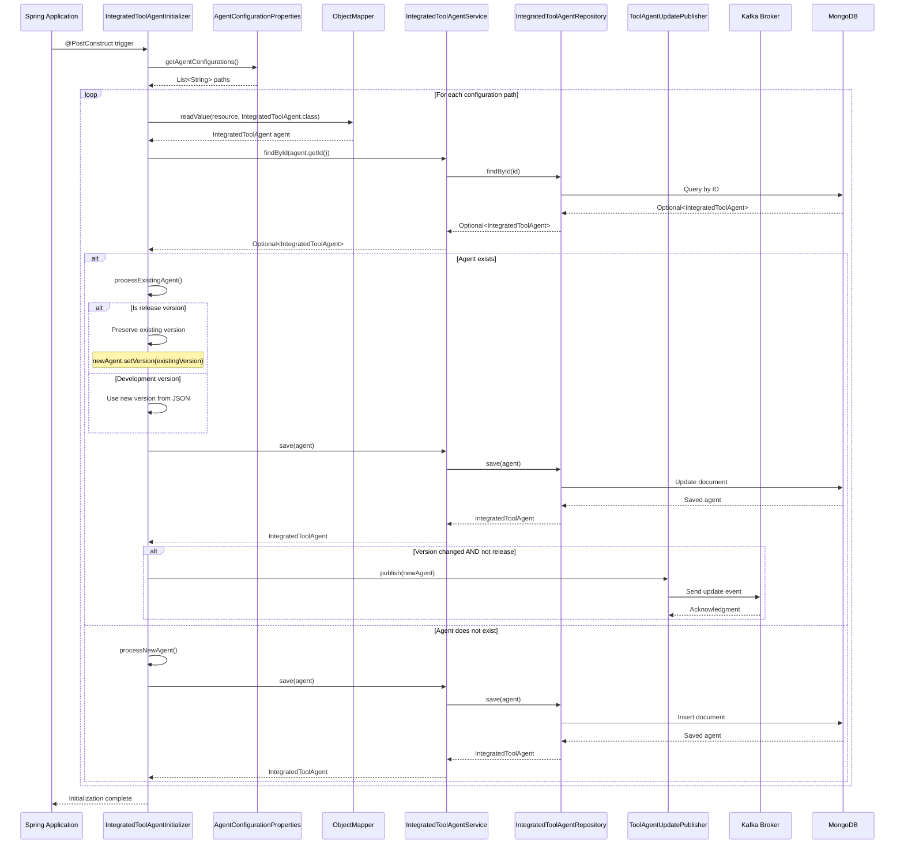
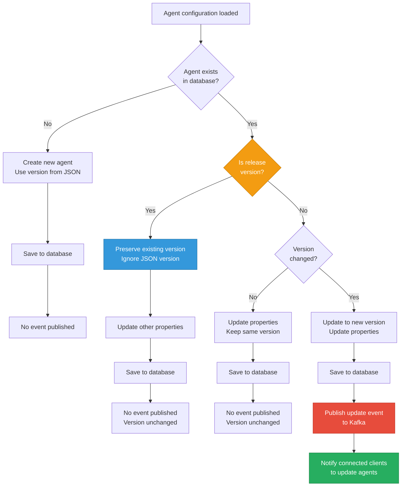

# Management Service - Agent Management Module

## Overview

The **Agent Management Module** is a critical component of the OpenFrame Management Service responsible for initializing, configuring, and managing integrated tool agents at application startup. This module ensures that agent configurations are loaded from classpath resources, synchronized with the database, and properly versioned for deployment across the OpenFrame ecosystem.

**Key Responsibilities:**
- Load agent configurations from JSON files at startup
- Synchronize agent definitions with MongoDB storage
- Manage agent versioning and release cycles
- Publish agent update events to Kafka for distributed notification
- Preserve release version integrity during updates

**Related Modules:**
- [Management Service Configuration](management_service_configuration.md) - Configuration properties and settings
- [Management Service Tool Management](management_service_tool_management.md) - Integrated tool lifecycle management
- [Data Layer MongoDB](data_layer_mongo.md) - Persistence layer for agent data
- [Data Layer Kafka](data_layer_kafka.md) - Event streaming for agent updates

---

## Architecture

### High-Level Component Architecture



### Initialization Flow



### Version Management Strategy



---

## Core Components

### IntegratedToolAgentInitializer

**Location:** `com.openframe.management.initializer.IntegratedToolAgentInitializer`

**Purpose:** Spring component that initializes integrated tool agent configurations from classpath resources at application startup.

**Key Features:**
- Automatic initialization via `@PostConstruct`
- JSON-based configuration loading
- Version-aware update logic
- Release version protection
- Kafka event publishing for updates

**Dependencies:**
- `ObjectMapper` - JSON deserialization
- `IntegratedToolAgentService` - Database operations
- `ToolAgentUpdatePublisher` - Event publishing
- `AgentConfigurationProperties` - Configuration paths

**Configuration Example:**

```yaml
openframe:
  management:
    agentConfigurations:
      - "agents/tactical-rmm-agent.json"
      - "agents/fleet-mdm-agent.json"
      - "agents/meshcentral-agent.json"
```

**Agent Configuration JSON Structure:**

```json
{
  "id": "tactical-rmm-agent",
  "toolId": "tactical-rmm",
  "releaseVersion": false,
  "version": "2.7.0",
  "sessionType": "SYSTEM",
  "downloadConfigurations": [
    {
      "platform": "WINDOWS",
      "architecture": "AMD64",
      "downloadUrl": "https://example.com/agent-windows-amd64.exe"
    }
  ],
  "assets": [
    {
      "name": "agent-installer",
      "source": "GITHUB_RELEASE",
      "assetPattern": "*.exe"
    }
  ],
  "installationCommandArgs": [
    "agent-installer.exe",
    "--silent",
    "--server", "${SERVER_URL}",
    "--api-key", "${API_KEY}"
  ],
  "runCommandArgs": [
    "tacticalagent.exe",
    "start"
  ],
  "agentToolIdCommandArgs": [
    "tacticalagent.exe",
    "get-id"
  ],
  "uninstallationCommandArgs": [
    "tacticalagent.exe",
    "uninstall",
    "--silent"
  ],
  "allowVersionUpdate": true,
  "allowConfigurationUpdate": true,
  "status": "ENABLED"
}
```

---

## Data Model

### IntegratedToolAgent Document

**Collection:** `integrated_tool_agents`

**Schema:**

| Field | Type | Description |
|-------|------|-------------|
| `id` | String | Unique agent identifier (e.g., "tactical-rmm-agent") |
| `toolId` | String | Reference to parent IntegratedTool |
| `releaseVersion` | boolean | If true, version is locked and cannot be auto-updated |
| `version` | String | Agent version (e.g., "2.7.0") |
| `sessionType` | SessionType | Execution context (SYSTEM, USER, ELEVATED) |
| `downloadConfigurations` | List<DownloadConfiguration> | Platform-specific download URLs |
| `assets` | List<ToolAgentAsset> | Asset definitions for dynamic downloads |
| `installationCommandArgs` | List<String> | Command arguments for installation |
| `runCommandArgs` | List<String> | Command arguments to start agent |
| `agentToolIdCommandArgs` | List<String> | Command to retrieve agent ID |
| `uninstallationCommandArgs` | List<String> | Command arguments for uninstallation |
| `allowVersionUpdate` | boolean | Allow automatic version updates |
| `allowConfigurationUpdate` | boolean | Allow configuration updates |
| `status` | ToolAgentStatus | ENABLED or DISABLED |

**Enumerations:**

```java
public enum SessionType {
    SYSTEM,    // Run as system service
    USER,      // Run as user process
    ELEVATED   // Run with elevated privileges
}

public enum ToolAgentStatus {
    ENABLED,   // Agent available for deployment
    DISABLED   // Agent hidden from deployment
}
```

---

## Component Interactions

### Agent Initialization Sequence



### Version Update Decision Flow



---

## Integration Points

### Configuration Properties Integration

**Component:** `AgentConfigurationProperties`

**Configuration Binding:**

```java
@ConfigurationProperties(prefix = "openframe.management")
public class AgentConfigurationProperties {
    private List<String> agentConfigurations = new ArrayList<>();
}
```

**Application Configuration:**

```yaml
openframe:
  management:
    agentConfigurations:
      - "agents/tactical-rmm-agent.json"
      - "agents/fleet-mdm-agent.json"
      - "agents/meshcentral-agent.json"
      - "agents/custom-monitoring-agent.json"
```

### Data Service Integration

**Component:** `IntegratedToolAgentService`

**Key Operations:**

| Method | Purpose | Return Type |
|--------|---------|-------------|
| `save(IntegratedToolAgent)` | Create or update agent | IntegratedToolAgent |
| `findById(String)` | Retrieve agent by ID | Optional<IntegratedToolAgent> |
| `getAll()` | Retrieve all agents | List<IntegratedToolAgent> |
| `getAllEnabled()` | Retrieve enabled agents only | List<IntegratedToolAgent> |
| `findByReleaseVersionTrue()` | Find all release agents | List<IntegratedToolAgent> |
| `updateVersionForReleaseAgents(String)` | Bulk version update for releases | void |

**Usage Example:**

```java
@Service
public class AgentDeploymentService {
    
    private final IntegratedToolAgentService agentService;
    
    public List<IntegratedToolAgent> getDeployableAgents() {
        return agentService.getAllEnabled();
    }
    
    public Optional<IntegratedToolAgent> getAgentForTool(String toolId) {
        return agentService.getAll().stream()
            .filter(agent -> agent.getToolId().equals(toolId))
            .filter(agent -> agent.getStatus() == ToolAgentStatus.ENABLED)
            .findFirst();
    }
}
```

### Event Publishing Integration

**Component:** `ToolAgentUpdatePublisher`

**Event Flow:**

```mermaid
flowchart LR
    Initializer["IntegratedToolAgentInitializer"] -->|"Version changed"| Publisher["ToolAgentUpdatePublisher"]
    Publisher -->|"Publish event"| Kafka["Kafka Topic<br/>tool-agent-updates"]
    Kafka -->|"Consume event"| ClientService["Client Service"]
    ClientService -->|"Notify agents"| Devices["Connected Devices"]
    Devices -->|"Download & install"| NewVersion["Updated Agent"]
    
    style Publisher fill:#F39C12,stroke:#C87F0A,color:#fff
    style Kafka fill:#231F20,stroke:#000,color:#fff
    style NewVersion fill:#27AE60,stroke:#1E8449,color:#fff
```



**Event Payload Structure:**

```json
{
  "eventType": "AGENT_VERSION_UPDATE",
  "agentId": "tactical-rmm-agent",
  "toolId": "tactical-rmm",
  "oldVersion": "2.6.0",
  "newVersion": "2.7.0",
  "timestamp": "2024-01-15T10:30:00Z",
  "releaseVersion": false,
  "downloadUrls": {
    "WINDOWS_AMD64": "https://example.com/agent-2.7.0-windows-amd64.exe",
    "LINUX_AMD64": "https://example.com/agent-2.7.0-linux-amd64.deb"
  }
}
```

---

## Operational Workflows

### Adding a New Agent Configuration

**Step 1: Create Agent Configuration JSON**

Create a new JSON file in `src/main/resources/agents/`:

```json
{
  "id": "custom-monitoring-agent",
  "toolId": "custom-monitoring",
  "releaseVersion": false,
  "version": "1.0.0",
  "sessionType": "SYSTEM",
  "downloadConfigurations": [
    {
      "platform": "WINDOWS",
      "architecture": "AMD64",
      "downloadUrl": "https://releases.example.com/monitoring-agent-1.0.0-windows-amd64.exe"
    },
    {
      "platform": "LINUX",
      "architecture": "AMD64",
      "downloadUrl": "https://releases.example.com/monitoring-agent-1.0.0-linux-amd64.deb"
    }
  ],
  "installationCommandArgs": [
    "monitoring-agent",
    "install",
    "--config", "${CONFIG_URL}"
  ],
  "runCommandArgs": [
    "monitoring-agent",
    "start"
  ],
  "agentToolIdCommandArgs": [
    "monitoring-agent",
    "get-id"
  ],
  "uninstallationCommandArgs": [
    "monitoring-agent",
    "uninstall"
  ],
  "allowVersionUpdate": true,
  "allowConfigurationUpdate": true,
  "status": "ENABLED"
}
```

**Step 2: Register Configuration Path**

Update `application.yml`:

```yaml
openframe:
  management:
    agentConfigurations:
      - "agents/tactical-rmm-agent.json"
      - "agents/fleet-mdm-agent.json"
      - "agents/meshcentral-agent.json"
      - "agents/custom-monitoring-agent.json"  # New agent
```

**Step 3: Restart Management Service**

The agent will be automatically loaded and persisted to MongoDB on startup.

**Step 4: Verify Agent Registration**

```bash
# Query MongoDB
mongosh openframe_db --eval 'db.integrated_tool_agents.find({id: "custom-monitoring-agent"})'

# Check logs
kubectl logs -f deployment/openframe-management | grep "custom-monitoring-agent"
```

### Updating an Existing Agent Version

**Scenario 1: Development Agent (releaseVersion = false)**

1. Update version in JSON file:
   ```json
   {
     "id": "tactical-rmm-agent",
     "version": "2.8.0",  // Changed from 2.7.0
     "releaseVersion": false
   }
   ```

2. Restart service - version will be updated and event published

3. Connected clients receive update notification via Kafka

**Scenario 2: Release Agent (releaseVersion = true)**

1. Update version in JSON file:
   ```json
   {
     "id": "tactical-rmm-agent",
     "version": "3.0.0",  // Attempted change
     "releaseVersion": true
   }
   ```

2. Restart service - **version will NOT be updated** (preserved)

3. To update release version, use service method:
   ```java
   agentService.updateVersionForReleaseAgents("3.0.0");
   ```

### Disabling an Agent

**Option 1: Update JSON Configuration**

```json
{
  "id": "legacy-agent",
  "status": "DISABLED"  // Changed from ENABLED
}
```

**Option 2: Direct Database Update**

```javascript
db.integrated_tool_agents.updateOne(
  { id: "legacy-agent" },
  { $set: { status: "DISABLED" } }
)
```

**Option 3: Programmatic Update**

```java
@Service
public class AgentManagementService {
    
    private final IntegratedToolAgentService agentService;
    
    public void disableAgent(String agentId) {
        agentService.findById(agentId).ifPresent(agent -> {
            agent.setStatus(ToolAgentStatus.DISABLED);
            agentService.save(agent);
        });
    }
}
```

---

## Error Handling

### Configuration Loading Errors

**Missing Configuration File:**

```text
WARN  IntegratedToolAgentInitializer - Agent configuration file not found: agents/missing-agent.json, skipping
```

**Behavior:** Logs warning and continues processing remaining configurations.

**Invalid JSON Format:**

```text
ERROR IntegratedToolAgentInitializer - Failed to load agent configuration from agents/invalid-agent.json: 
com.fasterxml.jackson.core.JsonParseException: Unexpected character ('}' (code 125))
```

**Behavior:** Logs error with stack trace and continues processing remaining configurations.

### Database Operation Errors

**MongoDB Connection Failure:**

```java
try {
    agentService.save(agent);
} catch (DataAccessException e) {
    log.error("Failed to save agent {}: {}", agent.getId(), e.getMessage());
    // Application continues, agent not persisted
}
```

**Duplicate Key Error:**

```text
ERROR IntegratedToolAgentService - Duplicate key error for agent tactical-rmm-agent
```

**Behavior:** Existing agent is updated instead of creating duplicate.

### Event Publishing Errors

**Kafka Unavailable:**

```java
try {
    toolAgentUpdatePublisher.publish(newAgent);
} catch (KafkaException e) {
    log.error("Failed to publish update event for agent {}: {}", 
              newAgent.getId(), e.getMessage());
    // Agent is still saved to database, event lost
}
```

**Mitigation:** Implement retry logic in publisher or use transactional outbox pattern.

---

## Configuration Reference

### Application Properties

```yaml
openframe:
  management:
    # List of agent configuration file paths (relative to classpath)
    agentConfigurations:
      - "agents/tactical-rmm-agent.json"
      - "agents/fleet-mdm-agent.json"
      - "agents/meshcentral-agent.json"
      - "agents/custom-agent.json"
    
    # Optional: Override default behavior
    agent:
      # Skip initialization on startup (default: false)
      skipInitialization: false
      
      # Fail fast on configuration errors (default: false)
      failOnError: false
      
      # Enable version update events (default: true)
      publishUpdates: true
```

### Agent Configuration Schema

**Complete JSON Schema:**

```json
{
  "$schema": "http://json-schema.org/draft-07/schema#",
  "type": "object",
  "required": ["id", "toolId", "version", "sessionType", "status"],
  "properties": {
    "id": {
      "type": "string",
      "description": "Unique agent identifier",
      "pattern": "^[a-z0-9-]+$"
    },
    "toolId": {
      "type": "string",
      "description": "Reference to parent IntegratedTool"
    },
    "releaseVersion": {
      "type": "boolean",
      "description": "Lock version from auto-updates",
      "default": false
    },
    "version": {
      "type": "string",
      "description": "Semantic version (e.g., 1.2.3)",
      "pattern": "^\\d+\\.\\d+\\.\\d+$"
    },
    "sessionType": {
      "type": "string",
      "enum": ["SYSTEM", "USER", "ELEVATED"]
    },
    "downloadConfigurations": {
      "type": "array",
      "items": {
        "type": "object",
        "properties": {
          "platform": {"type": "string"},
          "architecture": {"type": "string"},
          "downloadUrl": {"type": "string", "format": "uri"}
        }
      }
    },
    "assets": {
      "type": "array",
      "items": {
        "type": "object",
        "properties": {
          "name": {"type": "string"},
          "source": {"type": "string"},
          "assetPattern": {"type": "string"}
        }
      }
    },
    "installationCommandArgs": {
      "type": "array",
      "items": {"type": "string"}
    },
    "runCommandArgs": {
      "type": "array",
      "items": {"type": "string"}
    },
    "agentToolIdCommandArgs": {
      "type": "array",
      "items": {"type": "string"}
    },
    "uninstallationCommandArgs": {
      "type": "array",
      "items": {"type": "string"}
    },
    "allowVersionUpdate": {
      "type": "boolean",
      "default": true
    },
    "allowConfigurationUpdate": {
      "type": "boolean",
      "default": true
    },
    "status": {
      "type": "string",
      "enum": ["ENABLED", "DISABLED"]
    }
  }
}
```

---

## Monitoring and Observability

### Logging

**Initialization Logs:**

```text
INFO  IntegratedToolAgentInitializer - Initializing IntegratedToolAgent configurations from resources...
INFO  IntegratedToolAgentInitializer - Loading 3 agent configuration(s) from configuration: [agents/tactical-rmm-agent.json, agents/fleet-mdm-agent.json, agents/meshcentral-agent.json]
INFO  IntegratedToolAgentInitializer - Agent configuration tactical-rmm-agent already exists, updating
INFO  IntegratedToolAgentInitializer - Preserving version 2.7.0 for release agent tactical-rmm-agent
INFO  IntegratedToolAgentInitializer - Updated agent configuration: tactical-rmm-agent from agents/tactical-rmm-agent.json
INFO  IntegratedToolAgentInitializer - Found no existing agent configuration for fleet-mdm-agent
INFO  IntegratedToolAgentInitializer - Created new agent configuration: fleet-mdm-agent from agents/fleet-mdm-agent.json
INFO  IntegratedToolAgentInitializer - Detected version update for meshcentral-agent from 1.0.0 to 1.1.0
INFO  IntegratedToolAgentInitializer - Processed version update for meshcentral-agent
INFO  IntegratedToolAgentInitializer - IntegratedToolAgent configurations initialized successfully
```

### Metrics

**Recommended Metrics to Track:**

| Metric | Type | Description |
|--------|------|-------------|
| `agent.initialization.total` | Counter | Total agents initialized |
| `agent.initialization.new` | Counter | New agents created |
| `agent.initialization.updated` | Counter | Existing agents updated |
| `agent.initialization.failed` | Counter | Failed initializations |
| `agent.version.updates` | Counter | Version updates published |
| `agent.initialization.duration` | Timer | Time to initialize all agents |

**Example Micrometer Implementation:**

```java
@Component
@RequiredArgsConstructor
public class IntegratedToolAgentInitializer {
    
    private final MeterRegistry meterRegistry;
    
    @PostConstruct
    public void initializeToolAgents() {
        Timer.Sample sample = Timer.start(meterRegistry);
        
        try {
            // Initialization logic
            meterRegistry.counter("agent.initialization.total").increment();
        } finally {
            sample.stop(Timer.builder("agent.initialization.duration")
                .tag("status", "success")
                .register(meterRegistry));
        }
    }
}
```

### Health Checks

**Agent Configuration Health Indicator:**

```java
@Component
public class AgentConfigurationHealthIndicator implements HealthIndicator {
    
    private final IntegratedToolAgentService agentService;
    
    @Override
    public Health health() {
        try {
            List<IntegratedToolAgent> agents = agentService.getAll();
            long enabledCount = agents.stream()
                .filter(a -> a.getStatus() == ToolAgentStatus.ENABLED)
                .count();
            
            return Health.up()
                .withDetail("totalAgents", agents.size())
                .withDetail("enabledAgents", enabledCount)
                .withDetail("disabledAgents", agents.size() - enabledCount)
                .build();
        } catch (Exception e) {
            return Health.down()
                .withDetail("error", e.getMessage())
                .build();
        }
    }
}
```

---

## Best Practices

### Configuration Management

**✅ DO:**
- Use semantic versioning for agent versions (e.g., `2.7.0`)
- Set `releaseVersion: true` for production-stable agents
- Keep agent configurations in version control
- Document command argument placeholders (e.g., `${SERVER_URL}`)
- Use descriptive agent IDs (e.g., `tactical-rmm-agent`, not `agent1`)

**❌ DON'T:**
- Hardcode sensitive credentials in JSON files
- Use arbitrary version strings (e.g., `latest`, `dev`)
- Modify release agent versions directly in JSON
- Skip validation of command arguments
- Use spaces or special characters in agent IDs

### Version Management

**Release Version Strategy:**

```text
Development Phase:
  releaseVersion: false
  version: 1.0.0-beta.1
  → Auto-updates enabled
  → Kafka events published

Production Release:
  releaseVersion: true
  version: 1.0.0
  → Version locked
  → Manual updates only
  → No auto-events

Hotfix Release:
  releaseVersion: true
  version: 1.0.1
  → Update via service method
  → Controlled rollout
```

### Error Handling

**Graceful Degradation:**

```java
private void processAgentConfiguration(String path) {
    try {
        // Load and process agent
    } catch (IOException e) {
        log.error("Failed to load agent from {}: {}", path, e.getMessage());
        // Continue processing other agents
    } catch (JsonProcessingException e) {
        log.error("Invalid JSON in {}: {}", path, e.getMessage());
        // Continue processing other agents
    } catch (Exception e) {
        log.error("Unexpected error processing {}: {}", path, e.getMessage(), e);
        // Continue processing other agents
    }
}
```

### Testing

**Unit Test Example:**

```java
@SpringBootTest
class IntegratedToolAgentInitializerTest {
    
    @Autowired
    private IntegratedToolAgentInitializer initializer;
    
    @Autowired
    private IntegratedToolAgentService agentService;
    
    @Test
    void shouldPreserveReleaseVersionOnUpdate() {
        // Given: Existing release agent
        IntegratedToolAgent existing = new IntegratedToolAgent();
        existing.setId("test-agent");
        existing.setVersion("1.0.0");
        existing.setReleaseVersion(true);
        agentService.save(existing);
        
        // When: Initialization runs with new version
        initializer.initializeToolAgents();
        
        // Then: Version should be preserved
        IntegratedToolAgent updated = agentService.findById("test-agent").orElseThrow();
        assertEquals("1.0.0", updated.getVersion());
    }
}
```

---

## Troubleshooting

### Common Issues

**Issue: Agent configuration not loading**

**Symptoms:**
```text
WARN IntegratedToolAgentInitializer - Agent configuration file not found: agents/my-agent.json, skipping
```

**Solutions:**
1. Verify file exists in `src/main/resources/agents/`
2. Check file path in `application.yml` matches actual location
3. Ensure file is included in build (check `target/classes/agents/`)
4. Verify classpath resource loading: `ClassPathResource resource = new ClassPathResource("agents/my-agent.json"); resource.exists()`

---

**Issue: Version not updating for development agent**

**Symptoms:**
- JSON has new version
- Database still shows old version
- No Kafka event published

**Solutions:**
1. Check if agent is marked as release version:
   ```javascript
   db.integrated_tool_agents.find({id: "agent-id"}, {releaseVersion: 1, version: 1})
   ```
2. If `releaseVersion: true`, update manually:
   ```java
   agentService.updateVersionForReleaseAgents("2.0.0");
   ```
3. Verify version comparison logic in logs

---

**Issue: Kafka events not published**

**Symptoms:**
- Agent version updated in database
- No events in Kafka topic
- No errors in logs

**Solutions:**
1. Check if version actually changed (same version = no event)
2. Verify Kafka connectivity:
   ```bash
   kubectl exec -it openframe-management-pod -- curl kafka:9092
   ```
3. Check publisher configuration:
   ```yaml
   spring:
     kafka:
       bootstrap-servers: kafka:9092
       producer:
         key-serializer: org.apache.kafka.common.serialization.StringSerializer
         value-serializer: org.springframework.kafka.support.serializer.JsonSerializer
   ```
4. Enable Kafka debug logging:
   ```yaml
   logging:
     level:
       org.apache.kafka: DEBUG
       com.openframe.kafka: DEBUG
   ```

---

**Issue: JSON parsing errors**

**Symptoms:**
```text
ERROR IntegratedToolAgentInitializer - Failed to load agent configuration from agents/agent.json: 
Unrecognized field "invalidField"
```

**Solutions:**
1. Validate JSON against schema
2. Check for typos in field names
3. Ensure all required fields are present
4. Use JSON validator: `jq . < agents/agent.json`
5. Compare with working example configuration

---

## Security Considerations

### Sensitive Data Handling

**❌ NEVER store in JSON:**
- API keys
- Passwords
- Private keys
- OAuth tokens

**✅ USE placeholders instead:**

```json
{
  "installationCommandArgs": [
    "agent-installer",
    "--api-key", "${API_KEY}",
    "--server", "${SERVER_URL}"
  ]
}
```

**Runtime substitution:**

```java
public class AgentCommandBuilder {
    
    public List<String> buildInstallCommand(IntegratedToolAgent agent, Map<String, String> secrets) {
        return agent.getInstallationCommandArgs().stream()
            .map(arg -> replacePlaceholders(arg, secrets))
            .collect(Collectors.toList());
    }
    
    private String replacePlaceholders(String arg, Map<String, String> secrets) {
        String result = arg;
        for (Map.Entry<String, String> entry : secrets.entrySet()) {
            result = result.replace("${" + entry.getKey() + "}", entry.getValue());
        }
        return result;
    }
}
```

### Access Control

**Restrict agent configuration access:**

```yaml
# Kubernetes RBAC
apiVersion: rbac.authorization.k8s.io/v1
kind: Role
metadata:
  name: agent-config-reader
rules:
- apiGroups: [""]
  resources: ["configmaps"]
  resourceNames: ["agent-configurations"]
  verbs: ["get", "list"]
```

---

## Related Documentation

- [Management Service Configuration](management_service_configuration.md) - Service-wide configuration
- [Management Service Tool Management](management_service_tool_management.md) - Integrated tool lifecycle
- [Client Service Registration & Auth](client_service_registration_auth.md) - Agent registration flow
- [Data Layer MongoDB](data_layer_mongo.md) - Database schema and operations
- [Data Layer Kafka](data_layer_kafka.md) - Event streaming architecture

---

## Additional Resources

### Example Agent Configurations

**Tactical RMM Agent:**
```json
{
  "id": "tactical-rmm-agent",
  "toolId": "tactical-rmm",
  "releaseVersion": true,
  "version": "2.7.0",
  "sessionType": "SYSTEM",
  "downloadConfigurations": [
    {
      "platform": "WINDOWS",
      "architecture": "AMD64",
      "downloadUrl": "https://github.com/amidaware/rmmagent/releases/download/v2.7.0/tacticalagent-v2.7.0-windows-amd64.exe"
    }
  ],
  "installationCommandArgs": [
    "tacticalagent.exe",
    "-m", "install",
    "--api", "${TACTICAL_API_URL}",
    "--client-id", "${CLIENT_ID}",
    "--site-id", "${SITE_ID}",
    "--agent-type", "workstation",
    "--auth", "${AUTH_TOKEN}"
  ],
  "runCommandArgs": ["tacticalagent.exe", "-m", "svc"],
  "agentToolIdCommandArgs": ["tacticalagent.exe", "-m", "agentid"],
  "uninstallationCommandArgs": ["tacticalagent.exe", "-m", "uninstall"],
  "allowVersionUpdate": false,
  "allowConfigurationUpdate": true,
  "status": "ENABLED"
}
```

**Fleet MDM Agent:**
```json
{
  "id": "fleet-mdm-agent",
  "toolId": "fleet-mdm",
  "releaseVersion": false,
  "version": "5.0.1",
  "sessionType": "SYSTEM",
  "assets": [
    {
      "name": "orbit-installer",
      "source": "GITHUB_RELEASE",
      "repository": "fleetdm/fleet",
      "assetPattern": "orbit-*-{platform}-{arch}.{ext}"
    }
  ],
  "installationCommandArgs": [
    "orbit-installer",
    "--fleet-url", "${FLEET_URL}",
    "--enroll-secret", "${ENROLL_SECRET}",
    "--insecure"
  ],
  "runCommandArgs": ["orbit", "start"],
  "agentToolIdCommandArgs": ["orbit", "info", "--json"],
  "uninstallationCommandArgs": ["orbit", "uninstall"],
  "allowVersionUpdate": true,
  "allowConfigurationUpdate": true,
  "status": "ENABLED"
}
```

### Community Resources

- **OpenMSP Slack Community:** [Join here](https://join.slack.com/t/openmsp/shared_invite/zt-36bl7mx0h-3~U2nFH6nqHqoTPXMaHEHA)
- **OpenFrame Documentation:** [https://openframe.ai](https://openframe.ai)
- **Flamingo Platform:** [https://flamingo.run](https://flamingo.run)

---

**Document Version:** 1.0  
**Last Updated:** 2024-01-15  
**Maintained By:** OpenFrame Development Team
