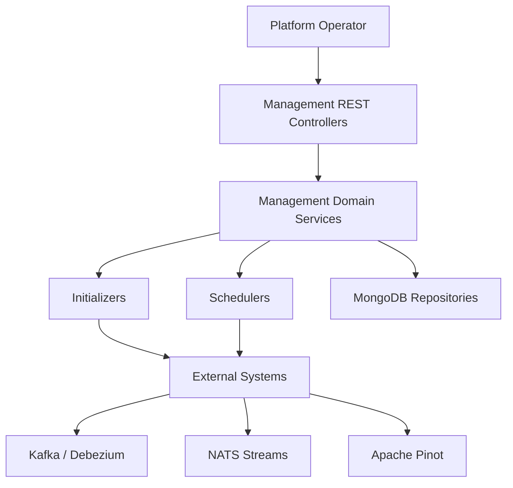
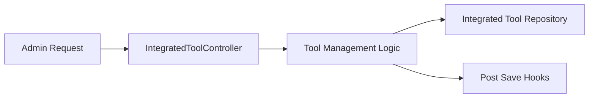
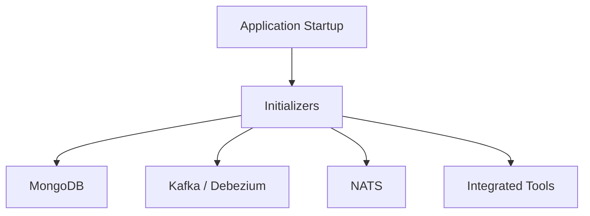
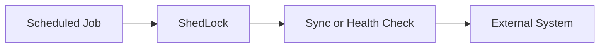
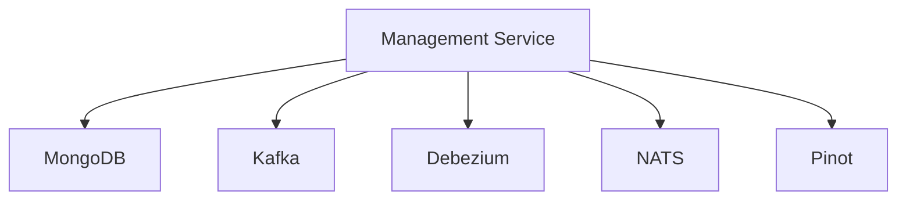

# Management Service Application

## Overview

The **management_service_app** module is the control-plane service for OpenFrame. It is responsible for **platform orchestration, configuration initialization, background schedulers, and lifecycle management** of integrated tools and infrastructure components that support tenant operations.

This service does **not** handle end-user request traffic directly. Instead, it ensures that the OpenFrame platform remains correctly configured, synchronized, and operational across tenants by:

- Bootstrapping platform configuration (agents, tools, streams)
- Managing integrated tools and release versions
- Initializing and monitoring Debezium, Kafka, NATS, and Pinot integrations
- Running scheduled background jobs (health checks, statistics sync)

It runs as a Spring Boot application and heavily depends on shared OpenFrame libraries for data access, Kafka, MongoDB, and security.

---

## Entry Point

### ManagementApplication

```java
@SpringBootApplication
@ComponentScan(
    basePackages = {
        "com.openframe.management",
        "com.openframe.data",
        "com.openframe.core"
    },
    excludeFilters = {
        @ComponentScan.Filter(
            type = FilterType.ASSIGNABLE_TYPE,
            classes = CassandraHealthIndicator.class
        )
    }
)
public class ManagementApplication {
    public static void main(String[] args) {
        SpringApplication.run(ManagementApplication.class, args);
    }
}
```

**Key responsibilities:**
- Boots the management service runtime
- Loads management, data, and core components
- Explicitly excludes Cassandra health checks (not required for this service)

---

## High-Level Architecture



---

## Core Subsystems

### 1. Configuration

**Primary components:**
- `ManagementConfiguration`
- `ShedLockConfig`
- `PinotConfigInitializer`

**Responsibilities:**
- Service-level configuration
- Distributed locking for scheduled jobs (ShedLock)
- Pinot schema and table initialization

---

### 2. REST Controllers

**Controllers:**
- `IntegratedToolController`
- `ReleaseVersionController`

**Responsibilities:**
- Manage integrated tools lifecycle
- Register and update release versions
- Expose operational endpoints for internal administration



---

### 3. Initializers

**Initializer components:**
- `AgentRegistrationSecretInitializer`
- `IntegratedToolAgentInitializer`
- `NatsStreamConfigurationInitializer`
- `OpenFrameClientConfigurationInitializer`
- `TacticalRmmScriptsInitializer`
- `DebeziumConnectorInitializer`

**Responsibilities:**
- Bootstrap required platform artifacts at startup
- Ensure tools, agents, streams, and connectors exist
- Automatically repair missing configuration



---

### 4. Hooks

**Component:**
- `IntegratedToolPostSaveHook`

**Purpose:**
- Executes side effects after an integrated tool is created or updated
- Triggers agent provisioning or downstream configuration updates

---

### 5. Schedulers

**Scheduled jobs:**
- `ApiKeyStatsSyncScheduler`
- `DebeziumHealthCheckScheduler`

**Responsibilities:**
- Periodic synchronization of API key usage statistics
- Continuous health monitoring of Debezium connectors



---

### 6. Services

**Key service:**
- `OpenFrameClientVersionUpdateService`

**Responsibilities:**
- Coordinates client version rollouts
- Ensures managed clients stay compatible with platform releases

---

## Data and Integration Dependencies

The management service relies on shared OpenFrame libraries and external systems:

- **MongoDB** – configuration, tools, tenants
- **Kafka / Debezium** – CDC pipelines and stream processing
- **NATS** – real-time messaging
- **Pinot** – analytics and time-series queries



---

## Relationship to Other Modules

The **management_service_app** acts as a control-plane coordinator for several runtime services:

- Works alongside `api_service_app.md` to prepare API-facing configuration
- Initializes infrastructure consumed by `stream_service_app.md`
- Manages client and agent configuration used by `client_service_app.md`
- Coordinates with shared Kafka, Mongo, and data configuration modules

This separation ensures that operational orchestration is isolated from request-driven services.

---

## Operational Characteristics

- **Startup-heavy**: performs most work during application boot
- **Low request volume**: limited REST surface
- **High side-effect impact**: changes affect multiple services
- **Safe concurrency**: enforced via ShedLock

---

## Summary

The **management_service_app** is the backbone of OpenFrame platform operations. It ensures that:

- Infrastructure dependencies are correctly initialized
- Integrated tools and agents are consistently managed
- Background health and sync processes run reliably

Without this service, other OpenFrame services would lack the configuration and orchestration required to operate correctly at scale.
