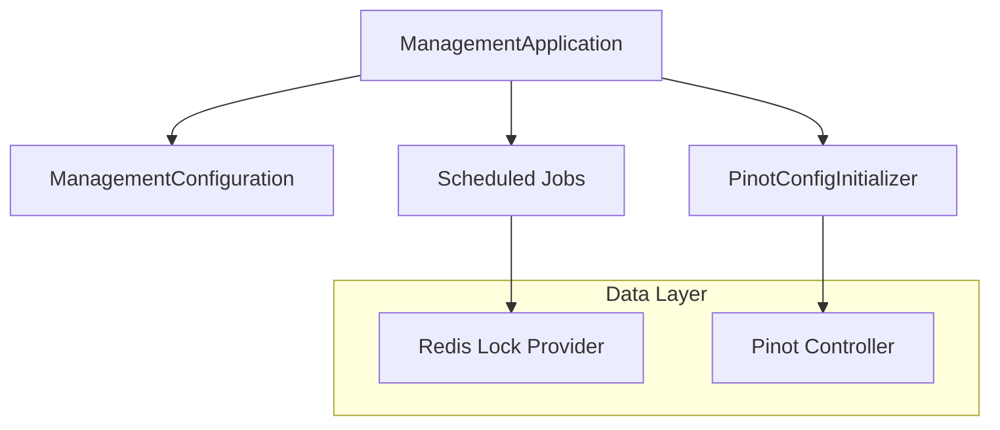
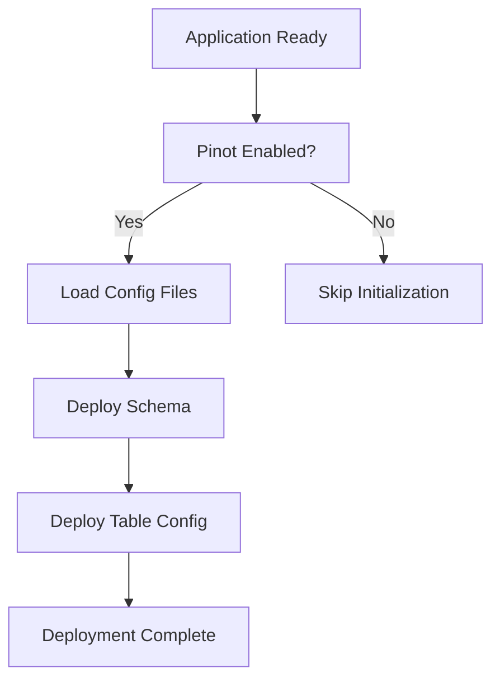

# Management Service – Application and Core

## Overview

The **Management Service** is a Spring Boot–based backend service responsible for **platform bootstrap, operational initialization, and background management tasks** in OpenFrame. It acts as the control-plane service that:

- Boots the management runtime
- Initializes shared infrastructure (Pinot, Redis-based schedulers)
- Coordinates tenant-safe scheduled jobs
- Exposes management APIs via dedicated controllers (documented separately)

This module is part of the broader OpenFrame microservice ecosystem and integrates closely with:
- Data layer services (Mongo, Redis, Pinot)
- Stream and analytics services
- API and Gateway layers

---

## Core Responsibilities

- **Application Bootstrap** – Starts the Management Service runtime
- **Global Configuration** – Component scanning, security primitives
- **Distributed Scheduling** – Tenant-aware scheduled jobs using Redis + ShedLock
- **Analytics Bootstrap** – Automated Apache Pinot schema and table provisioning

---

## High-Level Architecture



---

## Core Components

### ManagementApplication

**Component**:
- `openframe-oss-tenant.openframe.services.openframe-management.src.main.java.com.openframe.management.ManagementApplication.ManagementApplication`

**Purpose**:
- Entry point of the Management Service
- Boots Spring context
- Controls component scanning scope

**Key Characteristics**:
- Scans `com.openframe.management`, `com.openframe.data`, and `com.openframe.core`
- Explicitly excludes Cassandra health checks (not required for this service)

---

### ManagementConfiguration

**Component**:
- `deps.openframe-oss-lib.openframe-management-service-core.src.main.java.com.openframe.management.config.ManagementConfiguration.ManagementConfiguration`

**Purpose**:
- Central configuration class for management runtime

**Responsibilities**:
- Global component scanning
- Provides shared beans used across management workflows

**Exposed Beans**:
- `PasswordEncoder` (BCrypt-based)

---

### ShedLockConfig

**Component**:
- `deps.openframe-oss-lib.openframe-management-service-core.src.main.java.com.openframe.management.config.ShedLockConfig.ShedLockConfig`

**Purpose**:
- Enables **safe distributed scheduling** across clustered deployments

**How It Works**:
- Uses Redis as a shared lock store
- Locks are tenant-scoped using OpenFrame Redis key conventions

**Lock Key Format**:

```text
of:{tenantId}:job-lock:{environment}:{lockName}
```

**Key Features**:
- Prevents duplicate job execution
- Supports horizontal scaling
- Environment-aware isolation

---

### PinotConfigInitializer

**Component**:
- `deps.openframe-oss-lib.openframe-management-service-core.src.main.java.com.openframe.management.config.pinot.PinotConfigInitializer.PinotConfigInitializer`

**Purpose**:
- Automatically provisions Apache Pinot schemas and tables at startup

**Trigger**:
- Executes on `ApplicationReadyEvent`

**Managed Configurations**:
- Devices analytics schema and tables
- Logs analytics schema and tables

**Execution Flow**:



**Key Behaviors**:
- Retry with backoff on transient failures
- Safe create-or-update semantics
- Placeholder resolution via Spring Environment

---

## Related Sub-Modules

The Management Service is complemented by the following documentation files:

- [Management Service Controllers and DTOs](management_service_controllers_and_dtos.md)
- [Management Service Initializers and Schedulers](management_service_initializers_and_schedulers.md)

---

## How This Module Fits in the Platform

- **Upstream**: Gateway Service, API Service
- **Downstream**: Data Layer, Stream Service, Analytics (Pinot)
- **Operational Role**: System initialization, orchestration, and scheduled maintenance

This service is critical during:
- Tenant onboarding
- Integrated tool lifecycle events
- Analytics and reporting bootstrap

---

## Operational Notes

- Safe to run in multiple replicas (Redis locking enforced)
- Pinot bootstrap can be disabled via configuration
- Designed for idempotent startup behavior

---

**Summary**: The Management Service provides the backbone for OpenFrame operational orchestration, ensuring infrastructure readiness, safe scheduling, and analytics availability across tenants.