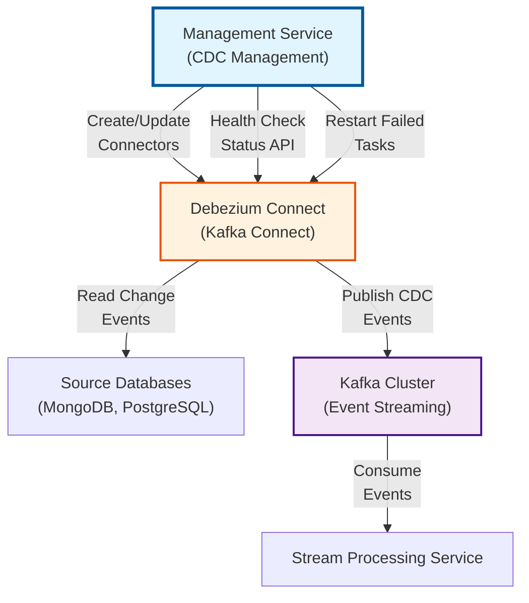
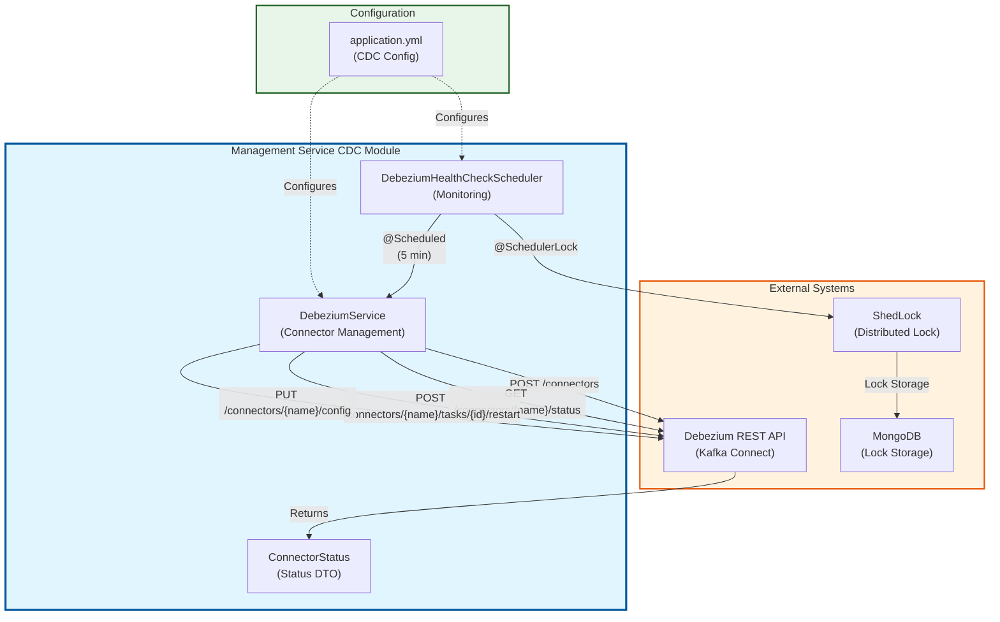
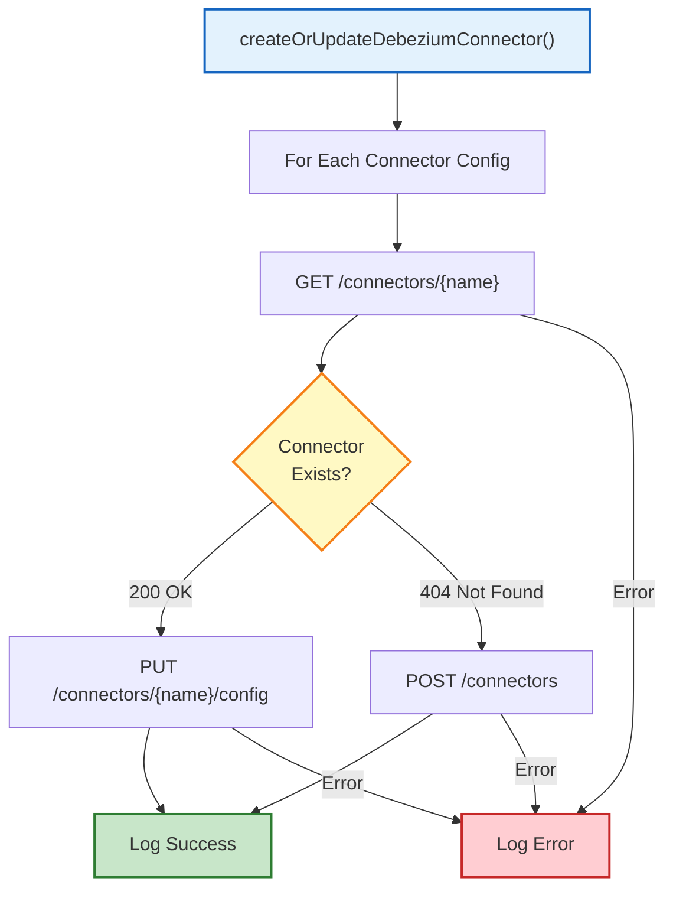
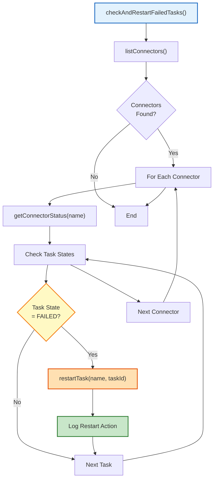
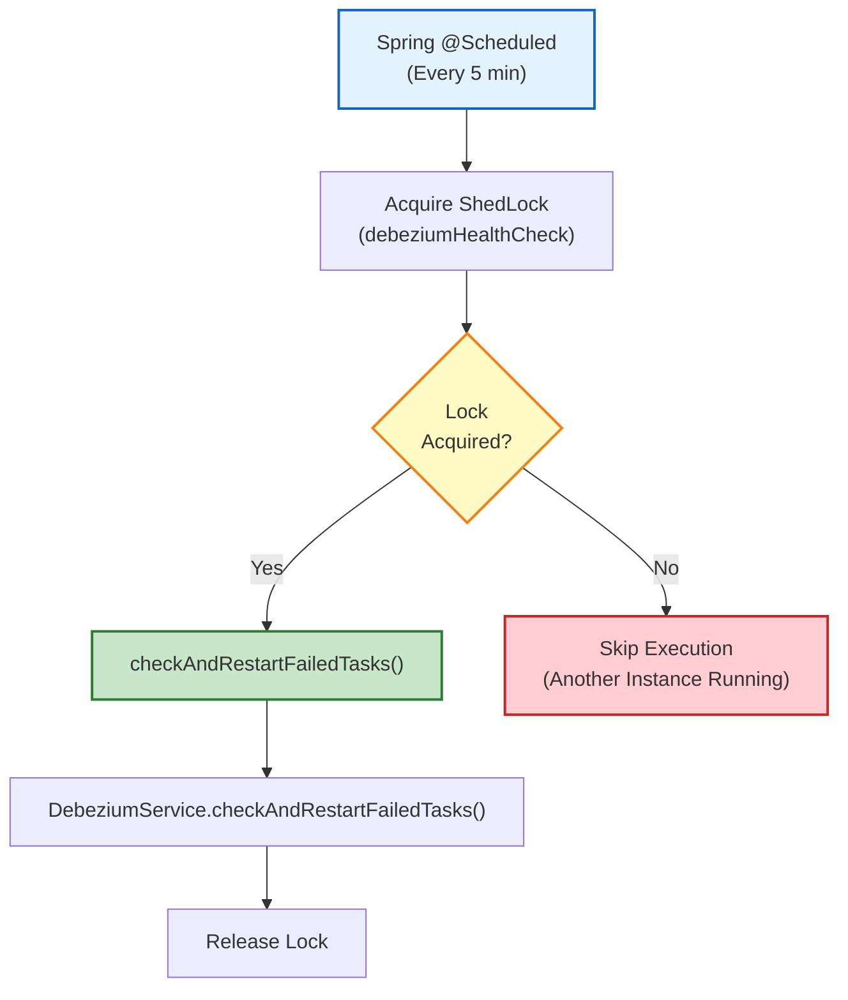
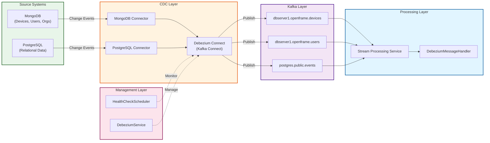
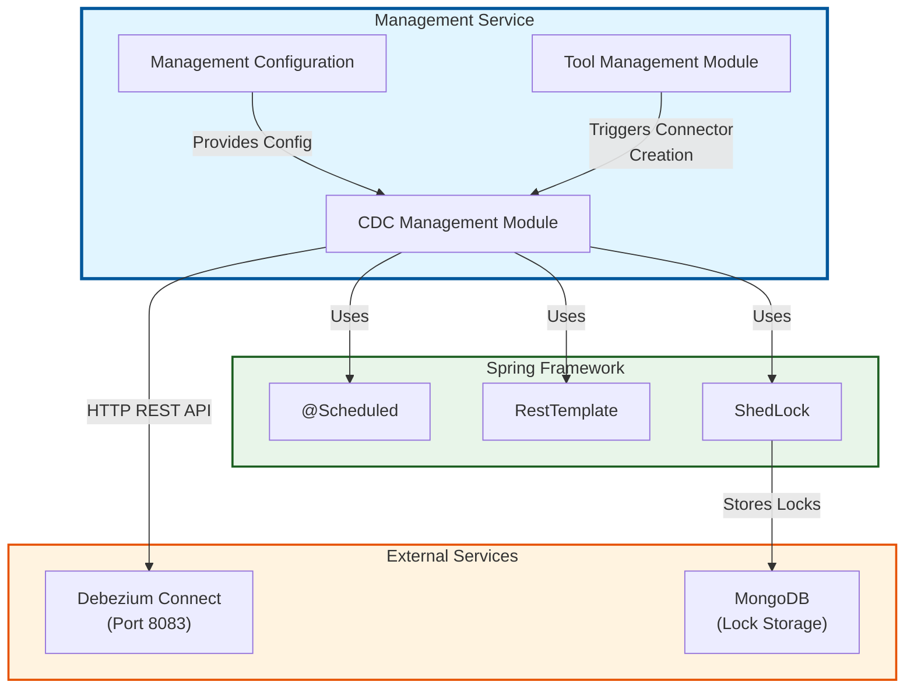
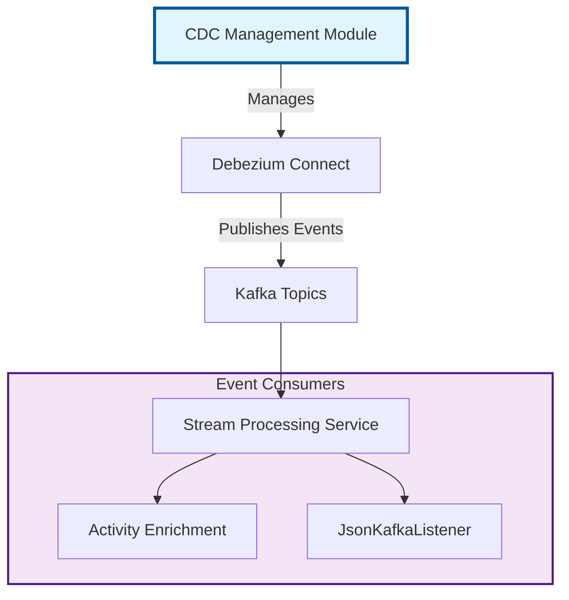
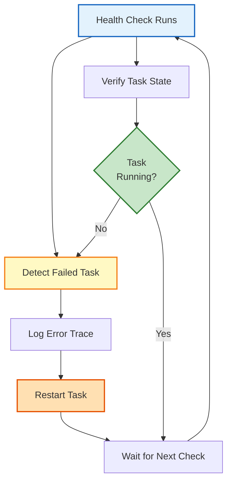

# Management Service CDC Management Module

## Overview

The **Management Service CDC Management** module provides automated Change Data Capture (CDC) connector lifecycle management for the OpenFrame platform. It manages Debezium connectors that capture database changes and stream them to Kafka topics, enabling real-time data synchronization across the distributed system.

This module handles connector registration, configuration updates, health monitoring, and automatic recovery of failed CDC tasks, ensuring reliable data streaming from source databases (MongoDB, PostgreSQL, etc.) to the event-driven architecture.

**Key Responsibilities:**
- **Connector Lifecycle Management**: Create, update, and configure Debezium connectors
- **Health Monitoring**: Continuous monitoring of connector and task states
- **Automatic Recovery**: Detect and restart failed CDC tasks
- **Distributed Coordination**: Use ShedLock for coordinated health checks across multiple instances

---

## Architecture Overview

### System Context



### Component Architecture



---

## Core Components

### 1. DebeziumService

**Purpose**: Manages the complete lifecycle of Debezium CDC connectors through REST API interactions.

**Location**: `com.openframe.management.service.DebeziumService`

**Key Responsibilities:**
- Create new Debezium connectors
- Update existing connector configurations
- Monitor connector and task health
- Restart failed tasks automatically
- List all registered connectors

**Configuration:**
```yaml
openframe:
  debezium:
    base-url: http://debezium-connect:8083
```

#### Core Operations

##### Connector Creation/Update



**Method Signature:**
```java
public void createOrUpdateDebeziumConnector(Object[] debeziumConnectors)
```

**Connector Configuration Format:**
```json
{
  "name": "mongodb-device-connector",
  "config": {
    "connector.class": "io.debezium.connector.mongodb.MongoDbConnector",
    "mongodb.connection.string": "mongodb://mongo:27017",
    "database.include.list": "openframe",
    "collection.include.list": "openframe.devices",
    "topic.prefix": "dbserver1",
    "tasks.max": "1"
  }
}
```

##### Health Monitoring



**Method Signatures:**
```java
public List<String> listConnectors()
public ConnectorStatus getConnectorStatus(String connectorName)
public void restartTask(String connectorName, int taskId)
public void checkAndRestartFailedTasks()
```

**API Endpoints Used:**
- `GET /connectors` - List all connectors
- `GET /connectors/{name}/status` - Get connector status
- `POST /connectors/{name}/tasks/{taskId}/restart` - Restart failed task

---

### 2. DebeziumHealthCheckScheduler

**Purpose**: Provides scheduled, distributed health monitoring for Debezium connectors with automatic recovery.

**Location**: `com.openframe.management.scheduler.DebeziumHealthCheckScheduler`

**Key Features:**
- **Scheduled Execution**: Runs health checks at configurable intervals (default: 5 minutes)
- **Distributed Locking**: Uses ShedLock to prevent duplicate execution across multiple instances
- **Conditional Activation**: Only enabled when `openframe.debezium.health-check.enabled=true`

**Configuration:**
```yaml
openframe:
  debezium:
    health-check:
      enabled: true
      interval: 300000  # 5 minutes in milliseconds
      lock-at-most-for: 5m
      lock-at-least-for: 1m
```

#### Scheduling Flow



**Scheduler Configuration:**
```java
@Scheduled(fixedDelayString = "${openframe.debezium.health-check.interval:300000}")
@SchedulerLock(
    name = "debeziumHealthCheck",
    lockAtMostFor = "${openframe.debezium.health-check.lock-at-most-for:5m}",
    lockAtLeastFor = "${openframe.debezium.health-check.lock-at-least-for:1m}"
)
public void checkAndRestartFailedTasks()
```

**Lock Parameters:**
- **lockAtMostFor**: Maximum time lock is held (prevents deadlock if instance crashes)
- **lockAtLeastFor**: Minimum time lock is held (prevents rapid re-execution)

---

### 3. ConnectorStatus DTO

**Purpose**: Data transfer object representing Debezium connector and task states.

**Location**: `com.openframe.management.dto.debezium.ConnectorStatus`

**Structure:**
```java
@Data
@JsonIgnoreProperties(ignoreUnknown = true)
public class ConnectorStatus {
    private String name;
    private Connector connector;
    private List<TaskStatus> tasks;
    
    @Data
    public static class Connector {
        private String state;      // RUNNING, PAUSED, FAILED
        private String workerId;
    }
    
    @Data
    public static class TaskStatus {
        private int id;
        private String state;      // RUNNING, FAILED
        private String workerId;
        private String trace;      // Error stack trace if failed
    }
}
```

**Example JSON Response:**
```json
{
  "name": "mongodb-device-connector",
  "connector": {
    "state": "RUNNING",
    "workerId": "kafka-connect-1:8083"
  },
  "tasks": [
    {
      "id": 0,
      "state": "RUNNING",
      "workerId": "kafka-connect-1:8083"
    }
  ]
}
```

**Task States:**
- `RUNNING` - Task is actively capturing changes
- `FAILED` - Task has encountered an error (triggers restart)
- `PAUSED` - Task is temporarily stopped
- `UNASSIGNED` - Task not yet assigned to a worker

---

## Data Flow

### CDC Event Pipeline



### Debezium Message Format

The CDC events follow the standard Debezium message structure (see [data_layer_kafka.md](data_layer_kafka.md) for details):

```json
{
  "payload": {
    "before": null,
    "after": {
      "id": "device-123",
      "name": "Server-01",
      "status": "online"
    },
    "source": {
      "version": "2.1.0",
      "connector": "mongodb",
      "name": "dbserver1",
      "ts_ms": 1704067200000,
      "db": "openframe",
      "collection": "devices"
    },
    "op": "c",
    "ts_ms": 1704067200000
  }
}
```

**Operation Types:**
- `c` - CREATE (insert)
- `r` - READ (initial snapshot)
- `u` - UPDATE (modification)
- `d` - DELETE (removal)

---

## Integration Points

### Upstream Dependencies



**Related Modules:**
- [management_service_tool_management.md](management_service_tool_management.md) - Triggers connector creation for integrated tools
- [management_service_configuration.md](management_service_configuration.md) - Provides base configuration
- [data_layer_kafka.md](data_layer_kafka.md) - Defines Debezium message models

### Downstream Consumers



**Related Modules:**
- [stream_processing.md](stream_processing.md) - Consumes CDC events
- [stream_processing_handlers.md](stream_processing_handlers.md) - Processes Debezium messages
- [stream_processing_streams.md](stream_processing_streams.md) - Enriches CDC data

---

## Configuration

### Application Properties

```yaml
# Debezium Connect Configuration
openframe:
  debezium:
    # Base URL for Debezium Connect REST API
    base-url: http://debezium-connect:8083
    
    # Health Check Configuration
    health-check:
      # Enable/disable automatic health monitoring
      enabled: true
      
      # Check interval in milliseconds (default: 5 minutes)
      interval: 300000
      
      # Maximum time to hold distributed lock (prevents deadlock)
      lock-at-most-for: 5m
      
      # Minimum time to hold distributed lock (prevents rapid re-execution)
      lock-at-least-for: 1m

# ShedLock Configuration (for distributed scheduling)
shedlock:
  defaults:
    lock-at-most-for: 10m
    lock-at-least-for: 5m
```

### Environment Variables

```bash
# Debezium Connect URL
OPENFRAME_DEBEZIUM_BASE_URL=http://debezium-connect:8083

# Health Check Settings
OPENFRAME_DEBEZIUM_HEALTH_CHECK_ENABLED=true
OPENFRAME_DEBEZIUM_HEALTH_CHECK_INTERVAL=300000

# Lock Configuration
OPENFRAME_DEBEZIUM_HEALTH_CHECK_LOCK_AT_MOST_FOR=5m
OPENFRAME_DEBEZIUM_HEALTH_CHECK_LOCK_AT_LEAST_FOR=1m
```

### Connector Configuration Examples

#### MongoDB Connector

```json
{
  "name": "mongodb-device-connector",
  "config": {
    "connector.class": "io.debezium.connector.mongodb.MongoDbConnector",
    "mongodb.connection.string": "mongodb://mongo:27017/?replicaSet=rs0",
    "mongodb.user": "debezium",
    "mongodb.password": "${MONGO_PASSWORD}",
    "database.include.list": "openframe",
    "collection.include.list": "openframe.devices,openframe.users,openframe.organizations",
    "topic.prefix": "dbserver1",
    "tasks.max": "1",
    "snapshot.mode": "initial",
    "capture.mode": "change_streams_update_full"
  }
}
```

#### PostgreSQL Connector

```json
{
  "name": "postgres-events-connector",
  "config": {
    "connector.class": "io.debezium.connector.postgresql.PostgresConnector",
    "database.hostname": "postgres",
    "database.port": "5432",
    "database.user": "debezium",
    "database.password": "${POSTGRES_PASSWORD}",
    "database.dbname": "openframe",
    "database.server.name": "postgres",
    "table.include.list": "public.events,public.logs",
    "plugin.name": "pgoutput",
    "publication.name": "dbz_publication",
    "slot.name": "debezium_slot"
  }
}
```

---

## Operational Procedures

### Monitoring Connector Health

#### Check All Connectors

```bash
# List all registered connectors
curl http://debezium-connect:8083/connectors

# Response:
# ["mongodb-device-connector", "postgres-events-connector"]
```

#### Check Specific Connector Status

```bash
# Get connector status
curl http://debezium-connect:8083/connectors/mongodb-device-connector/status

# Response:
{
  "name": "mongodb-device-connector",
  "connector": {
    "state": "RUNNING",
    "worker_id": "kafka-connect-1:8083"
  },
  "tasks": [
    {
      "id": 0,
      "state": "RUNNING",
      "worker_id": "kafka-connect-1:8083"
    }
  ]
}
```

### Manual Task Restart

```bash
# Restart a failed task
curl -X POST http://debezium-connect:8083/connectors/mongodb-device-connector/tasks/0/restart
```

### Update Connector Configuration

```bash
# Update connector config
curl -X PUT \
  -H "Content-Type: application/json" \
  --data '{
    "connector.class": "io.debezium.connector.mongodb.MongoDbConnector",
    "mongodb.connection.string": "mongodb://mongo:27017/?replicaSet=rs0",
    "database.include.list": "openframe",
    "collection.include.list": "openframe.devices,openframe.users",
    "topic.prefix": "dbserver1"
  }' \
  http://debezium-connect:8083/connectors/mongodb-device-connector/config
```

### Delete Connector

```bash
# Delete a connector
curl -X DELETE http://debezium-connect:8083/connectors/mongodb-device-connector
```

---

## Error Handling

### Common Failure Scenarios

#### 1. Connection Failures

**Symptom**: Connector fails to connect to source database

**Log Example:**
```text
ERROR Connector 'mongodb-device-connector' task 0 is FAILED. 
Trace: Unable to connect to mongodb://mongo:27017
```

**Resolution:**
- Verify database connectivity
- Check credentials in connector config
- Ensure database is accepting connections
- Automatic restart will retry connection

#### 2. Authentication Errors

**Symptom**: Task fails with authentication error

**Log Example:**
```text
ERROR Failed to authenticate user 'debezium' on database 'openframe'
```

**Resolution:**
- Verify database user credentials
- Ensure user has required permissions (read, replication)
- Update connector configuration with correct credentials

#### 3. Schema Changes

**Symptom**: Connector fails after database schema modification

**Log Example:**
```text
ERROR Schema mismatch detected for collection 'devices'
```

**Resolution:**
- Review schema evolution settings
- Consider connector restart to re-snapshot
- Update connector configuration if needed

#### 4. Kafka Connection Issues

**Symptom**: Connector cannot publish to Kafka

**Log Example:**
```text
ERROR Failed to send record to topic 'dbserver1.openframe.devices'
```

**Resolution:**
- Verify Kafka cluster health
- Check network connectivity to Kafka brokers
- Review Kafka topic configuration

### Automatic Recovery

The health check scheduler automatically handles:

1. **Failed Task Detection**: Identifies tasks in `FAILED` state
2. **Automatic Restart**: Restarts failed tasks without manual intervention
3. **Logging**: Records all restart actions for audit trail
4. **Retry Logic**: Continues monitoring and restarting until task recovers

**Recovery Flow:**


---

## Performance Considerations

### Scalability

**Distributed Locking:**
- ShedLock ensures only one instance performs health checks
- Prevents duplicate restart attempts across multiple management service instances
- Lock timeout prevents deadlock if instance crashes

**Health Check Interval:**
- Default 5-minute interval balances responsiveness and overhead
- Configurable based on system requirements
- Shorter intervals increase monitoring frequency but add API load

### Resource Usage

**Network Traffic:**
- Health checks make REST API calls to Debezium Connect
- Minimal payload size (status JSON)
- Frequency controlled by `interval` configuration

**Database Load:**
- ShedLock stores lock state in MongoDB
- Minimal write operations (once per health check)
- Automatic lock expiration prevents stale locks

### Optimization Tips

1. **Adjust Check Interval**: Increase interval for stable environments
2. **Monitor Lock Contention**: Review ShedLock metrics in multi-instance deployments
3. **Batch Connector Operations**: Group connector updates when possible
4. **Use Connector Pausing**: Pause connectors during maintenance windows

---

## Security Considerations

### API Authentication

**Debezium Connect Security:**
- Currently uses unauthenticated HTTP REST API
- Consider enabling authentication in production:
  - Basic authentication
  - OAuth 2.0
  - Mutual TLS

**Configuration Security:**
```yaml
openframe:
  debezium:
    base-url: https://debezium-connect:8443
    auth:
      username: ${DEBEZIUM_USERNAME}
      password: ${DEBEZIUM_PASSWORD}
```

### Credential Management

**Database Credentials in Connectors:**
- Use environment variable substitution: `${MONGO_PASSWORD}`
- Store credentials in secure secret management systems
- Rotate credentials regularly
- Limit database user permissions to minimum required

**Example Secure Configuration:**
```json
{
  "config": {
    "mongodb.user": "${env:MONGO_CDC_USER}",
    "mongodb.password": "${env:MONGO_CDC_PASSWORD}"
  }
}
```

### Network Security

**Recommendations:**
- Deploy Debezium Connect in private network
- Use TLS for all connections (MongoDB, Kafka, REST API)
- Implement network policies to restrict access
- Monitor API access logs

---

## Testing

### Unit Testing

**Test DebeziumService:**
```java
@Test
void testCreateConnector() {
    // Mock RestTemplate
    RestTemplate mockRestTemplate = mock(RestTemplate.class);
    
    // Configure mock responses
    when(mockRestTemplate.getForEntity(anyString(), eq(String.class)))
        .thenThrow(new HttpClientErrorException(HttpStatus.NOT_FOUND));
    
    when(mockRestTemplate.postForEntity(anyString(), any(), eq(String.class)))
        .thenReturn(ResponseEntity.ok("Created"));
    
    // Test connector creation
    debeziumService.createOrUpdateDebeziumConnector(connectorConfigs);
    
    // Verify POST was called
    verify(mockRestTemplate).postForEntity(
        contains("/connectors"),
        any(),
        eq(String.class)
    );
}
```

### Integration Testing

**Test Health Check Scheduler:**
```java
@SpringBootTest
@TestPropertySource(properties = {
    "openframe.debezium.health-check.enabled=true",
    "openframe.debezium.health-check.interval=1000"
})
class DebeziumHealthCheckSchedulerIntegrationTest {
    
    @Autowired
    private DebeziumHealthCheckScheduler scheduler;
    
    @MockBean
    private DebeziumService debeziumService;
    
    @Test
    void testScheduledExecution() throws InterruptedException {
        // Wait for scheduled execution
        Thread.sleep(2000);
        
        // Verify health check was called
        verify(debeziumService, atLeastOnce())
            .checkAndRestartFailedTasks();
    }
}
```

### Manual Testing

**Test Connector Lifecycle:**
```bash
# 1. Create connector
curl -X POST \
  -H "Content-Type: application/json" \
  --data @connector-config.json \
  http://debezium-connect:8083/connectors

# 2. Verify creation
curl http://debezium-connect:8083/connectors/test-connector/status

# 3. Simulate failure (stop database)
docker stop mongodb

# 4. Wait for health check (5 minutes)
# Check logs for restart attempt

# 5. Restart database
docker start mongodb

# 6. Verify recovery
curl http://debezium-connect:8083/connectors/test-connector/status
```

---

## Troubleshooting

### Common Issues

#### Health Check Not Running

**Symptoms:**
- No health check logs appearing
- Failed tasks not being restarted

**Diagnosis:**
```bash
# Check if health check is enabled
grep "health-check.enabled" application.yml

# Check scheduler initialization
grep "DebeziumHealthCheckScheduler initialized" logs/management-service.log
```

**Solutions:**
1. Verify `openframe.debezium.health-check.enabled=true`
2. Check ShedLock configuration
3. Verify MongoDB connectivity for lock storage
4. Review scheduler logs for errors

#### Connector Creation Fails

**Symptoms:**
- Connector not appearing in Debezium Connect
- Error logs during connector creation

**Diagnosis:**
```bash
# Check Debezium Connect logs
docker logs debezium-connect

# Verify connectivity
curl http://debezium-connect:8083/connectors

# Check connector configuration
curl http://debezium-connect:8083/connector-plugins
```

**Solutions:**
1. Verify Debezium Connect is running
2. Check connector configuration syntax
3. Ensure required connector plugins are installed
4. Review database connectivity from Debezium Connect

#### Lock Contention

**Symptoms:**
- Multiple instances attempting health checks
- Lock timeout errors in logs

**Diagnosis:**
```bash
# Check ShedLock collection in MongoDB
mongo openframe --eval "db.shedlock.find().pretty()"

# Review lock acquisition logs
grep "SchedulerLock" logs/management-service.log
```

**Solutions:**
1. Adjust `lock-at-most-for` and `lock-at-least-for` values
2. Verify clock synchronization across instances
3. Check MongoDB connectivity
4. Review instance count and scaling configuration

### Debug Logging

**Enable Debug Logs:**
```yaml
logging:
  level:
    com.openframe.management.service.DebeziumService: DEBUG
    com.openframe.management.scheduler.DebeziumHealthCheckScheduler: DEBUG
    net.javacrumbs.shedlock: DEBUG
```

**Key Log Messages:**
```text
# Connector creation
INFO  Processing Debezium connector: mongodb-device-connector
INFO  Connector 'mongodb-device-connector' created. Response: 201

# Health check execution
DEBUG Checking Debezium connector health...
WARN  Connector mongodb-device-connector task 0 is FAILED. Trace: ...
INFO  Restarted task 0 for connector mongodb-device-connector

# Lock acquisition
DEBUG Locked 'debeziumHealthCheck', lock will be held at most until 2024-01-01T12:05:00Z
```

---

## Best Practices

### Connector Management

1. **Use Descriptive Names**: Name connectors clearly (e.g., `mongodb-device-connector`)
2. **Version Control Configs**: Store connector configurations in version control
3. **Test Before Production**: Validate connector configs in staging environment
4. **Monitor Lag**: Track connector lag metrics to ensure timely event capture
5. **Plan for Snapshots**: Consider snapshot mode and duration for large datasets

### Health Monitoring

1. **Set Appropriate Intervals**: Balance responsiveness with system load
2. **Monitor Lock Metrics**: Track ShedLock acquisition and contention
3. **Alert on Persistent Failures**: Set up alerts for tasks that fail repeatedly
4. **Review Error Traces**: Analyze failure patterns to identify systemic issues
5. **Maintain Audit Trail**: Keep logs of all restart actions

### Configuration Management

1. **Use Environment Variables**: Externalize sensitive configuration
2. **Document Connector Configs**: Maintain documentation for each connector
3. **Implement Change Control**: Review and approve connector configuration changes
4. **Test Configuration Updates**: Validate config changes before applying
5. **Backup Configurations**: Keep backups of working connector configurations

### Operational Excellence

1. **Automate Deployment**: Use infrastructure-as-code for connector provisioning
2. **Implement Monitoring**: Track connector health, lag, and throughput
3. **Plan for Scaling**: Design connector topology for horizontal scaling
4. **Regular Maintenance**: Schedule periodic reviews of connector performance
5. **Disaster Recovery**: Document recovery procedures for connector failures

---

## Related Documentation

### Core Dependencies
- [management_service.md](management_service.md) - Parent management service module
- [management_service_configuration.md](management_service_configuration.md) - Configuration setup
- [management_service_tool_management.md](management_service_tool_management.md) - Tool integration triggering CDC

### Data Layer
- [data_layer_kafka.md](data_layer_kafka.md) - Kafka configuration and Debezium message models
- [data_layer_mongo.md](data_layer_mongo.md) - MongoDB collections being monitored

### Stream Processing
- [stream_processing.md](stream_processing.md) - CDC event consumption
- [stream_processing_handlers.md](stream_processing_handlers.md) - Debezium message processing
- [stream_processing_streams.md](stream_processing_streams.md) - Event enrichment

### External Resources
- [Debezium Documentation](https://debezium.io/documentation/)
- [Kafka Connect REST API](https://docs.confluent.io/platform/current/connect/references/restapi.html)
- [ShedLock Documentation](https://github.com/lukas-krecan/ShedLock)

---

## Summary

The **Management Service CDC Management** module provides robust, automated lifecycle management for Debezium CDC connectors in the OpenFrame platform. Key capabilities include:

✅ **Automated Connector Provisioning** - Create and update connectors programmatically  
✅ **Continuous Health Monitoring** - Scheduled checks every 5 minutes  
✅ **Automatic Recovery** - Restart failed tasks without manual intervention  
✅ **Distributed Coordination** - ShedLock prevents duplicate operations  
✅ **Production-Ready** - Handles errors gracefully with comprehensive logging  

This module ensures reliable real-time data streaming from source databases to the event-driven architecture, enabling features like activity tracking, device monitoring, and user management across the OpenFrame ecosystem.

For questions or issues, please consult the [OpenMSP Slack community](https://join.slack.com/t/openmsp/shared_invite/zt-36bl7mx0h-3~U2nFH6nqHqoTPXMaHEHA).
