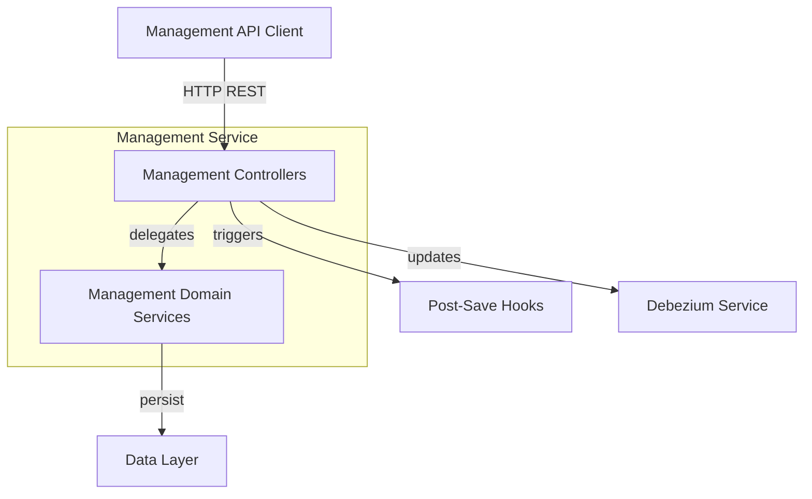
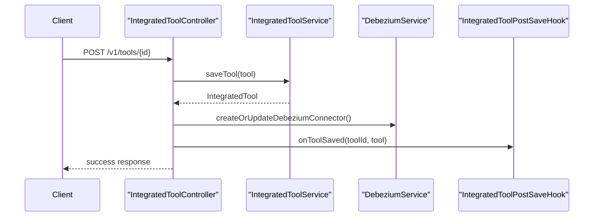

# Management Service Controllers and DTOs

This module exposes **management-level REST APIs** for configuring integrated tools and reporting cluster release versions. It sits inside the **OpenFrame Management Service**, acting as the external control surface used by operators and automation to manage tool integrations and cluster lifecycle metadata.

The module is intentionally thin: controllers validate and route requests, while persistence, orchestration, and side effects (Debezium, hooks, schedulers) are handled by lower-level services defined in other modules.

## Responsibilities

- Expose REST endpoints for **Integrated Tool configuration**
- Trigger **Debezium connector lifecycle updates** when tools change
- Notify post-save hooks to bootstrap or reconcile dependent resources
- Accept and process **cluster release version updates**
- Define request DTOs used by the management APIs

## High-Level Architecture

**Key characteristics**:
- Stateless REST controllers
- Strong separation between API layer and domain logic
- Side effects (connectors, hooks) are executed **after persistence**

## Sub-modules

The module is composed of two focused areas:

- **Controllers** – REST endpoints that expose management operations
- **DTOs** – Request objects used by controllers

### Controllers

- [Integrated Tool Controller](integrated_tool_controller.md)
- [Release Version Controller](release_version_controller.md)

### DTOs

- [Release Version Request DTO](release_version_request_dto.md)

## How This Module Fits Into the Platform

This module depends on and collaborates with several other parts of the system:

- **Management Service Core** – application bootstrap and configuration
- **Data Layer (Mongo, Kafka, Debezium)** – persistence and CDC pipelines
- **Management Initializers and Schedulers** – react to tool changes over time
- **Stream Service** – consumes Debezium events emitted after tool updates

Rather than duplicating logic, this module focuses on **API orchestration**, delegating all business rules to underlying services.

## Typical Flow: Saving an Integrated Tool

This ensures that:
- Tool configuration is persisted first
- CDC pipelines are kept in sync
- Additional initialization logic runs safely and independently
