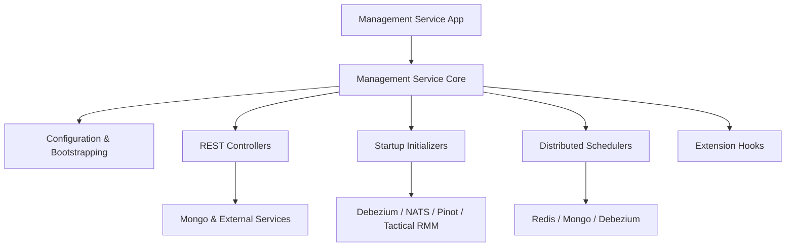
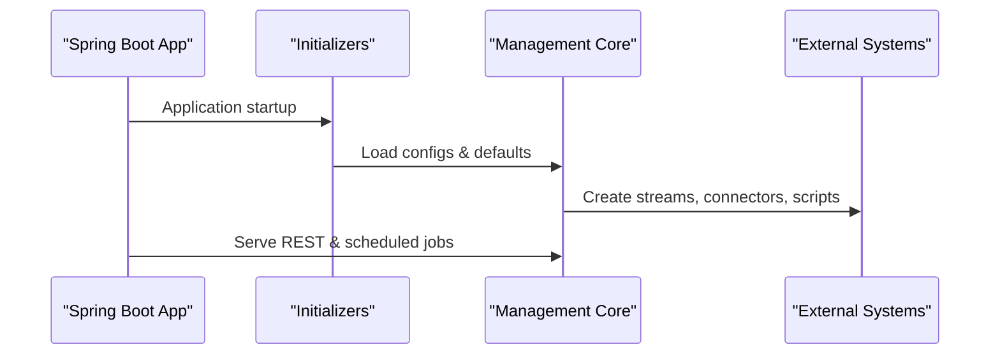

# Management Service Core

## Overview

The **management_service_core** module provides the backbone for cluster-wide configuration, lifecycle management, and operational automation within the OpenFrame / Flamingo platform. It is responsible for:

- Bootstrapping and maintaining system-wide configurations (agents, tools, client configs)
- Managing integrated tools and their downstream side-effects (Debezium, agents, scripts)
- Coordinating distributed schedulers with tenant-safe locking
- Initializing streaming, analytics, and connector infrastructure

This module is consumed by the **management_service_app** and interacts heavily with shared data, streaming, and integration services across the platform.

---

## High-Level Architecture

---

## Core Subsystems

### 1. Configuration & Infrastructure

Responsible for Spring wiring, security primitives, distributed locks, and analytics bootstrap.

- **ManagementConfiguration** – Base component scanning and password encoding
- **ShedLockConfig** – Redis-backed distributed scheduler locking
- **PinotConfigInitializer** – Deploys Pinot schemas and table configurations on startup

See: [management_service_core_configuration.md](management_service_core_configuration.md)

---

### 2. REST Controllers

Expose management APIs for tools and release coordination.

- **IntegratedToolController** – CRUD-style operations for integrated tools
- **ReleaseVersionController** – Receives cluster release/version updates

See: [management_service_core_controllers.md](management_service_core_controllers.md)

---

### 3. Startup Initializers

Executed during application startup to ensure required system state exists.

- Agent registration secrets
- Integrated tool agents
- NATS stream configuration
- OpenFrame client configuration
- Tactical RMM scripts
- Debezium connector bootstrap

See: [management_service_core_initializers.md](management_service_core_initializers.md)

---

### 4. Distributed Schedulers

Periodic background jobs protected by ShedLock to ensure single execution per tenant.

- **ApiKeyStatsSyncScheduler** – Syncs Redis stats into MongoDB
- **DebeziumHealthCheckScheduler** – Monitors and restarts failed Debezium tasks

See: [management_service_core_schedulers.md](management_service_core_schedulers.md)

---

### 5. Extension Hooks

Lightweight extension points for post-processing logic.

- **IntegratedToolPostSaveHook** – Invoked after a tool is persisted

Used to decouple tool persistence from side-effects such as connector creation.

See: [management_service_core_hooks.md](management_service_core_hooks.md)

---

## Runtime Lifecycle

---

## How This Module Fits in the Platform

- Works alongside **api_service_core** for user-facing APIs
- Coordinates with **stream_service_core** via Debezium and NATS
- Uses **shared_data_mongo_core** for persistence
- Publishes updates consumed by **client_service_core**

This makes **management_service_core** the control-plane orchestrator for OpenFrame.
