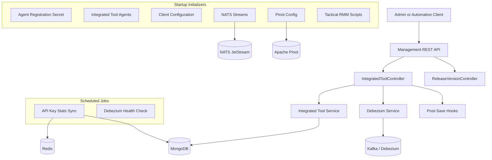
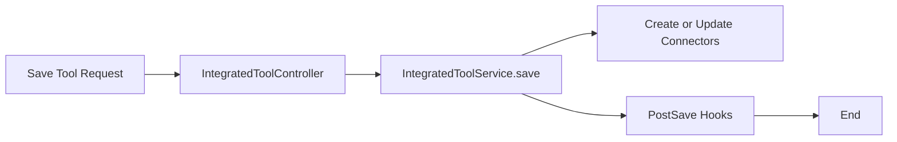
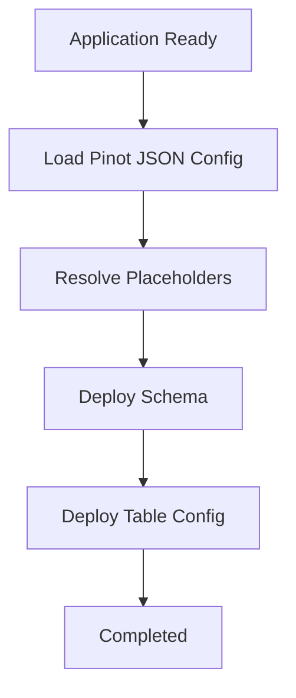

# Management Service Core

The **management_service_core** module provides the operational and orchestration backbone for OpenFrame management tasks. It is responsible for bootstrapping system configuration, managing integrated tools, coordinating background jobs, initializing external infrastructure components, and handling cluster-level lifecycle events.

This module sits at the intersection of configuration management, tool orchestration, and operational automation, and is typically deployed as the **OpenFrame Management Service**.

---

## Responsibilities at a Glance

- System-wide configuration and bean initialization
- Integrated tool lifecycle management
- External system bootstrap (Pinot, NATS, Debezium)
- Scheduled background maintenance jobs
- Cluster and client release coordination
- Safe, distributed execution using Redis-backed locks

---

## High-Level Architecture

---

## Module Entry and Configuration

### ManagementConfiguration

- Performs a wide component scan over `com.openframe`
- Explicitly excludes Cassandra health checks to avoid cross-service interference
- Provides a shared `PasswordEncoder` using BCrypt

**Key outcome:** establishes the foundational Spring context for the management service.

---

### ShedLockConfig

This configuration enables **safe distributed scheduling** using Redis:

- Activates Spring scheduling
- Uses ShedLock with Redis as the lock provider
- Scopes locks by tenant and environment

**Why this matters:**
Only one instance of a scheduled job runs across a cluster, preventing duplicate processing.

---

## REST Controllers

### IntegratedToolController

**Base path:** `/v1/tools`

Responsibilities:

- List all integrated tools
- Fetch a single tool by ID
- Create or update tool configurations

Key behaviors during save:

1. Tool configuration is persisted
2. Debezium connectors are created or updated
3. Post-save hooks are invoked for side effects

The **IntegratedToolPostSaveHook** interface allows lightweight extension without event plumbing.

---

### ReleaseVersionController

**Base path:** `/v1/cluster-registrations`

- Accepts cluster release version updates
- Delegates processing to `ReleaseVersionService`

Used during:
- Cluster upgrades
- Client rollout coordination

---

## Startup Initializers

The management service performs several critical bootstrapping tasks at startup.

### AgentRegistrationSecretInitializer

- Runs once on application startup
- Ensures an initial agent registration secret exists
- Prevents agents from registering without a valid secret

---

### IntegratedToolAgentInitializer

- Loads agent definitions from classpath JSON files
- Creates or updates `IntegratedToolAgent` records
- Preserves versions for release agents
- Publishes update events when agent versions change

This ensures agent definitions are **idempotent and version-aware**.

---

### OpenFrameClientConfigurationInitializer

- Loads default client configuration from resources
- Ensures a `default` configuration always exists
- Preserves versioning to avoid unintended downgrades

---

### NatsStreamConfigurationInitializer

Creates required NATS JetStream streams:

- Tool installation events
- Client update notifications
- Tool agent updates
- Tool connections
- Installed agent events

All streams are created idempotently at startup.

---

### PinotConfigInitializer

Bootstraps Apache Pinot schemas and tables at application readiness.

Key features:

- Loads schema and table definitions from classpath
- Resolves Spring environment placeholders
- Supports retry with backoff
- Creates or updates realtime and offline tables

---

### TacticalRmmScriptsInitializer

- Connects to Tactical RMM via API
- Ensures required automation scripts exist
- Creates or updates scripts from bundled resources

This guarantees Tactical RMM environments remain aligned with OpenFrame automation requirements.

---

## Event-Driven Initialization

### DebeziumConnectorInitializer

Conditionally enabled via configuration.

On application readiness:

- Checks existing Debezium connectors
- If none exist, initializes them from MongoDB tool definitions

This bridges **stored configuration** and **runtime CDC pipelines**.

---

## Scheduled Jobs

### ApiKeyStatsSyncScheduler

- Periodically synchronizes API key usage statistics
- Moves data from Redis into MongoDB
- Uses ShedLock to ensure single execution

---

### DebeziumHealthCheckScheduler

- Periodically checks Debezium connector health
- Automatically restarts failed tasks
- Cluster-safe via distributed locking

---

## Supporting Models

### ScriptConfig

A simple configuration model used for external automation scripts:

- Name and description
- Resource path
- Execution shell and category
- Default timeout

---

## Client Release Coordination

### OpenFrameClientVersionUpdateService

This service acts as the integration point for:

- Cluster-reported release versions
- Client update distribution mechanisms

While currently minimal, it is designed to publish update events through shared messaging infrastructure.

---

## Relationship to Other Modules

The management service core interacts closely with:

- **data_mongo_layer** – persistent configuration and state
- **data_redis_cache_layer** – distributed locks and counters
- **stream_processing_core** – Debezium and event pipelines
- **gateway_service_core** – tool and agent communication paths
- **api_service_core** – exposes management state to clients

This module does **not** duplicate domain logic, but orchestrates and coordinates it.

---

## Summary

The **management_service_core** module is the operational control plane of OpenFrame. It ensures:

- Systems start in a known-good state
- External dependencies are initialized safely
- Background jobs run exactly once across clusters
- Tooling, agents, and clients remain synchronized

It is intentionally automation-heavy, idempotent by design, and optimized for distributed deployments.
